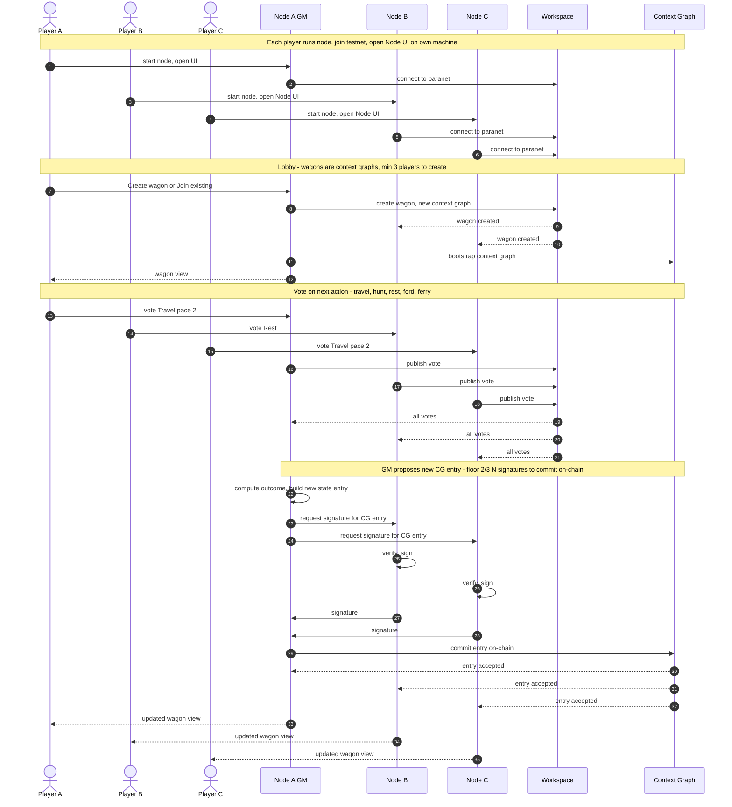

# Sequence: Join Testnet → Play Oregon Trail from Node UI

**Model:** 1 wagon = 1 game = 1 **context graph** on the Oregon Trail paranet. Each player runs their own node and plays from their Node UI (on their machine). Minimum **3 players** (more allowed). Players vote on the next action; votes are exchanged via the **workspace** between nodes. To advance the game, the **game master** proposes a new entry in the context graph; **at least floor(2/3 × N) nodes must sign** for the entry to pass on-chain (e.g. 3→2, 4→2, 5→3, 6→4). The game grows the context graph over time; the game master cannot advance without consensus. Coordination is through the DKG (workspace + context graph).

## Notes

- **1 wagon = 1 game = 1 context graph** on the Oregon Trail paranet. The context graph grows with each turn (one new attested entry per turn).
- **Each player runs one node** and uses the Node UI in their browser (e.g. `http://127.0.0.1:9200/ui` on the machine where the node runs).
- **Minimum 3 players** per wagon; more players allowed. Vote and signature threshold: **floor(2/3 × N)** (e.g. 3→2, 4→2, 5→3, 6→4).
- **Votes** are communicated through the **workspace** (DKG workspace on the Oregon Trail paranet); all nodes see each other’s votes via workspace sync.
- **Game master** proposes the next context-graph entry (next game state). The entry is committed **on-chain** only when at least floor(2/3 × N) nodes have signed it, so the game master cannot advance the game without consensus.
- **Tokens**: Only the **wagon leader (game master)** needs tokens. Committing a turn to the context graph is a DKG publish operation, which requires **testnet TRAC** (publishing fee) and **testnet ETH** (gas on Base Sepolia). Other players only vote and sign (feeless workspace operations) — they need a running node but no tokens.
- **Testnet**: Relay and chain (e.g. Base Sepolia) come from `network/testnet.json`; each user runs their node and joins the same paranet so they share workspace and context graphs.
