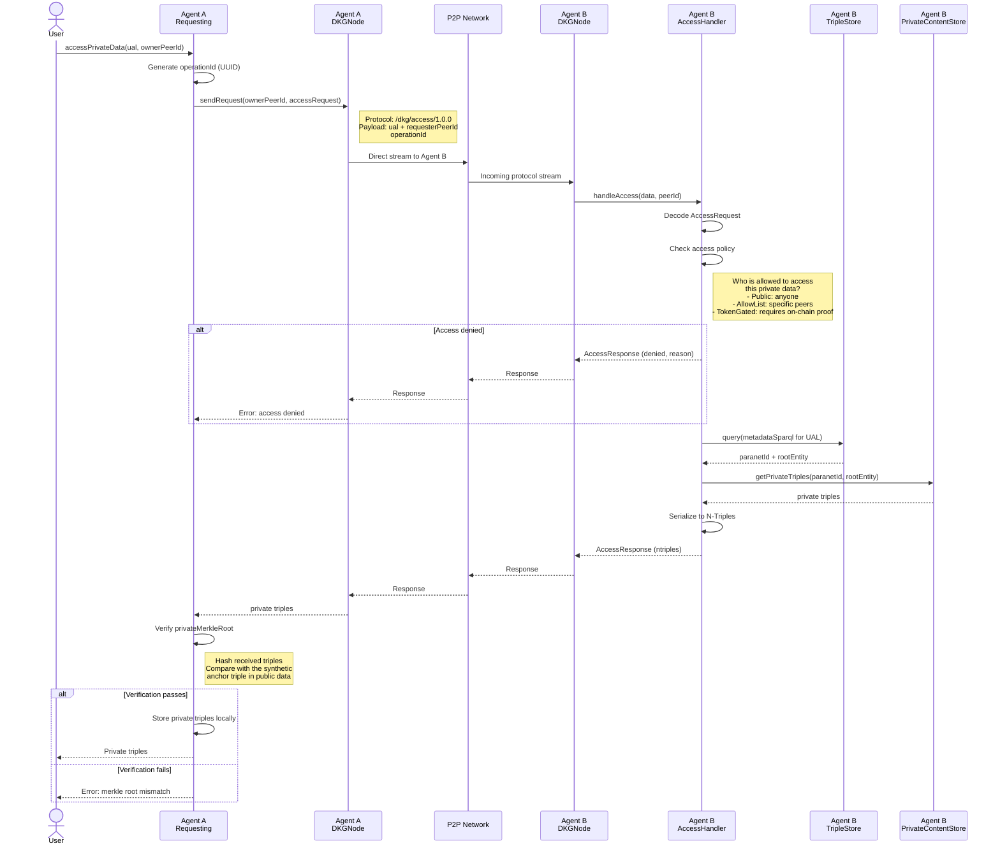

# Private Data Access Flow

How an agent retrieves private triples from another node that holds the
encrypted private content. This is the `/dkg/access/1.0.0` protocol.

## Context

When a KC is published with `privateQuads`, the publisher:
- Hashes the private triples into a `privateMerkleRoot`
- Anchors that root as a synthetic public triple
- Stores private triples locally in the `PrivateContentStore`

Other nodes only receive the public triples (including the synthetic anchor).
To get the private triples, they must send an access request to a node that
has them.

## Sequence diagram

## Access policies

The access handler on Agent B checks whether Agent A is allowed to access
the private data. The policy is per-KC or per-paranet:

| Policy | Description |
|--------|-------------|
| `public` | Any peer can access (private data with public access — useful for data that is integrity-verified but not confidential) |
| `allowList` | Only specific agent addresses (or legacy peer IDs) can access |
| `tokenGated` | Requester must prove they hold a specific token (checked on-chain) |
| `ownerOnly` | Only the original publisher can re-access (default) |

## Verification

When Agent A receives private triples, it can verify them using the
`privateMerkleRoot` that was anchored in the public triples:

1. Look up the synthetic triple: `<urn:dkg:kc> dkg:privateContentRoot "0x..."`
2. Hash the received private triples using the same algorithm
3. Compare the computed root with the anchored root
4. If they match, the private data is authentic and unmodified
