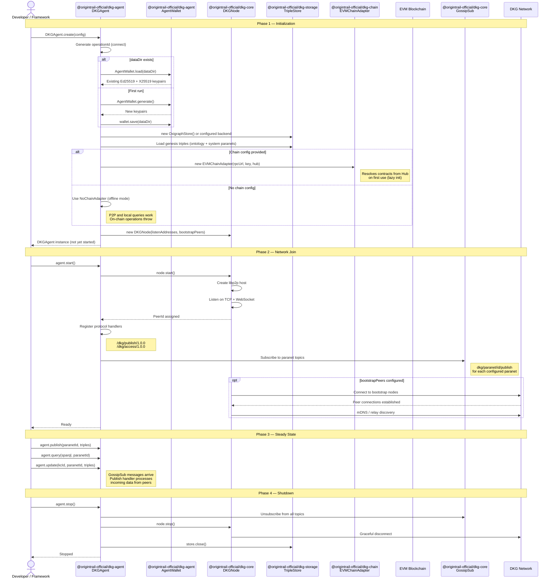

# Agent Lifecycle

How a DKG agent boots, joins the network, and shuts down. Relevant for
developers integrating the DKG into their own agents (e.g. OpenClaw, ElizaOS).

## Sequence diagram



## Configuration reference

```typescript
interface DKGAgentConfig {
  // Network
  listenAddresses?: string[];      // Default: random TCP + WS ports
  bootstrapPeers?: string[];       // DKG bootstrap multiaddrs
  enableMdns?: boolean;            // Default: true (local discovery)
  nodeRole?: 'core' | 'edge';     // Default: 'edge'

  // Chain (optional — omit for offline mode)
  chain?: {
    rpcUrl: string;                // e.g. https://sepolia.base.org
    privateKey: string;            // 0x-prefixed hex
    hubAddress: string;            // Hub contract address
  };

  // Storage
  dataDir?: string;                // Persistent data directory
  store?: TripleStore;             // Custom store (default: Oxigraph)

  // Identity
  publisherPrivateKey?: string;    // EVM key for on-chain publishing
}
```

## Integration example (OpenClaw / ElizaOS)

```typescript
import { DKGAgent } from '@origintrail-official/dkg-agent';

const agent = await DKGAgent.create({
  dataDir: './my-agent-data',
  bootstrapPeers: ['/dns4/bootstrap.dkg.io/tcp/9000/...'],
  chain: {
    rpcUrl: 'https://sepolia.base.org',
    privateKey: process.env.EVM_KEY!,
    hubAddress: '0x...',
  },
});

await agent.start();

// Publish knowledge
const result = await agent.publish('my-paranet', [
  { subject: 'https://example.org/Alice', predicate: 'http://schema.org/name', object: '"Alice"', graph: '' },
]);

// Query knowledge
const query = await agent.query('SELECT ?name WHERE { ?s <http://schema.org/name> ?name }', 'my-paranet');

await agent.stop();
```
