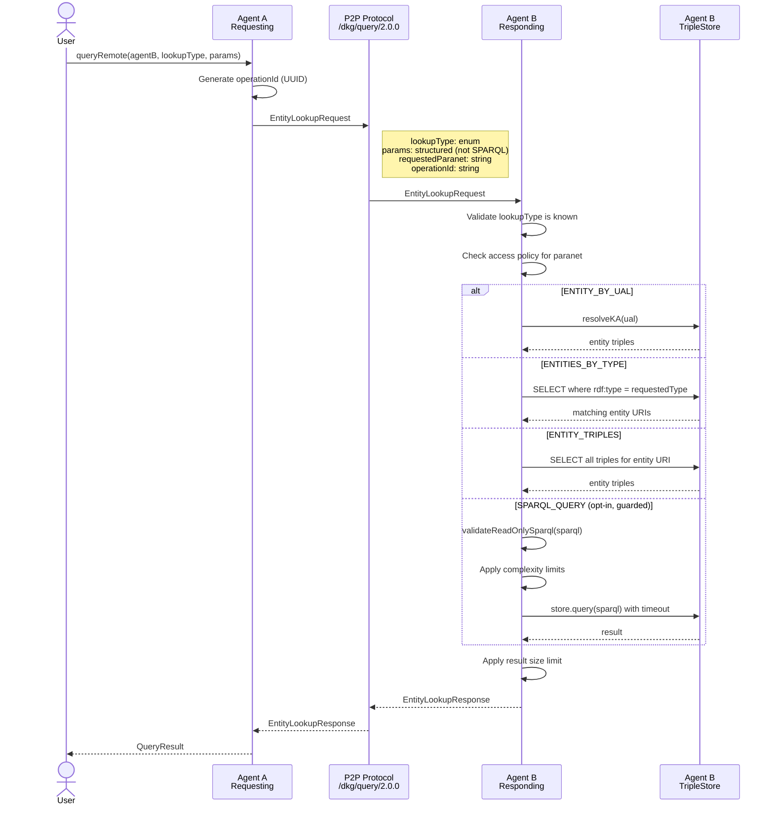

# Cross-Agent Query Flow

How one agent safely asks another agent to run a query on its behalf.

## The problem

If Agent A sends raw SPARQL to Agent B, Agent B must execute it against its
local store. This opens attack vectors:

- **SPARQL injection** — Agent A sends `DELETE WHERE { ?s ?p ?o }` disguised
  as a query, wiping Agent B's data.
- **Data exfiltration** — Agent A sends complex queries that scan all graphs,
  extracting private data Agent B didn't intend to share.
- **Resource exhaustion** — Agent A sends expensive queries (deep joins,
  unbounded patterns) that consume Agent B's CPU/memory.

## Design: No raw SPARQL over the wire

The protocol **does not transmit raw SPARQL**. Instead, it uses constrained
lookup primitives that Agent B controls. This is defense-in-depth: even if
the local query engine has a read-only guard, the protocol never gives a
remote agent the power to compose arbitrary queries.

## Part 1: Local-only queries

In Part 1, all queries are local. There is no cross-agent query protocol.
Each agent can only query data it already has in its own store. Data arrives
via the publish protocol (P2P replication).

The query engine enforces **read-only SPARQL** via `validateReadOnlySparql()`:
- Only `SELECT`, `CONSTRUCT`, `ASK`, `DESCRIBE` are allowed
- `INSERT`, `DELETE`, `DROP`, `CLEAR`, `LOAD`, `COPY`, `MOVE` are rejected
- This protects against the local agent's own code accidentally mutating via
  SPARQL (all mutations must go through `publish()` / `update()`)

## Part 2: Constrained entity lookups

When cross-agent queries are introduced, they use a whitelist of lookup types:



## Lookup types

| Type | Input | Output | Risk |
|------|-------|--------|------|
| `ENTITY_BY_UAL` | UAL string | Triples for that entity | Low — single entity |
| `ENTITIES_BY_TYPE` | RDF type URI | List of entity URIs | Medium — bounded by limit |
| `ENTITY_TRIPLES` | Entity URI | All triples for entity | Low — single entity |
| `SPARQL_QUERY` | Read-only SPARQL | Query result | High — opt-in only |

## Safety layers

1. **No raw SPARQL by default** — the default lookup types are structured,
   not free-form. Agent B translates them into SPARQL internally.

2. **Access policy** — Agent B decides per-paranet whether to respond to
   remote queries. Default: deny. Agent B's config specifies which paranets
   are queryable and by whom (allow-list of peer IDs or "public").

3. **Read-only guard** — even for the opt-in `SPARQL_QUERY` type, the
   `validateReadOnlySparql()` guard rejects any mutating keywords.

4. **Complexity limits** — `SPARQL_QUERY` type has additional limits:
   - Max execution time (e.g. 5 seconds)
   - Max result size (e.g. 1000 bindings)
   - No `SERVICE` clauses (prevents federation abuse)

5. **Result size cap** — all lookup types have a max result size. If the
   result exceeds it, the response is truncated with a `truncated: true` flag.

6. **Rate limiting** — Agent B tracks requests per peer and throttles if
   a peer exceeds the configured rate.

## Protocol message (Part 2)

```
message EntityLookupRequest {
  string operationId = 1;
  LookupType lookupType = 2;
  string paranetId = 3;
  string ual = 4;           // for ENTITY_BY_UAL
  string entityUri = 5;     // for ENTITY_TRIPLES
  string rdfType = 6;       // for ENTITIES_BY_TYPE
  string sparql = 7;        // for SPARQL_QUERY (opt-in)
  uint32 limit = 8;         // max results
}

message EntityLookupResponse {
  string operationId = 1;
  bytes ntriples = 2;       // N-Triples serialized result
  bytes bindings = 3;       // JSON-serialized bindings (for SPARQL_QUERY)
  bool truncated = 4;
  string error = 5;
}

enum LookupType {
  ENTITY_BY_UAL = 0;
  ENTITIES_BY_TYPE = 1;
  ENTITY_TRIPLES = 2;
  SPARQL_QUERY = 3;
}
```
