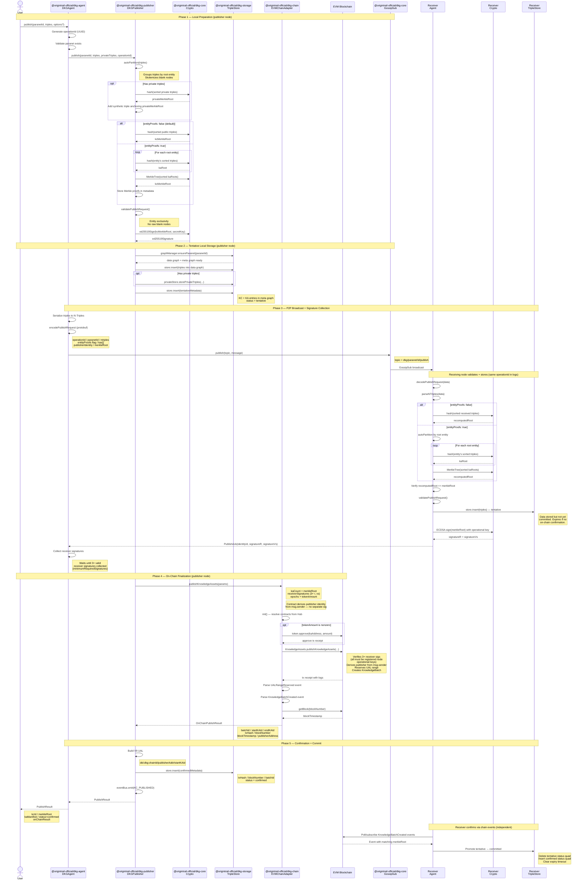

# Publish Flow

Sequence diagram showing the full lifecycle of a `publish()` call, from the
user-facing API through every internal module down to on-chain finality and
peer-to-peer replication.

The key insight is that **P2P replication happens before the on-chain
transaction**. The blockchain tx is the _finalization_ step — it can only
succeed once enough receiving nodes have validated the data and returned
their ECDSA signatures. After the tx confirms, receiving nodes promote
their tentative data to permanent.

## Design decisions

- **Triples, not quads** — the publish message carries `paranetId` in the
  envelope, so the graph component (`G` in SPOG) is redundant on the wire.
  Receiving nodes derive it as `did:dkg:paranet:{paranetId}`.
- **Two-level merkle root** — private triples hash into a `privateMerkleRoot`,
  which is anchored as a synthetic public triple. All public triples
  (including the anchor) hash into the `kcMerkleRoot` that goes on-chain.
- **`entityProofs: true` (opt-in)** — when enabled, triples are grouped by
  root entity and each group gets its own `kaRoot`. The `kcMerkleRoot` is then
  a Merkle tree over the sorted `kaRoot` values instead of a flat hash. This
  lets you prove a specific entity is in the batch without revealing the
  others. Off by default — the flat hash is simpler and cheaper.
- **No re-query** — the publisher already holds the triples from the publish
  call. They are passed directly to the broadcast step.
- **No publisher signature** — the contract derives the publisher node's
  identity from `msg.sender` via `IdentityStorage.getIdentityId()`. No
  separate ECDSA signature needed when the node publishes its own data.
- **Dual confirmation** — receiving nodes use both mechanisms:
  1. **GossipSub** — fast hint from the publisher that the tx landed.
  2. **ChainEventPoller** — trustless background polling for
     `KnowledgeBatchCreated` events, independent of the publisher.
  The chain event is the authoritative source. If the publisher goes offline
  after submitting the tx, the poller still confirms the data.
- **operationId** — every publish generates a UUID that is threaded through
  all modules and included in the GossipSub message. Log format:
  `YYYY-MM-DD HH:MM:SS publish <operationId> "message"`. Enables cross-node
  log correlation on testnet.

## Merkle computation

```
Default (entityProofs: false)         With entityProofs: true
─────────────────────────────         ─────────────────────────
                                      autoPartition by root entity
                                              │
private triples                       private triples
    │ sort + hash                         │ sort + hash
    ▼                                     ▼
privateMerkleRoot                     privateMerkleRoot
    │                                     │
    ▼ emit synthetic triple               ▼ emit synthetic triple
    ┌──────────────────────┐              ┌──────────────────────┐
    │ <kc> dkg:private-    │              │ <kc> dkg:private-    │
    │   ContentRoot "0x…"  │              │   ContentRoot "0x…"  │
    └──────────────────────┘              └──────────────────────┘
    │ add to public triples               │ add to public triples
    ▼                                     ▼
all public triples                    per-entity groups
    │ sort + hash                         │ hash each group
    ▼                                     ▼
kcMerkleRoot ◄── on-chain            kaRoot₁, kaRoot₂, … kaRootₙ
                                          │ build Merkle tree
                                          ▼
                                      kcMerkleRoot ◄── on-chain
                                          + per-KA Merkle proofs
                                            stored in metadata
```

## Sequence diagram



## How tentative → committed is reflected in the graph

Tentative vs committed is **reflected only in the paranet’s meta graph**
(`did:dkg:paranet:{paranetId}/_meta`), not in the data graph. The data graph
holds the same triples either way; the meta graph records lifecycle and
on-chain provenance.

**Clean model:** For a given KC (UAL), the meta graph is in exactly one of two
states — never both:

- **Tentative:** There is a triple `(ual, dkg:status, "tentative")` and **no**
  blockchain provenance triples (txHash, blockNumber, etc.). The KC/KA structure
  may be present.
- **Confirmed:** There is **no** tentative triple; there is
  `(ual, dkg:status, "confirmed")` and optionally chain provenance triples
  (txHash, blockNumber, blockTimestamp, publisherAddress, batchId, chainId).

So an agent that queries for status sees either “tentative” or “confirmed”,
never ambiguous.

### Publisher node

- **On-chain tx fails:** Publisher inserts full KC/KA metadata plus
  `(ual, dkg:status, "tentative")` into the meta graph. Data stays in the data
  graph; the KC is tentative until it expires or is retried.
- **On-chain tx succeeds:** Publisher inserts **only** confirmed metadata: full
  KC/KA structure plus `(ual, dkg:status, "confirmed")` and chain provenance. No
  tentative triple is written. So the graph has either tentative or confirmed,
  never both.

Promotion on the publisher = **do not write tentative** when you are about to
write confirmed (success path inserts confirmed-only).

### Receiver node

- **Tentative:** On P2P receive, the receiver inserts triples into the **data
  graph** and **tentative metadata** into the **meta graph** (KC/KA +
  `dkg:status "tentative"`). It starts a 10-minute timeout; if no on-chain
  confirmation is seen, it deletes those data and metadata quads.
- **Committed:** When the receiver sees the matching `KnowledgeBatchCreated`
  event, it **deletes** the tentative status quad
  `(ual, dkg:status, "tentative")` from the meta graph, **inserts**
  `(ual, dkg:status, "confirmed")`, and clears the timeout. So the graph moves
  from “tentative only” to “confirmed only”; no KC has both status triples.

Promotion on the receiver = **delete tentative status quad, insert confirmed
status quad** in the meta graph, then clear the expiry timeout.
