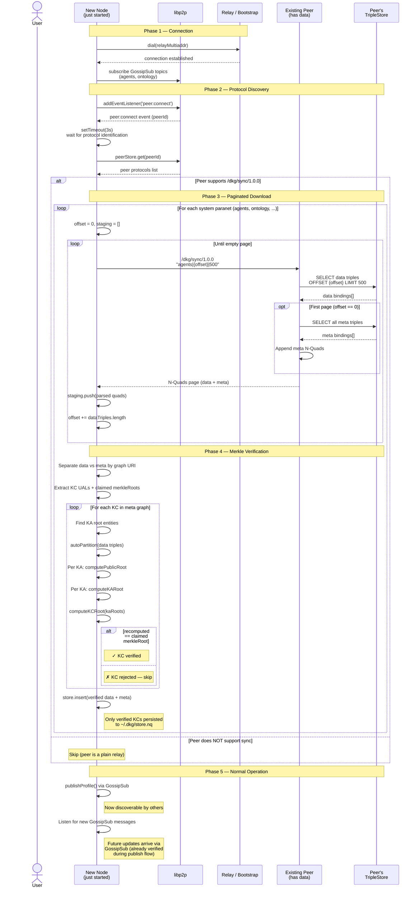

# Paranet Sync Flow

Sequence diagram showing how a newly-joined node catches up on data it
missed while offline. This solves the **"last to the party" problem** —
GossipSub is fire-and-forget, so a node that connects after profiles were
broadcast would never learn about existing agents without an explicit sync.

## Problem

```
Timeline ─────────────────────────────────────────►

  Agent A starts         Agent B starts
  publishes profile      publishes profile
  via GossipSub          via GossipSub
       │                      │
       ▼                      ▼
  ┌─────────┐            ┌─────────┐
  │ A knows  │            │ B knows │
  │ about B  │            │ about A │
  └─────────┘            └─────────┘

                                           Agent C starts
                                           subscribes to GossipSub
                                                │
                                                ▼
                                           ┌─────────┐
                                           │ C knows  │
                                           │ NOTHING  │  ← missed both broadcasts
                                           └─────────┘
```

## Solution: Verified sync on connect

When C connects to any peer, it requests the full contents of the `agents`
paranet from that peer, page by page. Every received Knowledge Collection
is **verified against its merkle root** before being accepted into the
local store — a malicious peer cannot inject, alter, or omit triples
without being detected.

## Threat model

An adversarial sync peer could attempt:

| Attack              | How sync handles it                                          |
|---------------------|--------------------------------------------------------------|
| **Inject triples**  | Fake triples change the merkle root → recomputation fails → rejected |
| **Alter triples**   | Modified triples change the merkle root → rejected           |
| **Omit triples**    | Missing triples change the merkle root → rejected            |
| **Forge metadata**  | Claimed merkle root doesn't match recomputed root → rejected |
| **Omit entire KCs** | Detectable via Tier 2 (on-chain cross-check, future)         |

### Two-tier verification

**Tier 1 (implemented, immediate):** After downloading all pages, the
receiver groups data triples by root entity (same `autoPartition` used
during publish), recomputes the merkle root per KC using
`computePublicRoot → computeKARoot → computeKCRoot`, and compares it to
the `dkg:merkleRoot` value in the meta graph. Only KCs with matching
roots are inserted into the local store.

**Tier 2 (future, trustless):** For KCs that claim `dkg:status "confirmed"`
with a `chainId` and `batchId`, query the blockchain to verify the merkle
root is actually on-chain. This catches a peer that fabricates *both* the
triples and the metadata. Tier 2 is deferred because it requires chain
RPC calls and is more expensive.

## Design decisions

- **Paginated** — the request includes `offset|limit` so large paranets
  don't blow up memory. Default page size is 500 triples per request.
  The requester loops until it gets an empty page.
- **Data + meta graph** — the first sync page includes the full meta graph
  (KC metadata with merkle roots). The receiver needs this to verify the
  data triples. Meta graph is small relative to data.
- **Staging buffer** — triples are downloaded into memory first, verified,
  then inserted. Nothing touches the local store until verification passes.
- **Per-KC granularity** — if a peer sends 10 KCs and 1 has a bad merkle
  root, the other 9 are still accepted. Only the invalid KC is rejected.
- **Protocol-gated** — before attempting sync, the requester checks the
  peer's protocol list via the libp2p peer store. If the peer doesn't
  advertise `/dkg/sync/1.0.0` (e.g. a plain circuit relay), the sync is
  skipped entirely.
- **Idempotent** — inserting duplicate triples into Oxigraph is a no-op.
- **Persistent store** — synced data is written to `~/.dkg/store.nq` and
  survives restarts.

## Wire format

```
Protocol:   /dkg/sync/1.0.0
Transport:  libp2p stream (request → response)

Request (UTF-8):
  "<paranetId>|<offset>|<limit>"
  e.g. "agents|0|500"

  - paranetId:  which paranet to sync (default: "agents")
  - offset:     number of data triples to skip (default: 0)
  - limit:      max data triples to return (capped at 500)

Response (UTF-8):
  N-Quads text, one triple per line:
  "<subject> <predicate> <object> <graph> .\n"

  Triples from TWO named graphs:
  - did:dkg:paranet:{id}       — data graph (paginated)
  - did:dkg:paranet:{id}/_meta — meta graph (full, first page only)

  Empty response = no more data (end of pagination).
```

## Merkle verification detail

```
Received from peer                              Verification
──────────────────                              ────────────

Meta graph triples:                             For each KC (UAL):
  ┌──────────────────────────────────┐            1. Find its KA entries
  │ <ual> rdf:type dkg:KC           │               (dkg:partOf → ual)
  │ <ual> dkg:merkleRoot "abc123"   │◄──┐
  │ <ual> dkg:kaCount 2             │   │        2. Get rootEntity per KA
  │ <ka1> dkg:rootEntity <entity:A> │   │
  │ <ka1> dkg:partOf <ual>          │   │        3. Partition data triples
  │ <ka2> dkg:rootEntity <entity:B> │   │           by rootEntity
  │ <ka2> dkg:partOf <ual>          │   │           (autoPartition)
  └──────────────────────────────────┘   │
                                         │       4. Per KA:
Data graph triples:                      │          publicRoot = hash(sorted triples)
  ┌──────────────────────────────────┐   │          kaRoot = computeKARoot(publicRoot)
  │ <entity:A> schema:name "Alice"   │   │
  │ <entity:A> schema:age "30"       │──►│       5. kcRoot = computeKCRoot(kaRoots)
  │ <entity:B> schema:name "Bob"     │   │
  │ <entity:B> schema:age "25"       │   │       6. kcRoot == claimed "abc123" ?
  └──────────────────────────────────┘   │          ✓ Insert into store
                                         │          ✗ Reject KC
                                    compare
```

## Sequence diagram



## Persistence lifecycle

```
First start (no store.nq)             Restart (store.nq exists)
─────────────────────────              ────────────────────────
OxigraphStore(~/.dkg/store.nq)        OxigraphStore(~/.dkg/store.nq)
  │                                      │
  ├─ file not found → empty store        ├─ load N-Quads from disk
  │                                      │  (agent profiles, published data, ...)
  ├─ peer:connect → sync agents          │
  │  └─ download → verify → insert       ├─ peer:connect → sync agents
  │                                      │  └─ download → verify → insert (dedup)
  ├─ GossipSub → receive publishes       │
  │  └─ verify + insert + flush          ├─ GossipSub → receive publishes
  │                                      │  └─ verify + insert + flush
  └─ close() → final flush               └─ close() → final flush
```
