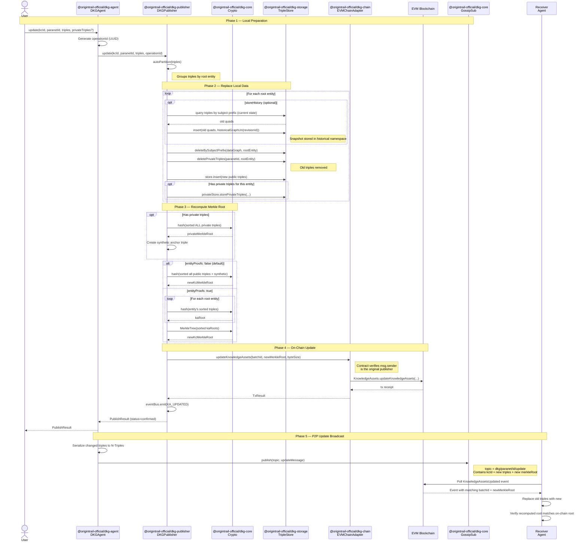

# Update Flow

Sequence diagram for updating an existing Knowledge Collection (KC). The
publisher replaces triples for specific root entities within an already-published
KC, recomputes the Merkle root, and submits an on-chain update transaction.

## Key differences from publish

| Aspect | Publish | Update |
|--------|---------|--------|
| UAL | New — reserved on-chain | Existing — reused |
| Old data | None | Deleted before insert |
| On-chain | `publishKnowledgeAssets` | `updateKnowledgeAssets` |
| Receiver signatures | Required (3+) | Not required |
| P2P broadcast | Full KC triples | Only changed entities |

Updates are simpler than publishes because:
- The KC already exists on-chain; only the merkle root needs updating
- No receiver signatures needed (the batch was already validated at publish time)
- Only the publisher can update (the contract enforces `msg.sender` ownership)

**Optional extension:** A node can optionally keep a snapshot of replaced triples
in a separate “historical” graph/namespace before deleting them, enabling
time-travel queries (see [Optional: Historical state](#optional-historical-state-time-travel) below). This is not required of core or receiver nodes.

## Sequence diagram

## Update validation on receivers

There is no tentative phase for updates: receivers replace triples only after
they have seen the on-chain event. The **tentative → committed** lifecycle
(applying to the meta graph and timeout on the receiver) applies only to the
[initial publish](publish-flow.md#how-tentative--committed-is-reflected-in-the-graph), not to updates.

When a receiver gets an update broadcast, it:

1. **Checks the chain event** — the `KnowledgeAssetsUpdated` event must exist
   with a matching `batchId` and `newMerkleRoot`.
2. **Verifies the publisher** — the on-chain event's `msg.sender` must match
   the original publisher of the KC.
3. **Replaces triples** — deletes old triples for the affected root entities
   and inserts the new ones.
4. **Recomputes the merkle root** — the recomputed root from the new data must
   match the on-chain root. If not, the update is rejected and old data is
   kept.

---

## Optional: Historical state (time travel)

The default update flow **replaces** triples: old triples are deleted and new
ones inserted. The chain only stores the latest merkle root, so there is no
protocol-level requirement to keep previous states. Core nodes and receivers
are not incentivised to retain history.

A **publisher or a dedicated node** may still want to offer **time travel**:
the ability to query the graph as it was at a past revision or point in time.
This can be done by optionally storing a snapshot of the replaced state before
deleting it, without changing the core update or on-chain semantics.

### Design

- **Optional** — Controlled by a flag (e.g. `storeHistory: true`) on the
  update call. If set, before each `deleteBySubjectPrefix` the publisher (or
  node) copies the current triples for that root entity into a **historical**
  store.
- **Separate graph / namespace** — History is kept out of the main data graph.
  For example:
  - A separate Blazegraph **namespace** (e.g. `historical`), or
  - Named graphs in the same store with a convention such as  
    `urn:dkg:historical:{paranetId}:{kcId}:{rootEntity}:{revisionId}`.
- **Revision identifier** — Each snapshot is keyed by a revision. Using the
  existing `operationId` (UUID) gives a stable “revision R”. Optionally store
  a timestamp (e.g. from the update event or block time) to support “as of
  time T” queries.
- **What is stored** — For each root entity being updated: the triples that
  would be deleted (current state) are written into the historical graph for
  that revision. Private triples can be included in the same way if the node
  keeps a private historical store.
- **Receivers** — Receivers are not required to implement history. Only nodes
  that opt in (e.g. the publisher or a dedicated archive node) need a
  historical namespace and the copy-before-delete step.

### Querying past state

- **Current state** — Unchanged: query the normal data graph (and meta graph)
  as today.
- **Time travel** — To get “graph as of revision R” or “as of time T”, the
  client (or a query endpoint that supports it) targets the historical
  namespace: either the named graph for that revision or a union of historical
  graphs with a filter on revision/timestamp. The exact SPARQL or API shape
  can be defined where this feature is implemented (e.g. in the query engine or
  a dedicated historical API).
