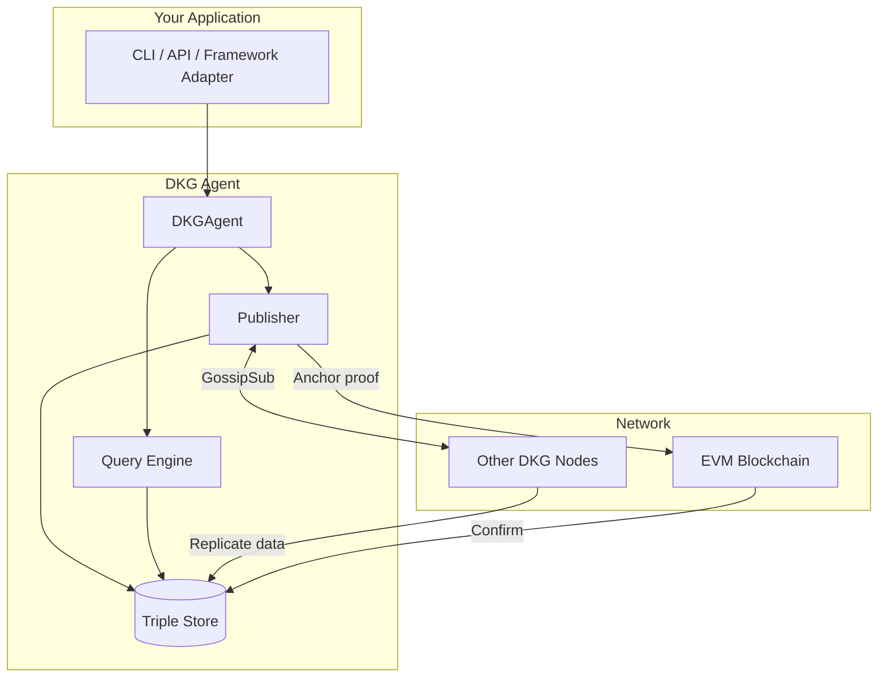

# DKG v9 Onboarding Guide

Welcome to the Decentralized Knowledge Graph (DKG) v9 codebase. This guide builds a mental model of the system -- what it does, why, and how the pieces connect -- so you can navigate confidently whether you have 6 months or 15 years of experience.

---

## What is the DKG?

The DKG is a **peer-to-peer network for publishing and querying structured knowledge**. Think of it as a distributed Wikipedia where:

- Data is stored as RDF triples (subject-predicate-object facts) in local graph databases
- Multiple nodes replicate and verify the same data
- A blockchain anchors cryptographic proofs so nobody can tamper with published knowledge
- Anyone can publish, and anyone with access can query

The fundamental operations are **publish** (add knowledge to the network) and **query** (retrieve knowledge from your local store or the network).

---

## Key Concepts

Before diving in, here are the terms you will encounter everywhere:

| Term | Plain English |
|------|--------------|
| **Paranet** | A topic-scoped partition. Like a database schema or a Slack channel -- all data belongs to exactly one paranet. |
| **Triple / Quad** | The atomic unit of data: subject-predicate-object (e.g., "Alice knows Bob"). A quad adds a graph name. |
| **Triple Store** | The local graph database on each node (default: Oxigraph). Stores and queries RDF data using SPARQL. |
| **Knowledge Asset (KA)** | A single entity and its triples within a publish batch. Each KA has a root entity URI. |
| **Knowledge Collection (KC)** | A batch of KAs published in one transaction. Gets one on-chain record. |
| **UAL** | Universal Asset Locator -- the persistent ID for a KC: `did:dkg:{chainId}/{address}/{kaId}`. Like a URL for knowledge. |
| **Tentative vs Confirmed** | Data starts tentative (local only). Once the blockchain transaction confirms, it becomes confirmed and permanent. |
| **Merkle Root** | A cryptographic fingerprint of all triples in a KC. Both publisher and receivers compute it independently to verify integrity. |
| **DKGAgent** | The main orchestrator object. Composes networking, storage, publishing, and querying into one interface. |
| **GossipSub** | Pub-sub messaging over libp2p. Nodes subscribe to paranet topics and receive broadcasts. |
| **SPARQL** | The W3C query language for RDF. Think SQL but for graph databases. |

---

## The Big Picture



**Data flows in two directions:**
- **Publish**: Your app hands triples to the agent, which stores them locally, broadcasts to peers for verification, collects signatures, and anchors a proof on-chain. Receivers store a tentative copy and promote it to confirmed when they see the chain event.
- **Query**: Your app sends SPARQL to the agent, which scopes it to a paranet's named graph and executes it against the local triple store. No network round-trip needed for local queries.

---

## Reading Order

These guides are designed to be read in order, but each stands alone:

| # | Guide | What you will learn |
|---|-------|-------------------|
| 1 | [Publish Flow](01-publish-flow.md) | How data goes from your app to the network and blockchain. The 5-phase lifecycle of a publish. Where things can fail. |
| 2 | [Query Flow](02-query-flow.md) | How SPARQL queries get scoped to paranets, executed, and returned. The 3 query types. Access control. |
| 3 | [Agent Lifecycle](03-agent-lifecycle.md) | How a node boots, joins the network, and operates. How adapters (OpenClaw, ElizaOS) hook in. |
| 4 | [Package Map](04-package-map.md) | What each of the 14 packages does, how they depend on each other, and where to look for specific functionality. |

**If you are short on time**, start with the Package Map (04) to orient yourself, then read whichever flow is most relevant to your work.

---

## Architecture at a Glance

The codebase is a **pnpm monorepo** with 14 packages organized in four layers:

```
Tooling & UI           cli  |  node-ui  |  graph-viz  |  network-sim
                       -----+----------+-----------+-------------
Features               agent  |  publisher  |  query
                       -------+-----------+--------
Adapters               adapter-elizaos  |  adapter-openclaw  |  mcp-server
                       ----------------+------------------+-----------
Core Infrastructure    core  |  storage  |  chain  |  evm-module
```

- **Core Infrastructure** provides networking (libp2p), storage (triple store), blockchain interaction, and smart contracts
- **Features** build on core to implement publishing, querying, and the agent orchestrator
- **Adapters** wrap the agent for external frameworks (ElizaOS, OpenClaw, MCP for AI assistants)
- **Tooling & UI** provides the CLI, dashboard, graph visualizer, and network simulator

The dependency flow is strictly downward -- higher layers depend on lower ones, never the reverse.

---

## Three Things That Make DKG v9 Different

1. **Data replicates before the chain transaction.** The blockchain is the finalization step, not the distribution step. Peers receive, verify, and sign the data via P2P. The on-chain transaction records the proof and can only succeed with enough peer signatures.

2. **Paranet scoping is built into the query engine.** Every SPARQL query is automatically rewritten to target a specific paranet's named graph. You do not need to manage graph URIs manually.

3. **The agent is a composable building block.** `DKGAgent` is a single object you can embed in any application. The ElizaOS and OpenClaw adapters are thin wrappers (~200 lines each) that map DKG operations to their framework's conventions.

---

## Quick Start: Where Do I Look?

| I want to...                           | Start here |
|----------------------------------------|------------|
| Run a node                             | `packages/cli/` |
| Publish data                           | `packages/publisher/` |
| Query data                             | `packages/query/` |
| Understand how nodes communicate       | `packages/core/src/node.ts` |
| Modify smart contracts                 | `packages/evm-module/contracts/` |
| Build an adapter for my framework      | `packages/adapter-elizaos/` (simplest example) |
| See the full agent API                 | `packages/agent/src/dkg-agent.ts` |
| Understand the data model              | `packages/storage/src/graph-manager.ts` |

---

## Further Reading

- `docs/diagrams/` -- Detailed technical sequence diagrams for every flow
- `docs/specs/` -- Specifications for cross-agent queries, paranet lifecycle, sync, relay discovery
- `docs/setup/` -- Setup guides for running a node, joining testnet, configuring adapters
- `docs/plans/` -- Implementation plans and deployment guides
