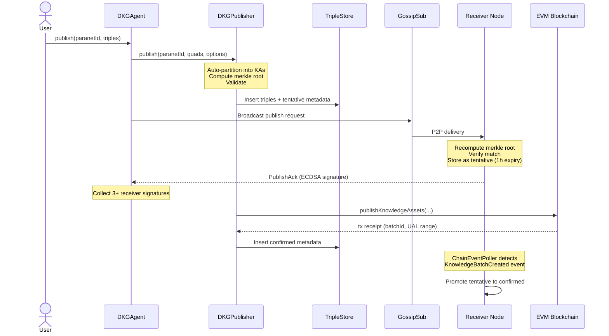

# The Publish Flow

How data gets from your application into the Decentralized Knowledge Graph, verified by
the network, and anchored on-chain.

---

## Key Concepts

| Term | Definition |
|------|-----------|
| **Paranet** | A topic-scoped partition of the knowledge graph. Every publish targets a specific paranet. Think of it as a shared database namespace that multiple nodes subscribe to. |
| **Triple store** | The local graph database (quad store) on each node. Stores RDF triples (subject-predicate-object) organized into named graphs. |
| **Knowledge Asset (KA)** | A single entity and its triples within a publish batch. One publish can contain many KAs. Each KA maps to one "root entity" (a URI like `https://example.org/sensor/42`). |
| **Knowledge Collection (KC)** | The entire batch of KAs published in a single transaction. The KC gets one on-chain record and one merkle root. |
| **Tentative vs Confirmed** | Data starts as "tentative" (stored locally, not yet on-chain). Once the blockchain transaction confirms, it becomes "confirmed" and is retained permanently. |
| **Merkle root** | A cryptographic fingerprint of all triples in the KC. Both publisher and receivers compute it independently. If they match, the data is identical. This root goes on-chain. |
| **UAL** | Universal Asset Locator. The persistent identifier for a KC: `did:dkg:{chainId}/{publisherAddress}/{startKAId}`. Similar to a URL, but for knowledge assets. |

---

## The Big Picture

Publishing is like submitting a research paper for peer review:

1. **You write the paper** (prepare your triples and compute a fingerprint).
2. **You send it to reviewers** (broadcast to network peers via P2P).
3. **Reviewers check your work** (receivers independently verify the merkle root).
4. **Reviewers sign off** (receivers return ECDSA signatures).
5. **The journal records it** (the blockchain stores the merkle root permanently).
6. **Everyone updates their records** (receivers promote tentative data to confirmed).

The critical insight: **data replication happens before the blockchain transaction**.
The on-chain step is finalization, not distribution. It can only succeed once enough
receivers have validated and signed.

---

## Flow Walkthrough

### Phase 1: Local Preparation

**Where:** `packages/publisher/src/dkg-publisher.ts` -- `publish()` method

The publisher node prepares data locally before any network interaction:

1. **Auto-partition** triples into Knowledge Assets. Each unique root entity (a
   non-blank-node subject URI) becomes one KA. Blank nodes are skolemized (converted to
   deterministic URIs) under their parent entity.
   See `packages/publisher/src/auto-partition.ts`.

2. **Compute the merkle root.** Two modes exist:
   - **Flat mode** (default): hash every triple, build a Merkle tree over all hashes.
   - **Entity proofs mode** (`entityProofs: true`): hash triples per-entity first
     (producing a `kaRoot` per KA), then build a tree over those roots. This lets you
     prove a specific entity belongs to the batch without revealing others.

3. **Handle private triples.** If private data is included, it gets its own
   `privateMerkleRoot`, which is anchored into the public set as a synthetic triple.
   This way the on-chain root covers both public and private data.
   See `packages/publisher/src/merkle.ts`.

4. **Validate.** Check entity exclusivity (no entity published by two different batches
   in the same paranet) and ensure no raw blank nodes remain.
   See `packages/publisher/src/validation.ts`.

### Phase 2: Tentative Local Storage

**Where:** `packages/publisher/src/dkg-publisher.ts` -- middle of `publish()`

Before going to the network, the publisher stores data locally:

- Public triples go into the paranet's **data graph**.
- Private triples go into the **private content store**.
- Metadata (KC structure, KA manifest, status = "tentative") goes into the **meta graph**.

The `GraphManager` (`packages/storage/src/`) handles graph naming:
- Data graph: `did:dkg:paranet:{paranetId}`
- Meta graph: `did:dkg:paranet:{paranetId}/_meta`

At this point the data exists only on the publisher node and is marked tentative.

### Phase 3: P2P Broadcast and Signature Collection

**Where:** `packages/agent/src/dkg-agent.ts` (publisher side),
`packages/publisher/src/publish-handler.ts` (receiver side)

The agent serializes the triples to N-Triples format, encodes a protobuf publish request
(containing operationId, paranetId, triples, manifest, merkle root), and broadcasts it
via GossipSub to the paranet's publish topic.

**On each receiving node**, the `PublishHandler`:

1. Decodes the protobuf message and parses N-Triples.
2. Runs the same auto-partition and merkle computation independently.
3. Verifies the recomputed root matches the publisher's claimed root.
4. Validates entity exclusivity and UAL consistency.
5. Stores triples as tentative (with a 1-hour expiry timeout).
6. Signs the merkle root + byte size with its ECDSA operational key.
7. Returns a `PublishAck` containing `identityId`, `signatureR`, `signatureVs`.

The publisher collects ack signatures. The on-chain contract requires at least 3 valid
receiver signatures from registered node operational keys.

### Phase 4: On-Chain Finalization

**Where:** `packages/chain/src/evm-adapter.ts` -- `publishKnowledgeAssets()`

Once enough signatures are collected, the publisher submits a single EVM transaction:

```
KnowledgeAssets.publishKnowledgeAssets(
  kaCount, publisherIdentityId, merkleRoot, publicByteSize,
  epochs, tokenAmount, publisherSignature, receiverSignatures[]
)
```

The smart contract:
- Verifies the publisher signature (derived from `msg.sender` via `IdentityStorage`).
- Verifies each receiver signature belongs to a registered node operational key.
- Reserves a UAL range (sequential KA token IDs).
- Creates a `KnowledgeBatch` record on-chain.
- Emits `UALRangeReserved` and `KnowledgeBatchCreated` events.

If a token amount is required (for storage incentives), the adapter approves and
transfers TRAC tokens before the publish call.

### Phase 5: Confirmation

**Where:** `packages/publisher/src/dkg-publisher.ts` (publisher side),
`packages/publisher/src/chain-event-poller.ts` (receiver side)

**Publisher:** On successful tx, the publisher:
- Builds the final UAL: `did:dkg:{chainId}/{publisherAddress}/{startKAId}`
- Writes confirmed metadata (txHash, blockNumber, batchId, status = "confirmed")
- Emits a `KC_PUBLISHED` event on the internal event bus
- Returns the `PublishResult` to the caller

**Receivers:** The `ChainEventPoller` runs in the background on every node, polling for
`KnowledgeBatchCreated` events every ~12 seconds. When it sees an event whose merkle root
matches a pending tentative publish:
- Deletes the tentative status triple from the meta graph
- Inserts a confirmed status triple
- Clears the expiry timeout so data is retained permanently

This dual-confirmation design (GossipSub hint + chain polling) means receivers confirm
even if the publisher goes offline after submitting the transaction.

---

## Sequence Diagram (Happy Path)



---

## Where Things Can Fail

| Failure | What happens |
|---------|-------------|
| **Merkle mismatch on receiver** | Receiver rejects the publish request and returns a rejection ack. The publisher cannot collect enough signatures. |
| **Not enough receiver signatures** | The publisher cannot submit the on-chain transaction. Data stays tentative on the publisher. |
| **On-chain tx reverts** | Publisher stores data as tentative with a temporary UAL (`did:dkg:{chainId}/{addr}/t{session}-{seq}`). Can be retried. |
| **Publisher goes offline after tx** | Receivers still confirm independently via `ChainEventPoller` -- they watch the chain directly, not the publisher. |
| **Receiver never sees chain event** | After 1 hour, the tentative data and metadata are automatically deleted by the expiry timeout in `PublishHandler`. |
| **Validation failure** | Entity exclusivity or blank node violations cause immediate rejection before any storage or network activity. |

---

## Key Source Files

| File | Role |
|------|------|
| `packages/agent/src/dkg-agent.ts` | Top-level `publish()` entry point, P2P broadcast, signature collection |
| `packages/publisher/src/dkg-publisher.ts` | Core publish logic: partition, merkle, store, chain submission |
| `packages/publisher/src/publish-handler.ts` | Receiver-side: validate, store tentative, sign ack |
| `packages/publisher/src/auto-partition.ts` | Groups triples into KAs by root entity |
| `packages/publisher/src/merkle.ts` | Merkle tree computation (flat and entity-proof modes) |
| `packages/publisher/src/validation.ts` | Entity exclusivity and structural validation |
| `packages/publisher/src/metadata.ts` | Generates tentative/confirmed metadata triples |
| `packages/publisher/src/chain-event-poller.ts` | Background poller that confirms tentative publishes from chain events |
| `packages/chain/src/evm-adapter.ts` | EVM transaction submission and contract interaction |
| `packages/storage/src/` | Triple store and graph manager |

---

## Further Reading

- `docs/diagrams/publish-flow.md` -- detailed technical sequence diagram with all edge cases
