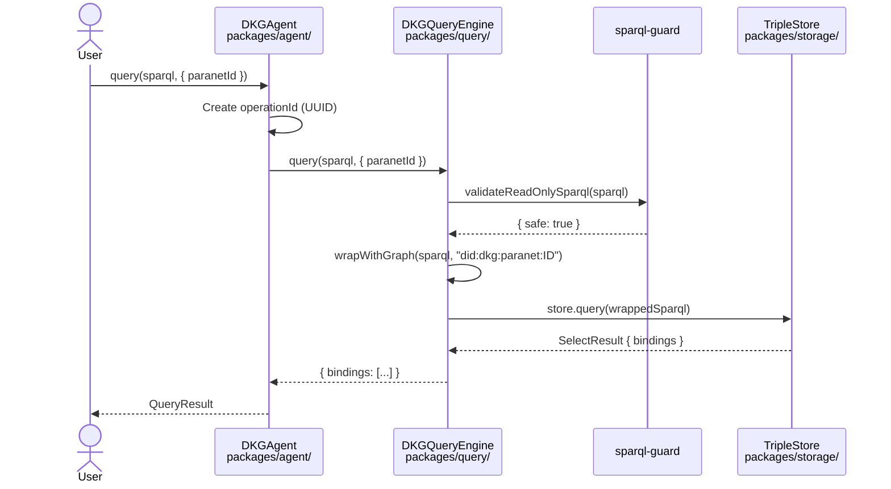

# Query Flow

How data gets queried in DKG v9 -- from SPARQL string to result bindings.

---

## Key Concepts

| Term | Definition |
|------|-----------|
| **SPARQL** | The W3C query language for RDF data. Think SQL, but for graph databases. DKG uses SELECT, CONSTRUCT, ASK, and DESCRIBE forms (all read-only). |
| **Paranet** | A logical partition of knowledge. Every piece of data belongs to exactly one paranet. Queries are scoped to a paranet unless you explicitly ask for cross-paranet results. |
| **Graph URI** | The named graph identifier that holds a paranet's data. Format: `did:dkg:paranet:<paranetId>`. Each paranet has several graphs (data, meta, private, workspace). |
| **Data graph vs meta graph** | The **data graph** holds the actual RDF triples (facts about the world). The **meta graph** holds metadata about knowledge assets -- who published them, which paranet they belong to, their root entity URIs. |
| **Bindings** | The rows returned by a SELECT query. Each binding is a map from variable name to value, like `{ name: "Alice", age: "30" }`. |
| **Entity resolution** | Looking up a knowledge asset by its UAL to get all its triples. A two-step process: find the entity in the meta graph, then fetch its data from the data graph. |
| **UAL** | Universal Asset Locator. A DID-based identifier for a knowledge asset, e.g. `did:dkg:base:84532/0x15e0.../1`. Like a URL, but for on-chain knowledge assets. |
| **Knowledge Asset (KA)** | A published unit of knowledge in the DKG, identified by a UAL and containing one or more RDF triples rooted at a single entity. |

**Analogy:** Think of querying the DKG like searching a library catalog. Each paranet is a different section of the library (science, history, fiction). When you run a query, you specify which section to search. Cross-paranet queries search every section. Entity resolution is like looking up a book by its ISBN -- you first check the catalog card (meta graph), then go to the shelf to get the actual book (data graph).

---

## Three Query Types

DKG v9 supports three local query paths. All queries run against the node's own triple store -- there is no remote/federated querying in the current release (Part 1).

### 1. Paranet-Scoped Query

The primary query path. You provide a SPARQL string and a paranet ID, and the engine scopes it to that paranet's data graph.

**Entry point:** `DKGAgent.query(sparql, { paranetId })` in `packages/agent/src/dkg-agent.ts:669`

**What happens:**

1. The agent creates an operation context (UUID for log tracing) and calls `DKGQueryEngine.query()`.
2. The query engine runs the SPARQL through a **read-only guard** (`sparql-guard.ts`) that rejects any mutating keywords (INSERT, DELETE, DROP, etc.). Writes must go through the publish protocol.
3. If a `paranetId` is provided and the query does not already contain a `FROM` clause, the engine **wraps** the WHERE clause inside a `GRAPH <did:dkg:paranet:ID> { ... }` block. This is how paranet scoping works -- the SPARQL itself is rewritten to target a specific named graph.
4. The wrapped SPARQL is sent to the `TripleStore.query()` interface.
5. Results are normalized based on the query form:
   - **SELECT** returns bindings (array of variable-to-value maps)
   - **CONSTRUCT** returns quads (array of subject/predicate/object/graph)
   - **ASK** returns a boolean (wrapped as a single binding)

**Workspace queries:** If you pass `includeWorkspace: true`, the engine runs the query against both the data graph and the workspace graph, then unions the results. If you pass `graphSuffix: '_workspace'`, it queries only the workspace graph. This lets you query draft/unpublished data separately.

### 2. Cross-Paranet Query (queryAllParanets)

Runs the same SPARQL against every known paranet and combines the results.

**Entry point:** `DKGQueryEngine.queryAllParanets(sparql)` in `packages/query/src/dkg-query-engine.ts:122`

**What happens:**

1. The engine asks `GraphManager.listParanets()` to enumerate all paranets stored locally.
2. `GraphManager` calls `TripleStore.listGraphs()`, filters for URIs starting with `did:dkg:paranet:`, and deduplicates by stripping suffixes like `/_meta`, `/_private`, `/_workspace`, `/_workspace_meta`.
3. For each paranet ID, it calls `query(sparql, { paranetId })` -- the same path as a paranet-scoped query.
4. All bindings are accumulated into a single array and returned.

**Performance note:** This is a sequential loop today. For nodes with many paranets, this could become slow. There is no parallel execution yet.

### 3. Entity Resolution (resolveKA)

A two-step lookup that resolves a UAL to its full set of triples.

**Entry point:** `DKGQueryEngine.resolveKA(ual)` in `packages/query/src/dkg-query-engine.ts:68`

**Step 1 -- Metadata lookup:** The engine queries across all meta graphs for:
- The root entity URI associated with this UAL
- The paranet the UAL belongs to

```sparql
SELECT ?rootEntity ?paranet WHERE {
  GRAPH ?g {
    ?ka <http://dkg.io/ontology/rootEntity> ?rootEntity .
    ?ka <http://dkg.io/ontology/partOf> <ual> .
    <ual> <http://dkg.io/ontology/paranet> ?paranet .
  }
}
```

If no results are found, the engine throws `KA not found for UAL`.

**Step 2 -- Data fetch:** Using the root entity URI and the resolved paranet, the engine fetches all triples where the subject is either the root entity or a skolemized blank node under it (pattern: `rootEntity/.well-known/genid/*`). This captures the full entity subgraph, including nested anonymous nodes.

---

## Happy Path: Paranet-Scoped Query



---

## How Graph Scoping Works

The key mechanism that makes paranet isolation work is the `wrapWithGraph` function in `packages/query/src/dkg-query-engine.ts:139`.

Given this input query:

```sparql
SELECT ?name WHERE {
  ?s <https://schema.org/name> ?name .
}
```

And paranet ID `testing`, the engine rewrites it to:

```sparql
SELECT ?name WHERE { GRAPH <did:dkg:paranet:testing> {
  ?s <https://schema.org/name> ?name .
} }
```

This ensures the query only sees triples stored in that paranet's named graph. The rewriting is skipped in two cases:
- The query already contains a `GRAPH` keyword (user is managing graph scoping manually)
- The query already contains a `FROM` clause

---

## The SPARQL Safety Guard

All SPARQL that enters the query engine passes through `validateReadOnlySparql()` in `packages/query/src/sparql-guard.ts`. This is a defense-in-depth measure: since data writes must go through the publish protocol, the query path must be strictly read-only.

The guard does two checks:

1. **Form check:** The query must start with SELECT, CONSTRUCT, ASK, or DESCRIBE (after any PREFIX/BASE preamble).
2. **Keyword check:** The query must not contain any mutating keywords: INSERT, DELETE, LOAD, CLEAR, DROP, CREATE, COPY, MOVE, ADD.

Comments are stripped before checking (lines starting with `#`). If the guard rejects a query, it throws with a message like `SPARQL rejected: Query contains mutating keyword "INSERT"`.

---

## Cross-Agent Queries (Future)

The current release only supports local queries. Remote/federated querying is specified in `docs/specs/SPEC_CROSS_AGENT_QUERY.md` (draft) and partially implemented in `packages/query/src/query-handler.ts`.

The design uses structured lookup types over libp2p streams instead of sending raw SPARQL over the wire:

| Lookup Type | What it does | Risk level |
|------------|--------------|------------|
| `ENTITY_BY_UAL` | Fetch triples for a UAL | Low |
| `ENTITIES_BY_TYPE` | Find entity URIs of a given RDF type in a paranet | Medium |
| `ENTITY_TRIPLES` | Fetch all triples for an entity URI in a paranet | Low |
| `SPARQL_QUERY` | Execute raw SPARQL (opt-in, disabled by default) | High |

**Access control** is per-paranet and per-peer, configured in `QueryAccessConfig`:
- `deny` -- reject all remote queries (the default)
- `public` -- accept queries from any peer
- `allowList` -- accept queries only from listed peer IDs

Additional safety layers include rate limiting (default 60 queries/minute per peer), result size caps (1 MB), query timeouts, and blocking of SERVICE clauses to prevent federation abuse.

The `QueryHandler` class (`packages/query/src/query-handler.ts`) implements the full pipeline: validate request, check access policy, check rate limit, dispatch to the appropriate lookup handler, enforce result size limits, and return the response.

The agent exposes `queryRemote()` (`packages/agent/src/dkg-agent.ts:688`) which opens a libp2p stream to the target peer using the `/dkg/query/2.0.0` protocol, sends a JSON-encoded `QueryRequest`, and reads back a `QueryResponse`.

---

## Named Graphs per Paranet

Each paranet gets five named graphs, managed by `GraphManager` (`packages/storage/src/graph-manager.ts`):

| Graph | URI pattern | Purpose |
|-------|-------------|---------|
| Data | `did:dkg:paranet:<id>` | Published RDF triples |
| Meta | `did:dkg:paranet:<id>/_meta` | KA metadata (root entities, ownership, paranet membership) |
| Private | `did:dkg:paranet:<id>/_private` | Encrypted/access-controlled triples |
| Workspace | `did:dkg:paranet:<id>/_workspace` | Draft/unpublished data |
| Workspace Meta | `did:dkg:paranet:<id>/_workspace_meta` | Metadata for workspace items |

---

## Triple Store Abstraction

The `TripleStore` interface (`packages/storage/src/triple-store.ts`) is backend-agnostic. Any SPARQL 1.1 compliant store can implement it. Current adapters:

- **Oxigraph** (in-memory) -- default for development and testing
- **Oxigraph persistent** -- on-disk storage
- **Oxigraph worker** -- runs in a Web Worker for non-blocking queries
- **Blazegraph** -- external Java-based store
- **SPARQL HTTP** -- generic adapter for any store with a SPARQL endpoint

The interface exposes: `query(sparql)`, `insert(quads)`, `delete(quads)`, `createGraph()`, `dropGraph()`, `listGraphs()`, and a few convenience methods.

---

## Where to Look

| What | File |
|------|------|
| Agent query entry point | `packages/agent/src/dkg-agent.ts` |
| Query engine (core logic) | `packages/query/src/dkg-query-engine.ts` |
| SPARQL safety guard | `packages/query/src/sparql-guard.ts` |
| Cross-agent query handler | `packages/query/src/query-handler.ts` |
| Query types and interfaces | `packages/query/src/query-types.ts` |
| QueryEngine interface | `packages/query/src/query-engine.ts` |
| Graph manager | `packages/storage/src/graph-manager.ts` |
| TripleStore interface | `packages/storage/src/triple-store.ts` |
| Store adapters | `packages/storage/src/adapters/` |
| Cross-agent query spec | `docs/specs/SPEC_CROSS_AGENT_QUERY.md` |
| Detailed sequence diagrams | `docs/diagrams/query-flow.md` |
