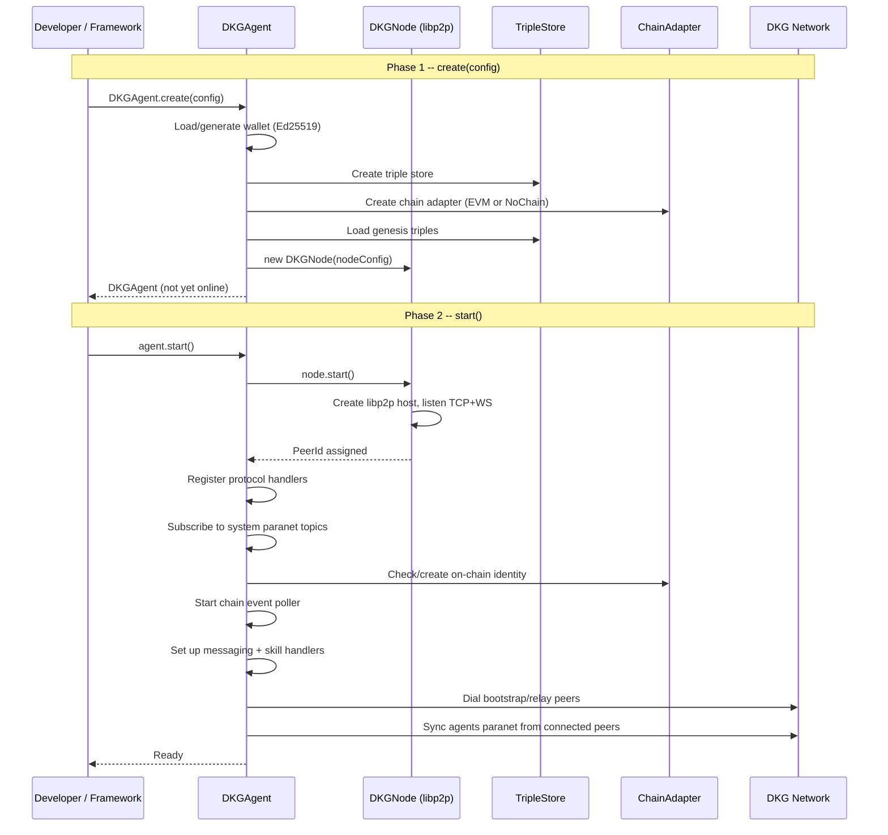

# Agent Lifecycle

How a DKG agent boots, joins the network, operates in steady state, and shuts down.

---

> **Key Concepts**
>
> | Term | Definition |
> |------|-----------|
> | **DKGAgent** | High-level facade (`@origintrail-official/dkg-agent`) that ties together identity, networking, publishing, querying, discovery, and messaging into a single object. |
> | **DKGNode** | Lower-level networking component (`@origintrail-official/dkg-core`) that manages a libp2p host -- TCP/WebSocket listeners, peer connections, and transport encryption. |
> | **libp2p** | Modular peer-to-peer networking stack. Each node gets a PeerId derived from its Ed25519 keypair. |
> | **GossipSub** | Publish-subscribe protocol layered on libp2p. Nodes subscribe to "topics" (one per paranet) and receive messages from any peer on that topic. |
> | **Peer discovery** | How nodes find each other. Uses mDNS (local network), bootstrap peers (known addresses), or relay nodes. |
> | **Bootstrap peers** | Well-known nodes whose multiaddrs are hardcoded in config. New nodes dial them first to join the network. |
> | **Relay / Circuit relay** | A public node that forwards traffic on behalf of nodes behind NAT. Edge nodes request a "reservation" on the relay so other peers can reach them. |
> | **Edge vs Core node** | Edge nodes are personal/behind NAT and connect through relays. Core nodes are public, act as relays, and are typically cloud-deployed. |
> | **Adapter / Plugin** | A wrapper that embeds a DKGAgent inside another framework (OpenClaw, ElizaOS) and exposes DKG capabilities as framework-native tools or services. |

---

## Analogy

Think of a DKG node as a **librarian joining a network of libraries**. On startup, the librarian unpacks their credentials (wallet), sets up their desk (triple store), and opens the doors (libp2p listener). They then walk over to the nearest known library (bootstrap/relay peer) and introduce themselves. Once connected, they subscribe to shared catalogues (paranet GossipSub topics) so they hear about new books (knowledge collections) as they are published. In steady state, the librarian can accept new books, answer questions, and pass messages to other librarians. When it is time to close, they unsubscribe from catalogues, say goodbye to peers, and lock the doors.

---

## Startup Sequence

The lifecycle has two phases: **create** (build the object) and **start** (go online).

### Phase 1: `DKGAgent.create(config)`

This is a static factory method. It assembles all internal components but does not touch the network.

1. **Wallet** -- Load or generate an Ed25519 keypair. If `dataDir` exists, load from `dataDir/agent-wallet.json`. Otherwise generate a fresh keypair and persist it.
   - File: `packages/agent/src/agent-wallet.ts`

2. **Triple store** -- Create the RDF storage backend. Defaults to an Oxigraph worker thread with persistence at `dataDir/store.nq`. Falls back to in-memory if no `dataDir`.
   - File: `packages/storage/src/`

3. **Chain adapter** -- If `chainConfig` is provided (RPC URL, hub address, operational keys), create an `EVMChainAdapter`. Otherwise use `NoChainAdapter` (offline mode -- P2P and local queries work, on-chain operations throw).
   - File: `packages/chain/src/`

4. **Genesis data** -- Load the DKG ontology and system paranet definitions into the triple store (idempotent).
   - File: `packages/core/src/genesis.ts`

5. **DKGNode** -- Construct (but do not start) the libp2p networking layer with the agent's keypair, listen addresses, relay peers, and discovery settings.
   - File: `packages/core/src/node.ts`

6. **DKGPublisher + DKGQueryEngine** -- Wire up the publishing pipeline and SPARQL query engine against the store.

The result is a fully configured `DKGAgent` instance that is not yet connected to any peers.

### Phase 2: `agent.start()`

This brings the node online:

1. **Start libp2p** -- `DKGNode.start()` creates the libp2p host, listens on TCP + WebSocket, assigns the PeerId.

2. **Protocol registration** -- A `ProtocolRouter` is created and handlers are registered for:
   - `/dkg/access/1.0.0` -- access-controlled data retrieval
   - `/dkg/publish/1.0.0` -- receive published knowledge collections
   - `/dkg/query/2.0.0` -- cross-agent SPARQL queries
   - `/dkg/sync/1.0.0` -- paginated data sync for new peers

3. **GossipSub setup** -- A `GossipSubManager` subscribes to the system paranet topics (`agents`, `ontology`).

4. **On-chain identity** -- If using a real chain adapter, the agent checks for an existing on-chain identity. If none exists, it calls `ensureProfile()` to create one and stake.

5. **Chain event poller** -- Starts polling for on-chain events (publish confirmations, new paranets).

6. **Messaging** -- Sets up encrypted peer-to-peer messaging (Ed25519 -> X25519 key conversion for encryption).

7. **Skill handlers** -- Registers any configured skill handlers so remote agents can invoke them.

8. **Sync handler** -- Registers the sync protocol so peers can pull data page-by-page.

9. **Bootstrap dial** -- Connects to configured bootstrap peers. For relay peers, the node requests a circuit reservation and starts a relay watchdog timer.

10. **Peer sync** -- On every new `peer:connect` event, the agent syncs the agents paranet from the new peer to discover profiles published before it came online.

---

## Network Join Details

How the node becomes reachable depends on its role:

**Edge node (behind NAT):**
- Dials relay peers from config and requests a circuit reservation
- A relay watchdog timer (15s base, exponential backoff up to 5min) periodically checks relay connections and redials if they drop (handles laptop sleep/wake)
- Other peers reach the edge node via the relay's circuit address
- DCUtR (Direct Connection Upgrade through Relay) attempts to upgrade relay connections to direct connections when possible

**Core node (public):**
- Listens directly on TCP + WebSocket
- Runs a `circuitRelayServer` so edge nodes can request reservations
- Does not need relay peers itself

Relevant file: `packages/core/src/node.ts` (lines 40-350)

---

## Steady-State Operations

Once started, the agent handles three categories of work:

### Inbound (from the network)
- **GossipSub messages** -- When a peer publishes to a subscribed paranet topic, the `PublishHandler` processes the incoming knowledge collection and inserts it into the local store.
- **Protocol requests** -- Remote peers can send access, publish, query, or sync requests via the `ProtocolRouter`. Each request opens a libp2p stream, the handler processes it, and returns a response.
- **Chat messages** -- Encrypted peer-to-peer messages arrive via the messaging protocol.

### Outbound (from the developer)
- `agent.publish(paranetId, quads)` -- Creates a knowledge collection, stores it locally, broadcasts via GossipSub, and optionally anchors on-chain.
- `agent.query(sparql)` -- Runs a SPARQL query against the local triple store.
- `agent.queryRemote(peerId, request)` -- Sends a query to a remote peer via the query protocol.
- `agent.sendChat(peerId, text)` -- Sends an encrypted message to another agent.
- `agent.findAgents()` / `agent.findSkills()` -- Queries the local store for agent profiles and skill offerings.

### Background
- **Chain event poller** -- Periodically checks for on-chain publish confirmations and new paranet registrations.
- **Relay watchdog** -- Monitors relay connections and redials on disconnect.

---

## Shutdown

`agent.stop()` performs a clean teardown:

1. Stop the chain event poller
2. Stop the libp2p node (which closes all peer connections, unsubscribes from GossipSub topics, and clears relay watchdog timers)

The daemon (`packages/cli/src/daemon.ts`) adds additional cleanup:
- Stops the metrics collector
- Closes the HTTP API server
- Closes the dashboard database
- Removes PID and API port files

Shutdown is triggered by SIGINT/SIGTERM signals.

---

## How Adapters Hook In

Both adapters follow the same pattern: create a `DKGAgent`, call `start()`, call `publishProfile()`, and expose DKG operations through the host framework's interface.

### OpenClaw Adapter (`packages/adapter-openclaw/src/DkgNodePlugin.ts`)

The `DkgNodePlugin` class wraps a `DKGAgent` and registers with OpenClaw's plugin API:

- **Lifecycle hooks**: `session_start` calls `agent.start()`, `session_end` calls `agent.stop()`.
- **Tools**: Registers framework-native tools (`dkg_status`, `dkg_publish`, `dkg_query`, `dkg_find_agents`, `dkg_send_message`, `dkg_invoke_skill`). Each tool delegates to the underlying `DKGAgent` method.
- **Lazy start**: The agent starts on the first tool call if not already running.
- **Skills**: OpenClaw skill handlers are wrapped to match the `SkillHandler` interface expected by `DKGAgent`.

### ElizaOS Adapter (`packages/adapter-elizaos/src/service.ts`)

The `dkgService` object implements ElizaOS's `Service` interface:

- **`initialize(runtime)`**: Reads config from ElizaOS runtime settings (`DKG_RELAY_PEERS`, `DKG_BOOTSTRAP_PEERS`, etc.), creates and starts a `DKGAgent`, publishes the profile. The agent is stored in a module-level singleton.
- **`cleanup()`**: Calls `agent.stop()` and clears the singleton.
- **Actions/Providers**: Separate files (`actions.ts`, `provider.ts`) use the singleton agent to expose publish, query, and discovery as ElizaOS actions and context providers.

### Writing Your Own Adapter

The interface is minimal. You need to:

1. Construct a `DKGAgentConfig` with at minimum a `name`
2. Call `DKGAgent.create(config)` and then `agent.start()`
3. Call `agent.publishProfile()` to announce yourself to the network
4. Expose `agent.publish()`, `agent.query()`, `agent.findAgents()`, etc. through your framework
5. Call `agent.stop()` on shutdown

---

## CLI Daemon Flow

When a user runs `dkg start`, the CLI (`packages/cli/src/cli.ts`) either runs the daemon in the foreground or spawns a detached background process. The daemon (`packages/cli/src/daemon.ts`) performs:

1. Load config from `~/.dkg/config.json`
2. Load network config from `network/testnet.json`
3. Load or generate operational wallets from `~/.dkg/wallets.json`
4. Call `DKGAgent.create()` with the assembled config
5. Verify the network ID matches genesis
6. Call `agent.start()` and `agent.publishProfile()`
7. Wait for circuit relay reservation (up to 10s)
8. Subscribe to configured paranets
9. Start the HTTP API server (status, publish, query, chat, wallet management)
10. Start dashboard DB, metrics collector, and operation tracker
11. Write PID file and API port for CLI subcommands to use

---

## Configuration Reference

See `docs/diagrams/agent-lifecycle.md` for the full `DKGAgentConfig` interface. Key fields:

| Field | Default | Description |
|-------|---------|-------------|
| `name` | (required) | Human-readable node name |
| `framework` | `undefined` | Framework identifier (e.g. "OpenClaw", "ElizaOS", "DKG") |
| `listenPort` | `0` (random) | TCP port for libp2p |
| `relayPeers` | `undefined` | Relay multiaddrs for NAT traversal |
| `bootstrapPeers` | `undefined` | Known peer multiaddrs for initial discovery |
| `nodeRole` | `"edge"` | `"core"` enables relay server; `"edge"` uses relays |
| `dataDir` | `undefined` | Persistent storage directory (wallet, triple store) |
| `chainConfig` | `undefined` | EVM chain settings (RPC, hub, operational keys) |
| `skills` | `[]` | Skill handlers this agent offers to the network |

---

## Where to Look

| Component | Path |
|-----------|------|
| DKGAgent (facade) | `packages/agent/src/dkg-agent.ts` |
| Agent wallet | `packages/agent/src/agent-wallet.ts` |
| Profile manager | `packages/agent/src/profile-manager.ts` |
| Discovery client | `packages/agent/src/discovery.ts` |
| Encrypted messaging | `packages/agent/src/messaging.ts` |
| DKGNode (libp2p) | `packages/core/src/node.ts` |
| GossipSubManager | `packages/core/src/gossipsub-manager.ts` |
| ProtocolRouter | `packages/core/src/protocol-router.ts` |
| Genesis data | `packages/core/src/genesis.ts` |
| CLI daemon | `packages/cli/src/daemon.ts` |
| CLI entry | `packages/cli/src/cli.ts` |
| OpenClaw adapter | `packages/adapter-openclaw/src/DkgNodePlugin.ts` |
| ElizaOS adapter | `packages/adapter-elizaos/src/service.ts` |
| Detailed diagram | `docs/diagrams/agent-lifecycle.md` |
