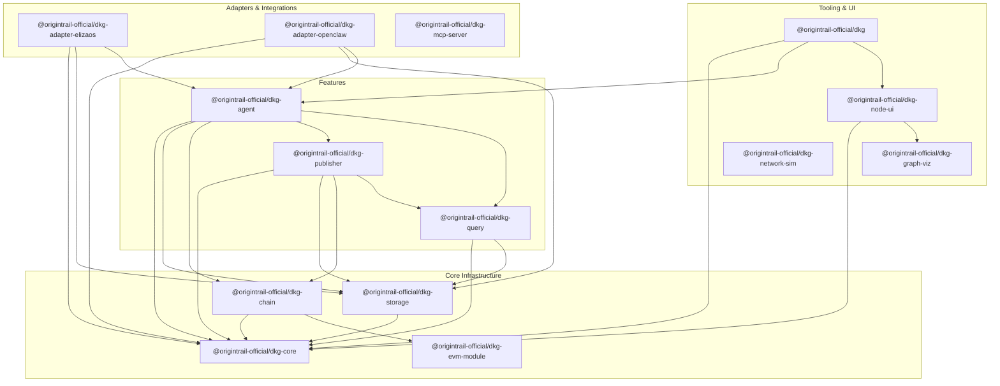

# Package Map

This guide maps all 14 packages in the DKG v9 monorepo, explains what each one does, and shows how they depend on each other.

> **Key Concepts**
>
> - **Monorepo**: A single Git repository containing multiple packages that are developed, versioned, and released together. DKG v9 uses pnpm workspaces.
> - **Workspace package**: A folder under `packages/` with its own `package.json`. Packages reference each other with `workspace:*` in their dependencies.
> - **Adapter pattern**: A package that wraps the DKG agent so it can run inside a different framework (ElizaOS, OpenClaw) without changing the core code.
> - **Triple store**: A database that stores data as RDF triples (subject-predicate-object). DKG uses triple stores (Oxigraph, Blazegraph) to hold knowledge graphs.

---

## Layer Overview

The packages form four layers. Higher layers depend on lower ones; packages in the same layer are mostly independent of each other.

```
Tooling & UI          cli  node-ui  graph-viz  network-sim
                        |     |
Features              agent  publisher  query
                        |       |         |
Adapters/Integrations adapter-elizaos  adapter-openclaw  mcp-server
                        |
Core Infrastructure   core  storage  chain  evm-module
```

---

## Dependency Diagram



---

## Core Infrastructure

These packages provide the foundation that everything else builds on.

### @origintrail-official/dkg-core
`packages/core/`

The lowest-level building block. Provides the libp2p networking layer (peer discovery, GossipSub messaging, protocol routing), cryptographic primitives (Ed25519 signing, hashing, RDF canonicalization), protobuf message definitions, the event bus, logging, and shared types/constants. Every other package in the monorepo depends on `@origintrail-official/dkg-core` either directly or transitively.

**Key exports**: `DKGNode`, `ProtocolRouter`, `GossipSubManager`, `PeerDiscoveryManager`, `Logger`, genesis helpers.

### @origintrail-official/dkg-storage
`packages/storage/`

Abstracts triple store backends behind a common `TripleStore` interface. Ships with four adapters: Oxigraph (embedded, default), Oxigraph Worker (off-main-thread), Blazegraph (remote), and a generic SPARQL-over-HTTP adapter. Also provides `GraphManager` for named-graph lifecycle and `PrivateContentStore` for encrypted data at rest.

**Depends on**: `core`.

### @origintrail-official/dkg-chain
`packages/chain/`

Defines the `ChainAdapter` interface for on-chain operations (identity registration, staking, knowledge asset creation, token transfers). Ships three implementations: `EVMChainAdapter` (real EVM via ethers.js), `MockChainAdapter` (for tests), and `NoChainAdapter` (offline mode).

**Depends on**: `core`, `evm-module` (for contract ABIs).

### @origintrail-official/dkg-evm-module
`packages/evm-module/`

The Solidity smart contracts that run on-chain (forked from DKG v8). Includes contracts for identity, staking, knowledge assets, knowledge collections, paranets, token management, random sampling, and fair-swap dispute resolution. Uses Hardhat for compilation, testing, and deployment. Other TypeScript packages import only the compiled ABI JSON files from this package.

**Depends on**: OpenZeppelin, Solady (Solidity libraries only).

---

## Features

These packages implement the core DKG capabilities: publishing knowledge, querying it, and running an autonomous agent.

### @origintrail-official/dkg-publisher
`packages/publisher/`

Handles the full publish lifecycle: validation, blank-node skolemization, auto-partitioning into knowledge assets, Merkle root computation (public, private, combined), metadata generation, on-chain commitment via `chain`, and gossip-based replication to peers. Also provides `AccessHandler`/`AccessClient` for private-data access control and `ChainEventPoller` for reacting to on-chain paranet events.

**Depends on**: `core`, `storage`, `chain`, `query`.

### @origintrail-official/dkg-query
`packages/query/`

Provides `DKGQueryEngine` for local SPARQL queries and `QueryHandler` for responding to remote peer queries over the P2P network. Includes a `sparql-guard` that validates queries are read-only before execution, preventing mutation through the query path.

**Depends on**: `core`, `storage`.

### @origintrail-official/dkg-agent
`packages/agent/`

The high-level "batteries-included" package. `DKGAgent` composes a node, publisher, query engine, wallet management, agent profiles, peer discovery, and encrypted messaging into a single orchestrator. Manages the agent lifecycle (start, register identity, publish profile, discover peers, handle messages, stop). Also provides skill-based RPC: agents can advertise skill offerings and invoke each other's skills over the network.

**Depends on**: `core`, `storage`, `chain`, `publisher`, `query`.

---

## Adapters & Integrations

These packages connect the DKG to external frameworks and tools.

### @origintrail-official/dkg-adapter-elizaos
`packages/adapter-elizaos/`

An ElizaOS plugin that turns any ElizaOS agent into a DKG v9 node. Exposes DKG capabilities as ElizaOS actions (publish, query, find agents, send message, invoke skill) and provides a knowledge provider that feeds graph data into the agent's context.

**Depends on**: `core`, `storage`, `agent`.

### @origintrail-official/dkg-adapter-openclaw
`packages/adapter-openclaw/`

An OpenClaw plugin adapter that turns any OpenClaw agent into a DKG v9 node. Follows the OpenClaw plugin convention (plugin manifest, entry script, tool definitions). Similar capability surface to the ElizaOS adapter but shaped to OpenClaw's extension API.

**Depends on**: `core`, `storage`, `agent`.

### @origintrail-official/dkg-mcp-server
`packages/mcp-server/`

A Model Context Protocol (MCP) server that exposes the DKG code graph to AI coding assistants (Claude Code, Cursor, etc.). Provides tools for finding modules, functions, classes, and packages by keyword, getting file summaries without reading source, and running raw SPARQL queries. Connects to a running DKG node's API.

**Depends on**: `@modelcontextprotocol/sdk`, `zod` (no workspace deps).

---

## Tooling & UI

These packages support development, operations, and visualization.

### @origintrail-official/dkg
`packages/cli/`

The `dkg` command-line tool. Provides commands for node lifecycle (`init`, `start`, `stop`, `status`), knowledge operations (`publish`, `query`, `query-remote`), paranet management (`paranet create`, `paranet list`), agent networking (`peers`, `send`, `chat`), wallet management, ask configuration, codebase indexing, and log tailing. This is the primary user-facing entry point for running a DKG node.

**Depends on**: `core`, `agent`, `node-ui`.

### @origintrail-official/dkg-node-ui
`packages/node-ui/`

A dashboard backend and React frontend for monitoring a running DKG node. The backend provides `DashboardDB` (SQLite-based metrics, operation tracking, chat history, query logs), `StructuredLogger`, `MetricsCollector`, `OperationTracker`, and OpenTelemetry integration. The frontend (built with Vite) provides a visual dashboard with charts (Recharts), a SPARQL query editor (CodeMirror), and a knowledge graph explorer (using `graph-viz`).

**Depends on**: `core`, `graph-viz`.

### @origintrail-official/dkg-graph-viz
`packages/graph-viz/`

A standalone RDF knowledge graph visualizer. Renders force-directed graphs with hexagonal nodes, supports declarative view configs, temporal filtering, multiple color palettes, and both 2D (Canvas) and optional 3D (Three.js) rendering. Can load data from Oxigraph or remote SPARQL endpoints. Also exports React components for embedding in web apps.

**Depends on**: `force-graph`, `n3`, `oxigraph` (no workspace deps).

### @origintrail-official/dkg-network-sim
`packages/network-sim/`

A browser-based network simulator for visualizing DKG node interactions. A React + Vite app that lets you spawn virtual nodes, watch them discover peers, publish knowledge, and propagate data -- useful for understanding network dynamics without running real nodes.

**Depends on**: `react` (no workspace deps).

---

## "Where Do I Look?" Quick Reference

| If you want to...                              | Look in                          |
|------------------------------------------------|----------------------------------|
| Run a DKG node locally                         | `packages/cli/`                  |
| Understand how data gets published              | `packages/publisher/`            |
| See how SPARQL queries execute                  | `packages/query/`                |
| Modify smart contracts                          | `packages/evm-module/contracts/` |
| Add a new on-chain operation                    | `packages/chain/`                |
| Change how peers discover each other            | `packages/core/src/discovery.ts` |
| Add a new GossipSub message type                | `packages/core/src/proto/`       |
| Swap the triple store backend                   | `packages/storage/src/adapters/` |
| Build an ElizaOS agent with DKG                 | `packages/adapter-elizaos/`      |
| Build an OpenClaw agent with DKG                | `packages/adapter-openclaw/`     |
| Expose DKG to an AI coding assistant            | `packages/mcp-server/`           |
| Add a metric to the node dashboard              | `packages/node-ui/`              |
| Customize knowledge graph rendering             | `packages/graph-viz/`            |
| Understand network behavior visually            | `packages/network-sim/`          |
| See how agent identity/profiles work            | `packages/agent/src/profile.ts`  |
| Understand encrypted agent-to-agent messaging   | `packages/agent/src/messaging.ts`|
| See the full agent orchestration lifecycle      | `packages/agent/src/dkg-agent.ts`|

---

## Workspace Dependency Summary

| Package              | Workspace Dependencies                              |
|----------------------|------------------------------------------------------|
| `@origintrail-official/dkg-core`          | (none -- leaf)                                       |
| `@origintrail-official/dkg-evm-module`    | (none -- leaf, Solidity only)                        |
| `@origintrail-official/dkg-storage`       | `core`                                               |
| `@origintrail-official/dkg-chain`         | `core`, `evm-module`                                 |
| `@origintrail-official/dkg-query`         | `core`, `storage`                                    |
| `@origintrail-official/dkg-publisher`     | `core`, `storage`, `chain`, `query`                  |
| `@origintrail-official/dkg-agent`         | `core`, `storage`, `chain`, `publisher`, `query`     |
| `@origintrail-official/dkg-adapter-elizaos` | `core`, `storage`, `agent`                         |
| `@origintrail-official/dkg-adapter-openclaw` | `core`, `storage`, `agent`                        |
| `@origintrail-official/dkg-mcp-server`    | (none -- connects via HTTP API)                      |
| `@origintrail-official/dkg-graph-viz`     | (none -- standalone)                                 |
| `@origintrail-official/dkg-network-sim`   | (none -- standalone)                                 |
| `@origintrail-official/dkg-node-ui`       | `core`, `graph-viz`                                  |
| `@origintrail-official/dkg`           | `core`, `agent`, `node-ui`                           |
