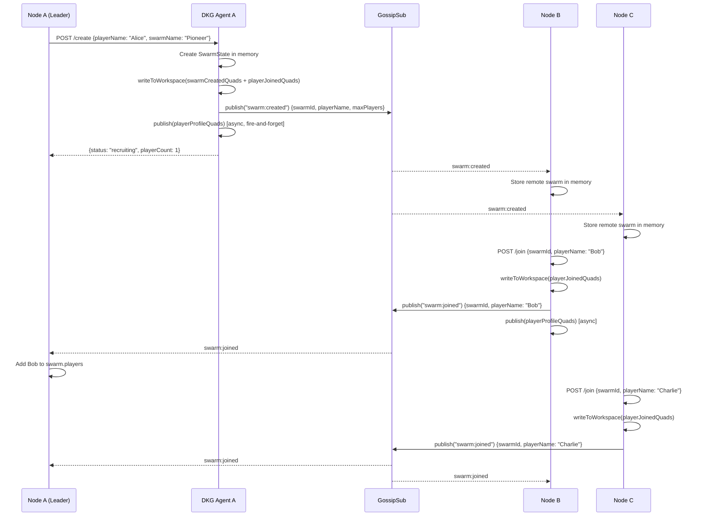
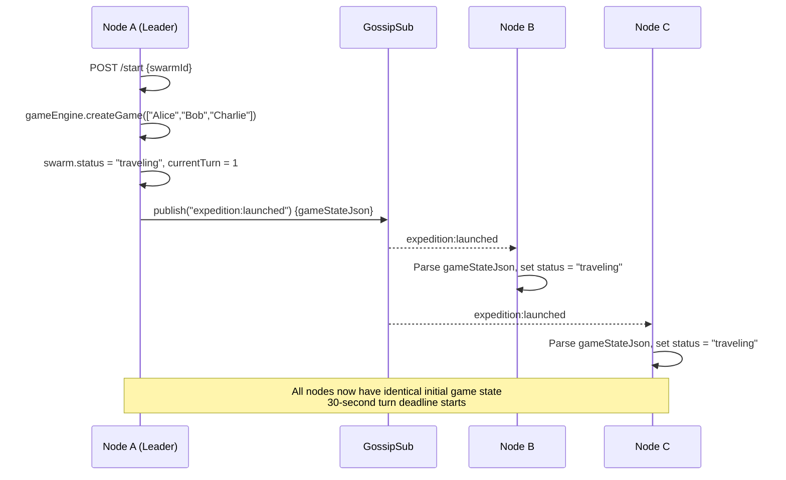
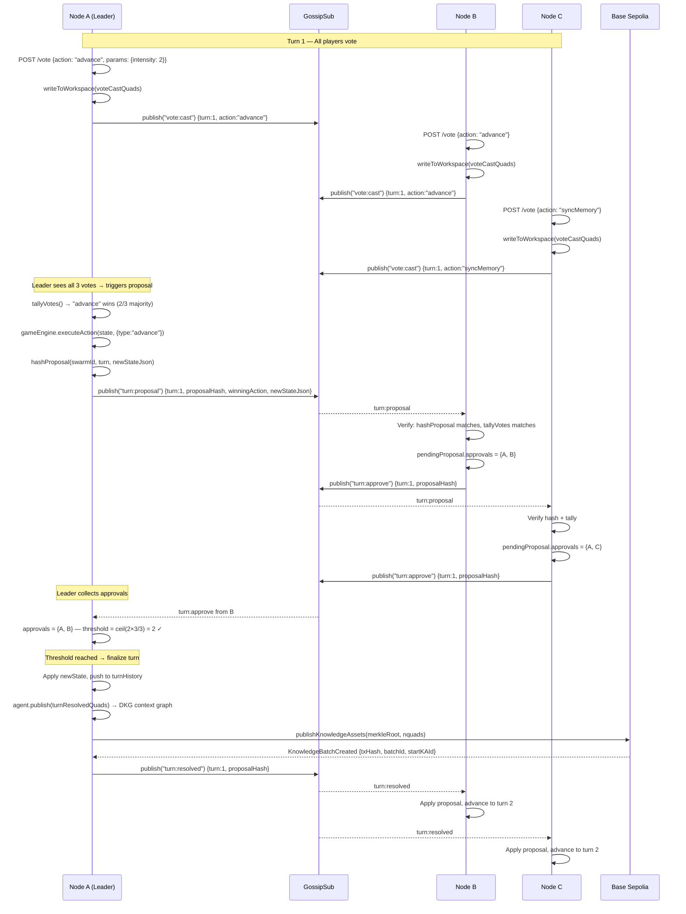
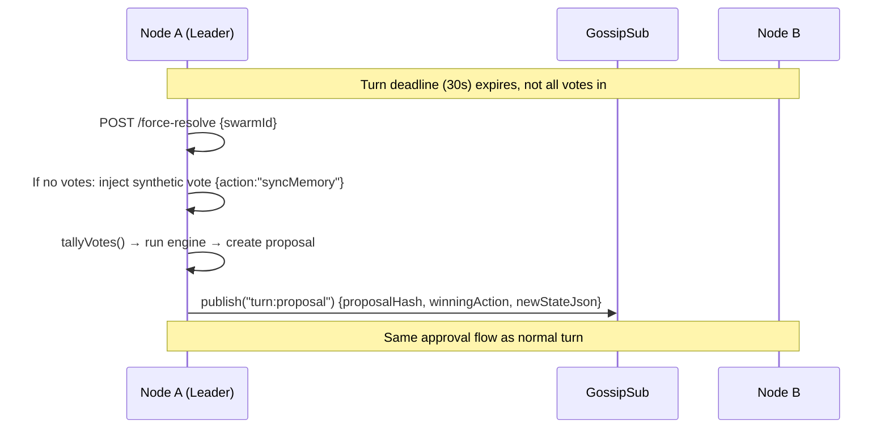
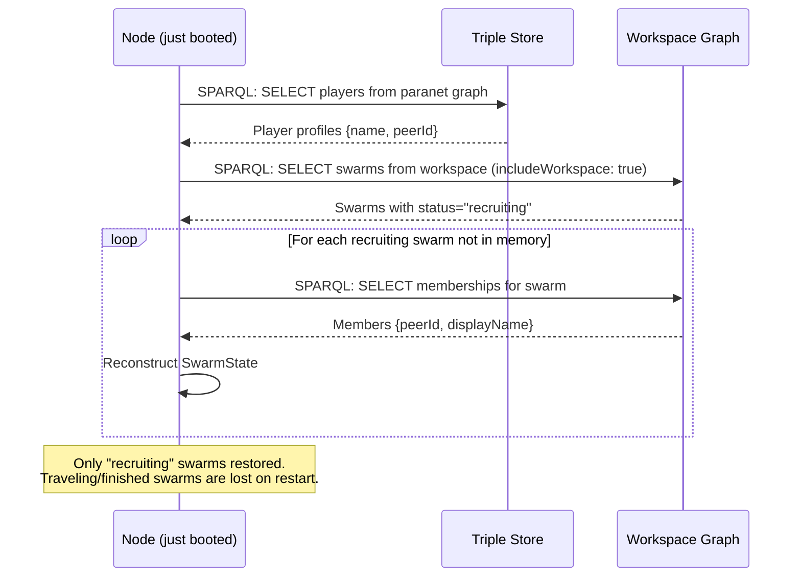
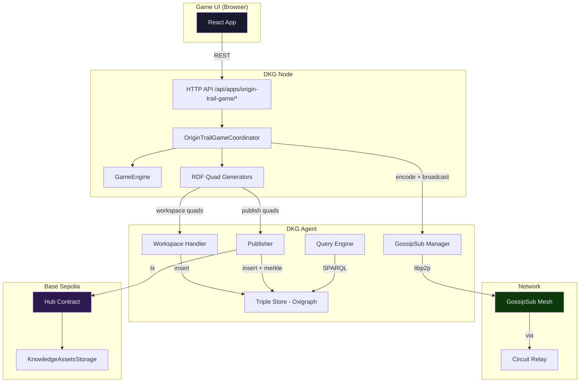

# OriginTrail Game — Protocol & Knowledge Graph Reference

> How the game uses the DKG V9 protocol: sequence diagrams, RDF triples,
> consensus flow, and identified improvement opportunities.

---

## 1. Architecture Overview

The game runs as an installable DKG app (`dkg-app-origin-trail-game`).
Each node loads the game coordinator, which bridges the game engine with the
DKG network using three DKG primitives:

| Primitive | When used | Persistence |
|-----------|-----------|-------------|
| **GossipSub** (app topic) | Real-time coordination (create, join, vote, propose, approve) | Ephemeral — in-memory only |
| **Workspace** writes | Swarm creation, player joins, vote records | Node-local, replicated via gossip, no chain |
| **Publish** | Turn results → context graph, player profiles | Permanent, on-chain anchored (merkle root + KA NFTs) |

All messages flow through a single topic: `dkg/paranet/origin-trail-game/app`.

---

## 2. Game Lifecycle — Full Sequence

### 2.1 Create Swarm + Join



### 2.2 Start Journey



### 2.3 Voting + Turn Resolution (Consensus)



### 2.4 Force Resolve (Deadline Expired)



---

## 3. RDF Triples Created at Each Step

### 3.1 Workspace Writes (ephemeral, no chain)

**Graph:** `did:dkg:paranet:origin-trail-game` (workspace)

#### Swarm Created
```turtle
<ot:swarm/{swarmId}>  rdf:type          ot:AgentSwarm ;
                       ot:name           "Pioneer Express" ;
                       ot:orchestrator   <ot:player/{leaderPeerId}> ;
                       ot:createdAt      "1709901234000"^^xsd:decimal ;
                       ot:status         "recruiting" .
```

#### Player Joined
```turtle
<ot:swarm/{swarmId}/member/{peerId}>
    rdf:type          ot:SwarmMembership ;
    ot:agent          <ot:player/{peerId}> ;
    ot:displayName    "Bob" ;
    ot:swarm          <ot:swarm/{swarmId}> .
```

#### Vote Cast
```turtle
<ot:swarm/{swarmId}/turn/1/vote/{peerId}>
    rdf:type    ot:Vote ;
    ot:turn     "1"^^xsd:decimal ;
    ot:action   "advance" ;
    ot:agent    <ot:player/{peerId}> ;
    ot:params   "{\"intensity\":2}" .
```

### 3.2 Published Data (permanent, on-chain anchored)

**Graph:** `did:dkg:paranet:origin-trail-game/context/{swarmId}`

#### Turn Resolved
```turtle
<ot:swarm/{swarmId}/turn/1>
    rdf:type           ot:TurnResult ;
    ot:turn            "1"^^xsd:decimal ;
    ot:winningAction   "advance" ;
    ot:gameState       "{...full JSON...}" ;
    ot:swarm           <ot:swarm/{swarmId}> ;
    ot:approvedBy      <ot:player/{peerId_A}> ;
    ot:approvedBy      <ot:player/{peerId_B}> .
```

#### Player Profile
```turtle
<did:dkg:game:player:{peerId}>
    rdf:type        ot:Player ;
    schema:name     "Alice" ;
    dkg:peerId      "12D3KooW..." ;
    prov:atTime     "2026-03-08T11:15:22.000Z" .
```

### 3.3 DKG Metadata (auto-generated by publisher)

**Graph:** `did:dkg:paranet:origin-trail-game/_meta`

```turtle
<did:dkg:base:84532/{publisherAddr}/{startKAId}>
    rdf:type              dkg:KnowledgeCollection ;
    dkg:merkleRoot        "0xabc123..." ;
    dkg:kaCount           "1"^^xsd:integer ;
    dkg:status            "confirmed" ;
    dkg:transactionHash   "0xdef456..." ;
    dkg:blockNumber       "12345678"^^xsd:integer ;
    dkg:publisherAddress  "0x1234..." ;
    dkg:chainId           "base:84532" ;
    dkg:paranet           did:dkg:paranet:origin-trail-game ;
    prov:wasAttributedTo  "12D3KooW..." ;
    dkg:publishedAt       "2026-03-08T..."^^xsd:dateTime .
```

---

## 4. GossipSub Message Types

| Message | Sender | Payload | Purpose |
|---------|--------|---------|---------|
| `swarm:created` | Leader | swarmId, swarmName, playerName, maxPlayers | Announce new swarm to network |
| `swarm:joined` | Joiner | swarmId, playerName | Announce player joined |
| `swarm:left` | Leaver | swarmId | Announce player left |
| `expedition:launched` | Leader | swarmId, gameStateJson | Broadcast initial game state |
| `vote:cast` | Voter | swarmId, turn, action, params | Broadcast vote (+ heartbeat every 5s) |
| `turn:proposal` | Leader | swarmId, turn, proposalHash, winningAction, newStateJson, resultMessage | Propose turn resolution |
| `turn:approve` | Verifier | swarmId, turn, proposalHash | Approve proposal |
| `turn:resolved` | Leader | swarmId, turn, proposalHash | Notify turn finalized |

**Topic:** `dkg/paranet/origin-trail-game/app` (shared with all paranet subscribers)

---

## 5. What's Missing from the Knowledge Graph

### 5.1 Chain Provenance on Turn Results

**Current state:** `turnResolvedQuads` does NOT include tx hash, block number, batch ID,
or UAL — even though the publisher generates all of this when it calls `agent.publish()`.
The data is available in the meta graph (`_meta`) but not linked to the turn result itself.

> **REVIEW: This is a significant gap.** An agent querying the context graph for turn
> history has no way to verify on-chain anchoring without cross-referencing the meta
> graph by merkle root. The turn result should include:
>
> ```turtle
> <ot:swarm/{swarmId}/turn/1>
>     ot:transactionHash  "0x..."  ;
>     ot:blockNumber      "12345678"^^xsd:integer ;
>     ot:ual              "did:dkg:base:84532/0x.../42" ;
>     ot:batchId          "7"^^xsd:integer .
> ```
>
> **Fix:** After `agent.publish()` resolves, extract `result.ual`, `result.onChainResult.txHash`,
> etc. and write supplementary triples to the context graph.

### 5.2 No Signature Data in Graph

**Current state:** Approvals are recorded as `ot:approvedBy <peerId>`, but there's no
cryptographic proof. The proposal hash is computed via SHA-256 over `swarmId:turn:stateJson`
but never published to the graph.

> **REVIEW: High-value addition for agent trust scoring.** Adding:
>
> ```turtle
> <ot:swarm/{swarmId}/turn/1>
>     ot:proposalHash    "a92ab6cb..." ;
>     ot:consensusType   "gossipsub-2/3-majority" ;
>     ot:signatureCount  "2"^^xsd:integer ;
>     ot:signatureThreshold "2"^^xsd:integer .
> ```
>
> Would enable agents to audit which nodes are reliable consensus participants.

### 5.3 No Result Message in Graph

**Current state:** `resultMessage` (e.g. "Advanced 16 epochs. Arrived at GPU Depot!")
is only in the GossipSub message and in-memory `turnHistory`. It's NOT in the RDF.

> **REVIEW:** This is useful context for the knowledge graph. Add
> `ot:resultMessage "Advanced 16 epochs."` to `turnResolvedQuads`.

### 5.4 No Game Events in Graph

**Current state:** Random events (hallucination cascade, model collapse, abandoned weights)
are embedded in `gameStateJson` as `lastEvent` but not as first-class RDF entities.

> **REVIEW:** Events are valuable knowledge. Consider:
>
> ```turtle
> <ot:swarm/{swarmId}/turn/1/event>
>     rdf:type          ot:GameEvent ;
>     ot:eventType      "ai_failure" ;
>     ot:description    "Bob is experiencing a hallucination cascade" ;
>     ot:affectedMember <ot:player/{peerId}> ;
>     ot:damage         "30"^^xsd:integer .
> ```

### 5.5 No Resource Deltas in Graph

**Current state:** The full `gameStateJson` blob is stored per turn, but resource changes
(tokens spent, health lost) are not extractable without JSON parsing.

> **REVIEW:** Structured resource snapshots per turn would be far more queryable:
>
> ```turtle
> <ot:swarm/{swarmId}/turn/1>
>     ot:epochsAfter       "16"^^xsd:integer ;
>     ot:tokensAfter        "485"^^xsd:integer ;
>     ot:partyAliveCount    "3"^^xsd:integer .
> ```

### 5.6 Missing Fields in Graph Sync

| Field | Stored in workspace? | Stored in context graph? | Issue |
|-------|---------------------|-------------------------|-------|
| `maxPlayers` | No | No | Restored as hardcoded `3` |
| `joinedAt` per member | No (uses `createdAt`) | No | All members get swarm creation time |
| Vote history | Workspace only | No | Lost after node restart |
| `expedition:launched` | No RDF | No | Only GossipSub; game state lost on late join |
| `swarm:left` | No RDF | No | Only GossipSub |
| `resultMessage` | No | No | Only in-memory turnHistory |

---

## 6. Consensus Mechanism — Analysis

### Current Design

- **Threshold:** `ceil(2n/3)` where n = player count. For 3 players: 2 approvals needed.
- **Verification:** Receivers verify `proposalHash` (SHA-256 of `swarmId:turn:stateJson`)
  and that `winningAction` matches their local vote tally.
- **Non-determinism:** The game engine uses `Math.random()` — receivers do NOT replay the
  engine. They trust the leader's state output and verify only the action choice.

> **REVIEW: Protocol-level considerations:**
>
> 1. **Leader trust:** The leader controls the random seed and could manipulate event
>    outcomes. This is acceptable for a game but would be a vulnerability in a financial
>    context. A VRF (Verifiable Random Function) seeded by collective input would fix this.
>
> 2. **No rejection path:** If a verifier disagrees with the proposal, it simply doesn't
>    approve — but there's no explicit rejection message. A stuck proposal blocks the game
>    until force-resolve. Consider adding `turn:reject` with a reason.
>
> 3. **Proposal replay:** `turn:resolved` triggers finalization on nodes that received
>    the proposal but haven't reached threshold locally. This is a useful catch-up
>    mechanism, but depends on the leader being honest about which proposal was approved.
>
> 4. **Vote heartbeat:** Every 5 seconds, each voter re-broadcasts their vote. This is
>    essential for GossipSub reliability but creates O(n × turns × 6) messages per turn.
>    For 3 players this is fine; for 8 it's ~48 messages per 30-second window.

---

## 7. Graph-based Lobby Sync — Analysis

When a node starts (or restarts), `loadLobbyFromGraph` runs after 5 seconds:



> **REVIEW: Significant limitations:**
>
> 1. **No traveling swarm recovery:** If a node crashes mid-game, it cannot recover the
>    game state. The `gameStateJson` from `expedition:launched` is gossip-only; it's never
>    written to workspace or published until a turn resolves.
>
> 2. **Fix:** Write `expeditionLaunchedQuads` to workspace when the journey starts, and
>    update swarm status in workspace from `"recruiting"` to `"traveling"`. Then
>    `loadLobbyFromGraph` can restore mid-game swarms.
>
> 3. **maxPlayers hardcoded to 3** during sync — the workspace doesn't record it.
>    Add `ot:maxPlayers` to `swarmCreatedQuads`.

---

## 8. Data Flow Summary


