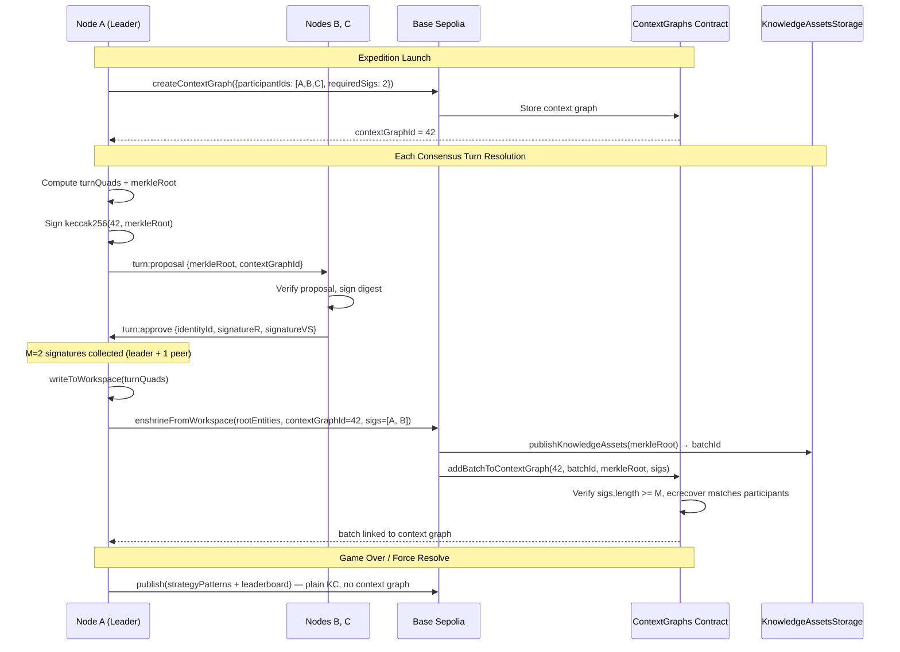
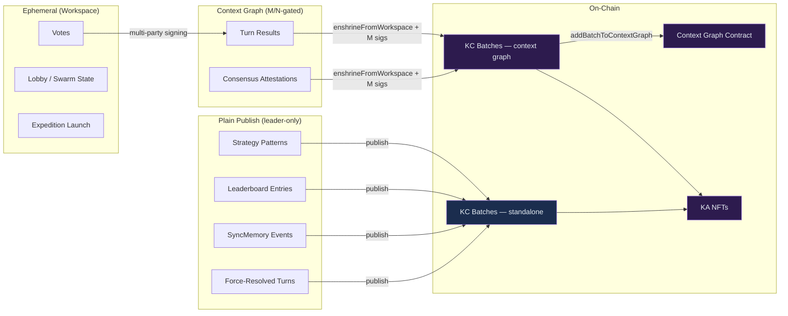
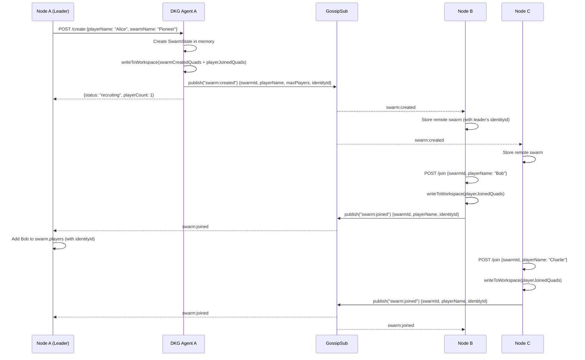
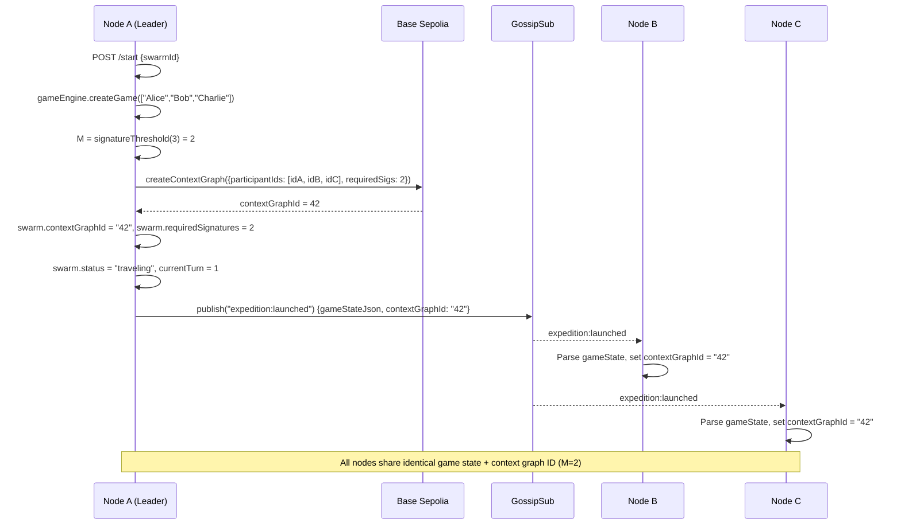
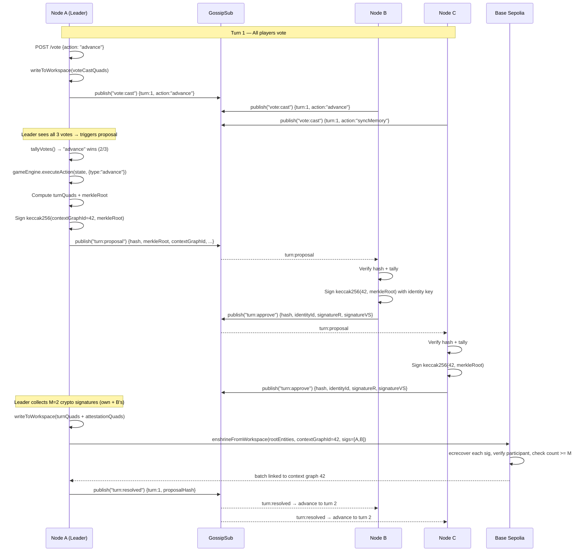
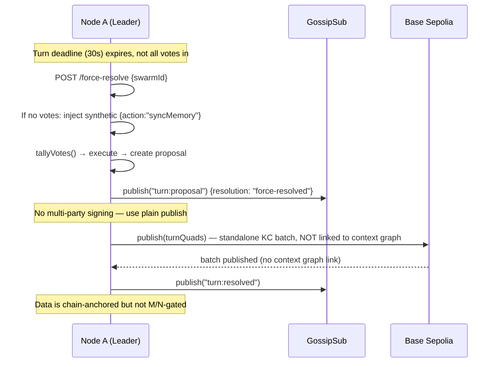
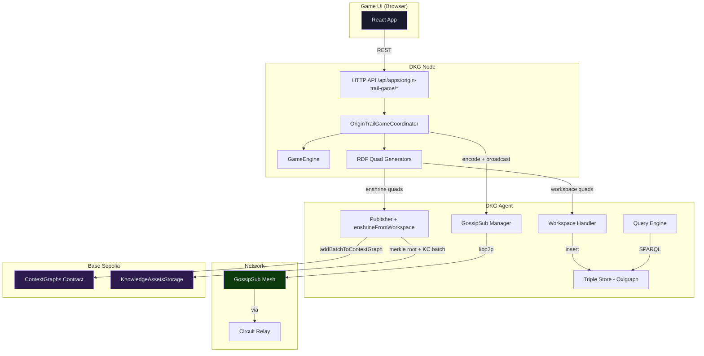
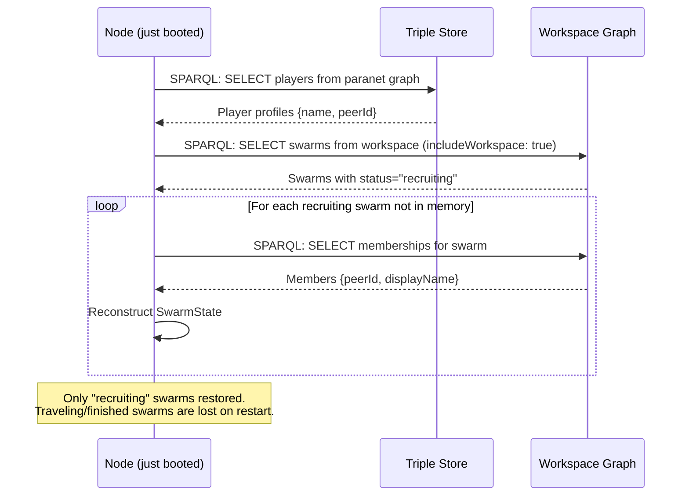

# OriginTrail Game — Protocol & Knowledge Graph Reference

> How the game uses the DKG V9 protocol: context graph integration,
> sequence diagrams, RDF triples, and consensus flow.

---

## 1. Architecture Overview

The game runs as an installable DKG app (`@origintrail-official/dkg-app-origin-trail-game`).
Each node loads the game coordinator, which bridges the game engine with the
DKG network using four DKG primitives:

| Primitive | When used | Persistence |
|-----------|-----------|-------------|
| **GossipSub** (app topic) | Real-time coordination (create, join, vote, propose, approve) | Ephemeral — in-memory only |
| **Workspace** writes | Swarm creation, player joins, vote records | Node-local, replicated via gossip, no chain |
| **Context Graph** | On-chain bounded subgraph created per game; turn results enshrined into it | Permanent, M/N signature-gated, on-chain anchored |
| **enshrineFromWorkspace** | Promote workspace quads to context graph with merkle root + KC batch | Permanent, chain-anchored (merkle root + KA NFTs) |

All gossipsub messages flow through a single topic: `dkg/paranet/origin-trail-game/app`.

---

## 2. Context Graph Integration

### 2.1 One Game = One Context Graph

Each game (wagon/swarm) gets its own on-chain **context graph**, created when the
expedition launches. The context graph:

- Lists all player identity IDs as **participants**
- Requires **M = ceil(2N/3)** on-chain participant signatures (e.g. M=2 for 3 players)
- Peers sign the context graph digest (`keccak256(contextGraphId, merkleRoot)`) as part of their `turn:approve` message
- The `ContextGraphs` contract verifies each signature belongs to a registered participant and that at least M are present
- Only consensus-resolved turn results are enshrined to the context graph; force-resolved turns and ancillary data (strategy patterns, leaderboard) use plain publish

### 2.2 Context Graph Lifecycle



### 2.3 Data Flow: Workspace → Context Graph → Chain



### 2.4 On-Chain Multi-Party Verification

The context graph uses a single, unified consensus mechanism:

1. **Gossip transport** — peers exchange votes, proposals, and signatures over GossipSub (sub-second, no gas)
2. **On-chain verification** — the `ContextGraphs` contract enforces that `M` of `N` registered participants cryptographically signed the merkle root before accepting a KC batch

| Aspect | Detail |
|--------|--------|
| **M value** | `ceil(2N/3)` — same threshold used for gossip approval |
| **What is signed** | `keccak256(contextGraphId, merkleRoot)` — ties the signature to both the context graph and the specific data batch |
| **Verification** | `ecrecover` on each signature, matched against participant identity IDs stored on the context graph |
| **Force-resolved turns** | Use plain `publish()` (not context graph) since multi-party consensus was not achieved |

This ensures that no single node can unilaterally enshrine data to the context graph — the blockchain enforces the same quorum the protocol requires.

---

## 3. Game Lifecycle — Full Sequence

### 3.1 Create Swarm + Join



### 3.2 Launch Expedition (creates context graph with M/N)



### 3.3 Voting + Turn Resolution (Multi-Party Signing → Context Graph)



### 3.4 Force Resolve (Deadline Expired — No Multi-Party Consensus)



---

## 4. RDF Triples Created at Each Step

### 4.1 Workspace Writes (ephemeral, no chain)

**Graph:** `did:dkg:paranet:origin-trail-game` (workspace)

#### Swarm Created
```turtle
<ot:swarm/{swarmId}>  rdf:type          ot:AgentSwarm ;
                       ot:name           "Pioneer Express" ;
                       ot:orchestrator   <ot:player/{leaderPeerId}> ;
                       ot:createdAt      "1709901234000"^^xsd:decimal ;
                       ot:status         "recruiting" ;
                       ot:maxPlayers     "3"^^xsd:decimal .
```

#### Player Joined
```turtle
<ot:swarm/{swarmId}/member/{peerId}>
    rdf:type          ot:SwarmMembership ;
    ot:agent          <ot:player/{peerId}> ;
    ot:displayName    "Bob" ;
    ot:swarm          <ot:swarm/{swarmId}> .
```

#### Vote Cast
```turtle
<ot:swarm/{swarmId}/turn/1/vote/{peerId}>
    rdf:type    ot:Vote ;
    ot:turn     "1"^^xsd:decimal ;
    ot:action   "advance" ;
    ot:agent    <ot:player/{peerId}> ;
    ot:params   "{\"intensity\":2}" .
```

### 4.2 Context Graph Data (permanent, enshrined on-chain)

**Graph:** `did:dkg:paranet:origin-trail-game/context/{swarmId}`

These quads are written to workspace first, then promoted to the on-chain
context graph via `enshrineFromWorkspace`.

#### Turn Resolved
```turtle
<ot:swarm/{swarmId}/turn/1>
    rdf:type           ot:TurnResult ;
    ot:turn            "1"^^xsd:decimal ;
    ot:winningAction   "advance" ;
    ot:gameState       "{...full JSON...}" ;
    ot:swarm           <ot:swarm/{swarmId}> ;
    ot:approvedBy      <ot:player/{peerId_A}> ;
    ot:approvedBy      <ot:player/{peerId_B}> .
```

#### Consensus Attestation
```turtle
<urn:dkg:attestation:{swarmId}:turn1:{proposalHash}>
    rdf:type          ot:ConsensusAttestationBatch ;
    ot:forTurn        <ot:swarm/{swarmId}/turn/1> ;
    ot:resolution     "consensus" ;
    ot:hasAttestation <ot:swarm/{swarmId}/turn/1/attestation/{hash}/{peerId}> .

<ot:swarm/{swarmId}/turn/1/attestation/{hash}/{peerId}>
    rdf:type          ot:ConsensusAttestation ;
    ot:signer         <ot:player/{peerId}> ;
    ot:proposalHash   "a92ab6cb..." ;
    ot:approved       "true"^^xsd:boolean ;
    ot:attestedAt     "1709901265000"^^xsd:decimal .
```

#### Strategy Pattern (game over)
```turtle
<ot:strategy/{swarmId}/{peerId}>
    rdf:type           ot:StrategyPattern ;
    ot:player          <ot:player/{peerId}> ;
    ot:swarm           <ot:swarm/{swarmId}> ;
    ot:totalVotes      "8"^^xsd:decimal ;
    ot:favoriteAction  "advance" ;
    ot:turnsSurvived   "12"^^xsd:decimal .
```

#### Leaderboard Entry (game over)
```turtle
<ot:swarm/{swarmId}/leaderboard/{peerId}>
    rdf:type       ot:LeaderboardEntry ;
    ot:player      <ot:player/{peerId}> ;
    ot:score       "2450"^^xsd:decimal ;
    ot:outcome     "won" ;
    ot:epochs      "200"^^xsd:decimal ;
    ot:survivors   "2"^^xsd:decimal ;
    ot:partySize   "3"^^xsd:decimal .
```

---

## 5. GossipSub Message Types

| Message | Sender | Key Payload | Purpose |
|---------|--------|-------------|---------|
| `swarm:created` | Leader | swarmId, playerName, maxPlayers, **identityId** | Announce new swarm |
| `swarm:joined` | Joiner | swarmId, playerName, **identityId** | Announce player joined |
| `swarm:left` | Leaver | swarmId | Announce player left |
| `expedition:launched` | Leader | gameStateJson, partyOrder, **contextGraphId** | Broadcast game state + context graph |
| `vote:cast` | Voter | turn, action, params | Broadcast vote |
| `turn:proposal` | Leader | proposalHash, winningAction, newStateJson, **merkleRoot**, **contextGraphId** | Propose turn + share digest for signing |
| `turn:approve` | Verifier | turn, proposalHash, **identityId**, **signatureR**, **signatureVS** | Approve proposal with crypto signature |
| `turn:resolved` | Leader | turn, proposalHash | Notify turn finalized |

**Topic:** `dkg/paranet/origin-trail-game/app`

---

## 6. Consensus Mechanism

### Threshold

`M = ceil(2n/3)` where n = player count. For 3 players: M=2 signatures needed.

### Gossip Verification

Receivers verify `proposalHash` (SHA-256 of `swarmId:turn:stateJson`)
and that `winningAction` matches their local vote tally.

### Cryptographic Signing

After verifying the proposal, each peer signs `keccak256(contextGraphId, merkleRoot)`
using their identity key and includes the signature (r, vs) in their `turn:approve` message.

### On-Chain Verification

The `ContextGraphs` contract:
1. Checks `signatures.length >= M`
2. Runs `ecrecover` on each signature to recover the signer address
3. Verifies each signer is a registered participant of the context graph
4. Only then links the KC batch to the context graph

### Non-determinism

The game engine uses `Math.random()` — receivers do NOT replay the
engine. They trust the leader's state output and verify only the action choice.

### Resolution modes

| Mode | When | Quorum | On-Chain |
|------|------|--------|----------|
| `consensus` | Majority wins cleanly | M crypto signatures | Enshrined to context graph |
| `leader-tiebreak` | Tie broken by leader's vote | M crypto signatures | Enshrined to context graph |
| `force-resolved` | Deadline expired | Leader only | Plain publish (no context graph) |

---

## 7. Data Flow Summary



---

## 8. Graph-based Lobby Sync

When a node starts (or restarts), `loadLobbyFromGraph` runs after 5 seconds:


