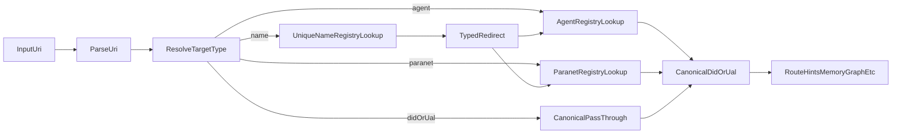

# DKG Resolver and Name Registry Proposal

Status: Draft  
Owner: Core protocol + Agent + Publisher + CLI + Node UI  
Scope: Design/spec proposal (no protocol-breaking rollout in this document)

## 1) Problem statement

Today, the system has strong identifiers (peer IDs, DIDs, UALs), but human-friendly resolution is fragmented:

- Agent identity is mostly discoverable via the agents system paranet, but not normalized into a resolver facade.
- Paranet discovery exists, but there is no first-class naming layer similar to ENS.
- Metadata provenance is not consistently query-friendly for "who authored this knowledge" across all write paths.

This proposal introduces:

1. A canonical resolver facade (`dkg://...`) that maps names/resources to canonical DIDs/UALs.
2. Three system registries:
   - Agent Registry
   - Paranet Registry
   - Unique Name Registry
3. A strict provenance requirement to store both network identity and chain identity when available.

## 2) Goals and non-goals

### Goals

- Deterministic resolution from friendly identifiers to canonical resources.
- Unambiguous ownership and uniqueness for names.
- Resolver compatibility with existing DID/UAL addressing.
- Mandatory dual provenance dimensions for writes:
  - network identity (peerId / agent DID)
  - chain identity (publisherAddress)

### Non-goals (phase 1)

- Replacing DID/UAL as canonical IDs.
- Building a tokenized auction economy for names.
- Cross-chain naming interoperability in v1.

## 3) Existing baseline

Relevant code and current capabilities:

- System paranets: `agents`, `ontology` in [packages/core/src/genesis.ts](../../packages/core/src/genesis.ts)
- Agent profiles and agent graph schema in [packages/agent/src/profile.ts](../../packages/agent/src/profile.ts)
- Metadata generation in [packages/publisher/src/metadata.ts](../../packages/publisher/src/metadata.ts)
- Publish/update call paths:
  - [packages/agent/src/dkg-agent.ts](../../packages/agent/src/dkg-agent.ts)
  - [packages/publisher/src/dkg-publisher.ts](../../packages/publisher/src/dkg-publisher.ts)

## 4) Identity model (dual provenance)

Every knowledge write SHOULD record both:

- `network identity`: peerId and/or `did:dkg:agent:<peerId>`
- `chain identity`: EVM `publisherAddress` (where applicable)

Recommended metadata shape for a KC (or equivalent operation metadata):

- `prov:wasAttributedTo` -> `did:dkg:agent:<peerId>` (resource, not literal)
- `dkg:peerId` -> `"12D3..."` (literal for direct lookup/debug)
- `dkg:publisherAddress` -> `"0x..."` (literal)

Rationale:

- `peerId` answers "which node/agent propagated this write?"
- `publisherAddress` answers "which chain identity finalized this write?"

## 5) URI grammar proposal (`dkg://`)

Canonical IDs remain DID/UAL. The resolver maps `dkg://...` into canonical targets.

Supported forms:

- `dkg://agent/<name-or-id>`
- `dkg://agent/<name-or-id>/memory`
- `dkg://paranet/<name-or-id>`
- `dkg://paranet/<name-or-id>/<path>`
- `dkg://name/<label>` (explicit unique-name lookup)
- `dkg://did/<did-value>` (direct canonical pass-through)
- `dkg://ual/<ual-value>` (direct canonical pass-through)

Examples:

- `dkg://agent/alice`
- `dkg://agent/alice/memory`
- `dkg://paranet/agents`
- `dkg://paranet/ontology`

### ABNF-like grammar (normative)

```text
dkg-uri          = "dkg://" target-kind "/" primary [ "/" subpath ]
target-kind      = "agent" / "paranet" / "name" / "did" / "ual"
primary          = 1*( unreserved / pct-encoded / ":" / "@" )
subpath          = segment *( "/" segment )
segment          = 1*( unreserved / pct-encoded / ":" / "@" )
unreserved       = ALPHA / DIGIT / "-" / "." / "_" / "~"
pct-encoded      = "%" HEXDIG HEXDIG
```

Normalization rules:

- URI scheme and target-kind are case-insensitive.
- `primary` is percent-decoded before resolver lookup.
- Name labels are normalized with: trim -> lowercase -> collapse internal whitespace/hyphen separators.
- DID/UAL values are not rewritten except percent-decoding.

## 6) Resolver algorithm

Resolver must be deterministic and explicit about precedence.



### Deterministic precedence

1. If URI is direct DID/UAL form -> return canonical target immediately.
2. For `<name-or-id>`:
   - exact DID/UAL match first
   - exact registry ID match
   - exact unique-name match
3. No fuzzy matching in resolver core.
4. If multiple valid records exist (should not happen for active names), fail with explicit conflict error.

### Reference resolver pseudocode

```text
resolve(uri):
  parsed = parseAndNormalize(uri)
  if parsed.kind in {"did", "ual"}:
    return canonical(parsed.primary)

  if looksLikeDidOrUal(parsed.primary):
    return canonical(parsed.primary)

  if parsed.kind == "name":
    claim = lookupActiveName(parsed.primary)
    if not claim: error NAME_NOT_FOUND
    return resolveTyped(claim.targetType, claim.targetId, parsed.subpath)

  if parsed.kind == "agent":
    hit = lookupAgentById(parsed.primary) or lookupAgentByName(parsed.primary)
    if not hit:
      claim = lookupActiveName(parsed.primary, targetType="agent")
      if not claim: error AGENT_NOT_FOUND
      hit = lookupAgentById(claim.targetId)
    return buildResolution(hit, parsed.subpath)

  if parsed.kind == "paranet":
    hit = lookupParanetById(parsed.primary) or lookupParanetByName(parsed.primary)
    if not hit:
      claim = lookupActiveName(parsed.primary, targetType="paranet")
      if not claim: error PARANET_NOT_FOUND
      hit = lookupParanetById(claim.targetId)
    return buildResolution(hit, parsed.subpath)

  error UNSUPPORTED_TARGET_KIND
```

## 7) Registry design (three system paranets)

## 7.1 Agent Registry (system paranet: `agents`)

Purpose: canonical agent identity + profile + capabilities + optional memory pointer.

Minimum fields:

- agent DID (`did:dkg:agent:<peerId>`)
- `dkg:peerId`
- `schema:name`
- optional:
  - framework
  - relay address
  - memory root/default memory paranet pointer

## 7.2 Paranet Registry (new dedicated system paranet)

Purpose: canonical paranet catalog and ownership metadata, separate from ontology lifecycle noise.

Minimum fields:

- paranet DID/UAL
- display name + description
- creator/owner
- status (active, deprecated)
- topic/config pointers

Note: existing ontology paranet can continue to define vocabularies. Registry content should be query-optimized for resolution.

## 7.3 Unique Name Registry (new ENS-like system paranet)

Purpose: map human names -> canonical targets with ownership and lifecycle.

Minimum fields:

- `name` (normalized label)
- `targetType` (`agent` | `paranet`)
- `targetId` (canonical DID/UAL)
- `owner` (agent DID and/or publisher address)
- `status` (`active` | `revoked` | `expired`)
- `createdAt`, `updatedAt`, optional `expiresAt`

Uniqueness rule:

- Only one active mapping for a fully normalized name.

## 7.4 Triple schema templates (normative)

The following templates define minimum triples for resolver correctness. Predicate names can map to final ontology constants during implementation.

### Agent Registry entry

```turtle
<did:dkg:agent:12D3...> a dkg:Agent ;
  dkg:peerId "12D3..." ;
  schema:name "alice" ;
  dkg:publisherAddress "0xabc..." ;
  dkg:defaultMemoryParanet <did:dkg:paranet:agents> ;
  dkg:updatedAt "2026-03-11T00:00:00Z"^^xsd:dateTime .
```

### Paranet Registry entry

```turtle
<did:dkg:paranet:agents> a dkg:Paranet ;
  schema:name "agents" ;
  schema:description "Agent registry and profiles" ;
  dkg:ownerAddress "0xabc..." ;
  dkg:registryStatus "active" ;
  dkg:updatedAt "2026-03-11T00:00:00Z"^^xsd:dateTime .
```

### Unique Name Registry claim

```turtle
<urn:dkg:name:agents> a dkg:NameClaim ;
  dkg:resolverName "agents" ;
  dkg:targetType "paranet" ;
  dkg:targetId <did:dkg:paranet:agents> ;
  dkg:ownerAddress "0xabc..." ;
  dkg:registryStatus "active" ;
  dkg:createdAt "2026-03-11T00:00:00Z"^^xsd:dateTime .
```

### Required indexes/constraints

- Name Registry:
  - unique active key on normalized `dkg:resolverName`
- Agent Registry:
  - unique key on `dkg:peerId`
- Paranet Registry:
  - unique key on canonical paranet DID/UAL
- All registries:
  - append-only activity history with current-state projection for fast lookup

## 8) Suggested ontology additions

Use existing namespace conventions from core genesis (`https://dkg.network/ontology#` and RDF/PROV schema terms), add if missing:

- `dkg:resolverName`
- `dkg:targetType`
- `dkg:targetId`
- `dkg:ownerAgent`
- `dkg:ownerAddress`
- `dkg:expiresAt`
- `dkg:registryStatus`
- `dkg:defaultMemoryParanet`
- `dkg:defaultMemoryRoot`

And standardize provenance expectations:

- `prov:wasAttributedTo` as DID resource
- `dkg:peerId` literal
- `dkg:publisherAddress` literal

## 9) API and integration surface

Potential resolver API (CLI/daemon):

- `GET /api/resolve?uri=dkg://agent/alice`
- `GET /api/resolve/name/<label>`
- `GET /api/resolve/agent/<nameOrId>`
- `GET /api/resolve/paranet/<nameOrId>`

Potential CLI:

- `dkg resolve dkg://agent/alice`
- `dkg resolve dkg://paranet/ontology`

Node UI:

- resolve deep links and render canonical target metadata
- provide clear error states for unknown/conflicting names

## 10) Migration and backfill strategy

Existing data may miss `peerId`-style provenance or store only partial identity.

Backfill policy:

1. Scan `_meta` and `_workspace_meta` graphs.
2. For each operation/KC metadata subject:
   - if chain identity exists and network identity missing, infer only when provably linked
   - if network identity exists as literal in non-standard predicate, normalize to canonical predicates
3. Never overwrite stronger existing provenance; only fill missing canonical fields.
4. Emit audit log/report of inferred vs authoritative writes.

Safety:

- Tag backfilled entries with migration activity metadata (`prov:wasGeneratedBy` migration op).
- Mark uncertainty explicitly when inference is heuristic (`dkg:inferenceConfidence` as `low|medium|high`).
- Dry-run mode required before write mode in migration tooling.

Suggested migration execution:

1. Export candidate records and classify:
   - complete provenance
   - missing peerId only
   - missing publisherAddress only
   - missing both
2. Run deterministic enrichment pipeline (no write) and produce a signed report artifact.
3. Review and approve by operator/governance.
4. Execute write mode in batches with checkpointing and retry-safe idempotency keys.
5. Re-run validation query suite and compare pre/post cardinality plus provenance coverage.

## 11) Security and governance

Name registry controls:

- proof of control for claim/update/revoke operations
- uniqueness checks on normalized labels
- optional expiration and renewal workflow
- reserved/system names list (`agents`, `ontology`, etc.)
- conflict handling via deterministic rejection, not silent overrides

Resolver hardening:

- no fuzzy fallback in core resolver
- explicit errors for ambiguity
- deterministic normalization rules (case, unicode, separators)

## 12) Rollout phases

Phase 1: Spec + schema
- Finalize URI grammar and resolver precedence.
- Add ontology predicates and registry schemas.

Phase 2: Write-path enforcement
- Ensure publish/update/workspace metadata consistently writes dual identity fields.
- Add tests at publisher/agent boundaries.

Phase 3: Resolver service
- Implement resolver library + daemon/CLI endpoints.
- Read from system registries and return canonical target + route hints.

Phase 4: Unique Name Registry
- Introduce new system paranet and claim/update/revoke flows.
- Enforce uniqueness semantics.

Phase 5: Migration + adoption
- Backfill missing provenance.
- Add UI tooling for resolution and name ownership visibility.
- Deprecate legacy ad-hoc resolution paths.

Compatibility strategy:

- Existing DID/UAL workflows remain fully valid with no resolver requirement.
- New resolver endpoints are additive and can be disabled by feature flag initially.
- UI and CLI should display canonical DID/UAL in all resolver responses to avoid lock-in to friendly names.
- Legacy name aliases can be imported into Name Registry with explicit status (`legacy`) and owner proof policy.

Release gating checklist:

- Phase 2 gate: >= 99% of new writes include dual provenance in integration tests.
- Phase 3 gate: resolver p95 latency target met on warm cache; deterministic snapshot tests green.
- Phase 4 gate: duplicate-name claim prevention verified under concurrent writes.
- Phase 5 gate: migration dry-run report approved; rollback plan tested on staging.

## 13) Validation criteria

- Resolver determinism tests (same input -> same output).
- No-ambiguity tests for conflicting names.
- Backward compatibility tests for direct DID/UAL queries.
- End-to-end tests:
  - `dkg://agent/<name>/memory` resolution
  - `dkg://paranet/<name>` resolution
  - dual provenance presence on new writes.

## 14) Implementation backlog mapping

Core/ontology:

- [packages/core/src/genesis.ts](../../packages/core/src/genesis.ts)
- potential new ontology/schema constants near genesis/core exports

Publisher/agent metadata enforcement:

- [packages/publisher/src/metadata.ts](../../packages/publisher/src/metadata.ts)
- [packages/publisher/src/dkg-publisher.ts](../../packages/publisher/src/dkg-publisher.ts)
- [packages/agent/src/dkg-agent.ts](../../packages/agent/src/dkg-agent.ts)

Resolver runtime/API:

- [packages/query](../../packages/query) (library placement candidate)
- [packages/cli/src/daemon.ts](../../packages/cli/src/daemon.ts)
- [packages/cli/src/cli.ts](../../packages/cli/src/cli.ts)

UI support:

- [packages/node-ui/src/ui](../../packages/node-ui/src/ui)

---

This proposal keeps canonical IDs unchanged while adding a stable, user-facing resolution layer and explicit registry-backed naming, with provenance guarantees required for robust agent/knowledge attribution.
