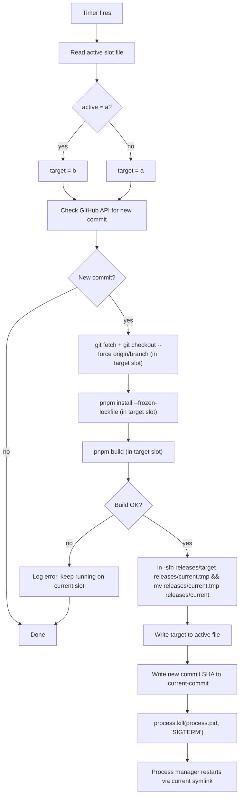

# Blue-Green Updates and Installation Management

> Replace the in-place auto-update with a zero-downtime blue-green slot mechanism, add an install script and `dkg update`/`dkg rollback` commands, then (Phase 2) publish packages to npm.

## Status

| Task | Status |
|------|--------|
| Add `repoDir()` and release slot helpers to `config.ts` | pending |
| Replace `process.cwd()` with `repoDir()` in `daemon.ts` and `app-loader.ts` | pending |
| Rewrite `checkForUpdate` in `daemon.ts` for blue-green slot swap | pending |
| Change `dkg start` spawn path in `cli.ts` to use `releases/current` symlink | pending |
| Add `dkg update` CLI command (manual blue-green trigger) | pending |
| Add `dkg rollback` CLI command (swap symlink back) | pending |
| Add one-time migration from old single-directory layout to blue-green slots | pending |
| Create `install.sh` at repo root | pending |
| Tests: unit tests for `repoDir()`, `activeSlot()`, `inactiveSlot()`, `swapSlot()` helpers | pending |
| Tests: rewrite `auto-update.test.ts` for blue-green `checkForUpdate` flow | pending |
| Tests: migration from old single-dir layout to blue-green slots | pending |
| Tests: `dkg rollback` swaps symlink and restarts | pending |
| Tests: `install.sh` validation in a temp directory | pending |
| Tests: integration test — full update cycle with real git repos in tmp | pending |
| Update `JOIN_TESTNET.md` and CLI help text | pending |
| Phase 2: Add `publishConfig` to all public packages | pending |
| Phase 2: Set up changesets for versioning | pending |
| Phase 2: Create GitHub Actions publish workflow | pending |

---

## Context

The current auto-update in [`packages/cli/src/daemon.ts`](../packages/cli/src/daemon.ts) (lines 1132-1251) does an in-place `git fetch` + `git merge --ff-only` + `pnpm install` + `pnpm build` in the live directory, then SIGTERMs itself. This causes 1-2 minutes of downtime during the build, risks corrupting build artifacts the running process depends on, and has a fragile rollback (`git reset --hard` + rebuild).

Data files (`~/.dkg/config.json`, `wallets.json`, `agent-key.bin`, `store.nq`, `node-ui.db`, etc.) already live in `~/.dkg/`, separate from code. This separation makes blue-green straightforward.

---

## Phase 1: Blue-Green + Install Script + CLI Commands

### 1.1 New directory layout

```
~/.dkg/
├── releases/
│   ├── a/              # git worktree, full repo clone
│   ├── b/              # git worktree, full repo clone
│   ├── current → a     # symlink, swapped atomically
│   └── active          # text file: "a" or "b"
├── config.json         # node config (unchanged)
├── wallets.json        # operational wallets (unchanged)
├── agent-key.bin       # libp2p identity key (unchanged)
├── store.nq            # triple store (unchanged)
├── node-ui.db          # dashboard DB (unchanged)
├── pending-publishes.json
├── auth.token
├── daemon.pid
├── daemon.log
├── api.port
└── .current-commit
```

Data stays in `~/.dkg/` root. Code lives in two interchangeable release slots.

### 1.2 Fix `process.cwd()` assumptions

Several files assume the process runs from the repo root. These need to resolve paths relative to the code directory (derivable from `import.meta.url`) rather than `process.cwd()`:

- **`daemon.ts:1137`** — `checkForUpdate` uses `process.cwd()` for git operations. Change to resolve repo root from `import.meta.url` (walk up from `packages/cli/dist/`), or add a `repoDir()` helper.
- **`daemon.ts:421`** — Node UI fallback: `join(process.cwd(), 'packages', 'node-ui', 'dist-ui')`. Change to use the same `repoDir()` helper.
- **`app-loader.ts:51-55`** — App discovery reads `process.cwd()/package.json`. Change to `repoDir()/package.json`.

Add a helper to `config.ts`:

```typescript
export function repoDir(): string {
  const thisDir = dirname(fileURLToPath(import.meta.url));
  // From packages/cli/dist/ → repo root
  return resolve(thisDir, '..', '..', '..');
}
```

`loadNetworkConfig` (lines 101-116) already walks up from `import.meta.url` so it will work as-is.

### 1.3 Change spawn path to use symlink

In `cli.ts:232-241`, the detached spawn currently uses `fileURLToPath(import.meta.url)` which points to the running script. After the update, we want the *restarted* process to pick up the new slot. Two options:

**Option A (recommended)**: Spawn through the `current` symlink explicitly:

```typescript
const entryPoint = join(dkgDir(), 'releases', 'current', 'packages', 'cli', 'dist', 'cli.js');
const child = spawn(process.execPath, [...process.execArgv, entryPoint, 'start', '--foreground'], {
  detached: true,
  stdio: ['ignore', 'ignore', 'ignore'],
  env: process.env,
});
```

**Option B**: Keep `import.meta.url` (the running CLI is already in the `current` symlink target, and by the time pm2 restarts, the symlink points to the new slot). This only works if the process manager re-resolves the symlink on restart.

Option A is safer because it works regardless of how the process is managed.

### 1.4 Rewrite `checkForUpdate` for blue-green

Replace the current logic in `daemon.ts:1132-1251` with:



Key implementation details:

- **Atomic symlink swap**: Create a temp symlink, then `rename()` it over the real one. `rename()` is atomic on POSIX:

```typescript
import { symlink, rename, unlink } from 'node:fs/promises';

const releasesDir = join(dkgDir(), 'releases');
const tmpLink = join(releasesDir, 'current.tmp');
try { await unlink(tmpLink); } catch {}
await symlink(targetSlot, tmpLink);
await rename(tmpLink, join(releasesDir, 'current'));
```

- **No rollback needed on build failure**: the old slot is untouched; the daemon keeps running.
- **Instant rollback**: just swap the symlink back and restart.
- **git operations target the inactive slot's directory**, not `process.cwd()`:

```typescript
execSync(`git fetch origin ${branch}`, { cwd: targetDir, ... });
execSync(`git checkout --force origin/${branch}`, { cwd: targetDir, ... });
execSync('pnpm install --frozen-lockfile', { cwd: targetDir, ... });
execSync('pnpm build', { cwd: targetDir, ... });
```

### 1.5 Update `AutoUpdateConfig` interface

In `config.ts:7-12`, the existing config is sufficient. No schema changes needed — `repo`, `branch`, and `checkIntervalMinutes` all still apply.

### 1.6 Add `dkg update` CLI command

In `cli.ts`, add a new command that triggers the blue-green swap immediately (same logic as the auto-update timer, but user-invoked and with progress output):

```
dkg update              # check + build + swap + restart
dkg update --check      # just check, print available version
```

Implementation: extract the core update logic from `checkForUpdate` into a shared function (e.g. `performUpdate`) that both the timer and the CLI command can call. The CLI version writes progress to stdout; the daemon version writes to the log.

### 1.7 Add `dkg rollback` CLI command

Swap the `current` symlink back to the other slot and restart:

```
dkg rollback            # swap symlink to previous slot, restart daemon
```

This is fast (no build) — just a symlink swap + SIGTERM.

### 1.8 Migration path

When `dkg start` runs and detects the old layout (no `~/.dkg/releases/` directory), perform a one-time migration:

1. Detect: check if `~/.dkg/releases/current` exists
2. If not, determine the current repo root (from `import.meta.url`)
3. Create `~/.dkg/releases/`
4. Move or symlink the existing repo clone as slot `a`
5. `git clone --reference a/ <repo-url> b/` (or `git worktree add`) for slot `b`
6. Create `current → a` symlink
7. Write `a` to `active` file
8. Continue startup normally

If the user installed via the install script (new installs), this migration is skipped.

### 1.9 Install script (`install.sh`)

A shell script hosted at the repo root (and served via raw GitHub URL) that:

1. Checks prerequisites: `node` (>= 20), `pnpm`, `git`
2. Creates `~/.dkg/releases/`
3. Clones the repo into `~/.dkg/releases/a/`
4. Runs `pnpm install --frozen-lockfile && pnpm build` in slot `a`
5. Creates an empty slot `b` clone: `git clone --reference a/ <url> b/`
6. Creates `current → a` symlink, writes `a` to `active`
7. Symlinks `~/.dkg/releases/current/packages/cli/dist/cli.js` to `/usr/local/bin/dkg` (or `~/.local/bin/dkg`)
8. Prints next steps: `dkg init`, `dkg start`

Usage:

```bash
curl -fsSL https://raw.githubusercontent.com/OriginTrail/dkg-v9/main/install.sh | sh
```

### 1.10 Testing strategy

All tests use **vitest** (existing test runner). The existing 4 tests in `packages/cli/test/auto-update.test.ts` mock `execSync`, `readFile`, `writeFile`, and `fetch`. We keep this mock-based approach for unit tests and add a new integration test file that uses real filesystem operations in a temp directory.

#### Test file: `packages/cli/test/slot-helpers.test.ts` (new)

Unit tests for the new helpers added to `config.ts`. These use a temp `DKG_HOME` to avoid touching the real `~/.dkg/`:

- **`repoDir()`** — resolves correctly from `packages/cli/dist/` to repo root
- **`releasesDir()`** — returns `{dkgDir}/releases`
- **`activeSlot()`** — reads `releases/active` file, returns `"a"` or `"b"`
- **`inactiveSlot()`** — returns opposite of `activeSlot()`
- **`swapSlot()`** — atomically swaps `releases/current` symlink:
  - Creates temp symlink + `rename()` (no intermediate broken state)
  - Updates `active` file
  - Verify `readlink(releases/current)` points to new slot after swap
  - Verify the old symlink target is not modified
- **`swapSlot()` is idempotent** — calling it twice with the same target is a no-op
- **`activeSlot()` returns `null`** when `active` file is missing (pre-migration)

#### Test file: `packages/cli/test/auto-update.test.ts` (rewrite)

Replace the existing 4 tests with blue-green equivalents. Same mocking approach (`execSync`, `fs/promises`, `fetch`), but now the assertions verify slot-based behavior:

1. **Skips when no new commit** — GitHub API returns same SHA; no `execSync` calls beyond the check
2. **Builds in inactive slot on new commit** — verify `git fetch`, `git checkout --force`, `pnpm install`, `pnpm build` all receive `cwd: <inactive slot dir>` (not the active slot or `process.cwd()`)
3. **Swaps symlink after successful build** — verify `swapSlot` is called with the target slot; verify `.current-commit` is updated
4. **Calls SIGTERM after swap** — verify `process.kill(process.pid, 'SIGTERM')` is called
5. **Build failure does not swap** — `pnpm build` throws in inactive slot; verify symlink was NOT changed, `.current-commit` was NOT updated, no SIGTERM
6. **Build failure does not touch active slot** — verify no `execSync` calls with `cwd` pointing to the active slot
7. **Fetch failure does not attempt build** — `git fetch` throws; verify no `pnpm install` or `pnpm build` calls
8. **Slot alternation** — simulate two consecutive updates; first builds in `b`, second builds in `a`; verify `activeSlot()` alternates

#### Test file: `packages/cli/test/migration.test.ts` (new)

Tests the one-time migration from old layout to blue-green. Uses a real temp directory (`fs.mkdtemp`) with `DKG_HOME` override:

1. **Migrates existing repo clone to slot `a`** — create a fake repo dir; run migration; verify `releases/a` exists with repo contents, `releases/current → a`, `active` file says `a`
2. **Creates slot `b` as a clone** — verify `releases/b` exists and has `.git`
3. **Skips migration when already migrated** — `releases/current` already exists; migration is a no-op
4. **Data files remain in root** — verify `config.json`, `wallets.json`, etc. are NOT moved into slots

#### Test file: `packages/cli/test/rollback.test.ts` (new)

Tests the `dkg rollback` command logic (the core swap function, not the full CLI):

1. **Rollback swaps to inactive slot** — active is `b`, rollback swaps to `a`; verify `readlink(current)` → `a`, `active` file → `a`
2. **Rollback triggers daemon restart** — verify the command calls the shutdown API (same as `dkg stop`) then starts via the new symlink
3. **Rollback when daemon is not running** — just swaps the symlink, prints message, no SIGTERM

#### Test file: `packages/cli/test/install-script.test.ts` (new)

Shell script validation. Runs `install.sh` in a controlled temp environment with mocked `git clone` and `pnpm`:

1. **Creates correct directory structure** — verify `releases/a/`, `releases/b/`, `releases/current → a`, `active` file
2. **Fails gracefully when node is missing** — mock `which node` to fail; verify script exits with error message
3. **Fails gracefully when pnpm is missing** — same pattern
4. **Creates dkg symlink in bin dir** — verify the symlink points to `releases/current/packages/cli/dist/cli.js`

Note: These tests invoke the shell script via `execSync('bash install.sh', { env: { HOME: tmpDir, ... } })` with mocked externals. They are slower than unit tests but validate the actual script.

#### Test file: `packages/cli/test/blue-green-integration.test.ts` (new)

End-to-end integration test using real git repos in a temp directory. This is the highest-confidence test — it exercises the full update cycle without mocks:

1. **Setup**: create two bare git repos in `/tmp` (simulating GitHub), clone into `releases/a/` and `releases/b/`, create minimal `package.json` + build script in each
2. **Full update cycle**:
   - Push a new commit to the bare repo
   - Call `performUpdate()` (the shared function extracted from `checkForUpdate`)
   - Verify: build ran in inactive slot, symlink swapped, `.current-commit` updated
3. **Rollback after update**:
   - After an update swapped to `b`, call rollback
   - Verify: symlink back to `a`, `active` file says `a`
4. **Failed build leaves system intact**:
   - Push a commit that breaks the build (invalid package.json)
   - Call `performUpdate()`
   - Verify: symlink still points to the previously active slot, no state corruption
5. **Cleanup**: remove temp directory

This test is marked `describe.sequential` since it has ordered steps and shared filesystem state. It should be tagged or placed so it only runs in the full test suite (not on every `vitest run` during development), e.g. via a `test:integration` script or vitest workspace config.

#### Test execution

- **Unit tests** (slot-helpers, auto-update, migration, rollback): run on every `pnpm test` via `vitest run`
- **Integration test** (blue-green-integration): run via `pnpm test:integration` or gated behind an env var (`INTEGRATION=1 vitest run`); also runs in CI
- **Install script test**: runs via `pnpm test:integration` (requires bash)

### 1.11 Update docs

- Update `docs/setup/JOIN_TESTNET.md` with install script instructions
- Add `dkg update` and `dkg rollback` to CLI help/docs

---

## Phase 2: npm Publishing

### 2.1 Add `publishConfig` to public packages

For each package that should be on npm, add to its `package.json`:

```json
"publishConfig": {
  "access": "public",
  "registry": "https://registry.npmjs.org/"
}
```

Packages to publish (in dependency order):

1. `@dkg/core` (leaf, no internal deps)
2. `@dkg/storage` (depends on core)
3. `@dkg/chain` (depends on core, evm-module)
4. `@dkg/query` (depends on core, storage)
5. `@dkg/publisher` (depends on core, storage, chain, query)
6. `@dkg/agent` (depends on core, storage, chain, publisher, query)
7. `@dkg/node-ui` (depends on core, graph-viz)
8. `@dkg/graph-viz` (no internal deps)
9. `@dkg/cli` (depends on agent, core, node-ui)
10. `@dkg/mcp-server` (depends on adapter-autoresearch optionally)
11. `@dkg/adapter-autoresearch` (no internal deps)

Packages to keep private (`"private": true`): `@dkg/evm-module` (Hardhat/Solidity), `@dkg/network-sim`, `@dkg/demo`.

### 2.2 `workspace:*` → real versions on publish

pnpm automatically replaces `workspace:*` with the actual version from the dependency's `package.json` when publishing. No code changes needed — just ensure each package has a correct `version` field.

### 2.3 Native dependency handling

`oxigraph` and `better-sqlite3` compile native addons on install. Options:

- **Accept compilation on install** (simplest — users need a C++ toolchain)
- **Use prebuilt binaries** via `prebuildify` or switch to WASM variants (more work, better UX)
- Recommend `oxigraph` WASM build for npm distribution if compilation is a dealbreaker

### 2.4 Versioning strategy

Use [changesets](https://github.com/changesets/changesets) for coordinated versioning across the monorepo:

- `pnpm add -Dw @changesets/cli`
- `pnpm changeset` to record changes
- `pnpm changeset version` to bump versions
- `pnpm changeset publish` to publish all changed packages

### 2.5 CI publish pipeline

GitHub Actions workflow triggered on tags or releases:

1. Checkout, install, build, test
2. `pnpm changeset publish` (or `pnpm -r publish --access public`)
3. Publishes all public packages to npm

### 2.6 End-user install via npm

After publishing:

```bash
npm install -g @dkg/cli
dkg init
dkg start
```

Updates:

```bash
npm update -g @dkg/cli
```

The auto-update mechanism from Phase 1 would not apply to npm installs (no git repo to pull). For npm users, updates are manual via `npm update` or a future `dkg update` variant that calls `npm install -g @dkg/cli@latest`.

---

## Files to create or modify (Phase 1)

| File | Action |
|------|--------|
| `packages/cli/src/config.ts` | Add `repoDir()`, `releasesDir()`, `activeSlot()`, `inactiveSlot()`, `swapSlot()` helpers |
| `packages/cli/src/daemon.ts` | Rewrite `checkForUpdate` for blue-green; extract `performUpdate()`; fix `process.cwd()` refs |
| `packages/cli/src/cli.ts` | Add `dkg update`, `dkg rollback` commands; change spawn path; add migration logic |
| `packages/cli/src/app-loader.ts` | Replace `process.cwd()` with `repoDir()` |
| `packages/cli/test/auto-update.test.ts` | Rewrite: 8 tests for blue-green `checkForUpdate` flow |
| `packages/cli/test/slot-helpers.test.ts` (new) | Unit tests for `repoDir`, `activeSlot`, `inactiveSlot`, `swapSlot` |
| `packages/cli/test/migration.test.ts` (new) | Migration from old layout to blue-green slots (real tmpdir) |
| `packages/cli/test/rollback.test.ts` (new) | Rollback symlink swap + restart behavior |
| `packages/cli/test/install-script.test.ts` (new) | Shell script validation in temp environment |
| `packages/cli/test/blue-green-integration.test.ts` (new) | End-to-end: full update cycle with real git repos in tmp |
| `install.sh` (new) | Install script at repo root |
| `docs/setup/JOIN_TESTNET.md` | Update install/update instructions |
