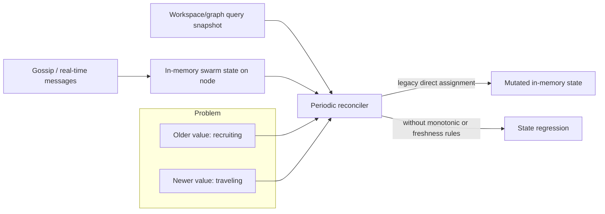

# Plan: Protocol Consistency Model for App State

**Status**: Phase 1 Implemented · Phases 2–3 Pending  
**Date**: 2026-03-13  
**Context**: Swarm status regression originally observed in the `origin-trail-game` app (retired in V10) under mixed gossip + graph-sync state sources. The underlying protocol concern — monotonic app-state writes across nodes — still applies to any app paranet and is captured here for reuse.

---

## 1. Why this exists

We observed a class of failures where app state regresses when two facts are both true:

- Real-time state advances via gossip/in-memory handlers.
- Periodic graph reconstruction reads stale data from an eventually consistent source.

This is not a single game bug. It is a consistency-class issue that can affect any DKG app that mixes:

- Fast local state transitions
- Eventual graph replication
- Multiple writers/readers and periodic reconciliation

PR `#159` addresses one critical path in the game app (status regression guard). This plan describes deeper protocol-level improvements that reduce this problem class across all apps.

---

## 2. Problem model

### 2.1 Current behavior

- Workspace and publish flows are eventually consistent by design.
- Apps can write mutable fields (for example, `status`) in multiple places/entities.
- Reconciliation logic often treats graph snapshots as authoritative and performs direct assignment.

### 2.2 Failure mode

- New state (`traveling`) is applied in memory via message flow.
- Graph still returns older value (`recruiting`) for a period.
- Reconciler overwrites local state with stale graph state.

### 2.3 Root cause

Missing protocol-level semantics for mutable fields:

- No canonical ownership of mutable field truth
- No built-in monotonic transition guarantees
- No first-class freshness/version ordering
- No conditional write primitives

### 2.4 Sequence diagram: how regression happens between players

The timeline below shows a concrete 3-player swarm (`A` leader, `B` and `C` followers)
where launch state advances in gossip, but graph sync later reads stale status.

```mermaid
sequenceDiagram
    autonumber
    participant A as Player A (Leader Node)
    participant B as Player B (Follower Node)
    participant C as Player C (Follower Node)
    participant W as Workspace Graph
    participant S as Graph Sync Reconciler (B)

    Note over A,B,C: Swarm is initially recruiting
    A->>W: write swarmCreated(status=recruiting)
    A->>B: gossip swarm:created
    A->>C: gossip swarm:created

    A->>A: launchExpedition() -> local status=traveling
    A->>B: gossip expedition:launched(status=traveling)
    A->>C: gossip expedition:launched(status=traveling)
    A->>W: write expeditionLaunched entity (eventual replication)

    Note over B: B now has local in-memory status=traveling
    Note over W: Workspace query may still return swarm status=recruiting for a short window

    S->>W: periodic loadLobbyFromGraph()
    W-->>S: status=recruiting (stale snapshot)
    S->>B: overwrite local status with recruiting (legacy behavior)

    Note over B: Regression: traveling -> recruiting\nVotes fail with "Swarm is not traveling"
```

### 2.5 State-view mismatch diagram

The issue is a mismatch between two views of "current state":



---

## 3. Design goals

1. **Prevent regressions by construction** for monotonic app fields.
2. **Keep eventual consistency** (do not require global locks).
3. **Minimize app-specific merge logic** duplicated across apps.
4. **Preserve current API ergonomics** where possible.
5. **Support phased adoption** without breaking existing apps.

---

## 4. Proposed protocol-level improvements

## 4.1 Field semantics registry (monotonic fields)

Introduce schema-level field semantics for mutable predicates.

Example concept:

- `ot:status` for `ot:AgentSwarm` is monotonic enum:
  - `recruiting < traveling < finished`

Protocol behavior:

- Writes to monotonic fields are merged by rank.
- Lower-rank writes never replace higher-rank values.

Impact:

- Stale snapshots can no longer force backward transitions.
- App code no longer needs ad hoc anti-regression guards everywhere.

## 4.2 Conditional write / compare-and-set API

Add conditional write primitives to workspace and (optionally) publish pathways.

Examples:

- `set status=traveling if status==recruiting`
- `set status=finished if status in {traveling}`
- `set statusVersion=42 if statusVersion==41`

Impact:

- Invalid transitions are rejected at write time.
- Race windows shrink because transition legality is enforced where data mutates.

## 4.3 Protocol-managed freshness metadata

Add protocol-recognized freshness metadata per mutable entity:

- `dkg:stateVersion` (monotonic integer) and/or
- `dkg:stateUpdatedAt` (logical/lamport timestamp preferred over wall clock)

Merge rule:

- Apply updates only if freshness is newer.
- Ties resolved deterministically (for example, publisher id ordering).

Impact:

- Reconciliation becomes deterministic.
- Apps stop re-implementing custom freshness checks.

## 4.4 Canonical state projection support

Support a canonical projection pattern in protocol/query layer:

- Append-only transition events remain as source history.
- Projection generates current entity state from ordered transitions.
- Consumers query the projection (not raw mixed event triples).

Impact:

- Reduces direct dependence on eventually ordered raw triples.
- Provides one current view for app runtime and UIs.

## 4.5 Consistency-aware query options

Add query options for bounded staleness awareness:

- Minimum observed operation watermark
- Include/exclude workspace layers explicitly
- Request latest state by version semantics

Impact:

- Apps can avoid reading known-stale state right after a local transition.
- Better control in high-churn environments (testnet relays, restart windows).

---

## 4.6 Protocol surface: what changes in code paths

This section makes scope explicit: which parts are API/runtime behavior vs metadata
vs app-level logic.

### A) Workspace write API (first target)

**Important clarification**: `writeToWorkspace(paranetId, quads)` is a generic RDF
quad writer. It does not understand app semantics. It does not know what a "status
transition" is, what values are legal, or which predicates are monotonic. That is
entirely the app's responsibility today, and the plan does not change that boundary.

What the plan proposes is a **small, generic infrastructure primitive** at the
workspace layer — not app-awareness:

#### What workspace gets (generic, content-agnostic)

- **Conditional write (CAS)**: "write quad (S, P, newValue) only if the current
  stored value of (S, P) equals expectedValue." The workspace does not need to
  understand what the values mean. It just compares the current triple value
  against a caller-provided expected value and rejects the write if they don't
  match. This is a standard database-level conditional-set primitive.

- **Version-stamped writes**: an optional `stateVersion` integer that the caller
  provides. Workspace stores it alongside the quad and only accepts a write if
  the incoming version is strictly greater than the stored version. Again, the
  workspace does not interpret the version — it just enforces "newer wins."

These are **generic infrastructure** — the same way a database supports
`UPDATE ... WHERE version = ?` without understanding your schema.

#### What apps provide (domain-specific, on top of generic CAS)

- The game (or any app) decides which predicates are mutable and what transitions
  are legal. For example, the game knows `recruiting -> traveling -> finished`.
- The app calls the CAS write with the appropriate expected value:
  `writeConditional(S, ot:status, "traveling", { ifCurrentValue: "recruiting" })`.
- If a stale reconciler tries to write `recruiting` when the current value is
  already `traveling`, the CAS write fails at the workspace layer.

#### What "transition-aware helpers" actually means

These are **SDK-level convenience functions** (likely in `@dkg/agent` or a shared
utility), not workspace internals. They wrap the generic CAS primitive with
app-declared transition rules. Example:

```typescript
const statusField = monotonicEnum('ot:status', ['recruiting', 'traveling', 'finished']);

await statusField.advance(agent, paranetId, swarmSubject, 'traveling');
// Internally: writeConditional(swarmSubject, 'ot:status', 'traveling',
//   { ifCurrentRank: < rank('traveling') })
```

The workspace layer stays generic. The helper lives in app/SDK code and
encodes the domain knowledge.

#### What workspace does NOT get

- No schema awareness of app predicates.
- No built-in knowledge of game states or transition graphs.
- No automatic rejection of "invalid" values (only CAS mismatch rejection).

#### Scope

- **Applies first to workspace writes**, where most app state churn happens.
- Publish/finalized pathways can adopt the same CAS semantics later if needed.
- The workspace API surface change is small: one new optional parameter
  (`ifCurrentValue` or `ifVersionBelow`) on the existing write path.

### B) Merge/reconciliation engine

Planned additions:

- Optional field semantics registry (for example monotonic enum rank)
- Freshness ordering (`stateVersion` / logical timestamp)
- Deterministic tie-break rules

Concrete effect:

- When a node merges stale and fresh values for the same mutable field, merge is
  protocol-guided (not ad hoc app assignment).
- Regressions are blocked by shared merge rules, not per-app guard code.

### C) Query/read API

Planned additions:

- Consistency-aware query options (watermarks, version preference)
- Canonical projection access path for "current state" reads

Concrete effect:

- Runtime/UI can ask for bounded-freshness results instead of reading any snapshot.
- Apps can query a current-state projection rather than reconstructing from mixed raw triples.

### D) Metadata schema (where freshness lives)

Planned additions:

- Protocol-recognized freshness fields (for example `dkg:stateVersion`,
  `dkg:stateUpdatedAt`)
- Clear association between mutable entity and its freshness facts

Clarification on placement:

- Some of this can be represented in workspace-meta style triples, but the plan
  is **not only "add workspace_meta triples"**.
- CAS semantics and merge semantics are protocol behavior; metadata is one input.

### E) App-level reducer remains (thin)

Still app-owned:

- Domain transition graph (what is business-legal)
- Authorization/policy decisions (who may do what)
- UX behavior under lag

Concrete effect:

- Apps keep a thin reducer, while protocol handles generic consistency mechanics.

### F) Rollout scope ("everywhere?" answer)

Rollout model:

- Opt-in by paranet/app via `legacy | guarded | strict`
- Pilot first (a single app paranet), then broader reuse

Concrete effect:

- Not forced globally on day one.
- Designed to become reusable across apps once validated.

---

## 5. What remains app-level (even after protocol improvements)

Protocol should reduce risk, but apps still own domain policy:

- Legal transition graph per domain object
- Business-side conflict policy (for example, who may force-resolve)
- UX behavior under delayed data arrival
- Non-monotonic fields where last-write-win is acceptable

Recommendation:

- Keep a small, explicit transition reducer in app code.
- Use protocol primitives so reducer is thin and declarative.

---

## 6. Phased implementation roadmap

## Phase 0 (done/near-term app guard)

- Keep `#159` monotonic non-regression checks in game sync.
- Continue local lifecycle-safe timer handling (skip node-not-started windows).

## Phase 1 (small protocol surface, high value) — **implemented**

- ✅ Add conditional write API for workspace mutations (`writeConditionalToWorkspace` in `@dkg/publisher` + `@dkg/agent`).
- ✅ Add `stateVersion` helper support in SDK/agent (`monotonicTransition`, `versionedWrite` in `workspace-consistency.ts`).
- ✅ Piloted CAS in the legacy `origin-trail-game` app (retired in V10): `launchExpedition` used a CAS condition on swarm status (`recruiting` → `traveling`). The CAS primitive (`writeConditionalToWorkspace`) survives in the publisher API for any future app paranet.
- Add docs and examples for monotonic transitions.

Success criteria:

- ✅ App can express status transitions with CAS.
- ✅ Regression reproduction case is blocked without custom merge hacks.

## Phase 2 (schema-aware merge semantics)

- Add optional field semantics registry for known predicates.
- Enforce monotonic merge where configured.
- Add diagnostics for rejected stale writes.

Success criteria:

- Two independent writers cannot regress a monotonic field.
- Reconciliation code complexity in apps decreases measurably.

## Phase 3 (projection/query consistency)

- Add canonical projection path for current state.
- Add consistency-aware query options (watermarks/version selection).

Success criteria:

- App runtime no longer relies on raw triple overwrite reconciliation.
- Testnet restart/lag scenarios keep state monotonic in projection output.

---

## 7. Backward compatibility and migration

- All new semantics should be opt-in first.
- Existing writes remain valid unless a paranet/app enables strict mode.
- Provide migration toggles per paranet:
  - `consistencyMode: legacy | guarded | strict`

Migration approach:

1. Enable guarded mode in non-production/testnet.
2. Audit rejected writes and stale-write metrics.
3. Move to strict mode once false positives are near zero.

---

## 8. Observability requirements

Add protocol/app counters to validate improvements in real deployments:

- `dkg_consistency_stale_write_rejected_total`
- `dkg_consistency_transition_invalid_total`
- `dkg_consistency_projection_lag_ms`
- `app_state_regression_ignored_total` (temporary while apps migrate)

Without these metrics, we cannot prove that regressions are actually eliminated.

---

## 9. Risks and trade-offs

- More protocol semantics increase implementation complexity.
- Incorrect field semantics configuration can block valid writes.
- Versioning introduces migration overhead for existing apps.
- Projection systems add operational components if persisted separately.

Mitigations:

- Opt-in rollout
- Strong default docs/templates
- Feature flags and shadow-mode validation

---

## 10. Recommended immediate next steps after PR #159

1. Merge and validate `#159` as immediate regression stop.
2. Implement app-side canonical status write + status freshness field (short-term hardening).
3. Open protocol RFC for:
   - conditional writes
   - protocol freshness metadata
   - monotonic field semantics
4. Ship one reference implementation in a pilot app paranet as the blueprint for broader app adoption.

---

## 11. Decision summary

- **This is a consistency-class issue, not just a one-off bug.**
- **State machine semantics are required and should be explicit.**
- **Best long-term outcome** is shared protocol primitives for monotonic transitions + freshness, with app reducers remaining thin.

---

## 12. Section-by-section explainer (node + graph examples)

This section translates each part of the plan into concrete node/graph behavior so
implementers can quickly see what each point brings.

### 12.1 Why this exists

- **What it brings**: Reframes the issue as a distributed consistency concern across nodes.
- **Node/graph example**: Node `A` writes `status=traveling` into
  `did:dkg:paranet:example-paranet/_workspace`, gossips launch event to `B` and `C`.
  Node `B` later queries an older workspace snapshot and sees `status=recruiting`.
  Without consistency semantics, `B` can regress local state from the graph read.

### 12.2 Problem model

- **What it brings**: Defines where regressions originate (mixed real-time + eventual reads).
- **Node/graph example**:
  - Real-time truth at node `B` (from gossip): `traveling`
  - Queried graph truth at node `B` (stale): `recruiting`
  - Legacy reconciler assigns stale graph value directly to in-memory state.

### 12.3 Design goals

- **What it brings**: Clarifies constraints: no global lock, keep eventual consistency.
- **Node/graph example**: Node `C` should still accept delayed replication from
  `did:dkg:paranet:example-paranet/_workspace`, but never allow that delayed value to
  move a monotonic field backward.

### 12.4 Proposed improvements (what each adds in practice)

#### 12.4.1 Field semantics registry

- **What it brings**: A protocol rule says which predicates are monotonic and how.
- **Node/graph example**: Predicate `ot:status` on swarm entity in workspace graph uses
  ranking `recruiting < traveling < finished`. Node `B` receives stale triple
  `status=recruiting`; merge engine rejects it because local/applied rank is already `traveling`.

#### 12.4.2 Conditional write (CAS)

- **What it brings**: Transition validity enforced at write time, not only in app code.
- **Node/graph example**: Node `A` attempts:
  `set status=finished if status==traveling` on swarm entity in `_workspace`.
  If graph currently holds `recruiting`, write fails immediately and does not emit invalid transition.

#### 12.4.3 Protocol freshness metadata

- **What it brings**: Deterministic ordering across nodes despite delayed replication.
- **Node/graph example**: Two updates for same swarm node:
  - Node `A`: `status=traveling`, `dkg:stateVersion=41`
  - Later stale read/write path: `status=recruiting`, `dkg:stateVersion=40`
  Any node merging graph data keeps version `41` and ignores `40`.

#### 12.4.4 Canonical state projection

- **What it brings**: Consumers read one computed current-state view instead of raw mixed triples.
- **Node/graph example**: Raw transition events remain append-only in workspace/meta graphs;
  projection materializes `currentSwarmState` where status is computed from ordered transitions.
  Node UI and game loop query projection, not raw unordered events.

#### 12.4.5 Consistency-aware query options

- **What it brings**: Lets nodes avoid known-stale reads right after writes.
- **Node/graph example**: Node `B` asks for state at or above watermark `op=launch-8842`.
  If local store has only older graph state, query can wait/fail-soft instead of returning regressive data.

### 12.5 What remains app-level

- **What it brings**: Keeps domain policy in apps while moving generic consistency to protocol.
- **Node/graph example**: Protocol guarantees monotonic `status` merge in paranet graph; app still decides
  whether node `A` (leader) is allowed to force-resolve turn in swarm graph.

### 12.6 Roadmap intent by phase

- **What it brings**: Adoption path from app patches to protocol-native consistency.
- **Node/graph example**:
  - Phase 0: Node `B` reducer ignores `traveling -> recruiting` from stale graph.
  - Phase 1: Node writes use CAS + version fields in workspace.
  - Phase 2: Protocol rejects stale monotonic writes globally.
  - Phase 3: Nodes and UI consume projection output as primary current-state source.

### 12.7 Backward compatibility

- **What it brings**: Safe migration without breaking existing paranets/apps.
- **Node/graph example**: Paranet runs `legacy` mode first (accepts old behavior), then `guarded`
  (logs/rejects risky writes selectively), then `strict` once metrics show near-zero false positives.

### 12.8 Observability

- **What it brings**: Proof that consistency improvements work under real network conditions.
- **Node/graph example**: During testnet relay lag, `dkg_consistency_stale_write_rejected_total`
  rises while `app_state_regression_ignored_total` trends to zero as apps migrate to protocol semantics.

### 12.9 Risks and trade-offs

- **What it brings**: Explicitly acknowledges cost/complexity of stronger semantics.
- **Node/graph example**: Incorrect semantics for a predicate in swarm graph could reject valid transition;
  mitigated by feature flags and shadow-mode validation before strict enforcement.

### 12.10 Immediate next steps

- **What it brings**: Practical implementation order with lowest risk first.
- **Node/graph example**: Keep the existing app-level guard in place now, then pilot CAS + version writes in a single pilot paranet workspace graph before rolling the same semantics to all app paranets.

### 12.11 Decision summary (practical reading)

- **What it brings**: Final architecture stance for all DKG apps.
- **Node/graph example**: Node apps keep thin reducers and domain policy, while protocol handles:
  monotonic merge, freshness ordering, and conditional graph state mutation semantics.

---

## 13. Phase-by-phase examples (node + graph walkthrough)

### Phase 0 example (current app guard)

- Node `A` launches expedition and gossips `traveling`.
- Node `B` applies local state `traveling`.
- Node `B` periodic graph load reads stale `recruiting` from workspace graph.
- App guard on `B` refuses backward transition.
- **Value added**: immediate regression block without protocol changes.

### Phase 1 example (CAS + version helper)

- Node `A` writes to swarm entity in workspace graph with CAS:
  `status=traveling if status==recruiting`, and sets `stateVersion=11`.
- Node `C` attempts outdated transition:
  `status=recruiting if status==traveling` with `stateVersion=10`.
- CAS/version check fails for stale path.
- **Value added**: invalid transitions rejected at mutation boundary.

### Phase 2 example (schema-aware monotonic merge)

- Two nodes concurrently publish status triples for same swarm:
  - Node `A`: `status=finished` (rank 3)
  - Node `B`: delayed `status=traveling` (rank 2)
- Merge engine in protocol keeps rank 3 based on field semantics registry.
- Rejected lower-rank write is surfaced in diagnostics.
- **Value added**: monotonic safety even under multi-writer races.

### Phase 3 example (projection + consistency-aware query)

- Nodes keep appending transition events into workspace/meta graphs.
- Projection service computes canonical current swarm state graph.
- Node UI and game loop query projection with version/watermark constraints.
- After relay lag or restart, readers still resolve to monotonic current state.
- **Value added**: stable "current truth" for runtimes and UIs in high-churn conditions.

