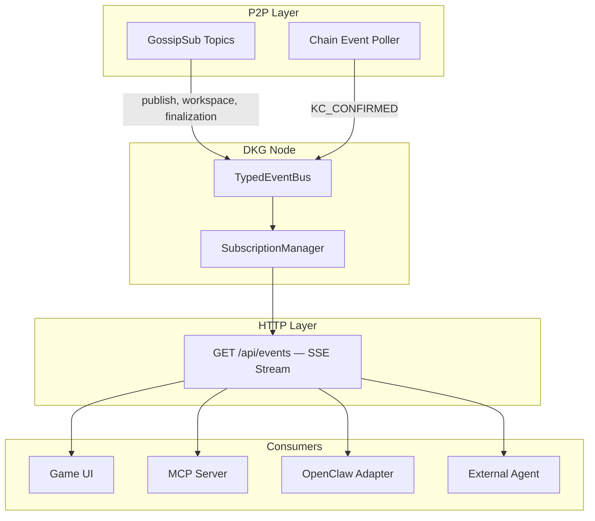
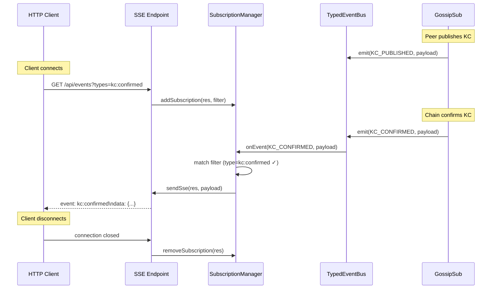

# Plan: Real-Time Subscriptions for Multi-Agent Coordination

Transform the DKG from a system agents poll into a system that pushes events to agents. Today, every consumer — the game UI, adapters, MCP tools, external agents — must poll REST endpoints on a timer. This plan adds a subscription layer that delivers events in real time over SSE (Server-Sent Events), with GossipSub as the P2P transport backbone.

**Last updated:** 2026-03-14

---

## Current State

| Capability | Mechanism | Latency | Gap |
|-----------|-----------|---------|-----|
| Game UI updates | HTTP poll every 3-4s | 3-4s | No push; missed events between polls |
| Workspace write notification | GossipSub P2P only | <1s between nodes | No way for HTTP clients to subscribe |
| Publish confirmation | GossipSub finalization topic | <1s between nodes | HTTP clients must poll `/api/operations` |
| Chain events | `ChainEventPoller` every 12s | 12s | Internal only; no external notification |
| Agent messages | P2P direct | <1s | No SSE/WebSocket delivery to UIs |
| Context graph signatures | GossipSub app topic | <1s between nodes | No HTTP push |

**Existing SSE infrastructure:** `node-ui/api.ts` already has `beginSse()` and `sendSse()` helpers used for chat persistence events and LLM streaming. The pattern is proven but only used for chat.

**Existing EventBus:** `core/event-bus.ts` provides `TypedEventBus` with events for `KC_PUBLISHED`, `KC_CONFIRMED`, `PEER_CONNECTED`, `GOSSIP_MESSAGE`, `MESSAGE_RECEIVED`, etc. But there is **no `WORKSPACE_WRITE`** event, and the bus is not exposed to HTTP clients.

---

## Architecture



---

## Design Principles

1. **SSE over WebSocket.** SSE is simpler (HTTP/1.1, auto-reconnect, no upgrade handshake), works through proxies, and is sufficient for server-to-client push. Agents that need bidirectional communication already have P2P messaging.

2. **Filter at subscription time.** Clients specify which event types and paranets they care about. The server only sends matching events — no client-side filtering of a firehose.

3. **Built on existing EventBus.** The `SubscriptionManager` listens to `TypedEventBus` events and fans them out to SSE connections. No new P2P protocol needed — GossipSub already delivers events to the EventBus.

4. **Backward compatible.** Polling still works. SSE is additive. No existing API changes.

---

## Phase 1: EventBus Completeness

**Goal:** Ensure every important state change emits an event on the bus, so the subscription layer has a complete signal set.

### 1.1 Add missing events

| Event | Emitter | When |
|-------|---------|------|
| `WORKSPACE_WRITE` | `WorkspaceHandler` | Local or remote workspace write stored |
| `WORKSPACE_ENSHRINE` | `DKGPublisher` | Workspace data enshrined to context graph |
| `CONTEXT_GRAPH_CREATED` | `DKGPublisher` | New context graph registered on-chain |
| `CONTEXT_GRAPH_SIGNED` | Context graph handler | M/N signature received |
| `PARANET_DISCOVERED` | `DKGAgent` | New paranet seen on-chain |
| `AGENT_DISCOVERED` | `Discovery` | New agent profile seen via gossip |
| `GAME_TURN_RESOLVED` | Game coordinator | Turn proposal enshrined |
| `GAME_SWARM_CREATED` | Game coordinator | New swarm discovered |

### 1.2 Event payload schema

Every event carries a standard envelope:

```typescript
interface DKGEventPayload {
  type: string;              // e.g. "workspace:write"
  paranetId?: string;        // scoping
  timestamp: number;         // epoch ms
  operationId?: string;      // correlation
  data: Record<string, any>; // event-specific payload
}
```

Example payloads:

```json
{
  "type": "kc:confirmed",
  "paranetId": "testing",
  "timestamp": 1773422454240,
  "operationId": "4b58269d-795e-49c4-ad73-eea9b346c21a",
  "data": {
    "ual": "did:dkg:evm:84532/0xf165.../79",
    "batchId": 79,
    "txHash": "0x2c40bc...",
    "kaCount": 3
  }
}
```

```json
{
  "type": "workspace:write",
  "paranetId": "origin-trail-game",
  "timestamp": 1773422454258,
  "operationId": "ws-1773422454258-jmv5k32n",
  "data": {
    "quadCount": 16,
    "fromPeerId": "12D3KooWHTN...",
    "rootEntities": ["urn:game:swarm-abc/turn/5"]
  }
}
```

```json
{
  "type": "message:received",
  "timestamp": 1773422455000,
  "data": {
    "fromPeerId": "12D3KooWGGzW...",
    "fromName": "Miladyn",
    "preview": "Hey Zivojin! Just got back online..."
  }
}
```

---

## Phase 2: SubscriptionManager + SSE Endpoint

**Goal:** An SSE endpoint that streams filtered events to HTTP clients.

### 2.1 `GET /api/events`

**Query parameters:**

| Parameter | Type | Default | Description |
|-----------|------|---------|-------------|
| `types` | comma-separated | all | Event types to subscribe to (e.g. `kc:confirmed,workspace:write`) |
| `paranets` | comma-separated | all | Filter by paranet ID |
| `since` | integer (seq ID) | latest | Replay events after this sequence ID (bounded to last 1000 events / 5 min) |

**Example:**

```
GET /api/events?types=workspace:write,kc:confirmed&paranets=origin-trail-game&ticket=<opaque_ticket>
Accept: text/event-stream
```

> **Auth note:** Browser `EventSource` cannot set custom headers, so SSE
> endpoints must accept auth via a `ticket` query parameter in addition
> to the `Authorization` header. The ticket should be an **opaque,
> single-use SSE ticket** (not a reusable JWT, which would leak
> credentials into URL logs/history). The server issues tickets via
> `POST /api/events/ticket` (authenticated, returns `{ ticket, expiresIn }`).
> Tickets are valid for a single SSE connection and expire after ≤60s
> if unused. Server-side logs must redact the `ticket` query parameter.
> Cookie-based auth is also acceptable when the client and API share
> the same origin.

**Response:**

```
HTTP/1.1 200 OK
Content-Type: text/event-stream
Cache-Control: no-cache
Connection: keep-alive

event: workspace:write
data: {"type":"workspace:write","paranetId":"origin-trail-game","timestamp":1773422454258,...}

event: kc:confirmed
data: {"type":"kc:confirmed","paranetId":"origin-trail-game","timestamp":1773422454300,...}

: keepalive
```

### 2.2 SubscriptionManager



### 2.3 Implementation

**New file:** `packages/cli/src/subscription-manager.ts`

```typescript
interface Subscription {
  res: ServerResponse;
  filter: {
    types: Set<string> | null;    // null = all
    paranets: Set<string> | null; // null = all
  };
}

class SubscriptionManager {
  private subscriptions = new Set<Subscription>();

  constructor(private eventBus: TypedEventBus) {
    // Listen to all DKGEvents (core) and fan out to matching subscribers
    for (const eventType of Object.values(DKGEvent)) {
      eventBus.on(eventType, (data) => this.broadcast(eventType, data));
    }
  }

  /** Register an app-scoped event source (e.g., game:* events from gossip). */
  registerAppEvents(appBus: TypedEventBus, eventTypes: string[]): void {
    for (const eventType of eventTypes) {
      appBus.on(eventType, (data) => this.broadcast(eventType, data));
    }
  }

  addSubscription(res: ServerResponse, filter: Subscription['filter']): void { ... }
  removeSubscription(res: ServerResponse): void { ... }

  private broadcast(eventType: string, data: unknown): void {
    const raw = data as Record<string, unknown>;
    const type = (raw.type as string) ?? eventType;
    const paranetId = raw.paranetId as string | undefined;
    const seq = this.nextSeq++;
    const payload = { ...raw, type };
    this.ringBuffer.push({ seq, payload });
    const isSystem = type.startsWith('system:');
    for (const sub of this.subscriptions) {
      if (!isSystem && sub.filter.types && !sub.filter.types.has(type)) continue;
      if (!isSystem && sub.filter.paranets && (!paranetId || !sub.filter.paranets.has(paranetId))) continue;
      sendSse(sub.res, payload, seq);
    }
  }
}
```

**Keepalive:** Send `: keepalive\n\n` every 15s to prevent proxies from closing idle connections.

**Backpressure:** If a client's TCP buffer is full (`res.writableNeedsDrain`), skip events for that client and send a `system:missed_events` notification when it drains. Clients should treat this as a signal to re-fetch state (e.g., refresh lobby/swarm from the REST API).

**Max connections:** Limit to 50 concurrent SSE connections per node. Return 503 if exceeded.

### 2.4 Event replay

Maintain a bounded ring buffer (last 1000 events, max 5 minutes) in `SubscriptionManager`. Each event is assigned an incrementing sequence ID.

**Subscribe-then-replay** to avoid losing events between replay and live attach:
1. Register the subscription first (live events start buffering to the client's queue).
2. Replay matching events from the ring buffer where `seq > since`.
3. Deduplicate on the client using the `id` field in SSE (`EventSource` handles this natively via `lastEventId`).

This ensures zero event loss on reconnection. The `since` parameter accepts a **sequence ID** (monotonic integer assigned by the server). Clients should persist `lastEventId` from SSE and pass it on reconnect. The server resolves the sequence to the ring-buffer offset. Epoch-ms timestamps are not supported for `since` to avoid ambiguity.

---

## Phase 3: Consumer Integration

**Goal:** Replace polling with subscriptions in the game UI, MCP server, and adapters.

### 3.1 Game UI — replace polling with SSE

**File:** `packages/origin-trail-game/ui/src/App.tsx`

Replace the `setInterval(refreshLobby, 4000)` and `setInterval(refreshSwarm, 3000)` with an `EventSource`:

```typescript
useEffect(() => {
  let es: EventSource | null = null;
  let cancelled = false;
  let lastSeq: string | null = null;

  async function connect() {
    const nodeUrl = getBaseUrl().replace(/\/api\/apps\/.*$/, '');
    const { ticket } = await api.getSseTicket();
    if (cancelled) return;
    const params = new URLSearchParams({
      types: 'game:swarm_created,game:turn_resolved,game:player_joined',
      paranets: 'origin-trail-game',
      ticket,
    });
    if (lastSeq) params.set('since', lastSeq);
    es = new EventSource(`${nodeUrl}/api/events?${params}`);

    function onEvent(e: MessageEvent) {
      if (e.lastEventId) lastSeq = e.lastEventId;
      const data = JSON.parse(e.data);
      if (data.data?.swarmId === swarm?.id && swarm) refreshSwarm(swarm.id);
      else if (data.type === 'game:swarm_created') refreshLobby();
    }
    es.addEventListener('game:turn_resolved', onEvent);
    es.addEventListener('game:swarm_created', onEvent);
    es.addEventListener('game:player_joined', onEvent);

    // Reconnect with a fresh ticket on connection loss.
    // Disable native EventSource reconnect since the ticket is single-use.
    es.onerror = () => {
      es?.close();
      if (!cancelled) setTimeout(connect, 2000);
    };
  }

  connect();
  return () => { cancelled = true; es?.close(); };
}, [swarm?.id]);
```

> **Note on deduplication:** `EventSource` does **not** deduplicate
> events natively — it only tracks `lastEventId` for reconnect resume.
> Clients **must** implement explicit dedup: track the last processed
> sequence ID and skip events where `id <= lastSeen`. The server
> guarantees monotonic sequence IDs and non-overlapping replay
> (subscribe-then-replay, §2.4), but edge cases during failover may
> still produce duplicates that clients must handle.

**Benefits:**
- Instant turn resolution (0ms vs 3-4s poll)
- No wasted requests when nothing changes
- Swarm join is visible immediately (fixes the UX bug from PR #162)

### 3.2 MCP Server — event subscription tool

**File:** `packages/mcp-server/src/index.ts`

Add an MCP tool `subscribe_events` that opens an SSE connection and delivers events to the LLM:

```json
{
  "name": "subscribe_events",
  "description": "Subscribe to real-time DKG events. Returns events as they happen.",
  "parameters": {
    "types": { "type": "string", "description": "Comma-separated event types" },
    "paranets": { "type": "string", "description": "Comma-separated paranet IDs" },
    "duration_seconds": { "type": "number", "description": "How long to listen (max 60)" }
  }
}
```

### 3.3 OpenClaw Adapter — reactive callbacks

**File:** `packages/adapter-openclaw/src/`

Add a `dkg.onEvent(filter, callback)` API so OpenClaw agents can react to DKG events:

```typescript
dkg.onEvent({ types: ['workspace:write'], paranets: ['testing'] }, (event) => {
  console.log(`New data in testing paranet: ${event.data.quadCount} quads`);
});
```

Internally uses `EventSource` to the local node's `/api/events`.

---

## Phase 4: Webhook Delivery (Future)

For agents that can't maintain long-lived connections (serverless functions, mobile), add optional webhook delivery:

```
POST /api/webhooks
{
  "url": "https://my-agent.example.com/dkg-events",
  "types": ["kc:confirmed", "workspace:write"],
  "paranets": ["testing"],
  "secret": "hmac-secret-for-signature"
}
```

The node stores webhook registrations in SQLite and delivers events via HTTP POST with HMAC signatures. Failed deliveries retry with exponential backoff.

This phase is optional and can be implemented later once SSE proves the event model.

---

## Event Type Catalog

### Core events

| Event type | Payload | Trigger |
|------------|---------|---------|
| `kc:published` | `{ual, batchId, kaCount, publisherPeerId}` | Local publish completed |
| `kc:confirmed` | `{ual, batchId, txHash, blockNumber}` | Chain confirmation received |
| `workspace:write` | `{operationId, quadCount, fromPeerId, rootEntities}` | Workspace data stored (local or remote) |
| `workspace:enshrine` | `{ual, contextGraphId, quadCount, txHash}` | Data enshrined to context graph |
| `context-graph:created` | `{contextGraphId, m, n, participants}` | New context graph registered |
| `context-graph:signed` | `{contextGraphId, signerPeerId, signatureCount, threshold}` | Signature received |
| `peer:connected` | `{peerId, name, transport}` | New peer connected |
| `peer:disconnected` | `{peerId, name}` | Peer disconnected |
| `message:received` | `{fromPeerId, fromName, preview}` | Encrypted message received |
| `agent:discovered` | `{peerId, name, framework}` | New agent profile seen |
| `paranet:discovered` | `{paranetId, name}` | New paranet seen on-chain |

### Game events (app-specific, published on app topic)

| Event type | Payload |
|------------|---------|
| `game:swarm_created` | `{swarmId, swarmName, leaderName, maxPlayers}` |
| `game:player_joined` | `{swarmId, playerName, playerCount}` |
| `game:expedition_started` | `{swarmId, playerCount}` |
| `game:turn_resolved` | `{swarmId, turn, outcome, survivorCount}` |
| `game:swarm_completed` | `{swarmId, finalScore, outcome}` |

### System events (always delivered, not filterable)

| Event type | Payload | Trigger |
|------------|---------|---------|
| `system:missed_events` | `{missedCount, oldestSeq, newestSeq}` | Client TCP buffer was full; events were skipped. Client should re-fetch state. |

---

## Execution Order

1. **Phase 1** (EventBus completeness) — prerequisite for everything; add `WORKSPACE_WRITE` and other missing events
2. **Phase 2** (SubscriptionManager + SSE) — the core infrastructure
3. **Phase 3** (game UI + MCP + adapter integration) — immediate consumer value
4. **Phase 4** (webhooks) — future, for serverless/mobile agents

---

## Acceptance Criteria

- [ ] `GET /api/events` streams SSE events in real time
- [ ] Clients can filter by event type and paranet
- [ ] Reconnecting with `since` replays missed events (bounded to 5 min)
- [ ] Game UI uses SSE instead of polling for swarm updates
- [ ] MCP server has a `subscribe_events` tool
- [ ] `WORKSPACE_WRITE` event is emitted on the EventBus for all workspace writes
- [ ] Keepalive every 15s prevents proxy timeouts
- [ ] Max 50 concurrent SSE connections with 503 on overflow
