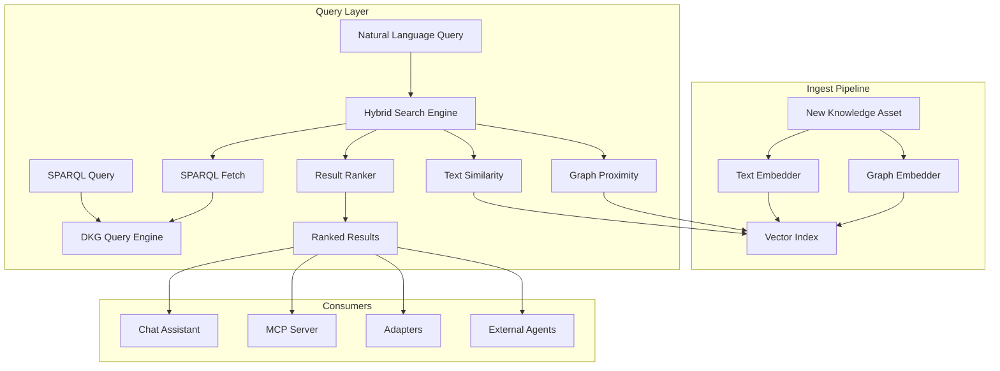
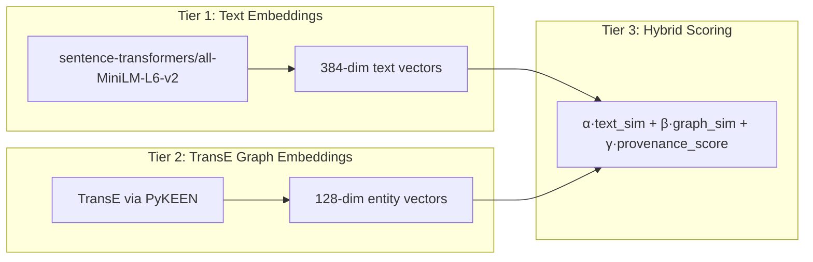
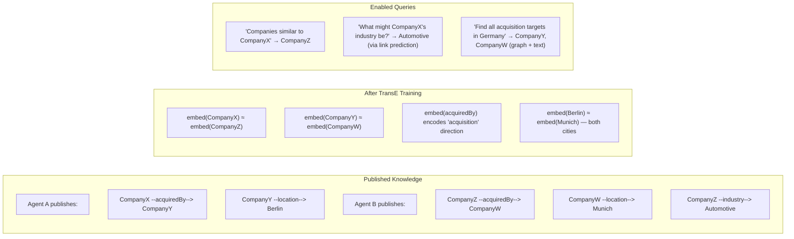
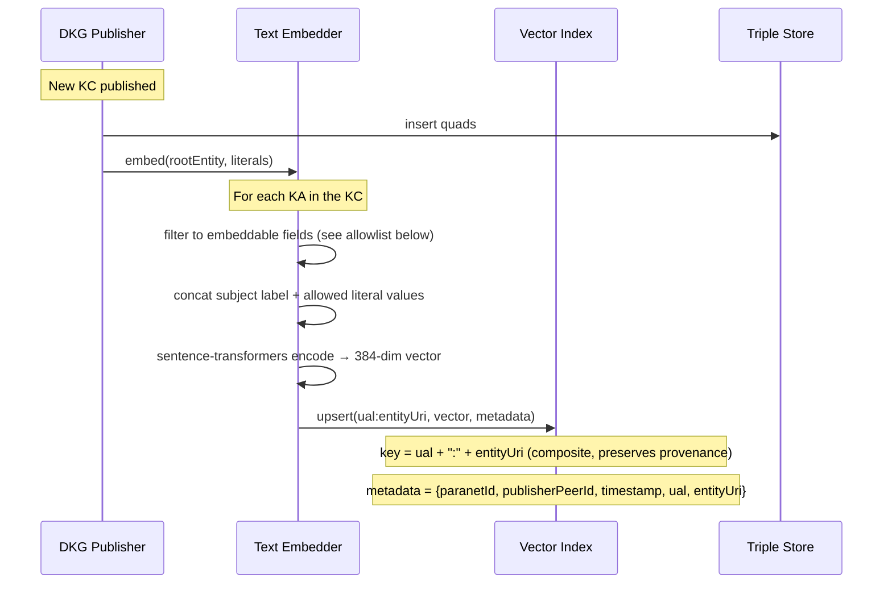
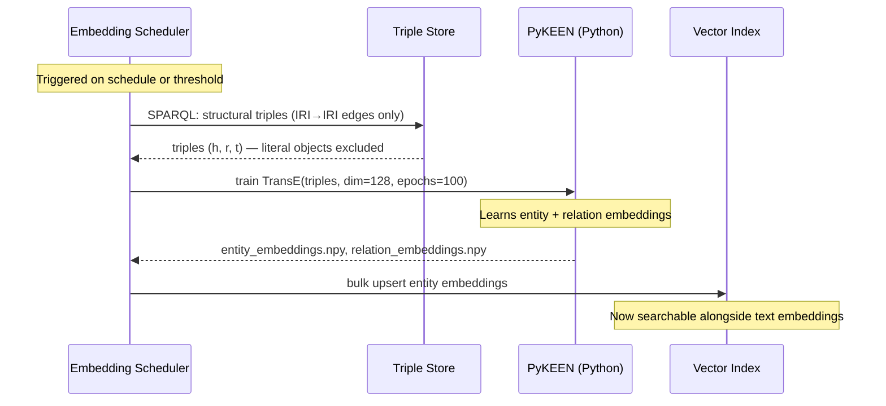
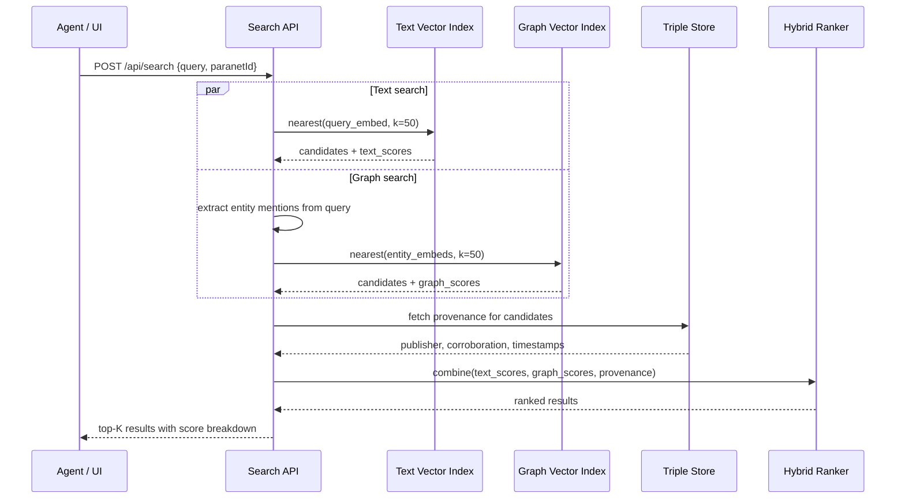
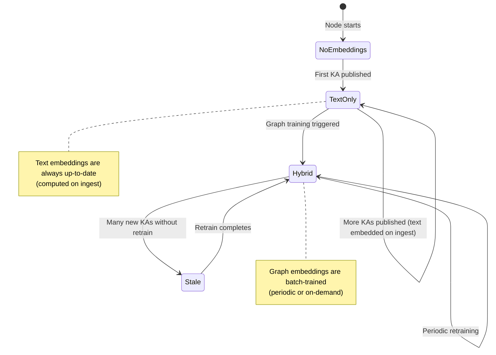

# Plan: Semantic Search and Knowledge Graph Embeddings

Bridge the gap between structured SPARQL queries and natural language agent interactions. Today, querying the DKG requires knowing the exact schema, predicates, and entity URIs. This plan adds semantic search (vector similarity) alongside SPARQL, and introduces knowledge graph embeddings that exploit the graph structure for link prediction, entity resolution, and intelligent recommendation.

**Last updated:** 2026-03-14

---

## Problem Statement

The DKG stores knowledge as RDF triples — a rich, structured representation. But there are two access patterns it cannot serve well today:

1. **Natural language search.** An agent asks "what do we know about supply chain disruptions?" and needs to find relevant knowledge assets without knowing that `schema:Event`, `supply:Disruption`, or `urn:corp:acme` exist in the graph. Today's fallback is `FILTER(CONTAINS(LCASE(?text), "supply chain"))` — a substring match that misses synonyms, related concepts, and multi-hop connections.

2. **Graph-aware reasoning.** Given that Agent A published "Company X acquired Company Y" and Agent B published "Company Y is headquartered in Berlin", no mechanism today can infer "Company X now has operations in Berlin" or suggest "you should also look at Company Z, which has a similar acquisition pattern." The graph structure contains these signals, but they're invisible to flat text search.

Knowledge graph embeddings solve both problems by learning dense vector representations that encode both the textual content and the structural relationships.

---

## Current State

| Component | Status | Gap |
|-----------|--------|-----|
| Text search | `FILTER(CONTAINS(LCASE(?text), ...))` | Substring only — no synonyms, no ranking, no semantic similarity |
| Full-text index | None | Oxigraph has basic FTS but it's not exposed; Blazegraph has built-in FTS but not wired |
| Vector store | None | No embedding storage or similarity search |
| Graph embeddings | None | No structural embeddings |
| Chat assistant | SPARQL via LLM tool calls | LLM generates SPARQL from natural language, but requires schema knowledge |
| MCP server | `dkg_query` tool (raw SPARQL) | No semantic search tool |

---

## Architecture Overview



---

## Knowledge Graph Embedding Strategy

### Why not just text embeddings?

Text embeddings (e.g., sentence-transformers) capture semantic meaning of literal values — "Company X acquired Company Y" is similar to "Corporation A purchased Corporation B." This is valuable but ignores the graph structure: the fact that Company X and Company Y are connected by `schema:acquiredBy`, that Company Y has `schema:location` pointing to Berlin, and that three other agents have corroborated this fact.

Knowledge graph embeddings encode the **structural position** of entities in the graph. Two entities with similar neighborhoods (similar predicates, similar objects) get similar vectors — even if their textual descriptions are completely different.

### Embedding approaches compared

| Method | Principle | Strengths | Weaknesses | Fit for DKG |
|--------|-----------|-----------|------------|-------------|
| **TransE** | `h + r ≈ t` (translation in one space) | Simple, fast, scales to millions of triples | Cannot model 1-to-N, N-to-1, or N-to-N relations | Good for initial deployment — fast training, low memory |
| **TransR** | Entities and relations in separate spaces, projected via matrices | Handles complex relation types (1-N, N-1, N-N) | More parameters, slower training | Better for paranets with rich ontologies |
| **RotatE** | Relations as rotations in complex space | Models symmetry, antisymmetry, inversion, composition | Moderate complexity | Strong general-purpose choice |
| **ComplEx** | Complex-valued embeddings with Hermitian dot product | Handles symmetric and antisymmetric relations elegantly | Higher memory than TransE | Good for mixed relation types |
| **HyperComplEx** | Adaptive mix of hyperbolic + complex + Euclidean | State-of-the-art on large KGs; handles hierarchies + symmetry | Most complex; newest (2025) | Future upgrade path |

### Recommendation: Tiered approach



**Tier 1 (ship first):** Text embeddings via `sentence-transformers`. Embed the textual content of each Knowledge Asset (concatenated literal values). Store in an in-process vector index. This immediately enables natural language search.

**Tier 2 (add graph awareness):** TransE embeddings via PyKEEN. Train on the full triple set per paranet. Embed every entity (subject/object URI) in a 128-dimensional space. Entities with similar structural neighborhoods get similar vectors — enabling "find entities like X" and "what's related to Y" queries that exploit the graph topology.

**Tier 3 (hybrid ranking):** Combine text similarity, graph proximity, and provenance signals (publisher reputation, corroboration count, recency) into a unified relevance score.

---

## How Graph Embeddings Correlate with the Graph

### Entity embeddings capture structural position

When TransE learns embeddings for the DKG, it processes every triple `(subject, predicate, object)` and optimizes so that `embed(subject) + embed(predicate) ≈ embed(object)`. After training:

- Entities that participate in similar relations cluster together
- The relation vector captures the "meaning" of that relationship type
- **Link prediction** becomes possible: given `(Company X, acquiredBy, ?)`, find entities whose embedding is close to `embed(Company X) + embed(acquiredBy)`

### Concrete example with DKG data



### How this maps to DKG concepts

| DKG Concept | Embedding Treatment | Value |
|-------------|-------------------|-------|
| **Knowledge Asset** | Embed the root entity + all literal values | Searchable by content AND structure |
| **Paranet** | Separate embedding space per paranet (or shared with paranet as context) | Paranet-scoped similarity |
| **Context Graph** | Entities within a context graph share structural proximity | Find related findings within a collaborative workspace |
| **Agent Profile** | Agent URI embedded alongside their publications | "Find agents who work on similar topics" |
| **Workspace data** | Tentative embeddings updated on write, finalized on enshrine | Real-time search over draft data |

---

## Phase 1: Text Embedding Index

**Goal:** Natural language search over Knowledge Assets. An agent or user types a question and gets ranked results without SPARQL.

### 1.1 Embedding pipeline



**When to embed:**
- On local publish (after `KC_PUBLISHED` event)
- On receiving gossip publish (after `GossipPublishHandler` stores triples)
- On workspace write (tentative, lower priority)

**When to remove/update vectors:**
- On workspace overwrite or clear: delete stale vectors from the workspace index, then re-embed the new data
- On KC rollback/reorg: remove vectors for the affected KA URIs from the enshrined index
- On enshrine: promote workspace vectors to the enshrined index (copy + delete from workspace)
- On retraction (future): delete vectors matching the retracted entity URIs

All vector lifecycle hooks must be registered alongside the store hooks to prevent orphaned vectors.

**Embeddable field allowlist:**
Only public, non-sensitive literal predicates are included in the embedding text. Encrypted fields, private quads, and access-controlled attributes are excluded by default:

| Predicate pattern | Include? | Reason |
|-------------------|----------|--------|
| `rdfs:label`, `schema:name`, `schema:description` | ✅ | Core searchable metadata |
| `dcterms:title`, `dcterms:abstract` | ✅ | Document metadata |
| Custom predicates not in denylist | ✅ | Extensible |
| `dkg:encryptedValue`, `dkg:privatePayload` | ❌ | Encrypted/sensitive |
| Any literal from private quads (via `accessPolicy`) | ❌ | Private data |

Publishers can override via a `search.embeddablePredicates` config.

**Authorization for workspace search:**
- Workspace search results are only returned to authenticated callers on the local node (owner)
- Remote peers cannot query another node's workspace index
- The `includeWorkspace: true` flag requires valid local auth; unauthenticated requests receive only enshrined results
- Future: ACL-based workspace sharing can extend this to privileged peers

### 1.2 Vector index

**In-process options (no external dependency):**

| Library | Language | Dimensions | Performance | Notes |
|---------|----------|------------|-------------|-------|
| `hnswlib-node` | C++ via N-API | Any | ~1ms for 100K vectors | Battle-tested, used by Chroma |
| `usearch` | C++ via N-API | Any | Fastest HNSW implementation | Newer, very efficient |
| `vectra` | Pure TypeScript | Any | Slower but no native deps | Good for initial prototype |

**Recommendation:** Start with `vectra` (zero native dependencies, works everywhere), migrate to `hnswlib-node` for production performance.

**Storage:** Persist indices to `~/.dkg/embeddings/` alongside the triple store. Use **separate indices per visibility scope** to prevent data leaks:

```
~/.dkg/embeddings/
  <paranetId>/
    enshrined.vectra    — confirmed on-chain KCs (public)
    workspace.vectra    — draft workspace writes (private, node-local)
```

Search queries over enshrined data never touch the workspace index, and vice versa. The `includeWorkspace` flag on search requests controls whether workspace results are merged. This isolation ensures draft/workspace vectors cannot leak into general search results even if a filter path is missed.

### 1.3 Search API

**`POST /api/search`**

```json
{
  "query": "supply chain disruptions in automotive",
  "paranetId": "testing",
  "limit": 10,
  "threshold": 0.5,
  "includeWorkspace": false
}
```

**Response:**

```json
{
  "results": [
    {
      "entityUri": "urn:supplychain:disruption:2026-q1",
      "ual": "did:dkg:evm:84532/0xf165.../42",
      "score": 0.87,
      "scoreBreakdown": { "textSimilarity": 0.87 },
      "snippet": "Q1 2026 automotive supply chain disruption affecting semiconductor deliveries...",
      "paranetId": "testing",
      "publisherPeerId": "12D3KooW...",
      "timestamp": "2026-03-10T14:30:00Z"
    }
  ],
  "totalMatches": 3,
  "queryEmbeddingMs": 12,
  "searchMs": 2
}
```

### 1.4 Embedding model

**Default:** `sentence-transformers/all-MiniLM-L6-v2` (384 dimensions, 22M parameters, runs on CPU in ~10ms per sentence). Load via `@xenova/transformers` (ONNX runtime, pure JS, no Python dependency).

**Configurable:** Allow operators to set a remote embedding endpoint (OpenAI, Cohere, local ollama) for higher quality:

```json
// ~/.dkg/config.json
{
  "search": {
    "enabled": true,
    "embeddingModel": "local",
    "embeddingEndpoint": null,
    "indexBackend": "vectra"
  }
}
```

---

## Phase 2: Knowledge Graph Embeddings (TransE)

**Goal:** Learn structural embeddings for every entity and relation in the graph, enabling graph-aware similarity search, link prediction, and entity recommendation.

### 2.1 Training pipeline



**Training trigger:**
- Periodic (e.g., every 6 hours or after N new KAs published)
- On-demand via API (`POST /api/embeddings/retrain`)
- Incremental update for new entities (approximate — add new vectors using learned relation vectors without full retrain)

### 2.2 PyKEEN integration

PyKEEN runs as a Python subprocess or sidecar. The node exports structural triples (IRI subjects and objects only — literal-object triples are excluded) as TSV, invokes PyKEEN, and imports the resulting embeddings.

```bash
# Export structural triples from store (excludes literal objects)
dkg embeddings export --paranet testing --output /tmp/triples.tsv

# Train using PyKEEN Python API (the pykeen CLI `--dataset` flag expects
# named datasets, not raw files — use the pipeline config for local triples):
python3 -c "
from pykeen.triples import TriplesFactory
from pykeen.pipeline import pipeline
tf = TriplesFactory.from_path('/tmp/triples.tsv')
result = pipeline(
    training=tf,
    model='TransE',
    model_kwargs=dict(embedding_dim=128),
    training_kwargs=dict(num_epochs=100),
)
result.save_to_directory('/tmp/embeddings/')
"

# Import embeddings back
dkg embeddings import --paranet testing --input /tmp/embeddings/
```

**Why PyKEEN over DGL-KE:** PyKEEN has better API design, supports more models (40+), has built-in evaluation (MRR, Hits@K), and handles RDF natively. DGL-KE is faster for very large graphs (100M+ triples) but the DKG's per-paranet graphs are typically <10M triples.

### 2.3 Which model and when

| Paranet size | Recommended model | Training time (CPU) | Embedding dim |
|-------------|-------------------|---------------------|---------------|
| <100K triples | TransE | ~1 min | 128 |
| 100K–1M triples | RotatE | ~10 min | 128 |
| 1M–10M triples | ComplEx | ~30 min | 256 |
| >10M triples | Consider DGL-KE with TransE | GPU recommended | 128 |

### 2.4 Link prediction API

**`POST /api/predict`**

```json
{
  "head": "urn:corp:companyX",
  "relation": "http://schema.org/acquiredBy",
  "tail": null,
  "paranetId": "testing",
  "limit": 5
}
```

**Response:**

```json
{
  "predictions": [
    { "entity": "urn:corp:companyY", "score": 0.92, "existsInGraph": true },
    { "entity": "urn:corp:companyW", "score": 0.78, "existsInGraph": false },
    { "entity": "urn:corp:companyZ", "score": 0.65, "existsInGraph": false }
  ],
  "model": "TransE",
  "trainedAt": "2026-03-14T10:00:00Z",
  "tripleCount": 45000
}
```

`existsInGraph: false` means the link is **predicted but not yet published** — a suggestion for agents to investigate.

---

## Phase 3: Hybrid Search

**Goal:** Combine text similarity, graph proximity, and provenance into a unified relevance score.

### 3.1 Scoring function

```
score(query, entity) = α · text_sim(query_embed, entity_text_embed)
                     + β · graph_sim(query_entities, entity_graph_embed)
                     + γ · provenance_score(entity)
```

Where:
- `text_sim` — cosine similarity between query text embedding and entity text embedding
- `graph_sim` — cosine similarity between the graph embeddings of entities mentioned in the query and the candidate entity
- `provenance_score` — weighted combination of:
  - Publisher reputation (how many of their KAs have been corroborated)
  - Corroboration count (how many agents confirmed this fact)
  - Recency (newer facts score higher for time-sensitive queries)
  - Context graph membership (enshrined facts score higher than workspace drafts)

**Default weights:** `α=0.5, β=0.3, γ=0.2` (tunable per paranet).

### 3.2 Query flow



---

## Phase 4: Consumer Integration

### 4.1 Chat assistant — semantic search tool

**File:** `packages/node-ui/src/chat-assistant.ts`

Add a `dkg_search` tool alongside the existing `dkg_query`:

```typescript
{
  name: 'dkg_search',
  description: 'Search the knowledge graph using natural language. Returns ranked results based on semantic text similarity. (Graph-structural ranking is added in Phase 3 after graph embeddings are available.)',
  parameters: {
    query: { type: 'string', description: 'Natural language search query' },
    paranetId: { type: 'string', description: 'Paranet to search' },
    limit: { type: 'number', description: 'Max results (default 10)' }
  }
}
```

The LLM can now choose between `dkg_query` (precise SPARQL) and `dkg_search` (natural language) depending on the user's question.

### 4.2 MCP server — search tool

**File:** `packages/mcp-server/src/index.ts`

```typescript
{
  name: 'dkg_semantic_search',
  description: 'Search the DKG using natural language. Finds relevant knowledge assets by meaning, not exact text match.',
  parameters: {
    query: { type: 'string' },
    paranetId: { type: 'string', description: 'Paranet ID to search within (single target)' },
    limit: { type: 'number' }
  }
}
```

### 4.3 Discovery enhancement

Agent discovery currently uses exact SPARQL matches. With embeddings, add "find agents with similar capabilities":

```
POST /api/agents/similar
{ "agentUri": "did:dkg:agent:12D3KooW...", "limit": 5 }
```

Returns agents whose profile embeddings (skills, publications, paranet memberships) are most similar.

---

## Implementation Details

### New package: `@origintrail-official/dkg-search`

```text
packages/search/
  src/
    text-embedder.ts       — sentence-transformers via @xenova/transformers
    vector-index.ts        — vectra/hnswlib wrapper
    graph-embedder.ts      — PyKEEN integration (export, train, import)
    hybrid-ranker.ts       — scoring function combining text + graph + provenance
    search-engine.ts       — main search API (wires everything together)
    index.ts               — exports
  test/
    text-embedder.test.ts
    vector-index.test.ts
    hybrid-ranker.test.ts
    search-engine.test.ts
```

### Embedding lifecycle



### Resource estimates

| Component | Memory | Disk | CPU |
|-----------|--------|------|-----|
| Text embeddings (MiniLM model) | ~100 MB (ONNX model) | — | ~10ms per embed |
| Text vector index (100K entities) | ~150 MB | ~200 MB | ~1ms per search |
| Graph embeddings (100K entities, dim=128) | ~50 MB | ~100 MB | — |
| PyKEEN training (100K triples) | ~500 MB peak | — | ~60s on CPU |

---

## Execution Order

1. **Phase 1** (text embeddings) — immediate value, no Python dependency, enables natural language search
2. **Phase 4.1** (chat assistant integration) — ship with Phase 1 for immediate user-facing value
3. **Phase 2** (graph embeddings) — adds structural awareness, requires PyKEEN sidecar
4. **Phase 3** (hybrid ranking) — combines all signals, requires Phase 1 + 2
5. **Phase 4.2-4.3** (MCP + discovery) — consumer integrations, after hybrid search works

---

## Acceptance Criteria

- [ ] `POST /api/search` returns semantically relevant results for natural language queries
- [ ] Text embeddings are computed on KA publish (latency < 50ms per KA)
- [ ] Vector index persists across node restarts
- [ ] Chat assistant has `dkg_search` tool and uses it for natural language questions
- [ ] MCP server has `dkg_semantic_search` tool
- [ ] Graph embeddings trainable via `POST /api/embeddings/retrain` or CLI
- [ ] Link prediction via `POST /api/predict` returns scored candidates
- [ ] Hybrid ranking combines text similarity, graph proximity, and provenance
- [ ] Per-paranet embedding spaces (no cross-paranet leakage)
- [ ] Embedding model is configurable (local MiniLM or remote endpoint)

---

## Future Directions

- **Inductive embeddings** — Use PyKEEN's inductive link prediction to handle unseen entities without full retrain (critical for a growing network)
- **Cross-paranet embeddings** — Shared embedding space across paranets for cross-domain discovery (with access control)
- **Embedding-aware context graphs** — Use graph similarity to suggest context graph participants ("these agents are working on related topics")
- **Federated embedding updates** — Nodes exchange embedding deltas via gossip, enabling network-wide semantic search without centralized retraining
- **Advanced models** — Upgrade from TransE to RotatE/ComplEx/HyperComplEx as paranet complexity grows
