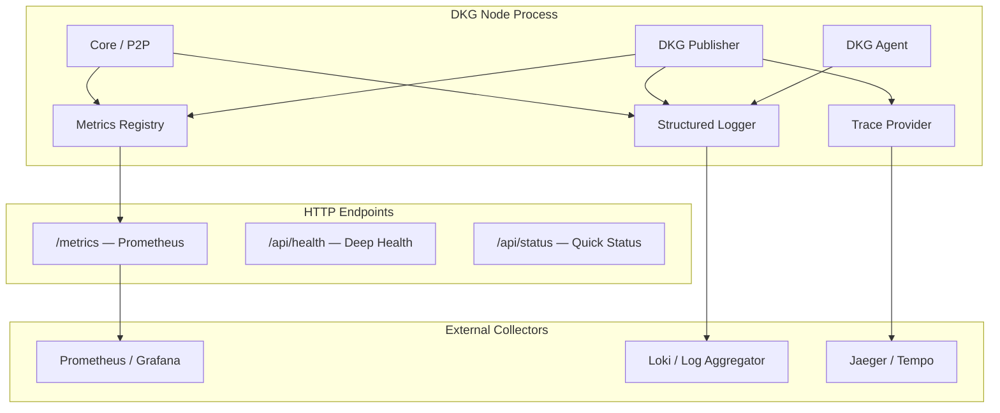
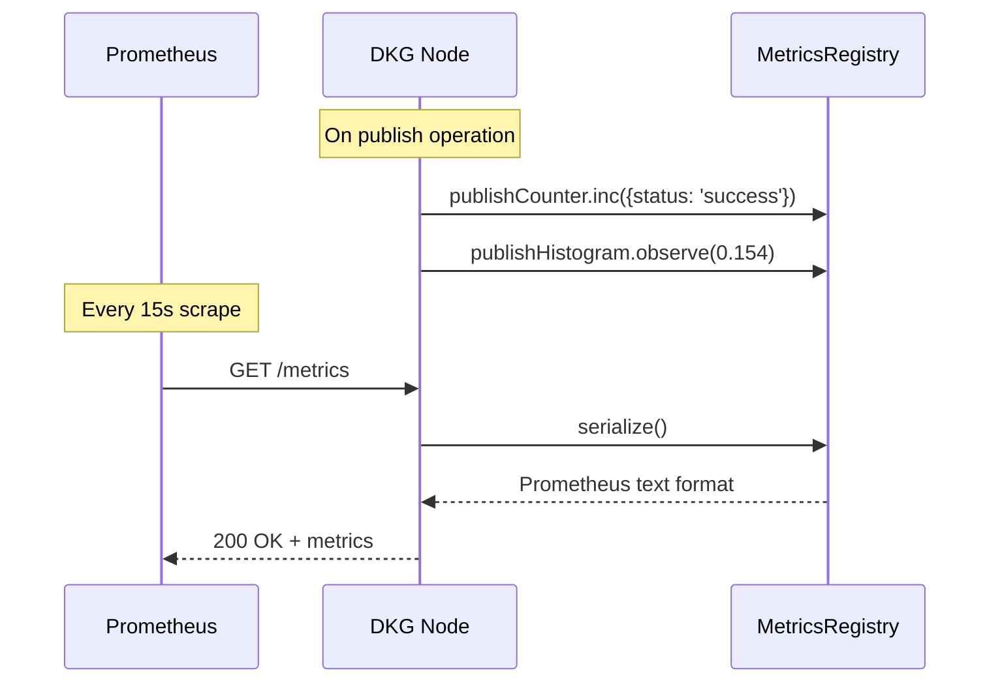
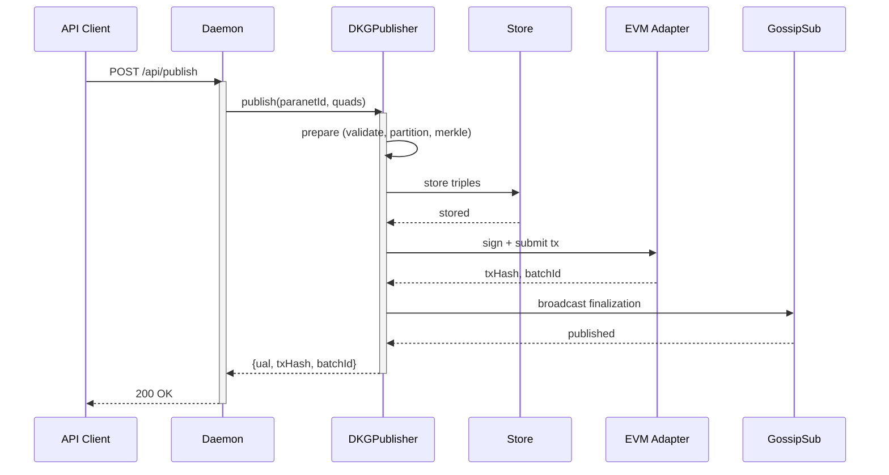

# Plan: Structured Observability

Make the DKG node introspectable in production. Today, debugging requires grepping `daemon.log`. This plan introduces structured logging with levels, a Prometheus metrics endpoint, and OpenTelemetry traces through critical paths — so operators can monitor fleet health, diagnose issues without SSH, and measure performance over time.

**Last updated:** 2026-03-14

---

## Current State

| Component | Status | Gap |
|-----------|--------|-----|
| `Logger` class (`core/logger.ts`) | Implemented — `debug/info/warn/error` with `LogSink` | No configurable log level; agent uses it, daemon and core use raw `console.log` |
| `MetricsCollector` (`node-ui/metrics-collector.ts`) | Collects CPU, memory, peers, triples, KCs every 2 min | Internal only — stored in SQLite, exposed via `/api/metrics` as JSON |
| Prometheus `/metrics` | Code exists but is **commented out** (`node-ui/api.ts:124-179`) | Never enabled; format is defined but not wired |
| OpenTelemetry | **Stub only** (`node-ui/telemetry.ts`) — `initTelemetry`, `recordGauge`, `setOperationSpan` are no-ops | OTLP endpoints configured in `config.ts` but unused |
| Log streaming | `LogPushWorker` sends syslog to Loggly via GELF over TCP | Works for central log aggregation but is not structured JSON |
| Health checks | `/api/status` (public), `/api/info` (auth), `/api/chain/rpc-health` | No deep health check (store health, gossip mesh health, chain sync lag) |

---

## Architecture



---

## Phase 1: Structured Logging with Levels

**Goal:** Every log line is structured JSON with a configurable level filter. Operators can set `LOG_LEVEL=warn` to silence noise, or `LOG_LEVEL=debug` for deep diagnostics.

### 1.1 Add log level configuration

**File:** `packages/core/src/logger.ts`

Add a global log level (configurable via env var and config):

```typescript
type LogLevel = 'debug' | 'info' | 'warn' | 'error';
const LEVEL_RANK: Record<LogLevel, number> = { debug: 0, info: 1, warn: 2, error: 3 };

let globalLevel: LogLevel = (process.env.LOG_LEVEL as LogLevel) ?? 'info';

export function setLogLevel(level: LogLevel): void { globalLevel = level; }
```

Each `Logger` method checks `LEVEL_RANK[method] >= LEVEL_RANK[globalLevel]` before emitting.

### 1.2 Structured JSON output

Each log entry becomes:

```json
{
  "ts": "2026-03-14T12:00:00.000Z",
  "level": "info",
  "module": "DKGPublisher",
  "operationId": "4b58269d-795e-49c4-ad73-eea9b346c21a",
  "operationType": "publish",
  "msg": "On-chain confirmed: UAL=did:dkg:evm:31337/0xa4a5.../1 batchId=6",
  "ual": "did:dkg:evm:31337/0xa4a5.../1",
  "batchId": 6,
  "durationMs": 154
}
```

### 1.3 Migrate daemon.ts and core/node.ts

Replace all `console.log(...)` in `daemon.ts` and `node.ts` with `Logger` calls. This is ~50 call sites. The daemon's `log()` function becomes a thin wrapper that calls `Logger.info()`.

### 1.4 Config integration

```json
// ~/.dkg/config.json
{
  "logging": {
    "level": "info",
    "json": true,
    "file": "~/.dkg/daemon.log"
  }
}
```

`json: false` preserves the current human-readable format for interactive use.

---

## Phase 2: Prometheus Metrics Endpoint

**Goal:** Uncomment and wire the existing Prometheus endpoint, add counters/histograms for all critical operations, expose at `GET /metrics`.

### 2.1 Metrics to expose

#### Gauges (current state)

| Metric | Labels | Source |
|--------|--------|--------|
| `dkg_peers_connected` | `transport=direct\|relayed` | `DKGNode.getConnections()` |
| `dkg_gossip_mesh_peers` | `topic` | `GossipSubManager` |
| `dkg_store_triples_total` | `paranet` | SPARQL COUNT query |
| `dkg_store_kcs_total` | `status=confirmed\|tentative` | Store query |
| `dkg_store_bytes` | — | Oxigraph file size |
| `dkg_chain_sync_block` | — | `ChainEventPoller.lastBlock` |
| `dkg_chain_rpc_latency_ms` | — | RPC health check |
| `dkg_uptime_seconds` | — | Process uptime |
| `dkg_memory_heap_used_bytes` | — | `process.memoryUsage()` |

#### Counters (cumulative)

| Metric | Labels | Source |
|--------|--------|--------|
| `dkg_publishes_total` | `status=success\|failed` | `DKGPublisher` |
| `dkg_queries_total` | `paranet` | Query handler |
| `dkg_workspace_writes_total` | `paranet` | Workspace handler |
| `dkg_gossip_messages_total` | `topic, direction=in\|out` | `GossipSubManager` |
| `dkg_protocol_requests_total` | `protocol, status=success\|error` | `ProtocolRouter` |
| `dkg_enshrine_total` | `status=success\|failed` | Enshrine flow |
| `dkg_context_graph_signatures_total` | — | Context graph handler |

#### Histograms (latency distribution)

| Metric | Labels | Buckets |
|--------|--------|---------|
| `dkg_publish_duration_seconds` | `phase=prepare\|store\|chain\|broadcast` | 0.01, 0.05, 0.1, 0.5, 1, 5, 10, 30 |
| `dkg_query_duration_seconds` | `paranet` | 0.001, 0.01, 0.05, 0.1, 0.5, 1, 5 |
| `dkg_gossip_publish_duration_seconds` | `topic` | 0.01, 0.05, 0.1, 0.5, 1, 5 |
| `dkg_protocol_request_duration_seconds` | `protocol` | 0.01, 0.05, 0.1, 0.5, 1, 5, 10 |

### 2.2 Implementation

**Approach:** Use a lightweight in-process metrics registry (no external dependency). The existing `MetricsCollector` already collects gauge values — extend it with counters and histograms, and add a Prometheus text format serializer.



### 2.3 Uncomment and extend existing code

The Prometheus serializer already exists at `node-ui/api.ts:124-179` (commented out). Uncomment it, wire it to the new registry, and add the metrics above.

**Auth:** `/metrics` should be unauthenticated (Prometheus can't send Bearer tokens by default). Add it to the public endpoint allowlist alongside `/api/status`.

---

## Phase 3: OpenTelemetry Traces

**Goal:** Trace the full lifecycle of a publish operation across the node, so operators can see where time is spent and where failures occur.

### 3.1 Critical paths to trace



Each box becomes a span. The trace ID propagates through the entire flow.

### 3.2 Implementation

Replace the stub in `node-ui/telemetry.ts` with real `@opentelemetry/api` instrumentation:

1. `initTelemetry()` creates a `TracerProvider` with OTLP exporter
2. `createSpan(name, attributes)` wraps operation sections
3. Spans are created in `DKGPublisher.publish()`, `WorkspaceHandler.handle()`, `DKGQueryEngine.execute()`, `ProtocolRouter.send()`

**Dependency:** Add `@opentelemetry/api` and `@opentelemetry/sdk-trace-node` to `@dkg/node-ui`.

### 3.3 Trace context propagation

For P2P operations (gossip publish → remote handler), embed the trace ID in the gossip message metadata so the receiving node can continue the trace.

---

## Phase 4: Deep Health Check

**Goal:** A single endpoint that tells operators whether the node is healthy, degraded, or failing — with specific component status.

### 4.1 `GET /api/health`

```json
{
  "status": "healthy",
  "components": {
    "p2p": { "status": "healthy", "peers": 4, "relayConnected": true },
    "store": { "status": "healthy", "backend": "oxigraph-worker", "tripleCount": 12400 },
    "chain": { "status": "degraded", "rpcLatencyMs": 2500, "lastBlock": 38831329, "syncLag": 3 },
    "gossip": { "status": "healthy", "meshPeers": { "dkg/paranet/testing/publish": 3 } }
  },
  "uptime": 72314,
  "version": "9.0.0-beta.2"
}
```

**Status logic:**
- `healthy` — all components green
- `degraded` — functioning but with issues (high RPC latency, low peer count, store near capacity)
- `unhealthy` — critical failure (no peers, store unresponsive, chain unreachable)

---

## Execution Order

1. **Phase 1** (logging) — no dependencies, immediate value, enables all other phases
2. **Phase 2** (Prometheus) — builds on existing MetricsCollector, high ROI for fleet monitoring
3. **Phase 4** (health check) — quick win, uses data from phases 1-2
4. **Phase 3** (tracing) — most complex, needs OpenTelemetry dependency, do last

---

## Acceptance Criteria

- [ ] All log output uses `Logger` with configurable level (no raw `console.log` in daemon/agent/publisher)
- [ ] `GET /metrics` returns Prometheus text format with all gauges, counters, and histograms
- [ ] `GET /api/health` returns component-level status with healthy/degraded/unhealthy
- [ ] Publish, query, and workspace operations produce OpenTelemetry spans
- [ ] Grafana dashboard template in `docs/observability/` for the standard metrics
