# DKG V9 Protocol Operations — Sequence Diagrams & Analysis

> End-to-end flows for every V9 protocol operation: publish, update,
> workspace, query, sync, gossip, and chain integration. Includes RDF
> triples produced, on-chain vs off-chain split, and improvement notes.

---

## Table of Contents

1. [Node Boot Sequence](#1-node-boot-sequence)
2. [Publish Operation](#2-publish-operation)
3. [Gossip-Based Publish Propagation](#3-gossip-based-publish-propagation)
4. [Chain Event Confirmation](#4-chain-event-confirmation)
5. [Workspace Writes](#5-workspace-writes)
6. [Update Operation](#6-update-operation)
7. [Query Operation](#7-query-operation)
8. [Peer Sync](#8-peer-sync)
9. [Paranet Discovery](#9-paranet-discovery)
10. [GossipSub Topic Architecture](#10-gossipsub-topic-architecture)
11. [Storage Model](#11-storage-model)
12. [Merkle Tree & Proof System](#12-merkle-tree--proof-system)
13. [On-Chain vs Off-Chain Data](#13-on-chain-vs-off-chain-data)
14. [Protocol-Level Review & Improvements](#14-protocol-level-review--improvements)

---

## 1. Node Boot Sequence

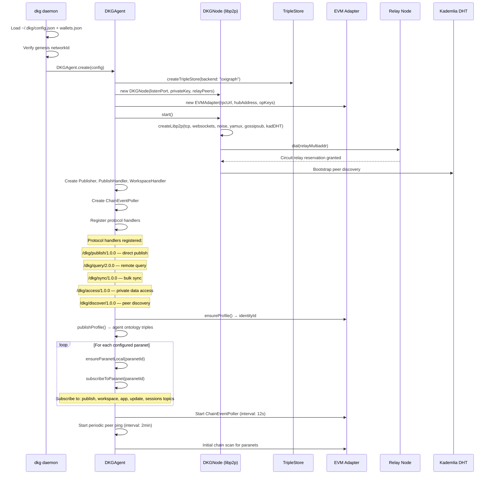

---

## 2. Publish Operation

### 2.1 Full End-to-End Flow

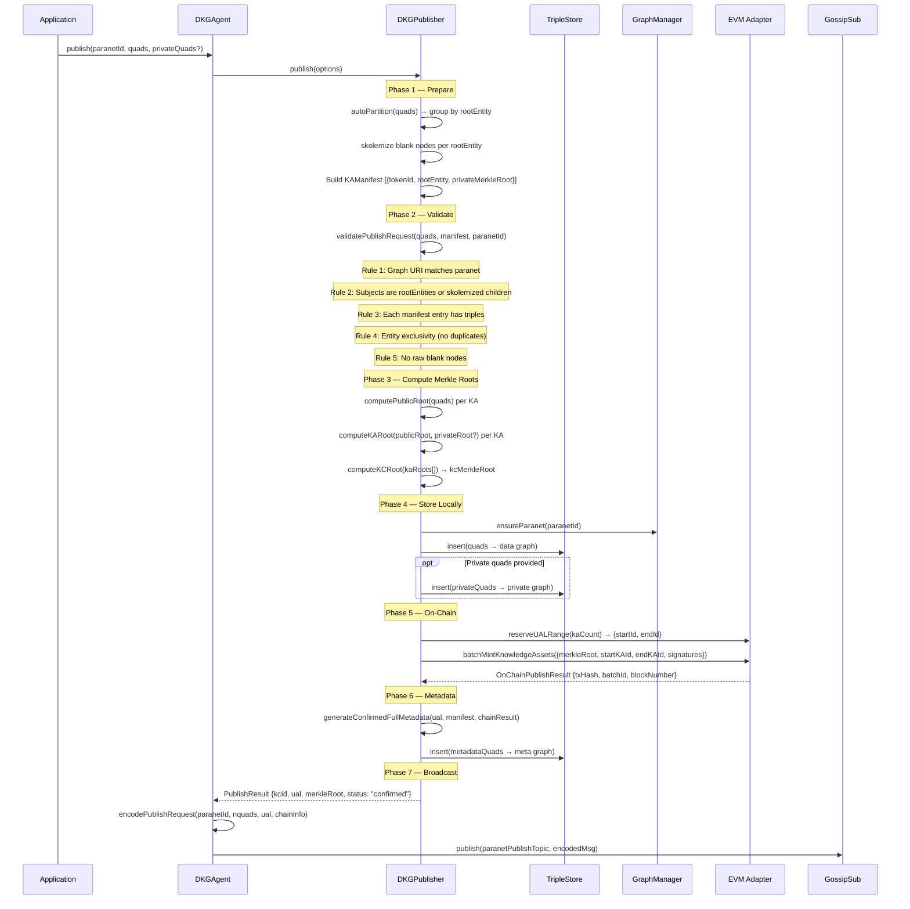

### 2.2 RDF Triples Produced

#### Data Graph: `did:dkg:paranet:{paranetId}`

User-supplied triples, normalized to the paranet graph:

```turtle
<https://example.org/entity/1>
    rdf:type            schema:Article ;
    schema:name         "Decentralized AI" ;
    schema:dateCreated  "2026-03-08" .

<https://example.org/entity/1/.well-known/genid/author-1>
    schema:name  "Alice" .
```

Optional private content marker:

```turtle
<urn:dkg:kc>  dkg:privateContentRoot  "0x9f86d081..." .
```

#### Meta Graph: `did:dkg:paranet:{paranetId}/_meta`

```turtle
# KC (Knowledge Collection)
<did:dkg:base:84532/0xPubAddr/42>
    rdf:type              dkg:KnowledgeCollection ;
    dkg:merkleRoot        "0xabc..." ;
    dkg:kaCount           "2"^^xsd:integer ;
    dkg:status            "confirmed" ;
    dkg:paranet           <did:dkg:paranet:{paranetId}> ;
    prov:wasAttributedTo  "12D3KooW..." ;
    dkg:publishedAt       "2026-03-08T11:00:00Z"^^xsd:dateTime ;
    dkg:transactionHash   "0xdef..." ;
    dkg:blockNumber       "12345678"^^xsd:integer ;
    dkg:blockTimestamp     "1709901234" ;
    dkg:publisherAddress  "0x1234..." ;
    dkg:batchId           "7"^^xsd:integer ;
    dkg:chainId           "base:84532" .

# KA (Knowledge Asset) — one per rootEntity
<did:dkg:base:84532/0xPubAddr/42/0>
    rdf:type                dkg:KnowledgeAsset ;
    dkg:rootEntity          <https://example.org/entity/1> ;
    dkg:partOf              <did:dkg:base:84532/0xPubAddr/42> ;
    dkg:tokenId             "0"^^xsd:integer ;
    dkg:publicTripleCount   "3"^^xsd:integer .

<did:dkg:base:84532/0xPubAddr/42/1>
    rdf:type                dkg:KnowledgeAsset ;
    dkg:rootEntity          <https://example.org/entity/2> ;
    dkg:partOf              <did:dkg:base:84532/0xPubAddr/42> ;
    dkg:tokenId             "1"^^xsd:integer ;
    dkg:publicTripleCount   "5"^^xsd:integer ;
    dkg:privateTripleCount  "2"^^xsd:integer ;
    dkg:privateMerkleRoot   "0x7c211..." .
```

---

## 3. Gossip-Based Publish Propagation

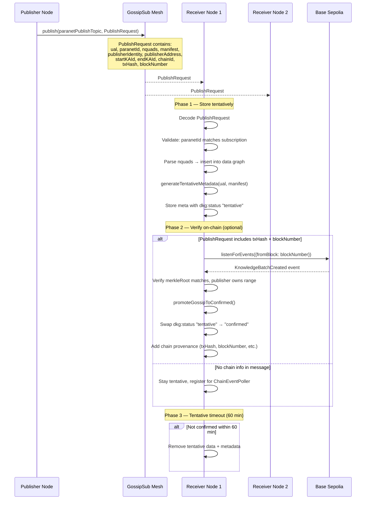

> **REVIEW: Tentative data retention.**
> The 60-minute timeout is a reasonable default, but:
> - If a publisher is slow to get on-chain (gas spikes, mempool congestion),
>   valid data may be dropped before the chain event arrives.
> - Consider making the timeout configurable and/or adding a re-request
>   mechanism via the sync protocol.

---

## 4. Chain Event Confirmation

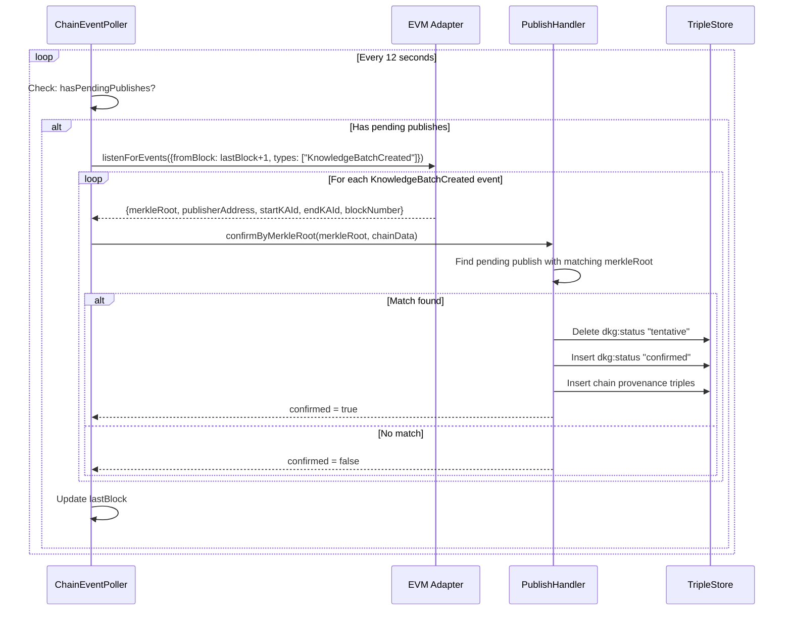

### Chain Events Emitted

| Event | Source Contract | Fields | Purpose |
|-------|---------------|--------|---------|
| `KnowledgeBatchCreated` | KnowledgeAssetsStorage | batchId, publisher, merkleRoot, startKAId, endKAId, txHash | Confirm published data |
| `UALRangeReserved` | KnowledgeAssetsStorage | publisher, startId, endId | UAL allocation |
| `ParanetCreated` | ParanetV9Registry | paranetId, creator, accessPolicy | Discover new paranets |
| `KnowledgeBatchUpdated` | KnowledgeAssetsStorage | batchId, newMerkleRoot | Confirm data updates |

---

## 5. Workspace Writes

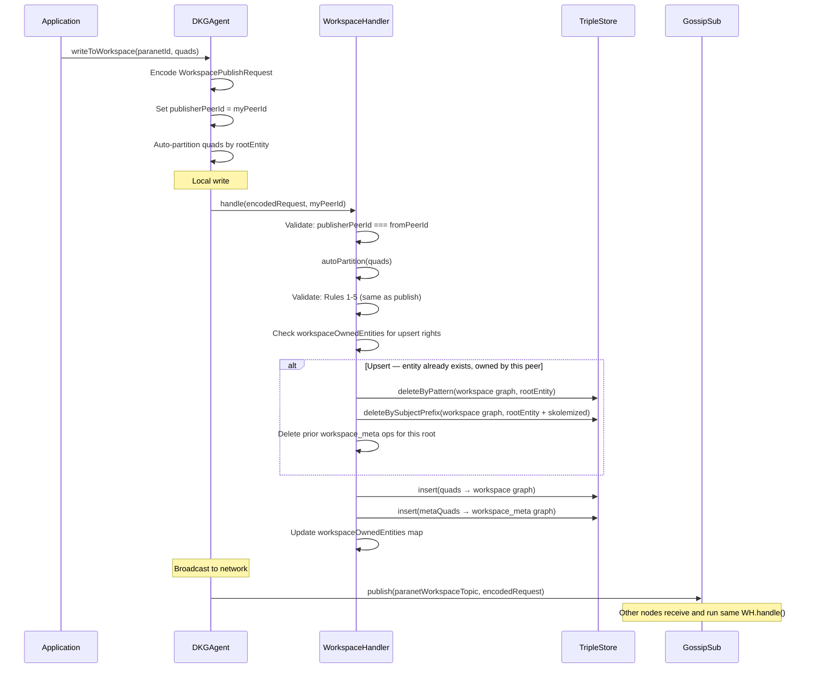

### Workspace Meta Triples

```turtle
# Workspace meta graph: did:dkg:paranet:{paranetId}/_workspace_meta

<urn:dkg:workspace:{paranetId}:{opId}>
    rdf:type              dkg:WorkspaceOperation ;
    prov:wasAttributedTo  "12D3KooW..." ;
    dkg:publishedAt       "2026-03-08T11:00:00Z"^^xsd:dateTime ;
    dkg:rootEntity        <https://example.org/entity/1> ;
    dkg:rootEntity        <https://example.org/entity/2> .
```

> **REVIEW: Workspace access control.**
> The current model is creator-only upsert — only the original publisher can
> overwrite their entities. This is enforced via `workspaceOwnedEntities` (in-memory map).
> **Problem:** On node restart, this map is empty. Any node can then claim
> ownership of unclaimed entities. Consider persisting ownership to workspace_meta.

---

## 6. Update Operation

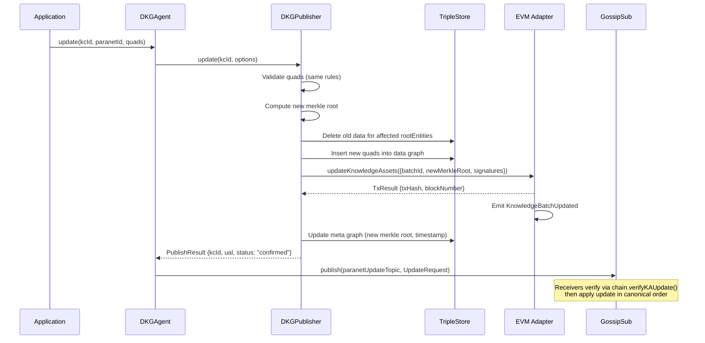

> **REVIEW: Update ordering.**
> Updates are applied in canonical `(blockNumber, txIndex)` order. This is
> correct for consistency, but there's no mechanism for conflict resolution
> if two publishers update overlapping entities in the same block. The first
> tx wins (by txIndex), but the second publisher gets no notification of
> the conflict.

---

## 7. Query Operation

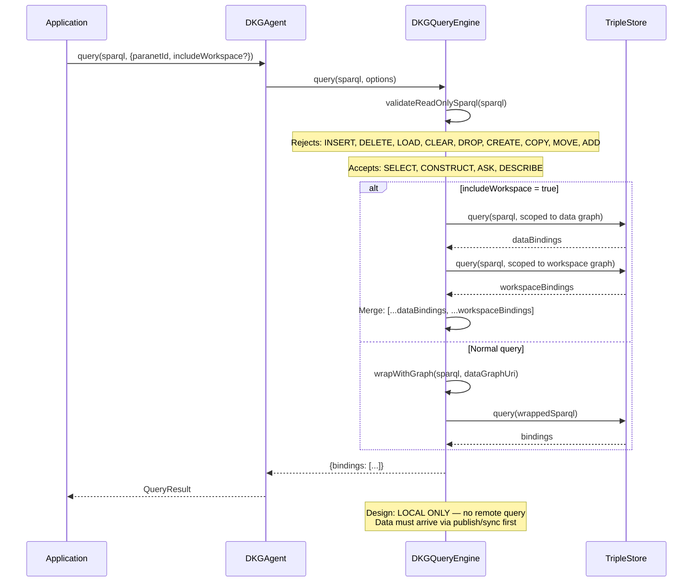

### Query Access Policy

```typescript
interface ParanetQueryPolicy {
  policy: 'deny' | 'public' | 'allowList';
  allowedPeers?: string[];
  allowedLookupTypes?: LookupType[];
  sparqlEnabled?: boolean;
  sparqlTimeout?: number;
  sparqlMaxResults?: number;
}
```

> **REVIEW: Query isolation.**
> The query engine is intentionally local-only (Spec §1.6 Store Isolation).
> This means a node can only query data it has received via publish/sync.
> **Implication for apps:** If an app needs data from a paranet it hasn't
> synced, it must first sync from a peer. There's no query federation.
> This is a conscious design choice for privacy/security, but may frustrate
> app developers expecting a "world computer" model.

---

## 8. Peer Sync

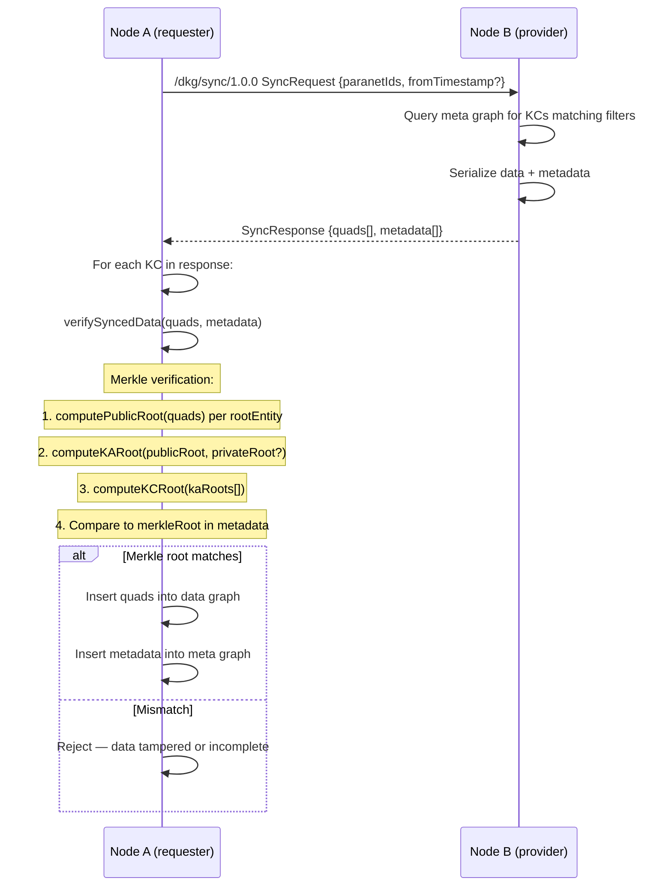

### Workspace Sync

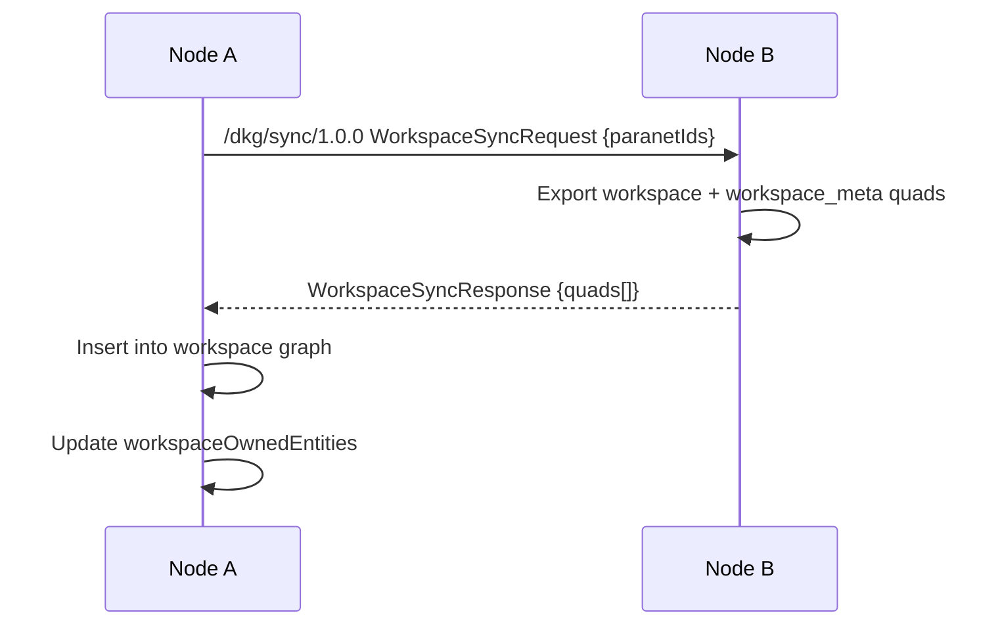

> **REVIEW: Sync completeness.**
> Workspace sync does NOT include the `workspaceOwnedEntities` map.
> A synced node cannot enforce creator-only upsert for workspace entities
> it received via sync. This is a known limitation.

---

## 9. Paranet Discovery

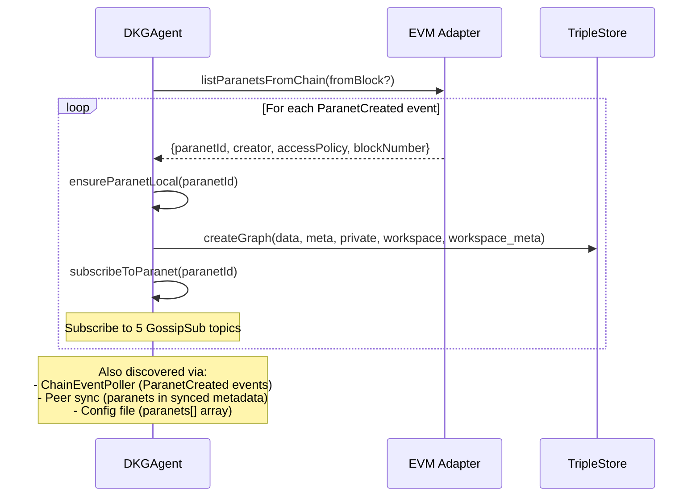

---

## 10. GossipSub Topic Architecture

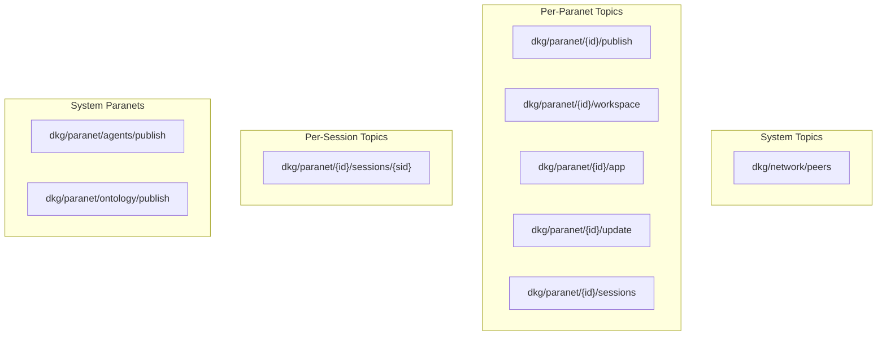

| Topic | Purpose | Message Types |
|-------|---------|---------------|
| `dkg/network/peers` | Peer discovery & health | Peer announce, capabilities |
| `dkg/paranet/{id}/publish` | Published data broadcast | PublishRequest (encoded protobuf) |
| `dkg/paranet/{id}/workspace` | Workspace writes | WorkspacePublishRequest |
| `dkg/paranet/{id}/app` | Application coordination | JSON app messages (game, etc.) |
| `dkg/paranet/{id}/update` | KA updates | UpdateRequest |
| `dkg/paranet/{id}/sessions` | Multi-party sessions | Session proposals, coordination |
| `dkg/paranet/{id}/sessions/{sid}` | Per-session messages | Round data, commitments |

> **REVIEW: App topic is untyped.**
> The `app` topic carries JSON messages with an `app` field for routing (e.g.
> `"origin-trail-game"`). All apps on the same paranet share a single topic.
> **Risk:** A malicious app could flood the topic, affecting all apps. Consider
> per-app subtopics: `dkg/paranet/{id}/app/{appId}`.

---

## 11. Storage Model

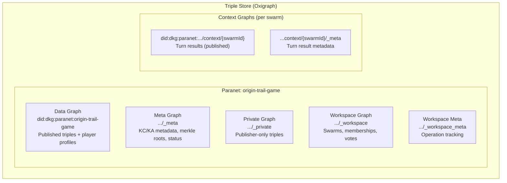

### Graph URI Patterns

| Pattern | Example | Content |
|---------|---------|---------|
| `did:dkg:paranet:{id}` | `did:dkg:paranet:origin-trail-game` | Published data |
| `did:dkg:paranet:{id}/_meta` | `.../_meta` | KC/KA metadata |
| `did:dkg:paranet:{id}/_private` | `.../_private` | Private triples |
| `did:dkg:paranet:{id}/_workspace` | `.../_workspace` | Workspace data |
| `did:dkg:paranet:{id}/_workspace_meta` | `.../_workspace_meta` | Workspace ops |
| `did:dkg:paranet:{id}/context/{ctxId}` | `.../context/swarm-abc123` | Context graph data |
| `did:dkg:paranet:{id}/context/{ctxId}/_meta` | `.../context/swarm-abc123/_meta` | Context graph meta |

---

## 12. Merkle Tree & Proof System

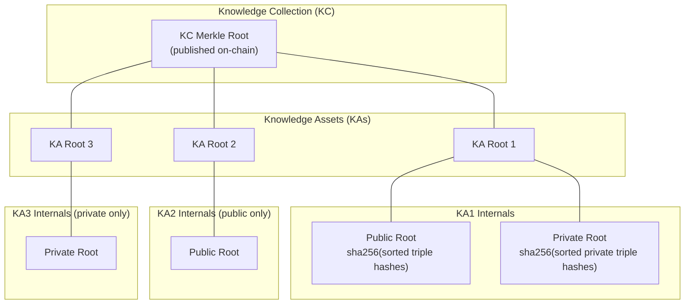

### Merkle Computation

1. **Triple hash:** SHA-256 of the NQuad serialization of each triple.
2. **Public root:** Merkle tree over sorted triple hashes for a rootEntity.
3. **Private root:** Merkle tree over sorted private triple hashes (publisher-only).
4. **KA root:** `sha256(publicRoot || privateRoot)` — or just the one that exists.
5. **KC root:** Merkle tree over sorted KA roots.
6. **On-chain:** Only the KC root (32 bytes) goes on-chain.

### Verification

```
Verifier receives: quads[], metadata{merkleRoot, kaManifest[]}

For each KA in manifest:
  1. Filter quads for rootEntity + skolemized children
  2. Hash each quad → sorted list
  3. Build merkle tree → publicRoot
  4. KA root = computeKARoot(publicRoot, privateMerkleRoot?)

Collect KA roots → sorted → build merkle tree → kcRoot
Compare kcRoot === metadata.merkleRoot ✓
```

> **REVIEW: Entity-proofs mode.**
> When `entityProofs: true`, each KA has its own sub-tree enabling selective
> disclosure (prove entity 2 without revealing entity 1). This is powerful
> but adds overhead. Currently off by default — consider making it the default
> for paranets with privacy requirements.

---

## 13. On-Chain vs Off-Chain Data

### On-Chain (Base Sepolia)

| Data | Contract | Purpose |
|------|----------|---------|
| KC Merkle Root | KnowledgeAssetsStorage | Integrity anchor — verifies off-chain data hasn't been tampered |
| KA token range | KnowledgeAssetsStorage | NFT ownership — startKAId to endKAId |
| Publisher address | KnowledgeAssetsStorage | Attribution — who published this data |
| Batch ID | KnowledgeAssetsStorage | Sequential ordering |
| Paranet ID | ParanetV9Registry | Paranet existence and access policy |
| TRAC stake | Token contract | Storage payment |
| Identity ID | Identity contract | DID ↔ on-chain identity binding |

### Off-Chain (Triple Store + GossipSub)

| Data | Storage | Propagation |
|------|---------|-------------|
| Published triples | Data graph | GossipSub publish topic |
| KC/KA metadata | Meta graph | GossipSub publish topic |
| Private triples | Private graph | NEVER propagated (publisher only) |
| Workspace data | Workspace graph | GossipSub workspace topic |
| App messages | In-memory | GossipSub app topic |

### What Gets Linked (and What Doesn't)

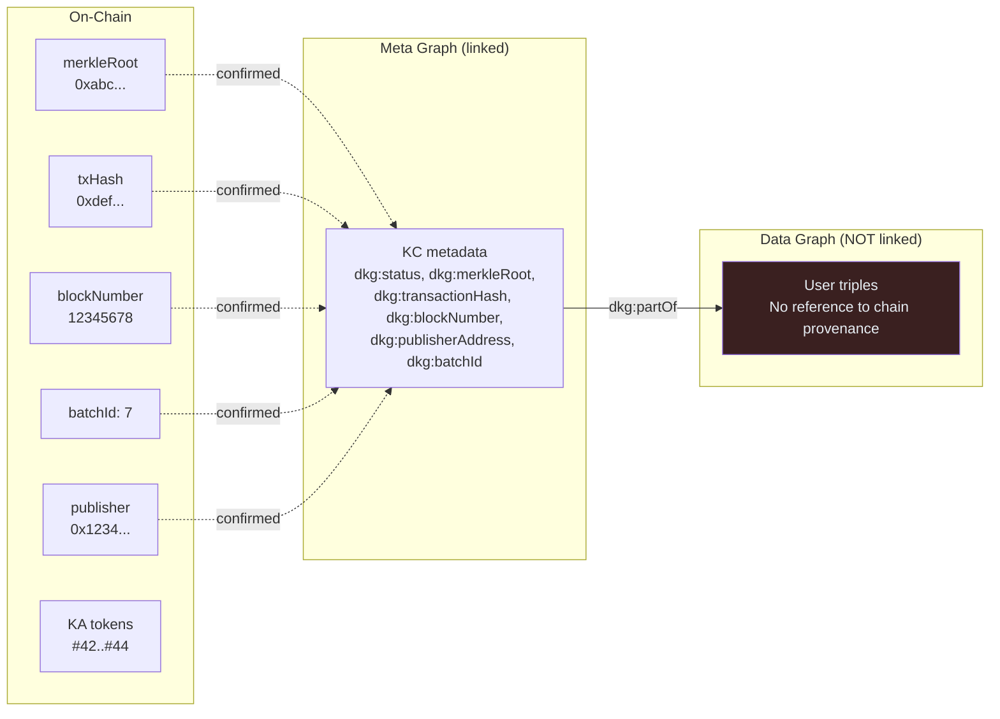

> **REVIEW: Data-to-chain linking gap.**
> User-facing data triples have NO direct link to their on-chain proof.
> To verify a triple's on-chain status, an app must:
> 1. Find the rootEntity of the triple
> 2. Look up the KA in the meta graph by rootEntity
> 3. Follow `dkg:partOf` to the KC
> 4. Read `dkg:transactionHash` from the KC
>
> This is workable but fragile. A convenience triple on each rootEntity
> pointing to its KA would simplify queries:
> ```turtle
> <rootEntity>  dkg:knowledgeAsset  <ual/tokenId> .
> ```

---

## 14. Protocol-Level Review & Improvements

### 14.1 Publish Flow

| # | Issue | Severity | Recommendation |
|---|-------|----------|----------------|
| P1 | Tentative data dropped after 60 min if chain is slow | Medium | Make timeout configurable; add re-request via sync protocol |
| P2 | No publish receipt/ACK from receivers | Low | Consider adding a lightweight gossip ACK for publisher visibility |
| P3 | Gossip publish can be replayed (no nonce/dedup) | Medium | Add `operationId` + dedup window to GossipSub handlers |
| P4 | `broadcastPublish` has a 5s timeout; large payloads may fail | Medium | Chunk large publish payloads or use direct protocol for big KCs |

### 14.2 Workspace

| # | Issue | Severity | Recommendation |
|---|-------|----------|----------------|
| W1 | `workspaceOwnedEntities` is in-memory only | High | Persist to workspace_meta; reconstruct on startup |
| W2 | No TTL on workspace data | Medium | Add configurable TTL; old workspace ops should be prunable |
| W3 | No workspace versioning | Low | Track version/revision per rootEntity for optimistic concurrency |

### 14.3 Consensus / Game

| # | Issue | Severity | Recommendation |
|---|-------|----------|----------------|
| C1 | Leader controls random seed — can manipulate game events | Medium | Use VRF seeded by collective randomness (hash of all votes) |
| C2 | No explicit rejection message for proposals | Medium | Add `turn:reject` message type with reason |
| C3 | `expedition:launched` game state is gossip-only | High | Write to workspace so late-joining nodes can catch up |
| C4 | Turn results don't include chain provenance | High | After publish, write txHash/ual/blockNumber to context graph |
| C5 | `resultMessage` not in RDF | Low | Add `ot:resultMessage` to `turnResolvedQuads` |
| C6 | No game event entities in RDF | Medium | Create first-class `ot:GameEvent` entities per turn |
| C7 | No resource deltas in RDF | Low | Add structured resource snapshots per turn |

### 14.4 GossipSub

| # | Issue | Severity | Recommendation |
|---|-------|----------|----------------|
| G1 | `offMessage` has a bug: returns early when handlers exist | Bug | Fix: `if (!handlers) return;` should be `if (handlers)` |
| G2 | All apps share single `app` topic per paranet | Medium | Add per-app subtopics: `dkg/paranet/{id}/app/{appId}` |
| G3 | No message signing/authentication on gossip level | Medium | GossipSub supports `strictNoSign: false` — enable message signing |
| G4 | Vote heartbeat creates O(n × 6) messages per turn | Low | Acceptable for 3-8 players; not scalable beyond ~20 |

### 14.5 Chain Integration

| # | Issue | Severity | Recommendation |
|---|-------|----------|----------------|
| CH1 | Chain poller interval (12s) may miss events on fast L2s | Low | Use WebSocket subscription instead of polling where available |
| CH2 | No retry on failed chain tx (publish, mint) | Medium | Add exponential backoff retry for chain transactions |
| CH3 | Paranet metadata reveal is a separate tx | Low | Consider batching with creation tx to save gas |

### 14.6 Storage

| # | Issue | Severity | Recommendation |
|---|-------|----------|----------------|
| S1 | Oxigraph doesn't support persistent WAL by default | Low | Ensure `oxigraph-persistent` backend is used in production |
| S2 | No compaction/garbage collection for dropped graphs | Low | Add periodic graph statistics and compaction |

### 14.7 Valuable Additions for Agents

Beyond fixing the gaps above, these additions to the knowledge graph would
significantly increase utility for AI agents:

1. **Consensus attestation triples** — Which specific nodes approved which turns,
   with their peerId and the proposal hash. Enables trust scoring and reputation.

2. **Publish provenance chain** — For each rootEntity, a provenance chain linking:
   `rootEntity → KA NFT → KC → txHash → blockNumber → publisher DID`.
   Currently requires 3 SPARQL joins; should be a direct property.

3. **Network topology hints** — Relay connections, direct connections, and peer
   latency metrics as RDF triples. Helps agents choose optimal peers.

4. **Workspace lineage** — Track which workspace entities were eventually
   enshrined (published) and link workspace operations to their resulting KCs.

5. **Game-specific: strategy patterns** — Aggregate voting patterns per player
   as RDF. Which players tend to vote "advance" vs "syncMemory"? This creates
   a behavioral knowledge graph that agents can use for strategy optimization.
