# DKG V9 Protocol Operations — Sequence Diagrams & Analysis

> End-to-end flows for every V9 protocol operation: publish (standard,
> workspace + enshrine, context graph), update, query, sync, gossip,
> and chain integration. Includes on-chain vs off-chain split and
> improvement notes.

---

## Table of Contents

1. [Node Boot Sequence](#1-node-boot-sequence)
2. [Publish Operation](#2-publish-operation)
   - 2.1 [Standard Publish Flow](#21-standard-publish-flow)
   - 2.2 [Workspace + Enshrine Flow](#22-workspace--enshrine-flow)
   - 2.3 [Context Graph Publish Flow](#23-context-graph-publish-flow)
   - 2.4 [Publish Flow Comparison](#24-publish-flow-comparison)
   - 2.5 [Signature Types](#25-signature-types)
3. [Chain Event Confirmation](#3-chain-event-confirmation)
4. [Update Operation](#4-update-operation)
5. [Query Operation](#5-query-operation)
6. [Peer Sync](#6-peer-sync)
7. [Paranet Discovery](#7-paranet-discovery)
8. [GossipSub Topic Architecture](#8-gossipsub-topic-architecture)
9. [Storage Model](#9-storage-model)
10. [Merkle Tree & Proof System](#10-merkle-tree--proof-system)
11. [On-Chain vs Off-Chain Data](#11-on-chain-vs-off-chain-data)
12. [Protocol-Level Review & Improvements](#12-protocol-level-review--improvements)
13. [Open Questions & Known Issues](#13-open-questions--known-issues)

---

## 1. Node Boot Sequence

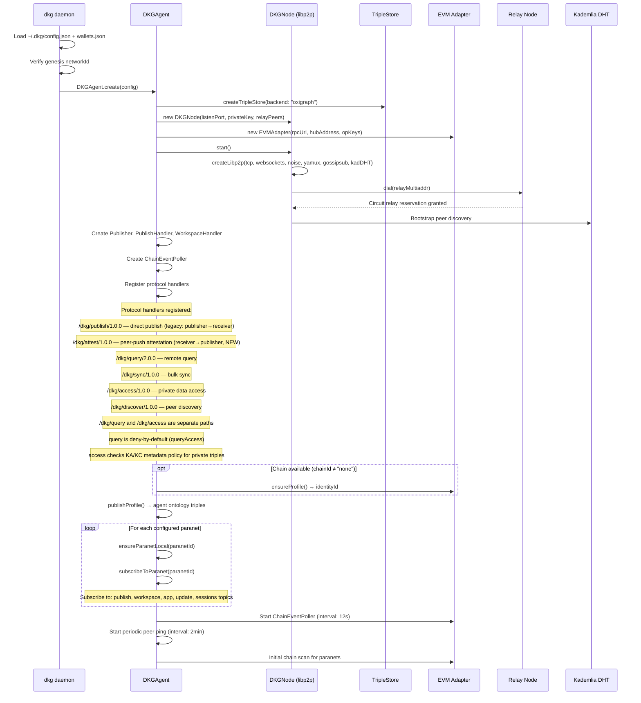

---

## 2. Publish Operation

### 2.1 Standard Publish Flow

The standard publish follows a **replicate-then-attest** protocol: data is
staged in the workspace, broadcast to peers via GossipSub, peers push
attestation signatures back to the publisher, and the publisher submits a
single on-chain transaction with the collected signatures.

**Key design decisions:**

- **Workspace as universal staging.** Data is stored in the workspace graph
  first. The data graph only contains chain-confirmed data.
- **GossipSub for dissemination, direct RPC for attestation.** The gossip
  message includes the publisher's `peerId` so that any peer in the mesh —
  including peers multiple relay hops away — can dial back directly.
- **Peer-push, not publisher-pull.** Peers self-select after receiving the
  gossip and push their signatures to the publisher. This decouples quorum
  collection from the publisher's local peer table.

```mermaid
sequenceDiagram
    participant App as Application
    participant Agent as DKGAgent
    participant Pub as DKGPublisher
    participant Store as TripleStore
    participant Chain as EVM Adapter
    participant GS as GossipSub
    participant Peers as Receiver Nodes

    App->>Agent: publish(paranetId, quads, privateQuads?)
    Agent->>Pub: publish(options)

    rect rgb(240, 240, 255)
        Note over Pub,Store: Phases 1–3 are LOCAL to the publishing node

        Note over Pub: Phase 1 — Prepare + validate

        Pub->>Pub: ensureParanet(paranetId)
        Pub->>Pub: autoPartition(quads) → group by rootEntity
        Pub->>Pub: Build manifest + KA metadata
        Pub->>Pub: validatePublishRequest(quads, manifest, paranetId)
        Note over Pub: Rules 1–5: graph URI, subjects, manifest, exclusivity, no blank nodes

        Note over Pub: Phase 2 — Compute Merkle roots

        opt privateQuads present
            Pub->>Pub: computePrivateRoot(private quads)
            Pub->>Pub: Add synthetic private Merkle root hash to leaf set
        end
        Pub->>Pub: Compute kcMerkleRoot (flat tree over all public triple hashes)
        Pub->>Pub: Compute publicByteSize (canonical N-Triples encoding)

        Note over Pub,Store: Phase 3 — Store in workspace (local staging)

        Pub->>Store: insert(quads → workspace graph)
        Pub->>Store: insert(workspace metadata → workspace_meta graph)
        opt Private quads provided
            Pub->>Store: storePrivateTriples(paranetId, rootEntity, privateQuads)
        end
    end

    Note over Agent,Peers: Phase 4 — Broadcast via GossipSub (dissemination)

    Pub-->>Agent: preBroadcast(preparedPublish)
    Agent->>GS: publish(paranetPublishTopic, PublishRequest)
    Note over GS: Message contains: type=PUBLISH,<br/>nquads, paranetId, manifest, kcMerkleRoot,<br/>publisherPeerId (return address), operationId,<br/>deadline, publicByteSize<br/>NO txHash, NO blockNumber (not yet on-chain)
    GS-->>Peers: PublishRequest (relayed through mesh)

    rect rgb(232, 245, 233)
        Note over Agent,Peers: Phase 5 — Peer-push attestation (Direct RPC)

        Note over Peers: Each peer that receives the gossip (any hop distance):
        Peers->>Peers: Validate + store in workspace graph
        Peers->>Peers: Recompute kcMerkleRoot from stored quads
        Peers->>Peers: Verify kcMerkleRoot and publicByteSize match
        Peers->>Peers: Sign keccak256(kcMerkleRoot, publicByteSize)
        Peers->>Agent: Dial publisher's peerId via /dkg/attest/1.0.0
        Note over Peers,Agent: Send: {operationId, identityId, signatureR, signatureVs}

        Note over Agent: Publisher collects incoming attestations:
        Agent->>Agent: Deduplicate by identityId
        Agent->>Agent: Accumulate until quorum reached or deadline expires
        Note over Agent: First N valid unique signatures win
    end

    rect rgb(232, 245, 233)
        Note over Pub,Chain: Phase 6 — Submit on-chain publish

        Pub->>Pub: Sign publisher commitment: keccak256(identityId, kcMerkleRoot)
        Pub->>Chain: publishKnowledgeAssets({kaCount, kcMerkleRoot, publicByteSize,<br/>tokenAmount, publisherSignature, receiverSignatures[]})
        Note over Chain: Contract verifies publisher + receiver signatures
        Note over Chain: Contract checks minimumRequiredSignatures threshold
        Chain-->>Pub: OnChainPublishResult {txHash, batchId, blockNumber, startKAId, endKAId}
        Note over Chain: Emits: UALRangeReserved, KnowledgeBatchCreated
    end

    Note over Pub,Store: Phase 7 — Promote workspace → data graph

    Pub->>Store: Copy quads: workspace graph → data graph
    Pub->>Store: Delete quads from workspace graph
    Pub->>Pub: generateConfirmedFullMetadata(ual, kcMerkleRoot, txHash, batchId, ...)
    Pub->>Store: insert(confirmed metadata → meta graph)
    Pub->>Pub: Track ownedEntities + batch→paranet binding

    Note over Agent,GS: Phase 8 — Post-broadcast with chain proof

    Pub-->>Agent: PublishResult {kcId, ual, kcMerkleRoot, status: confirmed}
    Agent->>GS: publish(paranetPublishTopic, ConfirmedPublishProof)
    Note over GS: Message contains: type=CONFIRMED, txHash, blockNumber,<br/>startKAId, endKAId, publisherAddress

    Agent-->>App: PublishResult

    rect rgb(240, 248, 255)
        Note over Peers,Chain: Phase 9 — Receiver-side finalization (two independent mechanisms)

        Note over Peers: Dedup gate (both mechanisms)
        Peers->>Store: ASK { <ual> dkg:status "confirmed" } in meta graph
        alt Already confirmed
            Peers->>Peers: Skip — already finalized (dedup by UAL)
        end

        Note over Peers,Chain: Mechanism A — Publisher gossip (fast path)
        Peers->>Peers: Receive confirmed PublishRequest from Phase 8
        Peers->>Chain: Verify KnowledgeBatchCreated event at specified blockNumber
        Note over Peers,Chain: Must match ALL of: txHash, kcMerkleRoot,<br/>publisherAddress, startKAId..endKAId
        Peers->>Peers: Recompute kcMerkleRoot from workspace quads
        Peers->>Peers: Verify computed root matches on-chain event root
        Peers->>Store: Copy quads: workspace graph → data graph
        Peers->>Store: Delete quads from workspace graph
        Peers->>Store: insert(confirmed metadata + chain provenance → meta graph)

        Note over Peers,Chain: Mechanism B — ChainEventPoller (independent, parallel)
        Peers->>Chain: Poll for KnowledgeBatchCreated events (every 12s)
        Peers->>Peers: Match event kcMerkleRoot against workspace data
        Peers->>Peers: Recompute kcMerkleRoot from workspace quads, verify match
        alt Workspace data found and not yet promoted (UAL not confirmed)
            Peers->>Store: Copy quads: workspace graph → data graph
            Peers->>Store: Delete quads from workspace graph
            Peers->>Store: insert(confirmed metadata + chain provenance → meta graph)
        end

        Note over Peers: Whichever mechanism fires first wins.<br/>The second is a no-op (dedup by UAL, not kcMerkleRoot).<br/>If neither fires within TTL, workspace data expires.
    end
```

> **Design decision: PublishResult returned before peer finalization.**
> The publisher returns `PublishResult` to the application as soon as the
> on-chain transaction confirms (Phase 6–7). It does NOT wait for peers to
> finalize. This is intentional: the chain confirmation is the source of truth.
> Peer finalization is an eventually-consistent replication step — peers will
> catch up via either mechanism (gossip or chain polling). The publisher has no
> way to know when all peers have finalized, and waiting would add unbounded
> latency for no additional guarantee.

### 2.2 Workspace + Enshrine Flow

This is the same protocol as standard publish, but split into two user-controlled
phases: **stage now, publish later.** The workspace is used for collaborative
drafting — data may be revised, discussed, or accumulated over hours or days
before committing on-chain.

`publish()` is syntactic sugar for `writeToWorkspace()` + immediate
`enshrineFromWorkspace()`. The underlying protocol is identical.

```mermaid
sequenceDiagram
    participant App as Application
    participant Agent as DKGAgent
    participant Pub as DKGPublisher
    participant Store as TripleStore
    participant GS as GossipSub
    participant Peers as Receiver Nodes
    participant Chain as EVM Adapter

    Note over App,Peers: Step A — Write to workspace (can happen many times)

    App->>Agent: writeToWorkspace(paranetId, quads)
    Agent->>Pub: writeToWorkspace(paranetId, quads)

    rect rgb(240, 240, 255)
        Note over Pub,Store: LOCAL: validate + store in workspace
        Pub->>Pub: autoPartition(quads) → group by rootEntity
        Pub->>Pub: Build manifest + KA metadata
        Pub->>Pub: validatePublishRequest(quads, manifest, paranetId)
        Note over Pub: Rules 1–5: graph URI, subjects, manifest, exclusivity, no blank nodes
        Pub->>Store: insert(quads → workspace graph)
        Pub->>Store: insert(workspace metadata → workspace_meta graph)
    end

    Agent->>GS: publish(paranetWorkspaceTopic, WorkspacePublishRequest)
    GS-->>Peers: WorkspacePublishRequest
    Peers->>Peers: Validate + store in workspace graph

    Note over App,Chain: Time passes — hours, days, revisions...

    Note over App,Peers: Step B — Enshrine from workspace (triggers publish flow)

    App->>Agent: enshrineFromWorkspace(paranetId, selection)
    Agent->>Pub: enshrineFromWorkspace(paranetId, selection)

    rect rgb(240, 240, 255)
        Note over Pub,Store: Phase 1–3 — Read staged data + compute Merkle root

        Pub->>Store: CONSTRUCT quads from workspace graph (by selection)

        opt privateQuads present in workspace
            Pub->>Pub: computePrivateRoot(private quads)
            Pub->>Pub: Add synthetic private root hash to leaf set
        end
        Pub->>Pub: Compute kcMerkleRoot (flat tree over all public triple hashes)
        Pub->>Pub: Compute publicByteSize (canonical N-Triples encoding)
    end

    Note over Agent,Peers: Phase 4 — No data broadcast needed (peers already have workspace data)

    rect rgb(232, 245, 233)
        Note over Agent,Peers: Phase 5 — Peer-push attestation (Direct RPC)

        Pub-->>Agent: preBroadcast(preparedPublish)
        Agent->>GS: publish(paranetPublishTopic, EnshrineRequest with publisherPeerId)
        Note over GS: Message contains: type=ENSHRINE, kcMerkleRoot, publicByteSize,<br/>publisherPeerId (return address), operationId, deadline<br/>NO nquads (peers already have workspace data)

        Note over Peers: Each peer that received workspace data:
        Peers->>Peers: Recompute kcMerkleRoot from workspace quads
        Peers->>Peers: Verify kcMerkleRoot and publicByteSize match
        Peers->>Peers: Sign keccak256(kcMerkleRoot, publicByteSize)
        Peers->>Agent: Dial publisher's peerId via /dkg/attest/1.0.0
        Note over Peers,Agent: Send: {operationId, identityId, signatureR, signatureVs}

        Note over Agent: Publisher collects incoming attestations:
        Agent->>Agent: Deduplicate by identityId
        Agent->>Agent: Accumulate until quorum reached or deadline expires
        Note over Agent: First N valid unique signatures win
    end

    rect rgb(232, 245, 233)
        Note over Pub,Chain: Phase 6 — Submit on-chain publish

        Pub->>Pub: Sign publisher commitment: keccak256(identityId, kcMerkleRoot)
        Pub->>Chain: publishKnowledgeAssets({kaCount, kcMerkleRoot, publicByteSize,<br/>tokenAmount, publisherSignature, receiverSignatures[]})
        Note over Chain: Contract verifies publisher + receiver signatures
        Note over Chain: Contract checks minimumRequiredSignatures threshold
        Chain-->>Pub: OnChainPublishResult {txHash, batchId, blockNumber, startKAId, endKAId}
        Note over Chain: Emits: UALRangeReserved, KnowledgeBatchCreated
    end

    Note over Pub,Store: Phase 7 — Promote workspace → data graph (publisher side)

    Pub->>Store: Copy quads: workspace graph → data graph
    Pub->>Store: Delete quads from workspace graph
    Pub->>Pub: generateConfirmedFullMetadata(ual, kcMerkleRoot, txHash, batchId, ...)
    Pub->>Store: insert(confirmed metadata + chain provenance → meta graph)
    Pub->>Pub: Track ownedEntities + batch→paranet binding

    Note over Agent,GS: Phase 8 — Post-broadcast with chain proof

    Pub-->>Agent: PublishResult {kcId, ual, kcMerkleRoot, status: confirmed}
    Agent->>GS: publish(paranetPublishTopic, ConfirmedPublishProof)
    Note over GS: Message contains: type=CONFIRMED, txHash, blockNumber,<br/>startKAId, endKAId, publisherAddress

    Agent-->>App: PublishResult {kcId, ual, kcMerkleRoot, status: confirmed}

    rect rgb(240, 248, 255)
        Note over Peers,Chain: Phase 9 — Receiver-side finalization (two independent mechanisms)

        Note over Peers: Dedup gate (both mechanisms)
        Peers->>Store: ASK { <ual> dkg:status "confirmed" } in meta graph
        alt Already confirmed
            Peers->>Peers: Skip — already finalized (dedup by UAL)
        end

        Note over Peers,Chain: Mechanism A — Publisher gossip (fast path)
        Peers->>Peers: Receive confirmed PublishRequest from Phase 8
        Peers->>Chain: Verify KnowledgeBatchCreated event at specified blockNumber
        Note over Peers,Chain: Must match ALL of: txHash, kcMerkleRoot,<br/>publisherAddress, startKAId..endKAId
        Peers->>Peers: Recompute kcMerkleRoot from workspace quads
        Peers->>Peers: Verify computed root matches on-chain event root
        Peers->>Store: Copy quads: workspace graph → data graph
        Peers->>Store: Delete quads from workspace graph
        Peers->>Store: insert(confirmed metadata + chain provenance → meta graph)

        Note over Peers,Chain: Mechanism B — ChainEventPoller (independent, parallel)
        Peers->>Chain: Poll for KnowledgeBatchCreated events (every 12s)
        Peers->>Peers: Match event kcMerkleRoot against workspace data
        Peers->>Peers: Recompute kcMerkleRoot from workspace quads, verify match
        alt Workspace data found and not yet promoted (UAL not confirmed)
            Peers->>Store: Copy quads: workspace graph → data graph
            Peers->>Store: Delete quads from workspace graph
            Peers->>Store: insert(confirmed metadata + chain provenance → meta graph)
        end

        Note over Peers: Whichever mechanism fires first wins.<br/>The second is a no-op (dedup by UAL, not kcMerkleRoot).<br/>If neither fires within TTL, workspace data expires.
    end
```

**Key differences from standard publish:**

| Aspect | Standard publish | Workspace + enshrine |
|--------|-----------------|---------------------|
| **Data already gossip-replicated?** | No — pre-broadcast needed in Phase 4 | Yes — workspace gossip happened during writeToWorkspace |
| **Timing** | Immediate — one API call | Deferred — two API calls, arbitrary time gap |
| **Revisions** | Not possible — data is committed | Workspace supports upsert before enshrine |
| **Attestation trigger** | Gossip message with publisherPeerId | Same mechanism — peers verify workspace data |

### 2.3 Context Graph Publish Flow

A context graph is a **curated, governance-gated subgraph** within a paranet.
M-of-N registered participants must sign before data can be published to it.
The publish is **atomic** — a single on-chain transaction handles both the base
publish (receiver signatures) and the context graph registration (participant
signatures). If either set of signatures is insufficient, nothing is published.

**Key concepts:**

- A context graph is **scoped to a paranet** via URI convention:
  `did:dkg:paranet:{paranetId}/context/{contextGraphId}`
- Participants are registered on-chain at context graph creation with an M-of-N
  threshold. The protocol's `minimumRequiredSignatures` does NOT apply — each
  context graph defines its own requirements.
- Data is gossip-replicated to **paranet peers only** (for availability), but
  only lands in the context graph URI after the atomic chain tx succeeds.
- **Context graph participants are a governance role**, not a storage role. They
  may or may not be paranet peers. Participants who are also paranet peers
  receive data via gossip; participants who are not (e.g., edge nodes) only
  participate in the signing step through the application coordination mechanism.
- **Receiver signatures** (replication proof) and **participant signatures**
  (governance consent) are collected in parallel before the chain tx.

```mermaid
sequenceDiagram
    participant App as Application / Game Coordinator
    participant Agent as DKGAgent
    participant Pub as DKGPublisher
    participant Store as TripleStore
    participant GS as GossipSub
    participant ParaPeers as Paranet Peers
    participant CGPeers as Context Graph Participants
    participant Chain as EVM Adapter

    Note over App,Chain: Prerequisites: context graph already created on-chain<br/>with participantAgents[] (Ethereum addresses) and requiredSignatures (M of N)

    App->>Agent: publish(paranetId, quads, {contextGraphId})
    Agent->>Pub: publish(paranetId, quads, {contextGraphId})

    rect rgb(240, 240, 255)
        Note over Pub,Store: Phases 1–3 are LOCAL to the publishing node

        Note over Pub: Phase 1 — Prepare + validate

        Pub->>Pub: ensureParanet(paranetId)
        Pub->>Pub: autoPartition(quads) → group by rootEntity
        Pub->>Pub: Build manifest + KA metadata
        Pub->>Pub: validatePublishRequest(quads, manifest, paranetId)
        Note over Pub: Rules 1–5: graph URI, subjects, manifest, exclusivity, no blank nodes

        Note over Pub: Phase 2 — Compute Merkle roots

        opt privateQuads present
            Pub->>Pub: computePrivateRoot(private quads)
            Pub->>Pub: Add synthetic private root hash to leaf set
        end
        Pub->>Pub: Compute kcMerkleRoot (flat tree over all public triple hashes)
        Pub->>Pub: Compute publicByteSize (canonical N-Triples encoding)

        Note over Pub,Store: Phase 3 — Store in workspace (local staging)

        Pub->>Store: insert(quads → workspace graph)
        Pub->>Store: insert(workspace metadata → workspace_meta graph)
    end

    Note over Agent,ParaPeers: Phase 4 — Broadcast via GossipSub (to all paranet peers)

    Pub-->>Agent: preBroadcast(preparedPublish)
    Agent->>GS: publish(paranetPublishTopic, PublishRequest)
    Note over GS: Message contains: type=PUBLISH,<br/>nquads, paranetId, manifest, kcMerkleRoot,<br/>publisherPeerId (return address), operationId,<br/>deadline, publicByteSize, contextGraphId
    GS-->>ParaPeers: PublishRequest (relayed through mesh)
    ParaPeers->>ParaPeers: Validate + store in workspace graph
    Note over CGPeers: Participants are a governance role, not a storage role.<br/>They may or may not be paranet peers.<br/>If they are paranet peers, they receive data via gossip.<br/>If not, they only verify and sign via the app coordination<br/>mechanism in Phase 5b — they do NOT store the data.

    rect rgb(232, 245, 233)
        Note over Agent,ParaPeers: Phase 5a — Collect receiver attestations (from any paranet peer)

        Note over ParaPeers: Each peer that receives the gossip (any hop distance):
        ParaPeers->>ParaPeers: Recompute kcMerkleRoot from stored quads
        ParaPeers->>ParaPeers: Verify kcMerkleRoot and publicByteSize match
        ParaPeers->>ParaPeers: Sign keccak256(kcMerkleRoot, publicByteSize)
        ParaPeers->>Agent: Dial publisher's peerId via /dkg/attest/1.0.0
        Note over ParaPeers,Agent: Send: {operationId, agentAddress, signatureR, signatureVs}

        Note over Agent: Publisher collects incoming attestations:
        Agent->>Agent: Deduplicate by agentAddress
        Agent->>Agent: Accumulate until quorum reached or deadline expires
    end

    rect rgb(255, 243, 224)
        Note over App,CGPeers: Phase 5b — Collect participant signatures (governance)

        Note over App: ⚠ OPEN QUESTION (OQ-21): Who collects participant signatures?<br/>Current diagram shows the App collecting and passing to Agent.<br/>Alternative: Agent collects internally via callback or protocol.<br/>See Open Questions section.

        Note over App: Application-defined coordination mechanism<br/>(e.g., game turn proposal/approval, voting protocol, manual review)
        Note over CGPeers: Participants verify the proposed data via the app mechanism.<br/>If they are also paranet peers, they may verify against their workspace.<br/>If not, the app provides the data or a summary for review.

        CGPeers->>CGPeers: Verify data matches proposal
        CGPeers->>CGPeers: Sign keccak256(contextGraphId, kcMerkleRoot)
        CGPeers-->>App: Participant signature {agentAddress, r, vs}

        App->>App: Collect M-of-N participant signatures
        App->>Agent: Pass participantSignatures[] to Agent
        Note over App: If < M participants sign → publish fails entirely<br/>(no orphaned data in paranet)
    end

    rect rgb(232, 245, 233)
        Note over Pub,Chain: Phase 6 — Atomic on-chain publish

        Pub->>Pub: Sign publisher commitment: keccak256(identityId, kcMerkleRoot)
        Pub->>Chain: publishToContextGraph({<br/>  kaCount, kcMerkleRoot, publicByteSize, tokenAmount,<br/>  publisherSignature,<br/>  receiverSignatures[],<br/>  contextGraphId, participantSignatures[]<br/>})
        Note over Chain: Contract verifies ALL signatures atomically:<br/>• Publisher commitment<br/>• Receiver attestations (≥ minimumRequired)<br/>• Participant governance (≥ context graph M-of-N)
        Chain-->>Pub: {txHash, batchId, blockNumber, startKAId, endKAId, contextGraphExpanded}
        Note over Chain: Emits: KnowledgeBatchCreated + ContextGraphExpanded
    end

    Note over Pub,Store: Phase 7 — Promote workspace → context graph (publisher side)
    Note over Pub,Store: ⚠ OPEN QUESTION (OQ-22): Should data also live in the<br/>paranet data graph, or ONLY in the context graph URI?

    Pub->>Store: Copy quads: workspace → context graph data URI
    Pub->>Store: Delete quads from workspace graph
    Pub->>Pub: generateConfirmedFullMetadata(ual, kcMerkleRoot, txHash, batchId, ...)
    Pub->>Store: insert(confirmed metadata + chain provenance → context graph meta URI)
    Pub->>Pub: Track ownedEntities + batch→paranet binding
    Note over Store: Data lives at did:dkg:paranet:{id}/context/{ctxId}<br/>NOT in the paranet data graph

    Note over Agent,GS: Phase 8 — Post-broadcast with chain proof

    Pub-->>Agent: PublishResult {kcId, ual, kcMerkleRoot, status: confirmed, contextGraphId}
    Agent->>GS: publish(paranetPublishTopic, ConfirmedPublishProof)
    Note over GS: Message contains: type=CONFIRMED, txHash, blockNumber,<br/>startKAId, endKAId, publisherAddress, contextGraphId

    Agent-->>App: PublishResult {kcId, ual, kcMerkleRoot, status: confirmed, contextGraphId}

    rect rgb(240, 248, 255)
        Note over ParaPeers,Chain: Phase 9 — Receiver-side finalization (two independent mechanisms)

        Note over ParaPeers: Dedup gate (both mechanisms)
        ParaPeers->>Store: ASK { <ual> dkg:status "confirmed" } in context graph meta
        alt Already confirmed
            ParaPeers->>ParaPeers: Skip — already finalized (dedup by UAL)
        end

        Note over ParaPeers,Chain: Mechanism A — Publisher gossip (fast path)
        ParaPeers->>ParaPeers: Receive confirmed PublishRequest from Phase 8
        ParaPeers->>Chain: Verify KnowledgeBatchCreated event at specified blockNumber
        Note over ParaPeers,Chain: Must match ALL of: txHash, kcMerkleRoot,<br/>publisherAddress, startKAId..endKAId
        ParaPeers->>Chain: Verify ContextGraphExpanded event (contextGraphId, batchId)
        ParaPeers->>ParaPeers: Recompute kcMerkleRoot from workspace quads
        ParaPeers->>ParaPeers: Verify computed root matches on-chain event root
        ParaPeers->>Store: Copy quads: workspace → context graph data URI
        ParaPeers->>Store: Delete quads from workspace graph
        ParaPeers->>Store: insert(confirmed metadata + chain provenance → context graph meta)

        Note over ParaPeers,Chain: Mechanism B — ChainEventPoller (independent, parallel)
        ParaPeers->>Chain: Poll for KnowledgeBatchCreated events (every 12s)
        ParaPeers->>ParaPeers: Match event kcMerkleRoot against workspace data
        ParaPeers->>ParaPeers: Recompute kcMerkleRoot from workspace quads, verify match
        ParaPeers->>Chain: Verify ContextGraphExpanded event for this batchId
        alt Workspace data found and not yet promoted (UAL not confirmed)
            ParaPeers->>Store: Copy quads: workspace → context graph data URI
            ParaPeers->>Store: Delete quads from workspace graph
            ParaPeers->>Store: insert(confirmed metadata + chain provenance → context graph meta)
        end

        Note over ParaPeers: Whichever mechanism fires first wins.<br/>The second is a no-op (dedup by UAL, not kcMerkleRoot).<br/>If neither fires within TTL, workspace data expires.
    end
```

#### How participant signature collection works

For **receiver signatures**, the protocol handles the full coordination:
gossip disseminates data, peers verify and sign, peers dial back via
`/dkg/attest/1.0.0`. No application involvement needed.

For **participant signatures**, the coordination mechanism is an open design
question (see OQ-21). Participants who are also paranet peers receive data
via gossip and can sign through the protocol. Participants who are not
paranet peers need an application-level mechanism to learn about the proposal.
Examples of how applications might coordinate participant signing:

| Application | Coordination mechanism | Timing |
|-------------|----------------------|--------|
| **Game (turn resolution)** | Leader broadcasts `turn:proposal` via app topic; peers respond with `turn:approve` + signature | During turn resolution, before enshrine |
| **Manual curation** | Dashboard shows pending proposals; curators sign via UI | Asynchronous, human-in-the-loop |
| **Automated pipeline** | Service monitors workspace writes; auto-signs if validation passes | Event-driven, immediate |

The protocol requires: M-of-N valid signatures over `keccak256(contextGraphId, kcMerkleRoot)`,
collected before the chain tx.

#### What if participant signatures are insufficient?

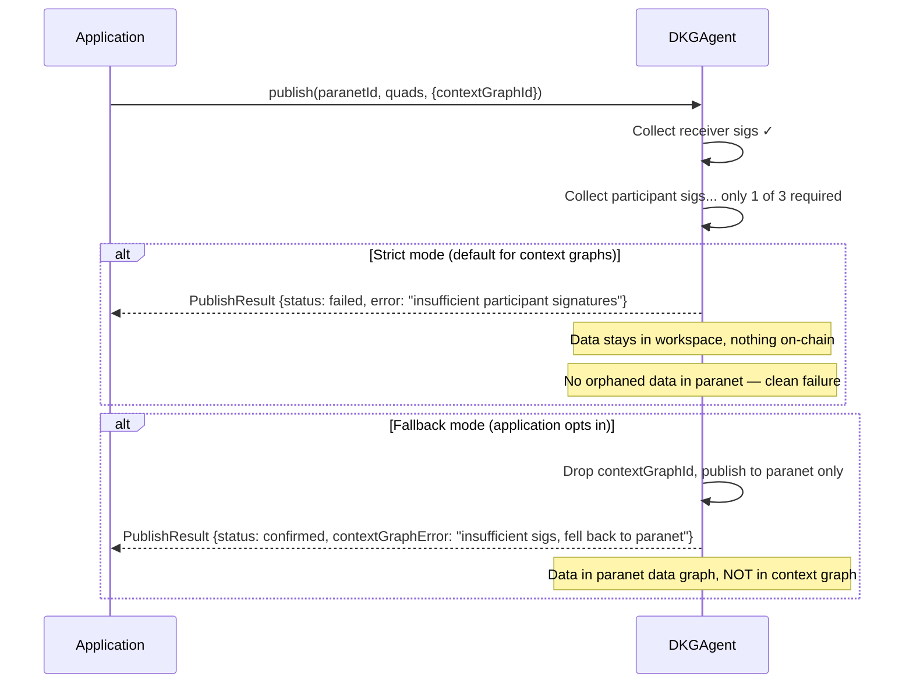

### 2.4 Publish Flow Comparison

| | Standard publish | Workspace + enshrine | Context graph publish |
|---|---|---|---|
| **Target** | Paranet data graph | Paranet data graph | Context graph (within paranet) |
| **Staging** | Workspace (automatic) | Workspace (manual write) | Workspace (automatic or manual) |
| **Receiver sigs** | Required (peer-push) | Required (peer-push) | Required (peer-push) |
| **Participant sigs** | Not needed | Not needed | Required (M-of-N, app-defined collection) |
| **Chain tx** | `publishKnowledgeAssets` | `publishKnowledgeAssets` | `publishToContextGraph` (atomic) |
| **Failure behavior** | Rollback workspace | Rollback workspace | Strict: fail entirely / Fallback: paranet-only |
| **Data lands in** | `did:dkg:paranet:{id}` | `did:dkg:paranet:{id}` | `did:dkg:paranet:{id}/context/{ctxId}` |

### 2.5 Signature Types

| Signature type | Purpose | Signed over | Collected from |
|---|---|---|---|
| **Publisher signature** | Publisher commits to the batch | `keccak256(identityId, kcMerkleRoot)` | Publisher's own operational key |
| **Receiver signatures** | Peers attest data replication | `keccak256(kcMerkleRoot, publicByteSize)` | Any paranet peer (peer-push after gossip) |
| **Participant signatures** | Governance consent for context graph | `keccak256(contextGraphId, kcMerkleRoot)` | Registered context graph participants only |

Receiver signatures prove replication. Participant signatures prove governance consent.
They serve different trust models, are collected through different mechanisms, and are
verified by different on-chain logic.

---

## 3. Chain Event Confirmation

Receiver nodes use two **independent, parallel mechanisms** to confirm that a
publish has landed on-chain and trigger workspace → data graph promotion:

1. **Publisher gossip (Phase 8/9):** The publisher broadcasts chain proof via
   GossipSub after the on-chain tx confirms. Peers verify on-chain and promote.
2. **ChainEventPoller:** Each node independently polls the chain for
   `KnowledgeBatchCreated` events and matches them against workspace data.

Neither mechanism is primary or fallback — they run in parallel and whichever
fires first wins. The second is a no-op (dedup by UAL). This gives the network
two independent paths to finalization: one peer-to-peer, one chain-direct.

Both paths dedup by **UAL** (not by kcMerkleRoot) — checking whether
`<ual> dkg:status "confirmed"` already exists in the meta graph. This is
critical because two different publishes can have the same kcMerkleRoot
(identical data) but different UALs; deduping by root would incorrectly
skip the second publish.

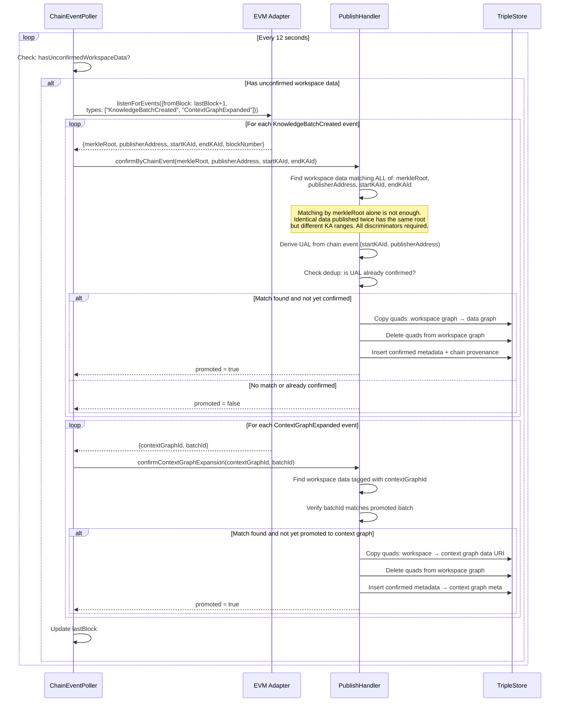

> **Workspace data expiry:** Workspace data that is never confirmed on-chain
> expires after a configurable timeout. This is safe — TRAC was never locked,
> so no economic harm. The publisher can retry with a new publish cycle.

### Chain Events Emitted

| Event | Source Contract | Fields | Purpose |
|-------|---------------|--------|---------|
| `KnowledgeBatchCreated` | KnowledgeAssetsStorage | batchId, publisher, merkleRoot, startKAId, endKAId, txHash | Confirm published data, trigger workspace → data graph promotion |
| `UALRangeReserved` | KnowledgeAssetsStorage | publisher, startId, endId | UAL allocation |
| `ParanetCreated` | ParanetV9Registry | paranetId, creator, accessPolicy | Discover new paranets |
| `KnowledgeBatchUpdated` | KnowledgeAssetsStorage | batchId, newMerkleRoot | Confirm data updates |
| `ContextGraphCreated` | ContextGraphStorage | contextGraphId, manager, participantAgents (address[]), M | Context graph creation |
| `ContextGraphExpanded` | ContextGraphStorage | contextGraphId, batchId | Context graph data addition |


---

## 4. Update Operation

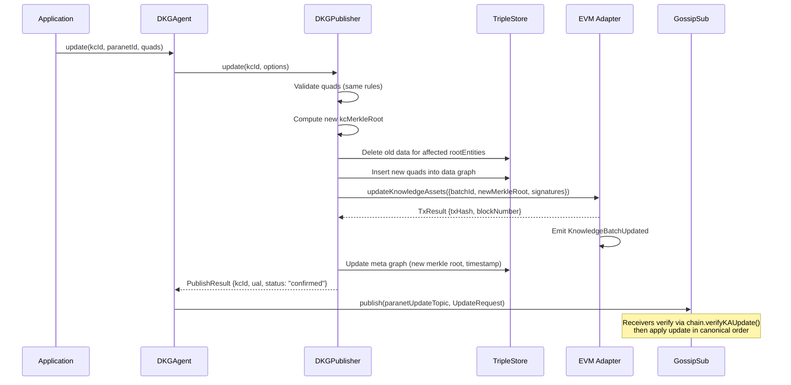

> **REVIEW: Update ordering.**
> Updates are applied in canonical `(blockNumber, txIndex)` order. This is
> correct for consistency, but there's no mechanism for conflict resolution
> if two publishers update overlapping entities in the same block. The first
> tx wins (by txIndex), but the second publisher gets no notification of
> the conflict.

---

## 5. Query Operation

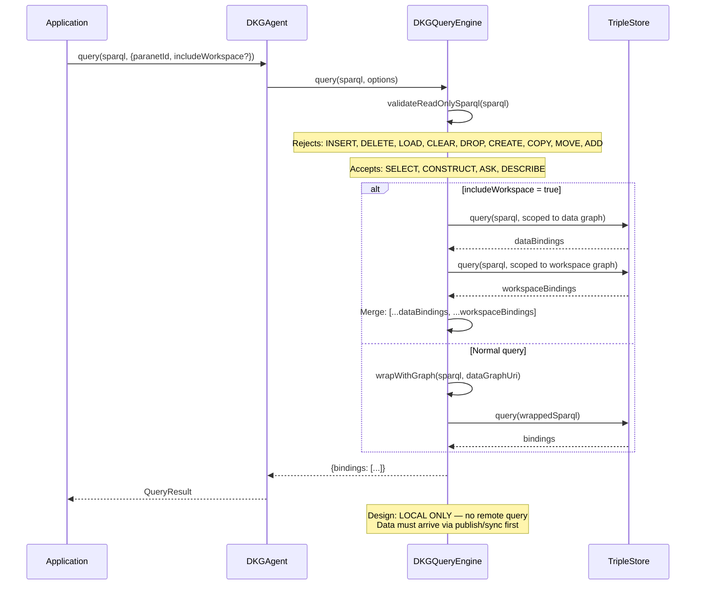

### Query Access Policy

```typescript
interface ParanetQueryPolicy {
  policy: 'deny' | 'public' | 'allowList';
  allowedPeers?: string[];
  allowedLookupTypes?: LookupType[];
  sparqlEnabled?: boolean;
  sparqlTimeout?: number;
  sparqlMaxResults?: number;
}
```

> **REVIEW: Query isolation.**
> The query engine is intentionally local-only (Spec §1.6 Store Isolation).
> This means a node can only query data it has received via publish/sync.
> **Implication for apps:** If an app needs data from a paranet it hasn't
> synced, it must first sync from a peer. There's no query federation.
> This is a conscious design choice for privacy/security, but may frustrate
> app developers expecting a "world computer" model.

### Private Access (cross-agent)

Private triple retrieval uses a separate protocol and policy path from remote query.

- **Protocol:** `/dkg/access/1.0.0` — requester sends KA UAL + signature; provider
  returns private N-Quads if access is granted.
- **Handler:** `AccessHandler` checks KA/KC metadata (`dkg:accessPolicy`,
  `dkg:publisherPeerId`, `dkg:allowedPeer`) before returning private triples.
- **Client:** `AccessClient` verifies returned triples against `privateMerkleRoot`
  when available.

Effective policy rules:

- `ownerOnly` -> only publisher peer may access.
- `allowList` -> only peers listed by KC metadata `dkg:allowedPeer` may access.
- `allowList` with missing or empty `dkg:allowedPeer` entries -> access denied.
- `public` -> any peer may request private triples for that KA.

> **Security note:** `/dkg/query/2.0.0` and `/dkg/access/1.0.0` are independent.
> A denied remote query does not imply denied private access. Access behavior is
> controlled by KC/KA access metadata.

---

## 6. Peer Sync

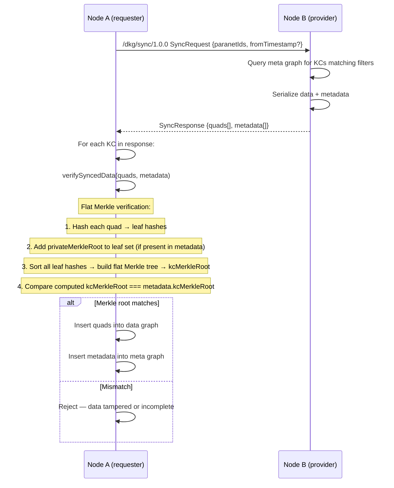

### Workspace Sync

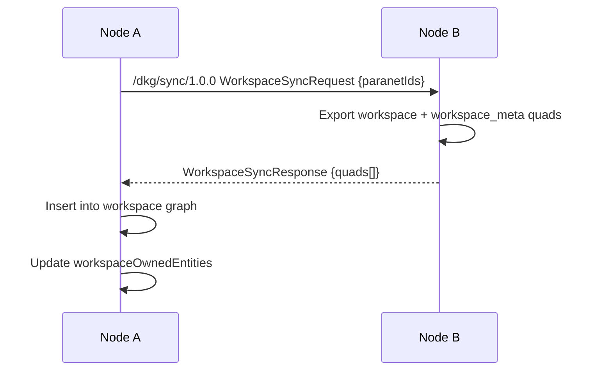

> **REVIEW: Sync completeness.**
> Workspace sync does NOT include the `workspaceOwnedEntities` map.
> A synced node cannot enforce creator-only upsert for workspace entities
> it received via sync. This is a known limitation.

---

## 7. Paranet Discovery

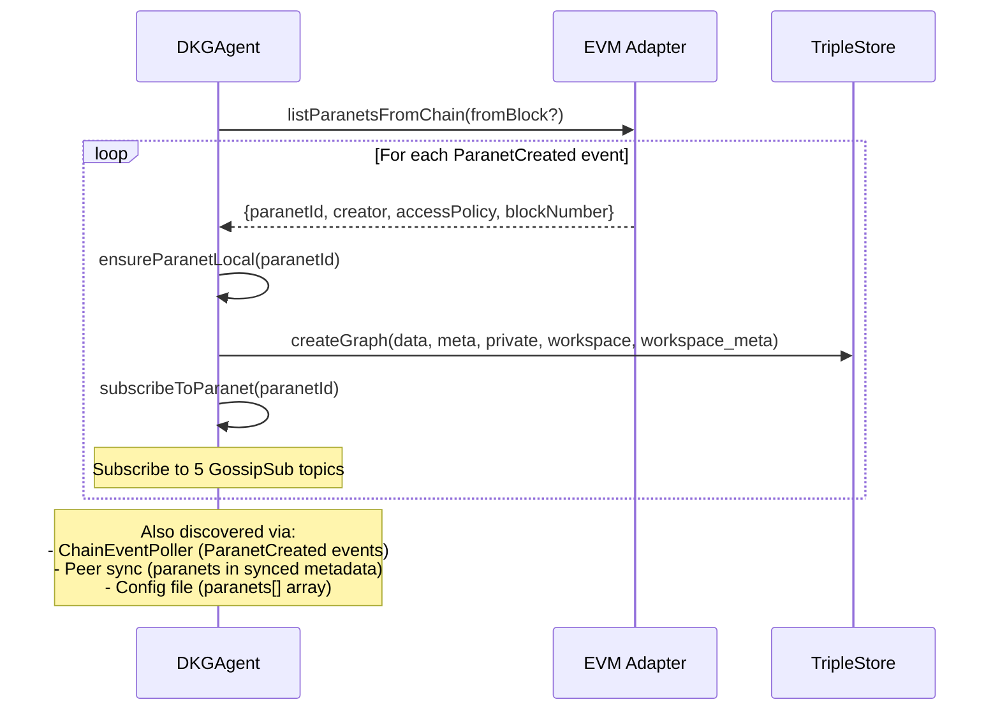

---

## 8. GossipSub Topic Architecture

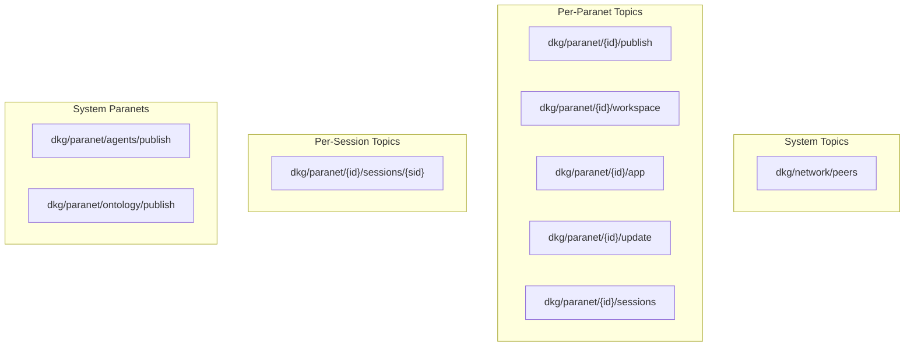

| Topic | Purpose | Message Types |
|-------|---------|---------------|
| `dkg/network/peers` | Peer discovery & health | Peer announce, capabilities |
| `dkg/paranet/{id}/publish` | Publish broadcast (pre- and post-chain) | PublishRequest (pre-chain: data + publisherPeerId; post-chain: + txHash, blockNumber) |
| `dkg/paranet/{id}/workspace` | Workspace writes (deferred publish staging) | WorkspacePublishRequest |
| `dkg/paranet/{id}/app` | Application coordination | JSON app messages (game, etc.) |
| `dkg/paranet/{id}/update` | KA updates | UpdateRequest |
| `dkg/paranet/{id}/sessions` | Multi-party sessions | Session proposals, coordination |
| `dkg/paranet/{id}/sessions/{sid}` | Per-session messages | Round data, commitments |

> **REVIEW: App topic is untyped.**
> The `app` topic carries JSON messages with an `app` field for routing (e.g.
> `"example-app"`). All apps on the same paranet share a single topic.
> **Risk:** A malicious app could flood the topic, affecting all apps. Consider
> per-app subtopics: `dkg/paranet/{id}/app/{appId}`.

---

## 9. Storage Model

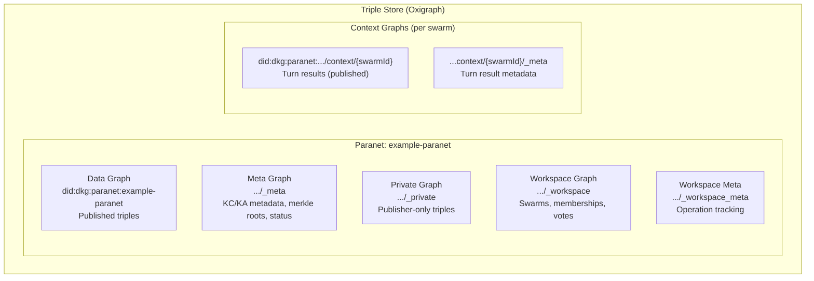

### Graph URI Patterns

| Pattern | Example | Content |
|---------|---------|---------|
| `did:dkg:paranet:{id}` | `did:dkg:paranet:example-paranet` | Published data |
| `did:dkg:paranet:{id}/_meta` | `.../_meta` | KC/KA metadata |
| `did:dkg:paranet:{id}/_private` | `.../_private` | Private triples |
| `did:dkg:paranet:{id}/_workspace` | `.../_workspace` | Workspace data |
| `did:dkg:paranet:{id}/_workspace_meta` | `.../_workspace_meta` | Workspace ops |
| `did:dkg:paranet:{id}/context/{ctxId}` | `.../context/swarm-abc123` | Context graph data |
| `did:dkg:paranet:{id}/context/{ctxId}/_meta` | `.../context/swarm-abc123/_meta` | Context graph meta |

`_private` graph behavior:

- Not included in normal peer sync (`/dkg/sync/1.0.0`) or standard query replication.
- Retrieved only through `/dkg/access/1.0.0` when access policy permits.

---

## 10. Merkle Tree & Proof System

The KC Merkle root (`kcMerkleRoot`) is a **flat tree** over all triple hashes
in the knowledge collection. There is no per-KA sub-tree hierarchy — all public
triple hashes (plus private Merkle root hashes, if any) are collected into a
single sorted leaf set and hashed into one root.

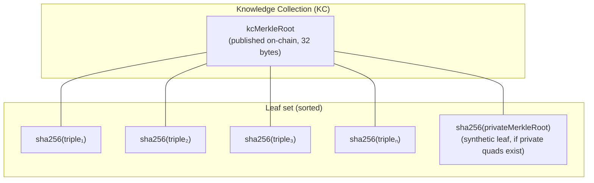

### Merkle Computation

1. **Triple hash:** SHA-256 of the canonical N-Triples serialization of each public triple.
2. **Private commitment (if private quads exist):** The publisher computes a
   private Merkle root hash from the private triples and adds it as a synthetic
   leaf to the leaf set. Peers do not have the private triples — they receive
   the private Merkle root hash as part of the manifest and include it in their
   leaf set for verification.
3. **kcMerkleRoot:** Flat Merkle tree over the sorted leaf set (all public
   triple hashes + private Merkle root hash if present).
4. **On-chain:** Only the `kcMerkleRoot` (32 bytes) goes on-chain.

### Verification

```
Verifier receives: quads[], manifest{kcMerkleRoot, privateMerkleRoot?}

1. Hash each received quad → leaf hashes
2. If privateMerkleRoot present, add it to leaf set
3. Sort all leaf hashes
4. Build flat Merkle tree → computedKcMerkleRoot
5. Compare computedKcMerkleRoot === manifest.kcMerkleRoot ✓
```

### Private data and the Merkle root

Private triples are **never propagated** to peers. Only the publisher stores
them. However, the private Merkle root hash IS shared in the manifest so that
peers can include it in their flat tree computation and still arrive at the
same `kcMerkleRoot`. This means:

- Peers can verify integrity of the full KC (public + private exists) without
  seeing the private data.
- The publisher can later prove specific private triples to authorized parties
  via `/dkg/access/1.0.0`, and those parties can verify the triples hash to
  the private commitment that was included in the `kcMerkleRoot`.

---

## 11. On-Chain vs Off-Chain Data

### On-Chain (Base Sepolia)

| Data | Contract | Purpose |
|------|----------|---------|
| KC Merkle Root | KnowledgeAssetsStorage | Integrity anchor — verifies off-chain data hasn't been tampered |
| KA token range | KnowledgeAssetsStorage | NFT ownership — startKAId to endKAId |
| Publisher address | KnowledgeAssetsStorage | Attribution — who published this data |
| Batch ID | KnowledgeAssetsStorage | Sequential ordering |
| Paranet ID | ParanetV9Registry | Paranet existence and access policy |
| TRAC stake | Token contract | Storage payment |
| Identity ID | Identity contract | DID ↔ on-chain identity binding |

### Off-Chain (Triple Store + GossipSub)

| Data | Storage | Propagation |
|------|---------|-------------|
| Published triples | Data graph | GossipSub publish topic |
| KC/KA metadata | Meta graph | GossipSub publish topic |
| Private triples | Private graph | NEVER propagated (publisher only) |
| Workspace data | Workspace graph | GossipSub workspace topic |
| App messages | In-memory | GossipSub app topic |

Access-policy linkage (off-chain):

- Access control for private triples is encoded in KC/KA metadata in `_meta`
  (e.g., `dkg:accessPolicy`, `dkg:publisherPeerId`).
- Registry-level paranet `accessPolicy` on-chain governs paranet registration/discovery
  semantics and should not be treated as a substitute for KA private data access checks.

### What Gets Linked (and What Doesn't)

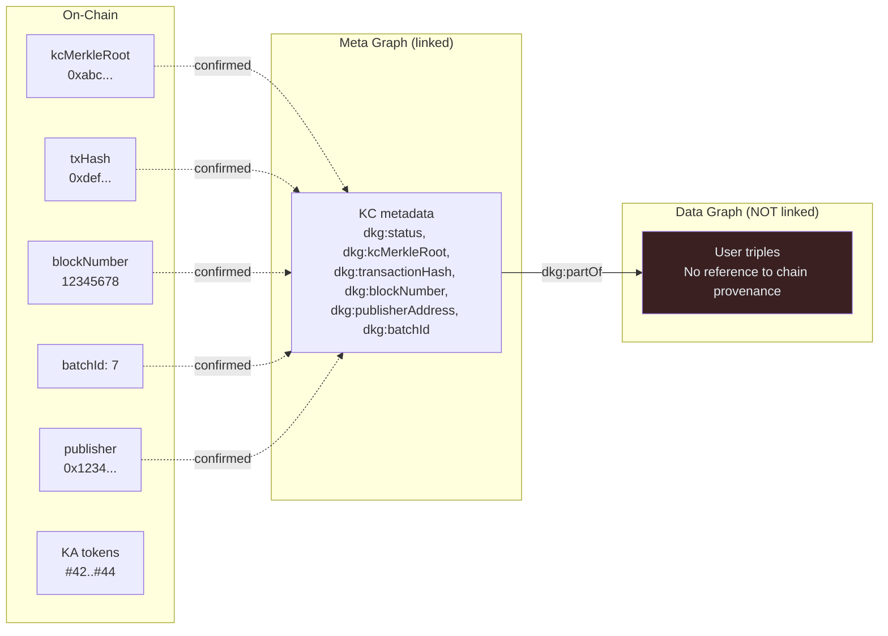

> **REVIEW: Data-to-chain linking gap.**
> User-facing data triples have NO direct link to their on-chain proof.
> To verify a triple's on-chain status, an app must:
> 1. Find the rootEntity of the triple
> 2. Look up the KA in the meta graph by rootEntity
> 3. Follow `dkg:partOf` to the KC
> 4. Read `dkg:transactionHash` from the KC
>
> This is workable but fragile. A convenience triple on each rootEntity
> pointing to its KA would simplify queries:
> ```turtle
> <rootEntity>  dkg:knowledgeAsset  <ual/tokenId> .
> ```

---

## 12. Protocol-Level Review & Improvements

### 12.1 Publish Flow

| # | Issue | Severity | Recommendation |
|---|-------|----------|----------------|
| P1 | Workspace data dropped after timeout if chain tx never confirms | Medium | Make timeout configurable; add re-request via sync protocol |
| P2 | No publish receipt/ACK from receivers | Low | Consider adding a lightweight gossip ACK for publisher visibility |
| P3 | Gossip publish can be replayed (`operationId` exists but no dedup window) | Medium | Implement dedup window for existing `operationId` in GossipSub handlers |
| P4 | `broadcastPublish` has a 5s timeout; large payloads may fail | Medium | Chunk large publish payloads or use direct protocol for big KCs |

### 12.2 Workspace

| # | Issue | Severity | Recommendation |
|---|-------|----------|----------------|
| W1 | `workspaceOwnedEntities` is in-memory only | High | Persist to workspace_meta; reconstruct on startup |
| W2 | No TTL on workspace data | Medium | Add configurable TTL; old workspace ops should be prunable |
| W3 | No workspace versioning | Low | Track version/revision per rootEntity for optimistic concurrency |

### 12.3 Consensus / Game

| # | Issue | Severity | Recommendation |
|---|-------|----------|----------------|
| C1 | Leader controls random seed — can manipulate game events | Medium | Use VRF seeded by collective randomness (hash of all votes) |
| C2 | No explicit rejection message for proposals | Medium | Add `turn:reject` message type with reason |
| C3 | `expedition:launched` game state is gossip-only | High | Write to workspace so late-joining nodes can catch up |
| C4 | Turn results don't include chain provenance | High | After publish, write txHash/ual/blockNumber to context graph |
| C5 | `resultMessage` not in RDF | Low | Add `ot:resultMessage` to `turnResolvedQuads` |
| C6 | No game event entities in RDF | Medium | Create first-class `ot:GameEvent` entities per turn |
| C7 | No resource deltas in RDF | Low | Add structured resource snapshots per turn |

### 12.4 GossipSub

| # | Issue | Severity | Recommendation |
|---|-------|----------|----------------|
| G1 | `offMessage` has a bug: returns early when handlers exist | Bug | Fix: `if (!handlers) return;` should be `if (handlers)` |
| G2 | All apps share single `app` topic per paranet | Medium | Add per-app subtopics: `dkg/paranet/{id}/app/{appId}` |
| G3 | No message signing/authentication on gossip level | Medium | GossipSub supports `strictNoSign: false` — enable message signing |
| G4 | Vote heartbeat creates O(n × 6) messages per turn | Low | Acceptable for 3-8 players; not scalable beyond ~20 |

### 12.5 Chain Integration

| # | Issue | Severity | Recommendation |
|---|-------|----------|----------------|
| CH1 | Chain poller interval (12s) may miss events on fast L2s | Low | Use WebSocket subscription instead of polling where available |
| CH2 | No retry on failed chain tx (publish, mint) | Medium | Add exponential backoff retry for chain transactions |
| CH3 | Paranet metadata reveal is a separate tx | Low | Consider batching with creation tx to save gas |

### 12.6 Storage

| # | Issue | Severity | Recommendation |
|---|-------|----------|----------------|
| S1 | Oxigraph doesn't support persistent WAL by default | Low | Ensure `oxigraph-persistent` backend is used in production |
| S2 | No compaction/garbage collection for dropped graphs | Low | Add periodic graph statistics and compaction |

### 12.7 Valuable Additions for Agents

Beyond fixing the gaps above, these additions to the knowledge graph would
significantly increase utility for AI agents:

1. **Consensus attestation triples** — Which specific nodes approved which turns,
   with their peerId and the proposal hash. Enables trust scoring and reputation.

2. **Publish provenance chain** — For each rootEntity, a provenance chain linking:
   `rootEntity → KA NFT → KC → txHash → blockNumber → publisher DID`.
   Currently requires 3 SPARQL joins; should be a direct property.

3. **Network topology hints** — Relay connections, direct connections, and peer
   latency metrics as RDF triples. Helps agents choose optimal peers.

4. **Workspace lineage** — Track which workspace entities were eventually
   enshrined (published) and link workspace operations to their resulting KCs.

5. **Game-specific: strategy patterns** — Aggregate voting patterns per player
   as RDF. Which players tend to vote "advance" vs "syncMemory"? This creates
   a behavioral knowledge graph that agents can use for strategy optimization.

---

## 13. Open Questions & Known Issues

Issues surfaced during document review. Resolved items are struck through;
remaining items need design decisions before implementation.

### Open — Update flow (deferred)

The update flow (Section 4) is known to be underdeveloped. These questions are
deferred until the update flow is redesigned.

| # | Question | Context |
|---|----------|---------|
| OQ-5 | **Update flow does not collect receiver attestation signatures.** Section 4 jumps from computing the new Merkle root to submitting the chain tx with `signatures`. Do updates require receiver attestations? If so, the attestation collection phase is missing. If not, what does `signatures` mean? | Section 4 |
| OQ-6 | **Update flow writes to data graph before chain confirmation.** Section 4 inserts into the data graph BEFORE the chain tx, violating the workspace-staging invariant established in Section 2.1. Should updates use workspace staging too? | Section 4 vs Section 2.1 design principle |
| OQ-10 | **Signature types table incomplete for updates.** Section 2.5 lists publisher, receiver, and participant signatures. Do updates use the same types? Does the table need a fourth row? | Section 2.5 vs Section 4 |

### Open — Protocol & flow questions

| # | Question | Context |
|---|----------|---------|
| OQ-7 | **`/dkg/publish/1.0.0` is the legacy direct-publish handler (publisher→receiver); `/dkg/attest/1.0.0` is designed but not yet implemented (receiver→publisher).** In the current code, `/dkg/publish/1.0.0` exists and is registered — it's a direct-RPC handler where the publisher pushes data to receivers who return signed acks (old publisher-pull model). The new peer-push model (`/dkg/attest/1.0.0`) from Section 2 is not yet implemented; the publisher currently self-signs via a fallback. **Decision needed:** Keep `/dkg/publish/1.0.0` for backward compat or large payloads? Or replace entirely with `/dkg/attest/1.0.0`? | Section 1 |
| OQ-11 | **"No pre-broadcast needed" wording in Section 2.2 is misleading.** The data gossip is skipped (peers already have workspace data), but an attestation request IS still broadcast via GossipSub. Clarify that "no data broadcast needed" is the correct statement. | Section 2.2 |
| OQ-12 | **How does workspace→context graph promotion identify the right quads?** Peers store data in the general paranet workspace during gossip, but on promotion, quads must be copied to the specific context graph URI. How does the system know WHICH workspace quads belong to this publish vs other concurrent workspace data? Likely keyed by `operationId` or `kcMerkleRoot`, but not documented. | Section 2.3 Phase 7 |
| OQ-14 | **`deadline` field never defined.** Gossip messages include a `deadline` but the document never specifies: absolute timestamp or relative duration? Publisher-set or protocol constant? What happens when it expires without quorum — fail, submit with partial sigs, or retry? | Section 2.1 Phase 4 |
| OQ-16 | **Quorum size (`minimumRequiredSignatures`) undefined.** Is it a protocol-wide constant? Per-paranet configurable? A percentage of active peers? A fixed number? | Section 2.1 Phase 5 |
| OQ-17 | **`selection` parameter for `enshrineFromWorkspace` undefined.** What can be selected — individual rootEntities? All workspace data? A time range? An operationId set? | Section 2.2 |
| OQ-18 | **`publisherPeerId` ↔ `publisherAddress` relationship not documented.** Gossip uses peerId (libp2p identity), chain uses address (Ethereum). How does one resolve to the other? Via the identity contract? This mapping is central to the protocol but never explained. | Throughout |
| OQ-13 | **`/dkg/query/2.0.0` registered but queries are documented as "LOCAL ONLY."** Is remote query a planned future feature, or should the handler be removed from the boot sequence? | Section 1 vs Section 5 |
| OQ-20 | **Workspace conflict resolution undefined.** Creator-only upsert handles single-owner entities, but what about two publishers writing overlapping (non-identical) entities? Is this prevented by validation rules, or is it a race condition? | Section 2.2, Section 12.2 W1 |
| OQ-21 | **Who collects participant signatures — the App or the DKG Agent?** The current diagram shows the App/Game Coordinator collecting M-of-N participant signatures and passing them to the Agent. But this means the App must somehow halt/resume the publish flow mid-execution. Alternatives: **(a)** App provides participant signatures upfront in the `publish()` call (requires app to pre-coordinate before calling publish). **(b)** Agent exposes a callback/event that the app subscribes to (agent pauses, app collects, agent resumes). **(c)** Agent collects internally via a protocol (but how does it know the app-specific coordination mechanism?). Each has trade-offs for API design and flow control. | Section 2.3 Phase 5b |
| OQ-22 | **Should context graph data also live in the paranet data graph?** Currently, data published to a context graph lands ONLY at `did:dkg:paranet:{id}/context/{ctxId}`, NOT in the paranet data graph. This means paranet-scoped queries won't find context graph data. Options: **(a)** Context graph only (current) — clean separation, but requires explicit context graph queries. **(b)** Both graphs — data is queryable from either scope, but creates duplication. **(c)** Paranet graph with a context graph link — data in paranet, metadata links it to the context graph. | Section 2.3 Phase 7 |
| OQ-23 | **How are context graph queries scoped?** Section 5 shows queries against the paranet data graph and optionally workspace. Context graph data lives at a different URI. Can the app specify a `contextGraphId`? Is there a union query across all context graphs in a paranet? | Section 5 vs Section 2.3 |
| OQ-24 | **Update conflict resolution.** Two publishers updating overlapping entities in the same block — the first tx wins by txIndex but the second publisher gets no notification. What is the conflict resolution strategy? | Section 4, REVIEW note |
| OQ-25 | **Context graph updates — do they require re-collecting participant signatures?** Section 4 only covers paranet data updates. For context graph data, does an update need M-of-N participant governance again? | Section 4 vs Section 2.3 |
| OQ-26 | **Sync trust model — should syncing node verify chain provenance?** Current sync verifies kcMerkleRoot but not that the data was actually committed on-chain. A malicious peer could fabricate confirmed metadata. | Section 6 |
| OQ-27 | **When does a node initiate sync? How does a new node catch up?** Section 6 shows the sync protocol but not when/why a node triggers it. Manual? Automatic on paranet join? Periodic? | Section 6 |
| OQ-28 | **Workspace sync is unauthenticated.** Workspace data has no Merkle root yet, so there is nothing to verify against. A malicious peer can send arbitrary workspace triples. Is this acceptable? | Section 6 |
| OQ-29 | **`tokenAmount` / TRAC economics undefined.** All publish flows include `tokenAmount` in the chain tx but the document never explains: how is it determined? Per-KA, per-KC, per-byte? What if insufficient? Locked or burned? | Throughout Section 2 |
| OQ-30 | **Context graph participant lifecycle.** Can participants be added/removed after creation? What if a participant goes offline permanently — does M-of-N become unachievable? | Section 2.3 |
| OQ-31 | **Paranet unsubscribe/leave mechanism.** Section 7 covers discovery and subscription but not leaving a paranet. Can a node unsubscribe and garbage-collect local graphs? | Section 7 |
| OQ-32 | **GossipSub message type discrimination.** The `paranetPublishTopic` carries three message types: `PUBLISH` (full data), `ENSHRINE` (attestation-only), `CONFIRMED` (chain proof). These need a type field in the message envelope. Currently implied but not formally specified. | Sections 2.1/2.2/2.3, Section 8 |
| OQ-33 | **Finalization dedup atomicity.** Both gossip and ChainEventPoller check UAL confirmation status. If both fire concurrently, the dedup check must be atomic to prevent double-promotion (TOCTOU race). | Section 2.1 Phase 9 |
| OQ-34 | **Data-to-chain convenience linking.** User-facing triples have no direct link to their on-chain proof (requires 4-step SPARQL joins via meta graph). Should the protocol add `<rootEntity> dkg:knowledgeAsset <ual>` as a convenience triple? | Section 11, REVIEW note |
| OQ-35 | **Manifest schema never defined.** Referenced in Sections 2.1, 2.3, and 10 but the field list and format are never specified. | Throughout |

### Known Issues (not blocking, tracked for future work)

| # | Issue | Status |
|---|-------|--------|
| KI-1 | **Context graph failure leaves workspace data on peers.** When a context graph publish fails (insufficient participant signatures), peers that received the gossip still have the data in their workspace. There is no explicit cleanup mechanism — it relies on workspace TTL expiry. Acceptable for now; revisit when workspace TTL is implemented (see Section 12.2 W2). | Known, deferred |
| KI-2 | **`workspaceOwnedEntities` is in-memory only.** On node restart, ownership map is empty. Any peer can claim ownership of unclaimed entities. Tracked in Section 12.2 W1. | Known, deferred |
| KI-3 | **`/dkg/attest/1.0.0` not yet implemented.** The peer-push attestation protocol described in Section 2 is designed but not coded. Currently the publisher self-signs as a fallback (`ReceiverSignatureProvider` callback exists but is never wired up). The legacy `/dkg/publish/1.0.0` (publisher→receiver direct push) is implemented but not used by the documented flows. | Implementation gap |
