# DKG V9 Protocol Operations — Sequence Diagrams & Analysis

> End-to-end flows for every V9 protocol operation: publish, update,
> workspace, query, sync, gossip, and chain integration. Includes RDF
> triples produced, on-chain vs off-chain split, and improvement notes.

---

## Table of Contents

1. [Node Boot Sequence](#1-node-boot-sequence)
2. [Publish Operation](#2-publish-operation)
3. [Gossip-Based Publish Propagation](#3-gossip-based-publish-propagation)
4. [Chain Event Confirmation](#4-chain-event-confirmation)
5. [Workspace Writes](#5-workspace-writes)
6. [Update Operation](#6-update-operation)
7. [Query Operation](#7-query-operation)
8. [Peer Sync](#8-peer-sync)
9. [Paranet Discovery](#9-paranet-discovery)
10. [GossipSub Topic Architecture](#10-gossipsub-topic-architecture)
11. [Storage Model](#11-storage-model)
12. [Merkle Tree & Proof System](#12-merkle-tree--proof-system)
13. [On-Chain vs Off-Chain Data](#13-on-chain-vs-off-chain-data)
14. [Protocol-Level Review & Improvements](#14-protocol-level-review--improvements)

---

## 1. Node Boot Sequence

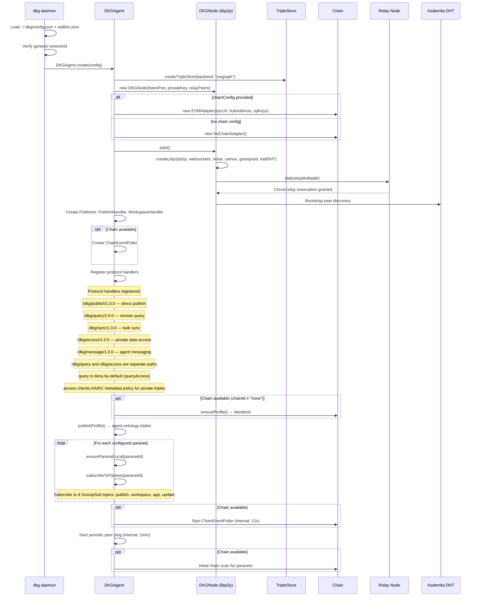
```mermaid
sequenceDiagram
    participant CLI as dkg daemon
    participant Agent as DKGAgent
    participant Node as DKGNode (libp2p)
    participant Store as TripleStore
    participant Chain as Chain
    participant Relay as Relay Node
    participant DHT as Kademlia DHT

    CLI->>CLI: Load ~/.dkg/config.json + wallets.json
    CLI->>CLI: Verify genesis networkId

    CLI->>Agent: DKGAgent.create(config)
    Agent->>Store: createTripleStore(backend: "oxigraph")
    Agent->>Node: new DKGNode(listenPort, privateKey, relayPeers)
    alt chainConfig provided
        Agent->>Chain: new EVMAdapter(rpcUrl, hubAddress, opKeys)
    else no chain config
        Agent->>Chain: new NoChainAdapter()
    end

    Agent->>Node: start()
    Node->>Node: createLibp2p(tcp, websockets, noise, yamux, gossipsub, kadDHT)
    Node->>Relay: dial(relayMultiaddr)
    Relay-->>Node: Circuit relay reservation granted
    Node->>DHT: Bootstrap peer discovery

    Agent->>Agent: Create Publisher, PublishHandler, WorkspaceHandler
    opt Chain available
        Agent->>Agent: Create ChainEventPoller
    end
    Agent->>Agent: Register protocol handlers

    Note over Agent: Protocol handlers registered:
    Note over Agent: /dkg/publish/1.0.0 — direct publish
    Note over Agent: /dkg/query/2.0.0 — remote query
    Note over Agent: /dkg/sync/1.0.0 — bulk sync
    Note over Agent: /dkg/access/1.0.0 — private data access
    Note over Agent: /dkg/message/1.0.0 — agent messaging

    Note over Agent: /dkg/query and /dkg/access are separate paths
    Note over Agent: query is deny-by-default (queryAccess)
    Note over Agent: access checks KA/KC metadata policy for private triples

    opt Chain available (chainId ≠ "none")
        Agent->>Chain: ensureProfile() → identityId
    end
    Agent->>Agent: publishProfile() → agent ontology triples

    loop For each configured paranet
        Agent->>Agent: ensureParanetLocal(paranetId)
        Agent->>Agent: subscribeToParanet(paranetId)
        Note over Agent: Subscribe to 4 GossipSub topics: publish, workspace, app, update
    end

    opt Chain available
        Agent->>Chain: Start ChainEventPoller (interval: 12s)
    end
    Agent->>Agent: Start periodic peer ping (interval: 2min)
    opt Chain available
        Agent->>Chain: Initial chain scan for paranets
    end
```

---

## 2. Publish Operation

### 2.1 Full End-to-End Flow

Current implementation note: the code path today is a **single-node publish
submission** with local data storage first, then a direct
`publishKnowledgeAssets(...)` call. The publisher currently signs both the
publisher commitment and the receiver-attestation payload with its configured
EVM wallet before submitting on-chain. Gossip then distributes the result to
other nodes. Receiver-side confirmation currently happens only through the
targeted on-chain verification in `GossipPublishHandler`; `ChainEventPoller`
confirms local pending publishes tracked by `PublishHandler`, not gossip-only
tentative data.

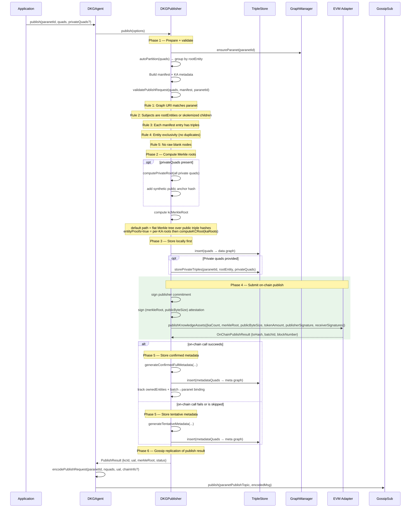
```mermaid
sequenceDiagram
    participant App as Application
    participant Agent as DKGAgent
    participant Pub as DKGPublisher
    participant Store as TripleStore
    participant GM as GraphManager
    participant Chain as EVM Adapter
    participant GS as GossipSub

    App->>Agent: publish(paranetId, quads, privateQuads?)

    Agent->>Pub: publish(options)

    Note over Pub: Phase 1 — Prepare + validate

    Pub->>GM: ensureParanet(paranetId)
    Pub->>Pub: autoPartition(quads) → group by rootEntity
    Pub->>Pub: Build manifest + KA metadata
    Pub->>Pub: validatePublishRequest(quads, manifest, paranetId)
    Note over Pub: Rule 1: Graph URI matches paranet
    Note over Pub: Rule 2: Subjects are rootEntities or skolemized children
    Note over Pub: Rule 3: Each manifest entry has triples
    Note over Pub: Rule 4: Entity exclusivity (no duplicates)
    Note over Pub: Rule 5: No raw blank nodes

    Note over Pub: Phase 2 — Compute Merkle roots

    opt privateQuads present
        Pub->>Pub: computePrivateRoot(all private quads)
        Pub->>Pub: add synthetic public anchor hash
    end
    Pub->>Pub: compute kcMerkleRoot
    Note over Pub: default path = flat Merkle tree over public triple hashes<br/>entityProofs=true = per-KA roots then computeKCRoot(kaRoots)

    Note over Pub: Phase 3 — Store locally first

    Pub->>Store: insert(quads → data graph)
    opt Private quads provided
        Pub->>Store: storePrivateTriples(paranetId, rootEntity, privateQuads)
    end

    rect rgb(232, 245, 233)
        Note over Pub,Chain: Phase 4 — Submit on-chain publish
        Pub->>Pub: sign publisher commitment
        Pub->>Pub: sign (merkleRoot, publicByteSize) attestation
        Pub->>Chain: publishKnowledgeAssets({kaCount, merkleRoot, publicByteSize, tokenAmount, publisherSignature, receiverSignatures})
        Chain-->>Pub: OnChainPublishResult {txHash, batchId, blockNumber}
    end

    alt on-chain call succeeds
        Note over Pub: Phase 5 — Store confirmed metadata

        Pub->>Pub: generateConfirmedFullMetadata(...)
        Pub->>Store: insert(metadataQuads → meta graph)
        Pub->>Pub: track ownedEntities + batch→paranet binding
    else on-chain call fails or is skipped
        Note over Pub: Phase 5 — Store tentative metadata
        Pub->>Pub: generateTentativeMetadata(...)
        Pub->>Store: insert(metadataQuads → meta graph)
    end

    Note over Pub: Phase 6 — Gossip replication of publish result

    Pub-->>Agent: PublishResult {kcId, ual, merkleRoot, status}
    Agent->>Agent: encodePublishRequest(paranetId, nquads, ual, chainInfo?)
    Agent->>GS: publish(paranetPublishTopic, encodedMsg)
```

Important implementation details reflected in code:

- There is only **one protocol publish** in this flow:
  `publishKnowledgeAssets(...)` is the actual on-chain publish. The final
  `GossipSub.publish(...)` call is just peer-to-peer replication of that result.
- In the current implementation, gossip replication happens after
  `DKGPublisher.publish()` returns, regardless of whether the result is
  `confirmed` or `tentative`.
- The publisher inserts **data first** and writes tentative metadata only if the
  on-chain step fails or is unavailable.
- The on-chain publish path uses `publishKnowledgeAssets(...)`, not a separate
  `reserveUALRange(...)` + `batchMintKnowledgeAssets(...)` sequence in the
  current `DKGPublisher.publish()` implementation.
- `ownedEntities` and `knownBatchParanets` are updated only on confirmed local
  publishes.
- Broadcasts contain **public quads only**; private triples stay in the private
  store.

That means the final network step is best read as: "replicate the current local
publish result to peers," not "perform the publish."

### 2.2 RDF Triples Produced

#### Data Graph: `did:dkg:paranet:{paranetId}`

User-supplied triples, normalized to the paranet graph:

```turtle
<https://example.org/entity/1>
    rdf:type            schema:Article ;
    schema:name         "Decentralized AI" ;
    schema:dateCreated  "2026-03-08" .

<https://example.org/entity/1/.well-known/genid/author-1>
    schema:name  "Alice" .
```

Optional private content marker:

```turtle
<urn:dkg:kc>  dkg:privateContentRoot  "0x9f86d081..." .
```

#### Meta Graph: `did:dkg:paranet:{paranetId}/_meta`

```turtle
# KC (Knowledge Collection)
<did:dkg:base:84532/0xPubAddr/42>
    rdf:type              dkg:KnowledgeCollection ;
    dkg:merkleRoot        "0xabc..." ;
    dkg:kaCount           "2"^^xsd:integer ;
    dkg:status            "confirmed" ;
    dkg:paranet           <did:dkg:paranet:{paranetId}> ;
    dkg:accessPolicy      "ownerOnly" ;
    dkg:publisherPeerId   "12D3KooW..." ;
    prov:wasAttributedTo  "12D3KooW..." ;
    dkg:publishedAt       "2026-03-08T11:00:00Z"^^xsd:dateTime ;
    dkg:transactionHash   "0xdef..." ;
    dkg:blockNumber       "12345678"^^xsd:integer ;
    dkg:blockTimestamp     "1709901234" ;
    dkg:publisherAddress  "0x1234..." ;
    dkg:batchId           "7"^^xsd:integer ;
    dkg:chainId           "base:84532" .

# KA (Knowledge Asset) — one per rootEntity
<did:dkg:base:84532/0xPubAddr/42/1>
    rdf:type                dkg:KnowledgeAsset ;
    dkg:rootEntity          <https://example.org/entity/1> ;
    dkg:partOf              <did:dkg:base:84532/0xPubAddr/42> ;
    dkg:tokenId             "1"^^xsd:integer ;
    dkg:publicTripleCount   "3"^^xsd:integer .

<did:dkg:base:84532/0xPubAddr/42/2>
    rdf:type                dkg:KnowledgeAsset ;
    dkg:rootEntity          <https://example.org/entity/2> ;
    dkg:partOf              <did:dkg:base:84532/0xPubAddr/42> ;
    dkg:tokenId             "2"^^xsd:integer ;
    dkg:publicTripleCount   "5"^^xsd:integer ;
    dkg:privateTripleCount  "2"^^xsd:integer ;
    dkg:privateMerkleRoot   "0x7c211..." .
```

---

## 3. Gossip-Based Publish Propagation

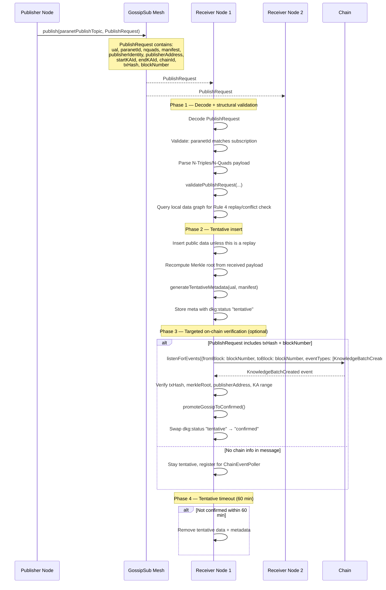
```mermaid
sequenceDiagram
    participant Pub as Publisher Node
    participant GS as GossipSub Mesh
    participant R1 as Receiver Node 1
    participant R2 as Receiver Node 2
    participant Chain as Chain

    Pub->>GS: publish(paranetPublishTopic, PublishRequest)

    Note over GS: PublishRequest contains:<br/>ual, paranetId, nquads, manifest,<br/>publisherIdentity, publisherAddress,<br/>startKAId, endKAId, chainId,<br/>txHash, blockNumber

    GS-->>R1: PublishRequest
    GS-->>R2: PublishRequest

    Note over R1: Phase 1 — Decode + structural validation

    R1->>R1: Decode PublishRequest
    R1->>R1: Validate: paranetId matches subscription
    R1->>R1: Parse N-Triples/N-Quads payload
    R1->>R1: validatePublishRequest(...)
    R1->>R1: Query local data graph for Rule 4 replay/conflict check

    Note over R1: Phase 2 — Tentative insert

    R1->>R1: Insert public data unless this is a replay
    R1->>R1: Recompute Merkle root from received payload
    R1->>R1: generateTentativeMetadata(ual, manifest)
    R1->>R1: Store meta with dkg:status "tentative"

    Note over R1: Phase 3 — Targeted on-chain verification (optional)

    alt PublishRequest includes txHash + blockNumber
        R1->>Chain: listenForEvents({fromBlock: blockNumber, toBlock: blockNumber, eventTypes: [KnowledgeBatchCreated]})
        Chain-->>R1: KnowledgeBatchCreated event
        R1->>R1: Verify txHash, merkleRoot, publisherAddress, KA range
        R1->>R1: promoteGossipToConfirmed()
        R1->>R1: Swap dkg:status "tentative" → "confirmed"
    else No chain info in message
        R1->>R1: Stay tentative, register for ChainEventPoller
    end

    Note over R1: Phase 4 — Tentative timeout (60 min)

    alt Not confirmed within 60 min
        R1->>R1: Remove tentative data + metadata
    end
```

> **REVIEW: Tentative data retention.**
> The 60-minute timeout is a reasonable default, but:
> - If a publisher is slow to get on-chain (gas spikes, mempool congestion),
>   valid data may be dropped before the chain event arrives.
> - Consider making the timeout configurable and/or adding a re-request
>   mechanism via the sync protocol.

Current implementation details:

- Receivers do **not** trust gossip-supplied on-chain status; they always store
  gossip-received publishes as tentative first.
- `GossipPublishHandler` promotes tentative metadata by swapping status quads.
  It does **not** currently append full chain provenance during gossip-based
  promotion.
- Replay publishes are tolerated: if validation failures are all Rule 4
  conflicts, the handler treats the message as a replay and skips duplicate data
  insertion while still attempting verification.

---

## 4. Chain Event Confirmation

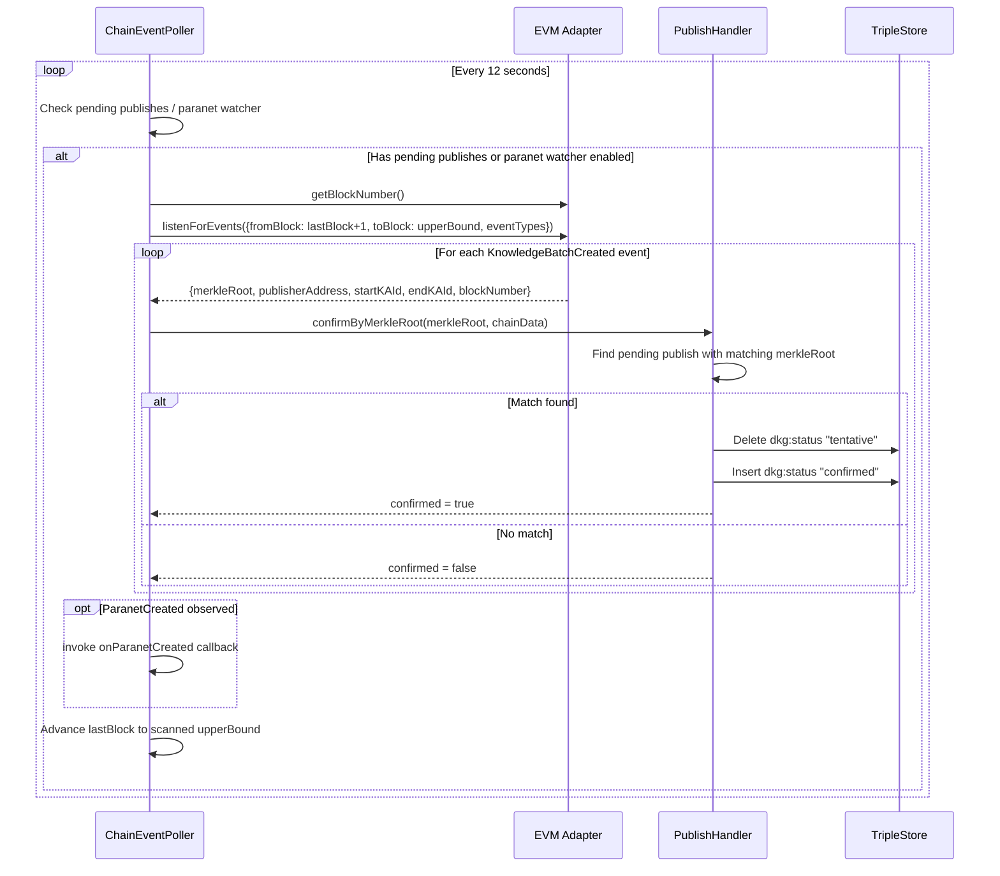
```mermaid
sequenceDiagram
    participant Poller as ChainEventPoller
    participant Chain as EVM Adapter
    participant PH as PublishHandler
    participant Store as TripleStore

    loop Every 12 seconds
        Poller->>Poller: Check pending publishes / paranet watcher
        alt Has pending publishes or paranet watcher enabled
            Poller->>Chain: getBlockNumber()
            Poller->>Chain: listenForEvents({fromBlock: lastBlock+1, toBlock: upperBound, eventTypes})

            loop For each KnowledgeBatchCreated event
                Chain-->>Poller: {merkleRoot, publisherAddress, startKAId, endKAId, blockNumber}
                Poller->>PH: confirmByMerkleRoot(merkleRoot, chainData)
                PH->>PH: Find pending publish with matching merkleRoot
                alt Match found
                    PH->>Store: Delete dkg:status "tentative"
                    PH->>Store: Insert dkg:status "confirmed"
                    PH-->>Poller: confirmed = true
                else No match
                    PH-->>Poller: confirmed = false
                end
            end

            opt ParanetCreated observed
                Poller->>Poller: invoke onParanetCreated callback
            end

            Poller->>Poller: Advance lastBlock to scanned upperBound
        end
    end
```

Current implementation details:

- The poller only starts work when there are pending publishes or a paranet
  discovery callback is configured.
- On first successful head lookup, if there are no pending publishes, it seeds
  the cursor near the tip instead of scanning full history.
- Publish confirmation is a **status-only promotion** in `PublishHandler`:
  delete tentative status, insert confirmed status, clear timeout, persist the
  pending-publish journal.

### Chain Events Emitted

| Event | Source Contract | Fields | Purpose |
|-------|---------------|--------|---------|
| `KnowledgeBatchCreated` | KnowledgeAssetsStorage | batchId, publisher, merkleRoot, startKAId, endKAId, txHash | Confirm published data |
| `UALRangeReserved` | KnowledgeAssetsStorage | publisher, startId, endId | UAL allocation |
| `ParanetCreated` | ParanetV9Registry | paranetId, creator, accessPolicy | Discover new paranets |
| `KnowledgeBatchUpdated` | KnowledgeAssetsStorage | batchId, newMerkleRoot | Confirm data updates |

---

## 5. Workspace Writes

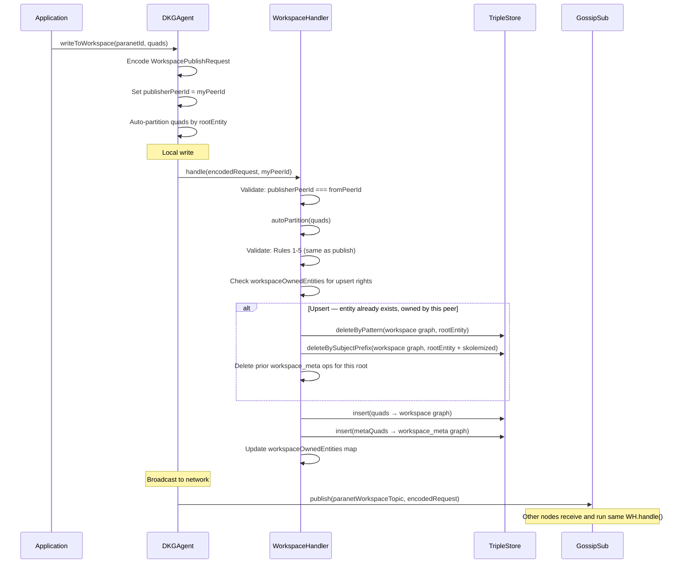
```mermaid
sequenceDiagram
    participant App as Application
    participant Agent as DKGAgent
    participant WH as WorkspaceHandler
    participant Store as TripleStore
    participant GS as GossipSub

    App->>Agent: writeToWorkspace(paranetId, quads)

    Agent->>Agent: Encode WorkspacePublishRequest
    Agent->>Agent: Set publisherPeerId = myPeerId
    Agent->>Agent: Auto-partition quads by rootEntity

    Note over Agent: Local write

    Agent->>WH: handle(encodedRequest, myPeerId)
    WH->>WH: Validate: publisherPeerId === fromPeerId
    WH->>WH: autoPartition(quads)
    WH->>WH: Validate: Rules 1-5 (same as publish)
    WH->>WH: Check workspaceOwnedEntities for upsert rights

    alt Upsert — entity already exists, owned by this peer
        WH->>Store: deleteByPattern(workspace graph, rootEntity)
        WH->>Store: deleteBySubjectPrefix(workspace graph, rootEntity + skolemized)
        WH->>WH: Delete prior workspace_meta ops for this root
    end

    WH->>Store: insert(quads → workspace graph)
    WH->>Store: insert(metaQuads → workspace_meta graph)
    WH->>WH: Update workspaceOwnedEntities map

    Note over Agent: Broadcast to network

    Agent->>GS: publish(paranetWorkspaceTopic, encodedRequest)

    Note over GS: Other nodes receive and run same WH.handle()
```

### Workspace Meta Triples

```turtle
# Workspace meta graph: did:dkg:paranet:{paranetId}/_workspace_meta

<urn:dkg:workspace:{paranetId}:{opId}>
    rdf:type              dkg:WorkspaceOperation ;
    prov:wasAttributedTo  "12D3KooW..." ;
    dkg:publishedAt       "2026-03-08T11:00:00Z"^^xsd:dateTime ;
    dkg:rootEntity        <https://example.org/entity/1> ;
    dkg:rootEntity        <https://example.org/entity/2> .
```

> **Implementation note: Workspace access control.**
> The current model is creator-only upsert — only the original publisher can
> overwrite their entities. This is enforced via `workspaceOwnedEntities`
> (`Map<paranetId, Map<rootEntity, creatorPeerId>>`) and persisted into
> `/_workspace_meta` with `dkg:workspaceOwner` / `prov:wasAttributedTo` triples.
> `DKGPublisher.reconstructWorkspaceOwnership()` rebuilds the in-memory map on
> startup from those persisted ownership records.

---

## 6. Update Operation

There are two distinct concerns in an update flow:

1. **Owner authorization** — only the batch publisher is allowed to change the
   KC on-chain.
2. **State safety** — if other nodes, apps, or reducers depend on the current
   version, the ecosystem may still need consensus before the owner commits the
   replacement.

On mainnet, treat `updateKnowledgeAssets` as the final commit primitive, not as
proof that the new state was socially or application-wise accepted. The chain
confirms who may update; consensus confirms whether the dependent system should
move to that update.

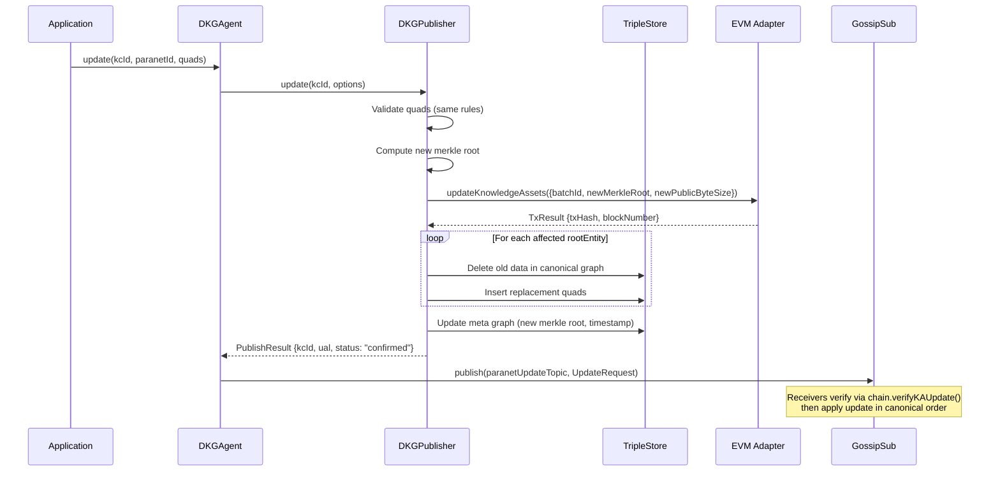
```mermaid
sequenceDiagram
    participant App as Application
    participant Agent as DKGAgent
    participant Pub as DKGPublisher
    participant Store as TripleStore
    participant Chain as EVM Adapter
    participant GS as GossipSub

    App->>Agent: update(kcId, paranetId, quads)

    Agent->>Pub: update(kcId, options)

    Pub->>Pub: Validate quads (same rules)
    Pub->>Pub: Compute new merkle root

    Pub->>Chain: updateKnowledgeAssets({batchId, newMerkleRoot, newPublicByteSize})
    Chain-->>Pub: TxResult {txHash, blockNumber}

    loop For each affected rootEntity
        Pub->>Store: Delete old data in canonical graph
        Pub->>Store: Insert replacement quads
    end

    Pub->>Store: Update meta graph (new merkle root, timestamp)
    Pub-->>Agent: PublishResult {kcId, ual, status: "confirmed"}

    Agent->>GS: publish(paranetUpdateTopic, UpdateRequest)

    Note over GS: Receivers verify via chain.verifyKAUpdate()<br/>then apply update in canonical order
```

### Why updates may need consensus first

Protocol authorization is not enough when the updated KC is a dependency for
other execution paths. If a pricing graph, policy graph, workflow state, or
shared reducer input changes underneath active consumers, a unilateral update
can create a cascading mismatch:

- one service starts using the new state,
- another still executes against the old assumptions,
- downstream validation disagrees,
- retries, compensating actions, or manual intervention follow.

That is why mainnet applications commonly gate updates behind a pre-update
consensus step whenever dependents exist.

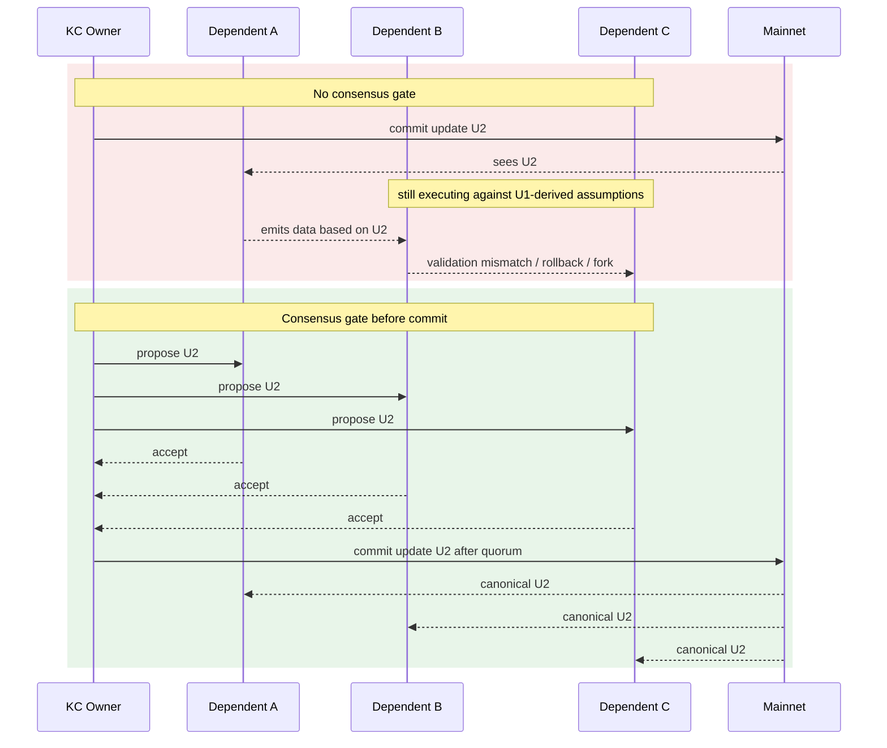
```mermaid
sequenceDiagram
    participant Owner as KC Owner
    participant DepA as Dependent A
    participant DepB as Dependent B
    participant DepC as Dependent C
    participant Chain as Mainnet

    rect rgb(251, 234, 234)
        Note over Owner,DepC: No consensus gate
        Owner->>Chain: commit update U2
        Chain-->>DepA: sees U2
        Note over DepB,DepC: still executing against U1-derived assumptions
        DepA-->>DepB: emits data based on U2
        DepB-->>DepC: validation mismatch / rollback / fork
    end

    rect rgb(232, 245, 233)
        Note over Owner,DepC: Consensus gate before commit
        Owner->>DepA: propose U2
        Owner->>DepB: propose U2
        Owner->>DepC: propose U2
        DepA-->>Owner: accept
        DepB-->>Owner: accept
        DepC-->>Owner: accept
        Owner->>Chain: commit update U2 after quorum
        Chain-->>DepA: canonical U2
        Chain-->>DepB: canonical U2
        Chain-->>DepC: canonical U2
    end
```

### Mainnet-safe update policy

- **Use owner-only update directly** for isolated assets where no live process
  depends on the previous version.
- **Require consensus before update** for shared state machines, workflow
  checkpoints, pricing/policy inputs, or any asset that other parties execute
  against.
- **Broadcast the on-chain update last** so gossip acts as distribution of an
  already-agreed canonical state, not as the place where conflicts are created.

Current implementation details:

- `DKGPublisher.update()` computes the replacement Merkle root before touching
  the local store.
- It only mutates local triples after `chain.updateKnowledgeAssets(...)`
  succeeds.
- Receivers verify updates with `verifyKAUpdate(...)`, recompute the Merkle
  root from the payload, and apply updates in canonical `(blockNumber, txIndex)`
  order.

> **REVIEW: Update ordering.**
> Updates are applied in canonical `(blockNumber, txIndex)` order. This is
> correct for consistency, but there's no mechanism for conflict resolution
> if two publishers update overlapping entities in the same block. The first
> tx wins (by txIndex), but the second publisher gets no notification of
> the conflict.

---

## 7. Query Operation

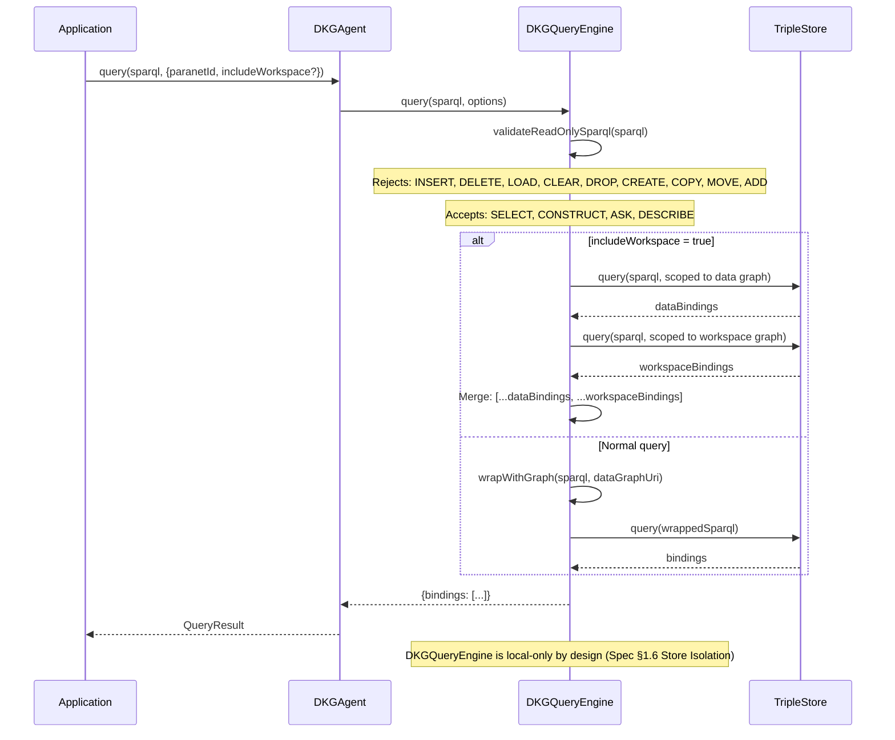
```mermaid
sequenceDiagram
    participant App as Application
    participant Agent as DKGAgent
    participant QE as DKGQueryEngine
    participant Store as TripleStore

    App->>Agent: query(sparql, {paranetId, includeWorkspace?})

    Agent->>QE: query(sparql, options)

    QE->>QE: validateReadOnlySparql(sparql)
    Note over QE: Rejects: INSERT, DELETE, LOAD, CLEAR, DROP, CREATE, COPY, MOVE, ADD
    Note over QE: Accepts: SELECT, CONSTRUCT, ASK, DESCRIBE

    alt includeWorkspace = true
        QE->>Store: query(sparql, scoped to data graph)
        Store-->>QE: dataBindings
        QE->>Store: query(sparql, scoped to workspace graph)
        Store-->>QE: workspaceBindings
        QE->>QE: Merge: [...dataBindings, ...workspaceBindings]
    else Normal query
        QE->>QE: wrapWithGraph(sparql, dataGraphUri)
        QE->>Store: query(wrappedSparql)
        Store-->>QE: bindings
    end

    QE-->>Agent: {bindings: [...]}
    Agent-->>App: QueryResult

    Note over QE: DKGQueryEngine is local-only by design (Spec §1.6 Store Isolation)
```

### Query Access Policy

```typescript
interface ParanetQueryPolicy {
  policy: 'deny' | 'public' | 'allowList';
  allowedPeers?: string[];
  allowedLookupTypes?: LookupType[];
  sparqlEnabled?: boolean;
  sparqlTimeout?: number;
  sparqlMaxResults?: number;
}
```

### Remote Queries (cross-agent)

While `DKGQueryEngine` executes only against the local triple store, remote
queries ARE supported at the protocol and HTTP layers:

- **Protocol:** `/dkg/query/2.0.0` — peers send query requests; the receiving
  node's `QueryHandler` enforces access policy, rate limits, and SPARQL
  restrictions before delegating to its local `DKGQueryEngine`.
- **HTTP API:** `POST /api/query-remote` — applications send remote queries
  via the daemon, which routes them to the target peer over the protocol.

**Remote query restrictions** (enforced by `QueryHandler`):
- `SERVICE` clauses rejected — no federated queries across endpoints
- Explicit `GRAPH` clauses rejected — queries are auto-scoped to the target paranet
- `FROM` / `FROM NAMED` clauses rejected — same reason

> **Design note:** The query engine is intentionally local-only (Spec §1.6 Store
> Isolation). All queries run against the local store only — including published data,
> workspace data, and any other locally-held triples. Remote queries delegate execution
> to another peer's local engine — they do not provide query federation or cross-store
> joins.

### Private Access (cross-agent)

Private triple retrieval uses a separate protocol and policy path from remote query.

- **Protocol:** `/dkg/access/1.0.0` — requester sends KA UAL + signature; provider
  returns private N-Quads if access is granted.
- **Handler:** `AccessHandler` checks KA/KC metadata (`dkg:accessPolicy`,
  `dkg:publisherPeerId`, `dkg:allowedPeer`) before returning private triples.
- **Client:** `AccessClient` verifies returned triples against `privateMerkleRoot`
  when available.

Effective policy rules:

- `ownerOnly` -> only publisher peer may access.
- `allowList` -> only peers listed by KC metadata `dkg:allowedPeer` may access.
- `allowList` with missing or empty `dkg:allowedPeer` entries -> access denied.
- `public` -> any peer may request private triples for that KA.

> **Security note:** `/dkg/query/2.0.0` and `/dkg/access/1.0.0` are independent.
> A denied remote query does not imply denied private access. Access behavior is
> controlled by KC/KA access metadata.

---

## 8. Peer Sync

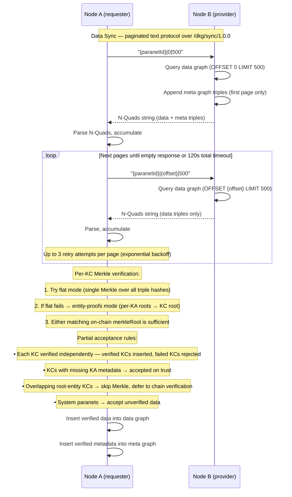
```mermaid
sequenceDiagram
    participant A as Node A (requester)
    participant B as Node B (provider)

    Note over A,B: Data Sync — paginated text protocol over /dkg/sync/1.0.0

    A->>B: "{paranetId}|0|500"
    B->>B: Query data graph (OFFSET 0 LIMIT 500)
    B->>B: Append meta graph triples (first page only)
    B-->>A: N-Quads string (data + meta triples)

    A->>A: Parse N-Quads, accumulate

    loop Next pages until empty response or 120s total timeout
        A->>B: "{paranetId}|{offset}|500"
        B->>B: Query data graph (OFFSET {offset} LIMIT 500)
        B-->>A: N-Quads string (data triples only)
        A->>A: Parse, accumulate
        Note over A: Up to 3 retry attempts per page (exponential backoff)
    end

    Note over A: Per-KC Merkle verification:
    Note over A: 1. Try flat mode (single Merkle over all triple hashes)
    Note over A: 2. If flat fails → entity-proofs mode (per-KA roots → KC root)
    Note over A: 3. Either matching on-chain merkleRoot is sufficient

    Note over A: Partial acceptance rules:
    Note over A: • Each KC verified independently — verified KCs inserted, failed KCs rejected
    Note over A: • KCs with missing KA metadata → accepted on trust
    Note over A: • Overlapping root-entity KCs → skip Merkle, defer to chain verification
    Note over A: • System paranets → accept unverified data

    A->>A: Insert verified data into data graph
    A->>A: Insert verified metadata into meta graph
```

### Workspace Sync

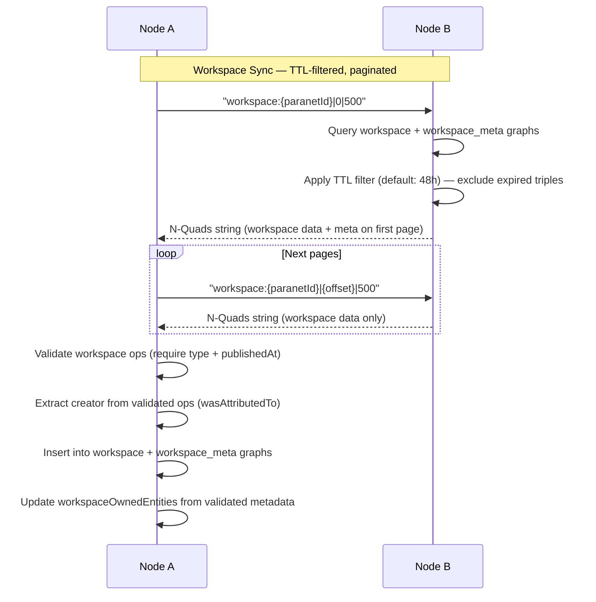
```mermaid
sequenceDiagram
    participant A as Node A
    participant B as Node B

    Note over A,B: Workspace Sync — TTL-filtered, paginated

    A->>B: "workspace:{paranetId}|0|500"
    B->>B: Query workspace + workspace_meta graphs
    B->>B: Apply TTL filter (default: 48h) — exclude expired triples
    B-->>A: N-Quads string (workspace data + meta on first page)

    loop Next pages
        A->>B: "workspace:{paranetId}|{offset}|500"
        B-->>A: N-Quads string (workspace data only)
    end

    A->>A: Validate workspace ops (require type + publishedAt)
    A->>A: Extract creator from validated ops (wasAttributedTo)
    A->>A: Insert into workspace + workspace_meta graphs
    A->>A: Update workspaceOwnedEntities from validated metadata
```

Current implementation details:

- Sync uses a plain-text request protocol: `"{paranetId}|{offset}|{limit}"` for data,
  `"workspace:{paranetId}|{offset}|{limit}"` for workspace.
- Page size is 500 triples (`SYNC_PAGE_SIZE`). Meta graph triples are included only
  on the first page (offset=0).
- Total sync timeout is 120 seconds. Each page has up to 3 retry attempts with
  exponential backoff.
- Merkle verification tries flat mode first (single tree over all triple hashes),
  then falls back to entity-proofs mode (per-KA roots → KC root). Verification is
  **per-KC** — verified KCs are inserted while failed KCs are individually rejected.
  KCs with missing KA metadata are accepted on trust; overlapping root-entity KCs
  skip Merkle verification and defer to chain-level checks.
- System paranets (e.g., agent registry) accept unverified data when the paranet
  is in the `SYSTEM_PARANETS` set.
- Workspace sync applies a configurable TTL filter (`workspaceTtlMs`, default 48h).
  Synced workspace operations are validated (require `rdf:type` + `publishedAt`),
  and creator-entity mappings are extracted to populate `workspaceOwnedEntities`,
  enabling creator-only upsert enforcement after sync.

---

## 9. Paranet Discovery

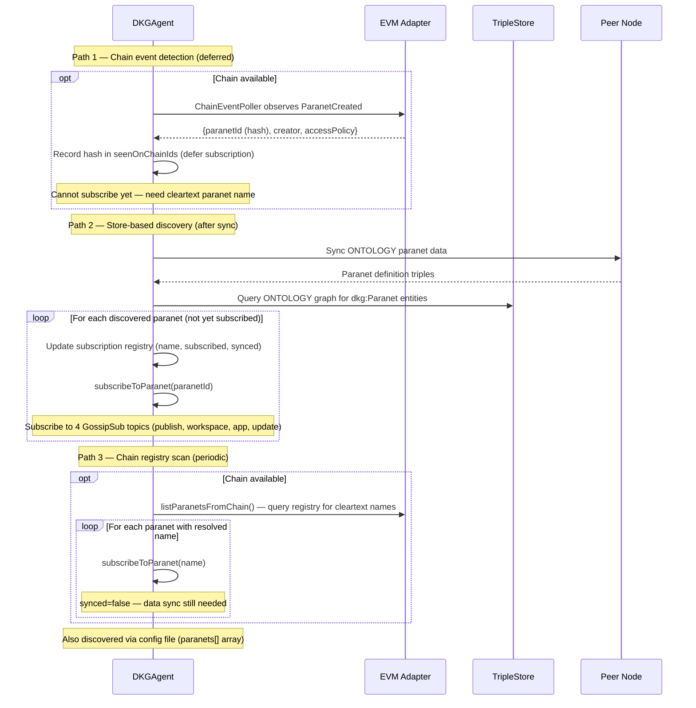
```mermaid
sequenceDiagram
    participant Agent as DKGAgent
    participant Chain as EVM Adapter
    participant Store as TripleStore
    participant Peer as Peer Node

    Note over Agent: Path 1 — Chain event detection (deferred)

    opt Chain available
        Agent->>Chain: ChainEventPoller observes ParanetCreated
        Chain-->>Agent: {paranetId (hash), creator, accessPolicy}
        Agent->>Agent: Record hash in seenOnChainIds (defer subscription)
        Note over Agent: Cannot subscribe yet — need cleartext paranet name
    end

    Note over Agent: Path 2 — Store-based discovery (after sync)

    Agent->>Peer: Sync ONTOLOGY paranet data
    Peer-->>Agent: Paranet definition triples
    Agent->>Store: Query ONTOLOGY graph for dkg:Paranet entities
    loop For each discovered paranet (not yet subscribed)
        Agent->>Agent: Update subscription registry (name, subscribed, synced)
        Agent->>Agent: subscribeToParanet(paranetId)
        Note over Agent: Subscribe to 4 GossipSub topics (publish, workspace, app, update)
    end

    Note over Agent: Path 3 — Chain registry scan (periodic)

    opt Chain available
        Agent->>Chain: listParanetsFromChain() — query registry for cleartext names
        loop For each paranet with resolved name
            Agent->>Agent: subscribeToParanet(name)
            Note over Agent: synced=false — data sync still needed
        end
    end

    Note over Agent: Also discovered via config file (paranets[] array)
```

---

## 10. GossipSub Topic Architecture

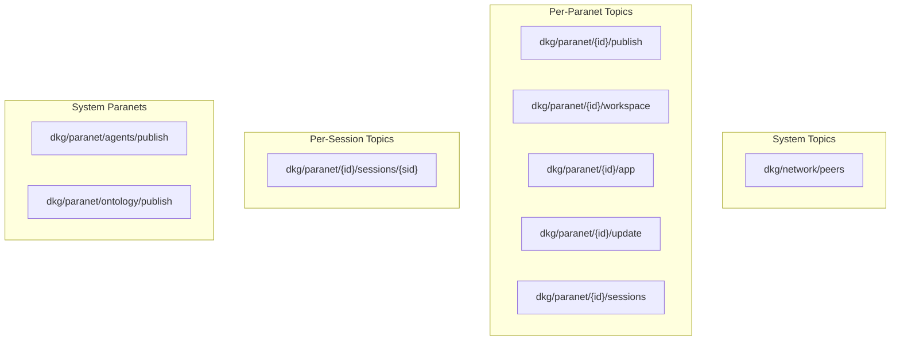
```mermaid
graph TB
    subgraph "System Topics"
        PEERS["dkg/network/peers"]
    end

    subgraph "Per-Paranet Topics"
        PUB["dkg/paranet/{id}/publish"]
        WS["dkg/paranet/{id}/workspace"]
        APP["dkg/paranet/{id}/app"]
        UPD["dkg/paranet/{id}/update"]
        SESS["dkg/paranet/{id}/sessions"]
    end

    subgraph "Per-Session Topics"
        S1["dkg/paranet/{id}/sessions/{sid}"]
    end

    subgraph "System Paranets"
        AGENTS["dkg/paranet/agents/publish"]
        ONTO["dkg/paranet/ontology/publish"]
    end
```

| Topic | Purpose | Message Types |
|-------|---------|---------------|
| `dkg/network/peers` | Peer discovery & health | Peer announce, capabilities |
| `dkg/paranet/{id}/publish` | Published data broadcast | PublishRequest (encoded protobuf) |
| `dkg/paranet/{id}/workspace` | Workspace writes | WorkspacePublishRequest |
| `dkg/paranet/{id}/app` | Application coordination | JSON app messages (game, etc.) |
| `dkg/paranet/{id}/update` | KA updates | UpdateRequest |
| `dkg/paranet/{id}/sessions` | Multi-party sessions | Session proposals, coordination |
| `dkg/paranet/{id}/sessions/{sid}` | Per-session messages | Round data, commitments |

> **Note on `dkg/network/peers`:** The topic constant is defined (`networkPeersTopic()`)
> but has no publish, subscribe, or handler usage on this branch. It is reserved for
> future peer discovery but not currently active.

> **Note on sessions topics:** The base `subscribeToParanet()` flow does NOT subscribe
> to sessions topics. The attested-assets layer can subscribe the paranet-level sessions
> topic (`dkg/paranet/{id}/sessions`) via `SessionManager.subscribeParanet()`. Per-session
> topics (`dkg/paranet/{id}/sessions/{sid}`) are subscribed when a session is created or
> a proposal is received.

> **REVIEW: App topic is untyped.**
> The `app` topic carries JSON messages with an `app` field for routing (e.g.
> `"origin-trail-game"`). All apps on the same paranet share a single topic.
> **Risk:** A malicious app could flood the topic, affecting all apps. Consider
> per-app subtopics: `dkg/paranet/{id}/app/{appId}`.

---

## 11. Storage Model

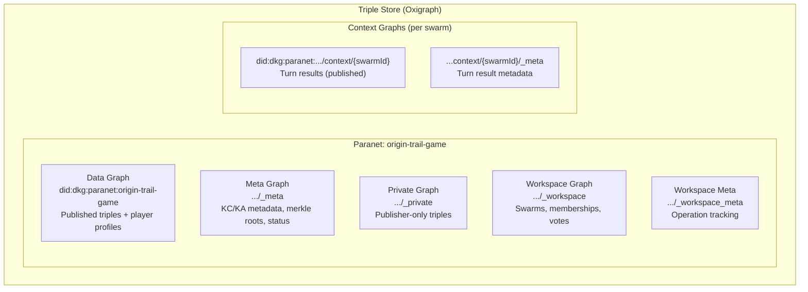
```mermaid
graph TB
    subgraph "Triple Store (Oxigraph)"
        subgraph "Paranet: origin-trail-game"
            DATA["Data Graph<br/>did:dkg:paranet:origin-trail-game<br/>Published triples + player profiles"]
            META["Meta Graph<br/>.../_meta<br/>KC/KA metadata, merkle roots, status"]
            PRIV["Private Graph<br/>.../_private<br/>Publisher-only triples"]
            WS["Workspace Graph<br/>.../_workspace<br/>Swarms, memberships, votes"]
            WS_META["Workspace Meta<br/>.../_workspace_meta<br/>Operation tracking"]
        end

        subgraph "Context Graphs (per swarm)"
            CTX["did:dkg:paranet:.../context/{swarmId}<br/>Turn results (published)"]
            CTX_META["...context/{swarmId}/_meta<br/>Turn result metadata"]
        end
    end
```

### Graph URI Patterns

| Pattern | Example | Content |
|---------|---------|---------|
| `did:dkg:paranet:{id}` | `did:dkg:paranet:origin-trail-game` | Published data |
| `did:dkg:paranet:{id}/_meta` | `.../_meta` | KC/KA metadata |
| `did:dkg:paranet:{id}/_private` | `.../_private` | Private triples |
| `did:dkg:paranet:{id}/_workspace` | `.../_workspace` | Workspace data |
| `did:dkg:paranet:{id}/_workspace_meta` | `.../_workspace_meta` | Workspace ops |
| `did:dkg:paranet:{id}/context/{ctxId}` | `.../context/swarm-abc123` | Context graph data |
| `did:dkg:paranet:{id}/context/{ctxId}/_meta` | `.../context/swarm-abc123/_meta` | Context graph meta |

`_private` graph behavior:

- Not included in normal peer sync (`/dkg/sync/1.0.0`) or standard query replication.
- Retrieved only through `/dkg/access/1.0.0` when access policy permits.

---

## 12. Merkle Tree & Proof System

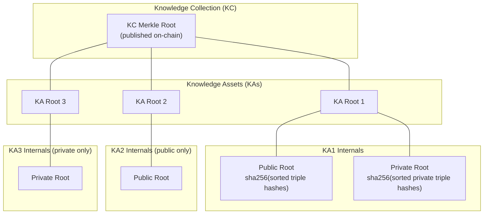
```mermaid
graph TB
    subgraph "Knowledge Collection (KC)"
        KC_ROOT["KC Merkle Root<br/>(published on-chain)"]
    end

    subgraph "Knowledge Assets (KAs)"
        KA1["KA Root 1"]
        KA2["KA Root 2"]
        KA3["KA Root 3"]
    end

    subgraph "KA1 Internals"
        PUB1["Public Root<br/>sha256(sorted triple hashes)"]
        PRIV1["Private Root<br/>sha256(sorted private triple hashes)"]
    end

    subgraph "KA2 Internals (public only)"
        PUB2["Public Root"]
    end

    subgraph "KA3 Internals (private only)"
        PRIV3["Private Root"]
    end

    KC_ROOT --- KA1
    KC_ROOT --- KA2
    KC_ROOT --- KA3

    KA1 --- PUB1
    KA1 --- PRIV1
    KA2 --- PUB2
    KA3 --- PRIV3
```

### Merkle Computation

1. **Triple hash:** SHA-256 of the NQuad serialization of each triple.
2. **Public root:** Merkle tree over sorted triple hashes for a rootEntity.
3. **Private root:** Merkle tree over sorted private triple hashes (publisher-only).
4. **KA root:** `sha256(publicRoot || privateRoot)` — or just the one that exists.
5. **KC root:** Merkle tree over sorted KA roots.
6. **On-chain:** Only the KC root (32 bytes) goes on-chain.

### Verification

```
Verifier receives: quads[], metadata{merkleRoot, kaManifest[]}

For each KA in manifest:
  1. Filter quads for rootEntity + skolemized children
  2. Hash each quad → sorted list
  3. Build merkle tree → publicRoot
  4. KA root = computeKARoot(publicRoot, privateMerkleRoot?)

Collect KA roots → sorted → build merkle tree → kcRoot
Compare kcRoot === metadata.merkleRoot ✓
```

> **REVIEW: Entity-proofs mode.**
> When `entityProofs: true`, each KA has its own sub-tree enabling selective
> disclosure (prove entity 2 without revealing entity 1). This is powerful
> but adds overhead. Currently off by default — consider making it the default
> for paranets with privacy requirements.

---

## 13. On-Chain vs Off-Chain Data

### On-Chain (Base Sepolia)

| Data | Contract | Purpose |
|------|----------|---------|
| KC Merkle Root | KnowledgeAssetsStorage | Integrity anchor — verifies off-chain data hasn't been tampered |
| KA token range | KnowledgeAssetsStorage | NFT ownership — startKAId to endKAId |
| Publisher address | KnowledgeAssetsStorage | Attribution — who published this data |
| Batch ID | KnowledgeAssetsStorage | Sequential ordering |
| Paranet ID | ParanetV9Registry | Paranet existence and access policy |
| TRAC stake | Token contract | Storage payment |
| Identity ID | Identity contract | DID ↔ on-chain identity binding |

### Off-Chain (Triple Store + GossipSub)

| Data | Storage | Propagation |
|------|---------|-------------|
| Published triples | Data graph | GossipSub publish topic |
| KC/KA metadata | Meta graph | GossipSub publish topic |
| Private triples | Private graph | NEVER propagated (publisher only) |
| Workspace data | Workspace graph | GossipSub workspace topic |
| App messages | In-memory | GossipSub app topic |

Access-policy linkage (off-chain):

- Access control for private triples is encoded in KC/KA metadata in `_meta`
  (e.g., `dkg:accessPolicy`, `dkg:publisherPeerId`).
- Registry-level paranet `accessPolicy` on-chain governs paranet registration/discovery
  semantics and should not be treated as a substitute for KA private data access checks.

### What Gets Linked (and What Doesn't)

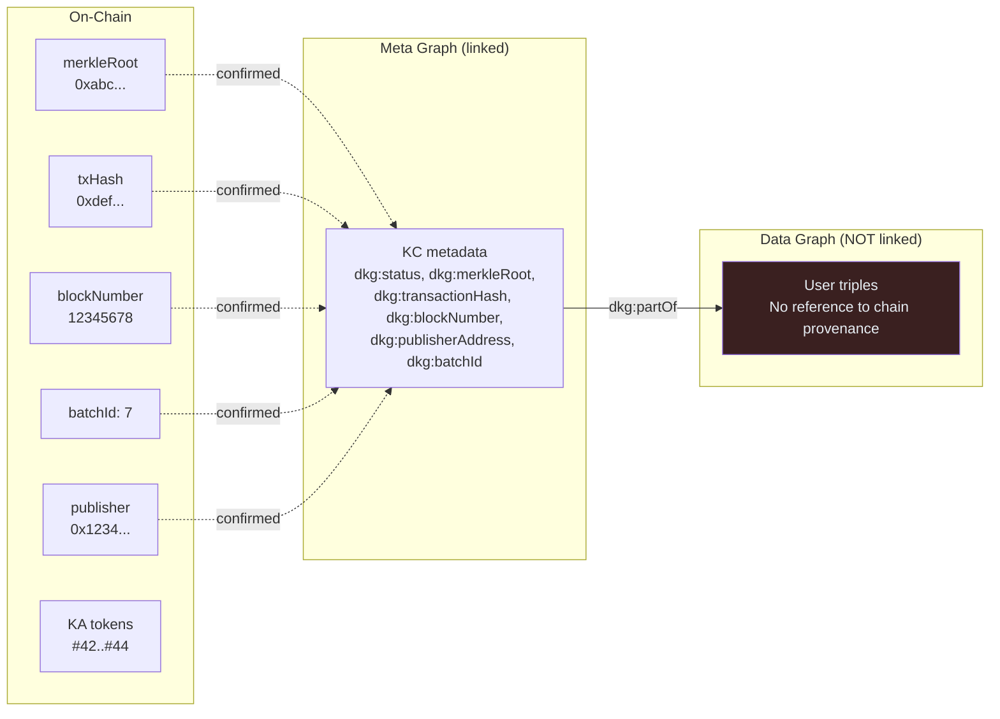
```mermaid
graph LR
    subgraph "On-Chain"
        MR["merkleRoot<br/>0xabc..."]
        TX["txHash<br/>0xdef..."]
        BN["blockNumber<br/>12345678"]
        BATCH["batchId: 7"]
        ADDR["publisher<br/>0x1234..."]
        NFT["KA tokens<br/>#42..#44"]
    end

    subgraph "Meta Graph (linked)"
        KC["KC metadata<br/>dkg:status, dkg:merkleRoot,<br/>dkg:transactionHash, dkg:blockNumber,<br/>dkg:publisherAddress, dkg:batchId"]
    end

    subgraph "Data Graph (NOT linked)"
        DATA["User triples<br/>No reference to chain provenance"]
    end

    MR -.->|confirmed| KC
    TX -.->|confirmed| KC
    BN -.->|confirmed| KC
    BATCH -.->|confirmed| KC
    ADDR -.->|confirmed| KC

    KC -->|"dkg:partOf"| DATA

    style DATA fill:#3a2020,color:#e6edf3
```

> **REVIEW: Data-to-chain linking gap.**
> User-facing data triples have NO direct link to their on-chain proof.
> To verify a triple's on-chain status, an app must:
> 1. Find the rootEntity of the triple
> 2. Look up the KA in the meta graph by rootEntity
> 3. Follow `dkg:partOf` to the KC
> 4. Read `dkg:transactionHash` from the KC
>
> This is workable but fragile. A convenience triple on each rootEntity
> pointing to its KA would simplify queries:
> ```turtle
> <rootEntity>  dkg:knowledgeAsset  <ual/tokenId> .
> ```

---

## 14. Protocol-Level Review & Improvements

### 14.1 Publish Flow

| # | Issue | Severity | Recommendation |
|---|-------|----------|----------------|
| P1 | Tentative data dropped after 60 min if chain is slow | Medium | Make timeout configurable; add re-request via sync protocol |
| P2 | No publish receipt/ACK from receivers | Low | Consider adding a lightweight gossip ACK for publisher visibility |
| P3 | Gossip publish can be replayed (no nonce/dedup) | Medium | Add `operationId` + dedup window to GossipSub handlers |
| P4 | `broadcastPublish` uses retry with exponential backoff (3 attempts, 500ms base); large payloads may still fail | Medium | Consider chunking large publish payloads or using direct protocol for big KCs |

### 14.2 Workspace

| # | Issue | Severity | Recommendation |
|---|-------|----------|----------------|
| W1 | ~~`workspaceOwnedEntities` is in-memory only~~ | ~~High~~ | **RESOLVED** — ownership is persisted to `workspace_meta` and reconstructed on startup via `reconstructWorkspaceOwnership()` |
| W2 | ~~No TTL on workspace data~~ | ~~Medium~~ | **RESOLVED** — TTL is implemented (default 48h). Cleanup runs every 15 minutes, pruning expired workspace ops, their data triples, and ownership entries |
| W3 | No workspace versioning | Low | Track version/revision per rootEntity for optimistic concurrency |

### 14.3 Consensus / Game

| # | Issue | Severity | Recommendation |
|---|-------|----------|----------------|
| C1 | Leader controls random seed — can manipulate game events | Medium | Use VRF seeded by collective randomness (hash of all votes) |
| C2 | No explicit rejection message for proposals | Medium | Add `turn:reject` message type with reason |
| C3 | `expedition:launched` game state is gossip-only | High | Write to workspace so late-joining nodes can catch up |
| C4 | Turn results don't include chain provenance | High | After publish, write txHash/ual/blockNumber to context graph |
| C5 | `resultMessage` not in RDF | Low | Add `ot:resultMessage` to `turnResolvedQuads` |
| C6 | No game event entities in RDF | Medium | Create first-class `ot:GameEvent` entities per turn |
| C7 | No resource deltas in RDF | Low | Add structured resource snapshots per turn |

### 14.4 GossipSub

| # | Issue | Severity | Recommendation |
|---|-------|----------|----------------|
| G1 | ~~`offMessage` has a bug~~ | ~~Bug~~ | **RESOLVED** — code is correct: `if (!handlers) return;` safely exits when no handlers exist, then deletes the specific handler and cleans up empty sets |
| G2 | All apps share single `app` topic per paranet | Medium | Add per-app subtopics: `dkg/paranet/{id}/app/{appId}` |
| G3 | No message signing/authentication on gossip level | Medium | GossipSub supports `strictNoSign: false` — enable message signing |
| G4 | Vote heartbeat creates O(n × 6) messages per turn | Low | Acceptable for 3-8 players; not scalable beyond ~20 |

### 14.5 Chain Integration

| # | Issue | Severity | Recommendation |
|---|-------|----------|----------------|
| CH1 | Chain poller interval (12s) may miss events on fast L2s | Low | Use WebSocket subscription instead of polling where available |
| CH2 | No retry on failed chain tx (publish, mint) | Medium | Add exponential backoff retry for chain transactions |
| CH3 | Paranet metadata reveal is a separate tx | Low | Consider batching with creation tx to save gas |

### 14.6 Storage

| # | Issue | Severity | Recommendation |
|---|-------|----------|----------------|
| S1 | Oxigraph doesn't support persistent WAL by default | Low | Ensure `oxigraph-persistent` backend is used in production |
| S2 | No compaction/garbage collection for dropped graphs | Low | Add periodic graph statistics and compaction |

### 14.7 Valuable Additions for Agents

Beyond fixing the gaps above, these additions to the knowledge graph would
significantly increase utility for AI agents:

1. **Consensus attestation triples** — Which specific nodes approved which turns,
   with their peerId and the proposal hash. Enables trust scoring and reputation.

2. **Publish provenance chain** — For each rootEntity, a provenance chain linking:
   `rootEntity → KA NFT → KC → txHash → blockNumber → publisher DID`.
   Currently requires 3 SPARQL joins; should be a direct property.

3. **Network topology hints** — Relay connections, direct connections, and peer
   latency metrics as RDF triples. Helps agents choose optimal peers.

4. **Workspace lineage** — Track which workspace entities were eventually
   enshrined (published) and link workspace operations to their resulting KCs.

5. **Game-specific: strategy patterns** — Aggregate voting patterns per player
   as RDF. Which players tend to vote "advance" vs "syncMemory"? This creates
   a behavioral knowledge graph that agents can use for strategy optimization.
