# DKG V9 Protocol Operations — Sequence Diagrams & Analysis

> End-to-end flows for every V9 protocol operation: publish, update,
> workspace, query, sync, gossip, and chain integration. Includes RDF
> triples produced, on-chain vs off-chain split, and improvement notes.

---

## Table of Contents

1. [Node Boot Sequence](#1-node-boot-sequence)
2. [Publish Operation](#2-publish-operation)
3. [Gossip-Based Publish Propagation](#3-gossip-based-publish-propagation)
4. [Chain Event Confirmation](#4-chain-event-confirmation)
5. [Workspace Writes](#5-workspace-writes)
   - 5.1 [Workspace-First Publish (Enshrine + Finalization)](#51-workspace-first-publish-enshrine--finalization)
   - 5.2 [Detailed Workspace Insert](#52-detailed-workspace-insert)
   - 5.3 [Detailed Paranet Enshrinement](#53-detailed-paranet-enshrinement-workspace--data-graph)
   - 5.4 [Detailed Context Graph Enshrinement](#54-detailed-context-graph-enshrinement-workspace--context-graph)
6. [Update Operation](#6-update-operation)
7. [Query Operation](#7-query-operation)
8. [Peer Sync](#8-peer-sync)
9. [Paranet Discovery](#9-paranet-discovery)
10. [GossipSub Topic Architecture](#10-gossipsub-topic-architecture)
11. [Storage Model](#11-storage-model)
12. [Merkle Tree & Proof System](#12-merkle-tree--proof-system)
13. [On-Chain vs Off-Chain Data](#13-on-chain-vs-off-chain-data)
14. [Protocol-Level Review & Improvements](#14-protocol-level-review--improvements)

---

## 1. Node Boot Sequence

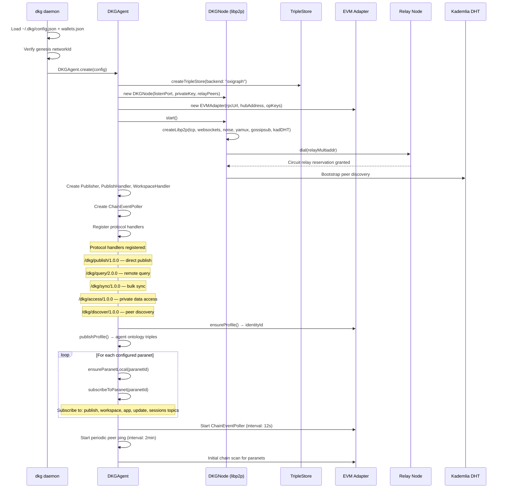
```mermaid
sequenceDiagram
    participant CLI as dkg daemon
    participant Agent as DKGAgent
    participant Node as DKGNode (libp2p)
    participant Store as TripleStore
    participant Chain as EVM Adapter
    participant Relay as Relay Node
    participant DHT as Kademlia DHT

    CLI->>CLI: Load ~/.dkg/config.json + wallets.json
    CLI->>CLI: Verify genesis networkId

    CLI->>Agent: DKGAgent.create(config)
    Agent->>Store: createTripleStore(backend: "oxigraph")
    Agent->>Node: new DKGNode(listenPort, privateKey, relayPeers)
    Agent->>Chain: new EVMAdapter(rpcUrl, hubAddress, opKeys)

    Agent->>Node: start()
    Node->>Node: createLibp2p(tcp, websockets, noise, yamux, gossipsub, kadDHT)
    Node->>Relay: dial(relayMultiaddr)
    Relay-->>Node: Circuit relay reservation granted
    Node->>DHT: Bootstrap peer discovery

    Agent->>Agent: Create Publisher, PublishHandler, WorkspaceHandler
    Agent->>Agent: Create ChainEventPoller
    Agent->>Agent: Register protocol handlers

    Note over Agent: Protocol handlers registered:
    Note over Agent: /dkg/publish/1.0.0 — direct publish
    Note over Agent: /dkg/query/2.0.0 — remote query
    Note over Agent: /dkg/sync/1.0.0 — bulk sync
    Note over Agent: /dkg/access/1.0.0 — private data access
    Note over Agent: /dkg/discover/1.0.0 — peer discovery

    Agent->>Chain: ensureProfile() → identityId
    Agent->>Agent: publishProfile() → agent ontology triples

    loop For each configured paranet
        Agent->>Agent: ensureParanetLocal(paranetId)
        Agent->>Agent: subscribeToParanet(paranetId)
        Note over Agent: Subscribe to: publish, workspace, app, update, sessions topics
    end

    Agent->>Chain: Start ChainEventPoller (interval: 12s)
    Agent->>Agent: Start periodic peer ping (interval: 2min)
    Agent->>Chain: Initial chain scan for paranets
```

---

## 2. Publish Operation

### 2.1 Full End-to-End Flow

The direct `publish()` call combines preparation, replication, signature
collection, and on-chain finalization in a single operation. The key invariant
holds: **data is replicated to core nodes and their signatures collected
BEFORE the on-chain transaction is submitted**.

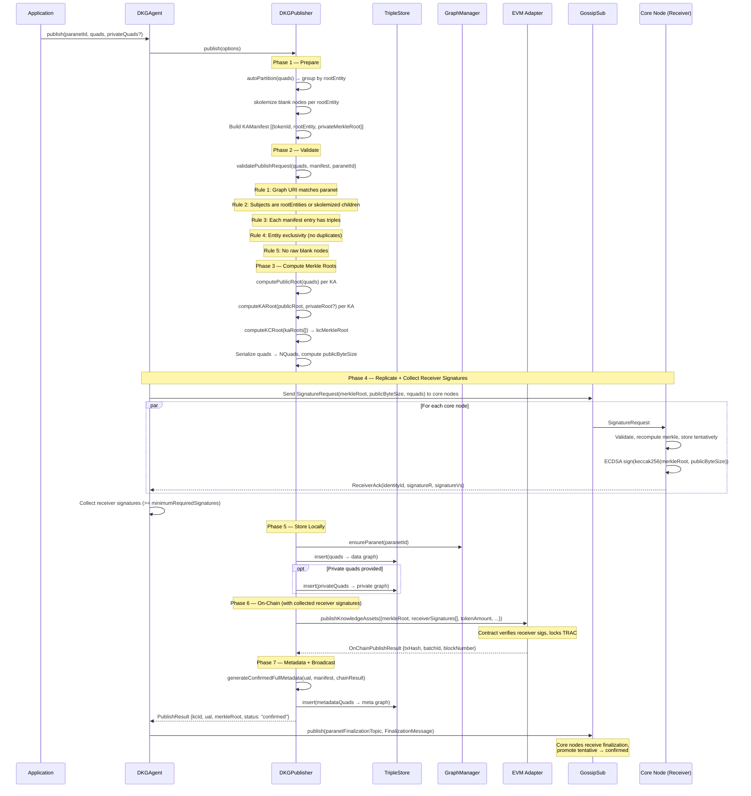
```mermaid
sequenceDiagram
    participant App as Application
    participant Agent as DKGAgent
    participant Pub as DKGPublisher
    participant Store as TripleStore
    participant GM as GraphManager
    participant Chain as EVM Adapter
    participant GS as GossipSub
    participant CoreNode as Core Node (Receiver)

    App->>Agent: publish(paranetId, quads, privateQuads?)

    Agent->>Pub: publish(options)

    Note over Pub: Phase 1 — Prepare

    Pub->>Pub: autoPartition(quads) → group by rootEntity
    Pub->>Pub: skolemize blank nodes per rootEntity
    Pub->>Pub: Build KAManifest [{tokenId, rootEntity, privateMerkleRoot}]

    Note over Pub: Phase 2 — Validate

    Pub->>Pub: validatePublishRequest(quads, manifest, paranetId)
    Note over Pub: Rule 1: Graph URI matches paranet
    Note over Pub: Rule 2: Subjects are rootEntities or skolemized children
    Note over Pub: Rule 3: Each manifest entry has triples
    Note over Pub: Rule 4: Entity exclusivity (no duplicates)
    Note over Pub: Rule 5: No raw blank nodes

    Note over Pub: Phase 3 — Compute Merkle Roots

    Pub->>Pub: computePublicRoot(quads) per KA
    Pub->>Pub: computeKARoot(publicRoot, privateRoot?) per KA
    Pub->>Pub: computeKCRoot(kaRoots[]) → kcMerkleRoot
    Pub->>Pub: Serialize quads → NQuads, compute publicByteSize

    Note over Agent,CoreNode: Phase 4 — Replicate + Collect Receiver Signatures

    Agent->>GS: Send SignatureRequest(merkleRoot, publicByteSize, nquads) to core nodes
    par For each core node
        GS->>CoreNode: SignatureRequest
        CoreNode->>CoreNode: Validate, recompute merkle, store tentatively
        CoreNode->>CoreNode: ECDSA sign(keccak256(merkleRoot, publicByteSize))
        CoreNode-->>Agent: ReceiverAck(identityId, signatureR, signatureVs)
    end
    Agent->>Agent: Collect receiver signatures (>= minimumRequiredSignatures)

    Note over Pub: Phase 5 — Store Locally

    Pub->>GM: ensureParanet(paranetId)
    Pub->>Store: insert(quads → data graph)
    opt Private quads provided
        Pub->>Store: insert(privateQuads → private graph)
    end

    Note over Pub: Phase 6 — On-Chain (with collected receiver signatures)

    Pub->>Chain: publishKnowledgeAssets({merkleRoot, receiverSignatures[], tokenAmount, ...})
    Note over Chain: Contract verifies receiver sigs, locks TRAC
    Chain-->>Pub: OnChainPublishResult {txHash, batchId, blockNumber}

    Note over Pub: Phase 7 — Metadata + Broadcast

    Pub->>Pub: generateConfirmedFullMetadata(ual, manifest, chainResult)
    Pub->>Store: insert(metadataQuads → meta graph)

    Pub-->>Agent: PublishResult {kcId, ual, merkleRoot, status: "confirmed"}
    Agent->>GS: publish(paranetFinalizationTopic, FinalizationMessage)
    Note over GS: Core nodes receive finalization,<br/>promote tentative → confirmed
```

### 2.2 RDF Triples Produced

#### Data Graph: `did:dkg:paranet:{paranetId}`

User-supplied triples, normalized to the paranet graph:

```turtle
<https://example.org/entity/1>
    rdf:type            schema:Article ;
    schema:name         "Decentralized AI" ;
    schema:dateCreated  "2026-03-08" .

<https://example.org/entity/1/.well-known/genid/author-1>
    schema:name  "Alice" .
```

Optional private content marker:

```turtle
<urn:dkg:kc>  dkg:privateContentRoot  "0x9f86d081..." .
```

#### Meta Graph: `did:dkg:paranet:{paranetId}/_meta`

```turtle
# KC (Knowledge Collection)
<did:dkg:base:84532/0xPubAddr/42>
    rdf:type              dkg:KnowledgeCollection ;
    dkg:merkleRoot        "0xabc..." ;
    dkg:kaCount           "2"^^xsd:integer ;
    dkg:status            "confirmed" ;
    dkg:paranet           <did:dkg:paranet:{paranetId}> ;
    prov:wasAttributedTo  "12D3KooW..." ;
    dkg:publishedAt       "2026-03-08T11:00:00Z"^^xsd:dateTime ;
    dkg:transactionHash   "0xdef..." ;
    dkg:blockNumber       "12345678"^^xsd:integer ;
    dkg:blockTimestamp     "1709901234" ;
    dkg:publisherAddress  "0x1234..." ;
    dkg:batchId           "7"^^xsd:integer ;
    dkg:chainId           "base:84532" .

# KA (Knowledge Asset) — one per rootEntity
<did:dkg:base:84532/0xPubAddr/42/0>
    rdf:type                dkg:KnowledgeAsset ;
    dkg:rootEntity          <https://example.org/entity/1> ;
    dkg:partOf              <did:dkg:base:84532/0xPubAddr/42> ;
    dkg:tokenId             "0"^^xsd:integer ;
    dkg:publicTripleCount   "3"^^xsd:integer .

<did:dkg:base:84532/0xPubAddr/42/1>
    rdf:type                dkg:KnowledgeAsset ;
    dkg:rootEntity          <https://example.org/entity/2> ;
    dkg:partOf              <did:dkg:base:84532/0xPubAddr/42> ;
    dkg:tokenId             "1"^^xsd:integer ;
    dkg:publicTripleCount   "5"^^xsd:integer ;
    dkg:privateTripleCount  "2"^^xsd:integer ;
    dkg:privateMerkleRoot   "0x7c211..." .
```

---

## 3. Publish Propagation (Replicate-then-Finalize)

In the V9 protocol, data propagation happens in two phases:
1. **Pre-publish replication**: Publisher sends data to core nodes, collects receiver
   signatures. This happens BEFORE the on-chain tx.
2. **Post-publish finalization**: After the chain tx confirms, publisher broadcasts a
   lightweight FinalizationMessage. Core nodes (who already have the data) promote
   from tentative to confirmed.

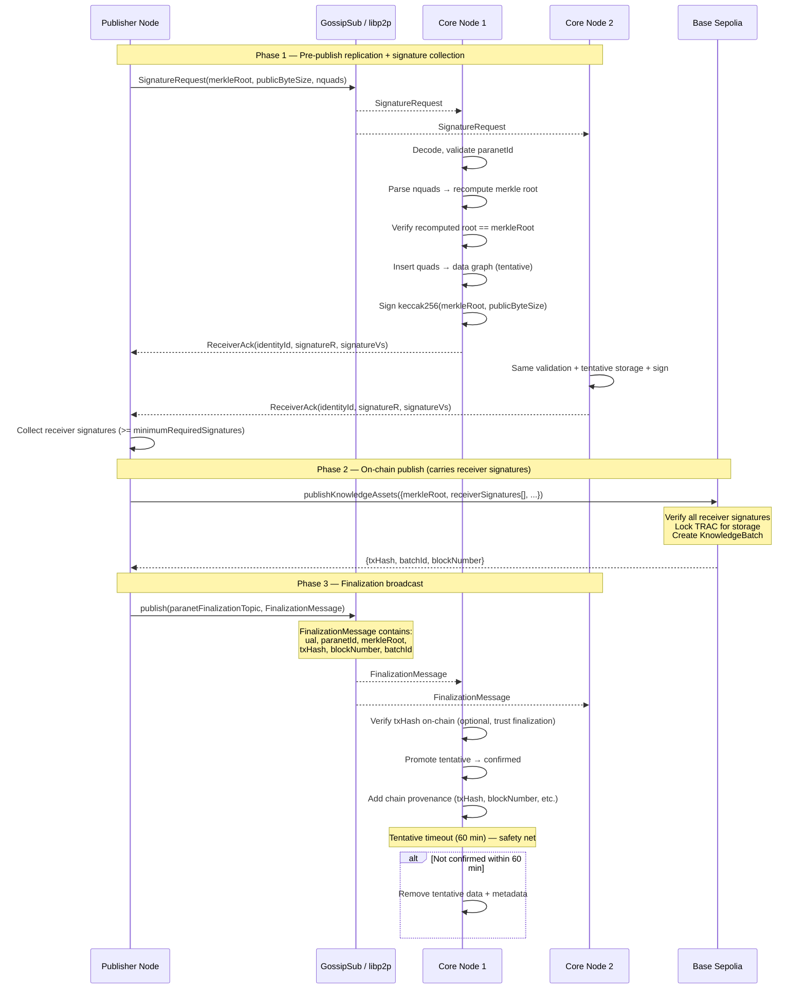
```mermaid
sequenceDiagram
    participant Pub as Publisher Node
    participant GS as GossipSub / libp2p
    participant R1 as Core Node 1
    participant R2 as Core Node 2
    participant Chain as Base Sepolia

    Note over Pub,R2: Phase 1 — Pre-publish replication + signature collection

    Pub->>GS: SignatureRequest(merkleRoot, publicByteSize, nquads)

    GS-->>R1: SignatureRequest
    GS-->>R2: SignatureRequest

    R1->>R1: Decode, validate paranetId
    R1->>R1: Parse nquads → recompute merkle root
    R1->>R1: Verify recomputed root == merkleRoot
    R1->>R1: Insert quads → data graph (tentative)
    R1->>R1: Sign keccak256(merkleRoot, publicByteSize)
    R1-->>Pub: ReceiverAck(identityId, signatureR, signatureVs)

    R2->>R2: Same validation + tentative storage + sign
    R2-->>Pub: ReceiverAck(identityId, signatureR, signatureVs)

    Pub->>Pub: Collect receiver signatures (>= minimumRequiredSignatures)

    Note over Pub,Chain: Phase 2 — On-chain publish (carries receiver signatures)

    Pub->>Chain: publishKnowledgeAssets({merkleRoot, receiverSignatures[], ...})
    Note over Chain: Verify all receiver signatures<br/>Lock TRAC for storage<br/>Create KnowledgeBatch
    Chain-->>Pub: {txHash, batchId, blockNumber}

    Note over Pub,R2: Phase 3 — Finalization broadcast

    Pub->>GS: publish(paranetFinalizationTopic, FinalizationMessage)
    Note over GS: FinalizationMessage contains:<br/>ual, paranetId, merkleRoot,<br/>txHash, blockNumber, batchId

    GS-->>R1: FinalizationMessage
    GS-->>R2: FinalizationMessage

    R1->>R1: Verify txHash on-chain (optional, trust finalization)
    R1->>R1: Promote tentative → confirmed
    R1->>R1: Add chain provenance (txHash, blockNumber, etc.)

    Note over R1: Tentative timeout (60 min) — safety net

    alt Not confirmed within 60 min
        R1->>R1: Remove tentative data + metadata
    end
```

> **Note on tentative data retention:**
> Core nodes store data tentatively when they sign the receiver ack. If the
> publisher fails to submit the chain tx (gas issues, crash), the tentative
> data expires after 60 minutes. This is safe — the TRAC was never locked,
> so no economic harm. The publisher can retry with a new signature collection.

---

## 4. Chain Event Confirmation

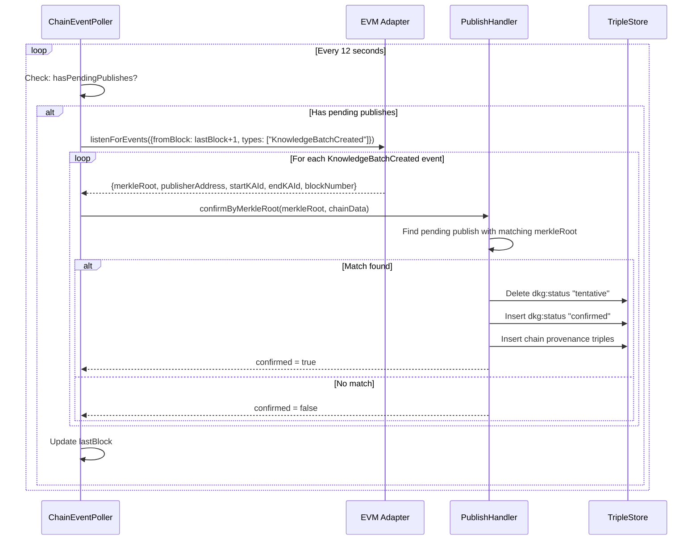
```mermaid
sequenceDiagram
    participant Poller as ChainEventPoller
    participant Chain as EVM Adapter
    participant PH as PublishHandler
    participant Store as TripleStore

    loop Every 12 seconds
        Poller->>Poller: Check: hasPendingPublishes?
        alt Has pending publishes
            Poller->>Chain: listenForEvents({fromBlock: lastBlock+1, types: ["KnowledgeBatchCreated"]})

            loop For each KnowledgeBatchCreated event
                Chain-->>Poller: {merkleRoot, publisherAddress, startKAId, endKAId, blockNumber}
                Poller->>PH: confirmByMerkleRoot(merkleRoot, chainData)
                PH->>PH: Find pending publish with matching merkleRoot
                alt Match found
                    PH->>Store: Delete dkg:status "tentative"
                    PH->>Store: Insert dkg:status "confirmed"
                    PH->>Store: Insert chain provenance triples
                    PH-->>Poller: confirmed = true
                else No match
                    PH-->>Poller: confirmed = false
                end
            end

            Poller->>Poller: Update lastBlock
        end
    end
```

### Chain Events Emitted

| Event | Source Contract | Fields | Purpose |
|-------|---------------|--------|---------|
| `KnowledgeBatchCreated` | KnowledgeAssetsStorage | batchId, publisher, merkleRoot, startKAId, endKAId, txHash | Confirm published data |
| `UALRangeReserved` | KnowledgeAssetsStorage | publisher, startId, endId | UAL allocation |
| `ParanetCreated` | ParanetV9Registry | paranetId, creator, accessPolicy | Discover new paranets |
| `KnowledgeBatchUpdated` | KnowledgeAssetsStorage | batchId, newMerkleRoot | Confirm data updates |

---

## 5. Workspace Writes

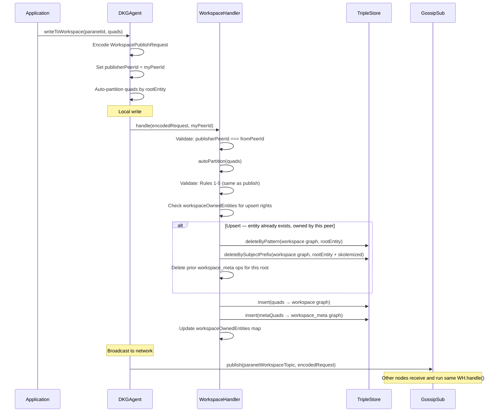
```mermaid
sequenceDiagram
    participant App as Application
    participant Agent as DKGAgent
    participant WH as WorkspaceHandler
    participant Store as TripleStore
    participant GS as GossipSub

    App->>Agent: writeToWorkspace(paranetId, quads)

    Agent->>Agent: Encode WorkspacePublishRequest
    Agent->>Agent: Set publisherPeerId = myPeerId
    Agent->>Agent: Auto-partition quads by rootEntity

    Note over Agent: Local write

    Agent->>WH: handle(encodedRequest, myPeerId)
    WH->>WH: Validate: publisherPeerId === fromPeerId
    WH->>WH: autoPartition(quads)
    WH->>WH: Validate: Rules 1-5 (same as publish)
    WH->>WH: Check workspaceOwnedEntities for upsert rights

    alt Upsert — entity already exists, owned by this peer
        WH->>Store: deleteByPattern(workspace graph, rootEntity)
        WH->>Store: deleteBySubjectPrefix(workspace graph, rootEntity + skolemized)
        WH->>WH: Delete prior workspace_meta ops for this root
    end

    WH->>Store: insert(quads → workspace graph)
    WH->>Store: insert(metaQuads → workspace_meta graph)
    WH->>WH: Update workspaceOwnedEntities map

    Note over Agent: Broadcast to network

    Agent->>GS: publish(paranetWorkspaceTopic, encodedRequest)

    Note over GS: Other nodes receive and run same WH.handle()
```

### Workspace Meta Triples

```turtle
# Workspace meta graph: did:dkg:paranet:{paranetId}/_workspace_meta

<urn:dkg:workspace:{paranetId}:{opId}>
    rdf:type              dkg:WorkspaceOperation ;
    prov:wasAttributedTo  "12D3KooW..." ;
    dkg:publishedAt       "2026-03-08T11:00:00Z"^^xsd:dateTime ;
    dkg:rootEntity        <https://example.org/entity/1> ;
    dkg:rootEntity        <https://example.org/entity/2> .
```

> **REVIEW: Workspace access control.**
> The current model is creator-only upsert — only the original publisher can
> overwrite their entities. This is enforced via `workspaceOwnedEntities` (in-memory map).
> **Problem:** On node restart, this map is empty. Any node can then claim
> ownership of unclaimed entities. Consider persisting ownership to workspace_meta.

---

## 5.1 Workspace-First Publish (Enshrine + Finalization)

When data is already shared via workspace, `enshrineFromWorkspace()` is the preferred publish path.
The core protocol invariant: **replication and signature collection happen BEFORE the on-chain
transaction**. The chain tx is the finalization step — it carries receiver signatures proving that
core nodes have already validated and stored the data.

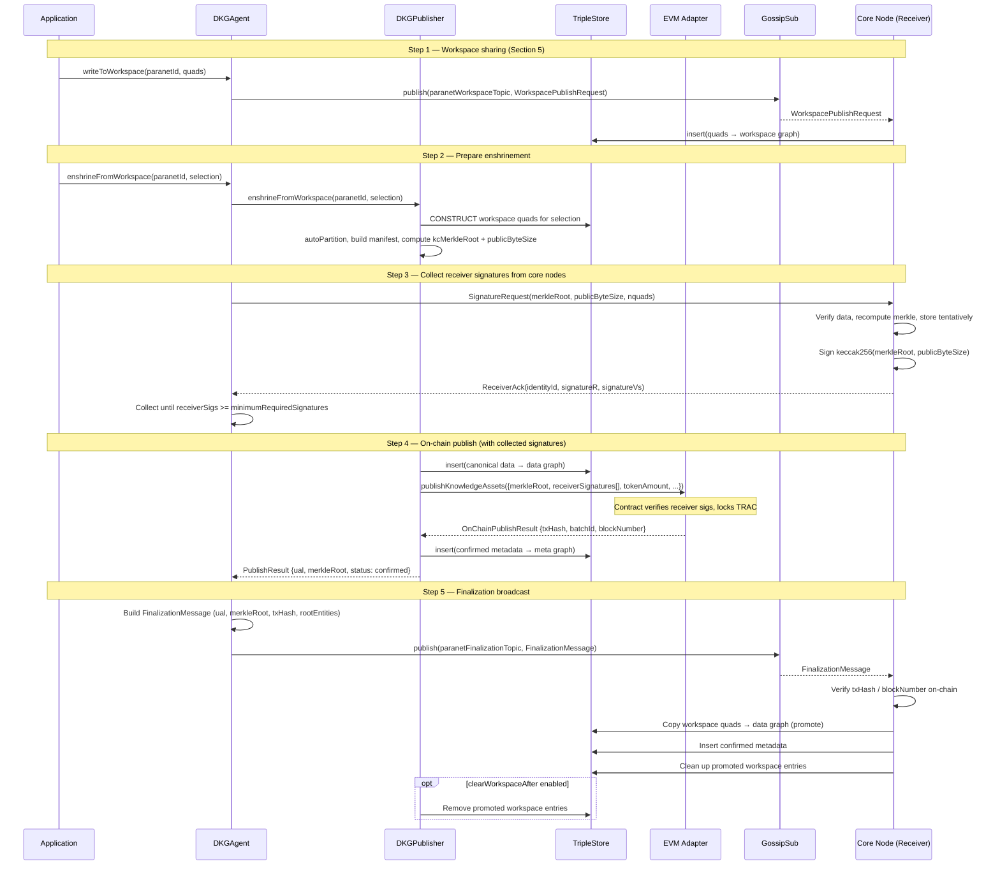
```mermaid
sequenceDiagram
    participant App as Application
    participant Agent as DKGAgent
    participant Pub as DKGPublisher
    participant Store as TripleStore
    participant Chain as EVM Adapter
    participant GS as GossipSub
    participant CoreNode as Core Node (Receiver)

    Note over App,CoreNode: Step 1 — Workspace sharing (Section 5)
    App->>Agent: writeToWorkspace(paranetId, quads)
    Agent->>GS: publish(paranetWorkspaceTopic, WorkspacePublishRequest)
    GS-->>CoreNode: WorkspacePublishRequest
    CoreNode->>Store: insert(quads → workspace graph)

    Note over App,CoreNode: Step 2 — Prepare enshrinement
    App->>Agent: enshrineFromWorkspace(paranetId, selection)
    Agent->>Pub: enshrineFromWorkspace(paranetId, selection)
    Pub->>Store: CONSTRUCT workspace quads for selection
    Pub->>Pub: autoPartition, build manifest, compute kcMerkleRoot + publicByteSize

    Note over App,CoreNode: Step 3 — Collect receiver signatures from core nodes
    Agent->>CoreNode: SignatureRequest(merkleRoot, publicByteSize, nquads)
    CoreNode->>CoreNode: Verify data, recompute merkle, store tentatively
    CoreNode->>CoreNode: Sign keccak256(merkleRoot, publicByteSize)
    CoreNode-->>Agent: ReceiverAck(identityId, signatureR, signatureVs)
    Agent->>Agent: Collect until receiverSigs >= minimumRequiredSignatures

    Note over App,CoreNode: Step 4 — On-chain publish (with collected signatures)
    Pub->>Store: insert(canonical data → data graph)
    Pub->>Chain: publishKnowledgeAssets({merkleRoot, receiverSignatures[], tokenAmount, ...})
    Note over Chain: Contract verifies receiver sigs, locks TRAC
    Chain-->>Pub: OnChainPublishResult {txHash, batchId, blockNumber}
    Pub->>Store: insert(confirmed metadata → meta graph)
    Pub-->>Agent: PublishResult {ual, merkleRoot, status: confirmed}

    Note over App,CoreNode: Step 5 — Finalization broadcast
    Agent->>Agent: Build FinalizationMessage (ual, merkleRoot, txHash, rootEntities)
    Agent->>GS: publish(paranetFinalizationTopic, FinalizationMessage)
    GS-->>CoreNode: FinalizationMessage

    CoreNode->>CoreNode: Verify txHash / blockNumber on-chain
    CoreNode->>Store: Copy workspace quads → data graph (promote)
    CoreNode->>Store: Insert confirmed metadata
    CoreNode->>Store: Clean up promoted workspace entries

    opt clearWorkspaceAfter enabled
        Pub->>Store: Remove promoted workspace entries
    end
```

### FinalizationMessage Fields

| Field | Type | Description |
|-------|------|-------------|
| `ual` | string | Published UAL |
| `paranetId` | string | Paranet being finalized |
| `kcMerkleRoot` | bytes | KC merkle root for integrity verification |
| `txHash` | string | On-chain transaction hash |
| `blockNumber` | uint64 | Block number of confirmation |
| `batchId` | uint64 | On-chain batch ID |
| `startKAId` / `endKAId` | uint64 | KA token ID range |
| `publisherAddress` | string | Publisher's on-chain address |
| `rootEntities` | repeated string | Which workspace entities were enshrined |
| `timestampMs` | uint64 | Message timestamp |
| `contextGraphId` | string (optional) | If enshrining to a context graph |

### Semantic Roles

| Concept | Purpose | Message |
|---------|---------|---------|
| **Workspace sharing** | Draft/shared state distribution | WorkspacePublishRequest |
| **Signature collection** | Pre-publish replication attestation | SignatureRequest → ReceiverAck |
| **Direct publish** | Convenience publish (replicate + sign + chain in one call) | PublishRequest + ReceiverAck |
| **Enshrine** | Commit workspace snapshot on-chain (with collected sigs) | On-chain tx |
| **Finalization** | Lightweight signal for peers to promote workspace → canonical | FinalizationMessage |

---

## 5.2 Detailed Workspace Insert

Full end-to-end flow for a workspace write, including validation, triple store
operations, GossipSub broadcast, and peer-side handling.

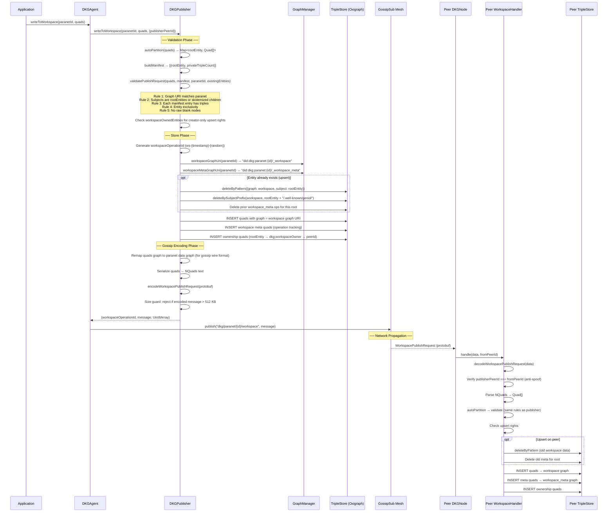
```mermaid
sequenceDiagram
    participant App as Application
    participant Agent as DKGAgent
    participant Pub as DKGPublisher
    participant GM as GraphManager
    participant Store as TripleStore (Oxigraph)
    participant GS as GossipSub Mesh
    participant Peer as Peer DKGNode
    participant PeerWH as Peer WorkspaceHandler
    participant PeerStore as Peer TripleStore

    App->>Agent: writeToWorkspace(paranetId, quads)
    Agent->>Pub: writeToWorkspace(paranetId, quads, {publisherPeerId})

    Note over Pub: ── Validation Phase ──

    Pub->>Pub: autoPartition(quads) → Map<rootEntity, Quad[]>
    Pub->>Pub: buildManifest → [{rootEntity, privateTripleCount}]
    Pub->>Pub: validatePublishRequest(quads, manifest, paranetId, existingEntities)
    Note over Pub: Rule 1: Graph URI matches paranet<br/>Rule 2: Subjects are rootEntities or skolemized children<br/>Rule 3: Each manifest entry has triples<br/>Rule 4: Entity exclusivity<br/>Rule 5: No raw blank nodes

    Pub->>Pub: Check workspaceOwnedEntities for creator-only upsert rights

    Note over Pub: ── Store Phase ──

    Pub->>Pub: Generate workspaceOperationId (ws-{timestamp}-{random})
    Pub->>GM: workspaceGraphUri(paranetId) → "did:dkg:paranet:{id}/_workspace"
    Pub->>GM: workspaceMetaGraphUri(paranetId) → "did:dkg:paranet:{id}/_workspace_meta"

    opt Entity already exists (upsert)
        Pub->>Store: deleteByPattern({graph: workspace, subject: rootEntity})
        Pub->>Store: deleteBySubjectPrefix(workspace, rootEntity + "/.well-known/genid/")
        Pub->>Store: Delete prior workspace_meta ops for this root
    end

    Pub->>Store: INSERT quads with graph = workspace graph URI
    Pub->>Store: INSERT workspace meta quads (operation tracking)
    Pub->>Store: INSERT ownership quads (rootEntity → dkg:workspaceOwner → peerId)

    Note over Pub: ── Gossip Encoding Phase ──

    Pub->>Pub: Remap quads graph to paranet data graph (for gossip wire format)
    Pub->>Pub: Serialize quads → NQuads text
    Pub->>Pub: encodeWorkspacePublishRequest(protobuf)
    Pub->>Pub: Size guard: reject if encoded message > 512 KB

    Pub-->>Agent: {workspaceOperationId, message: Uint8Array}

    Agent->>GS: publish("dkg/paranet/{id}/workspace", message)

    Note over GS: ── Network Propagation ──

    GS-->>Peer: WorkspacePublishRequest (protobuf)
    Peer->>PeerWH: handle(data, fromPeerId)

    PeerWH->>PeerWH: decodeWorkspacePublishRequest(data)
    PeerWH->>PeerWH: Verify publisherPeerId === fromPeerId (anti-spoof)
    PeerWH->>PeerWH: Parse NQuads → Quad[]
    PeerWH->>PeerWH: autoPartition → validate (same rules as publisher)
    PeerWH->>PeerWH: Check upsert rights

    opt Upsert on peer
        PeerWH->>PeerStore: deleteByPattern (old workspace data)
        PeerWH->>PeerStore: Delete old meta for root
    end

    PeerWH->>PeerStore: INSERT quads → workspace graph
    PeerWH->>PeerStore: INSERT meta quads → workspace_meta graph
    PeerWH->>PeerStore: INSERT ownership quads
```

### Workspace Write Triples Produced

#### Workspace Graph: `did:dkg:paranet:{id}/_workspace`

```turtle
<https://example.org/entity/1>
    rdf:type      schema:Article ;
    schema:name   "Decentralized AI" .
```

#### Workspace Meta Graph: `did:dkg:paranet:{id}/_workspace_meta`

```turtle
<urn:dkg:workspace:{paranetId}:{opId}>
    rdf:type              dkg:WorkspaceOperation ;
    prov:wasAttributedTo  "12D3KooW..." ;
    dkg:publishedAt       "2026-03-08T11:00:00Z"^^xsd:dateTime ;
    dkg:rootEntity        <https://example.org/entity/1> .

<https://example.org/entity/1>
    dkg:workspaceOwner    "12D3KooW..." .
```

---

## 5.3 Detailed Paranet Enshrinement (Workspace → Data Graph)

Full end-to-end flow for `enshrineFromWorkspace()` targeting the paranet's canonical
data graph. The key invariant: **data replication and signature collection happen
BEFORE the on-chain transaction**. The chain tx carries receiver signatures proving
that core nodes have already stored the data.

### Design decisions

- **Replicate-then-publish**: Core nodes must attest (via ECDSA signature) that they
  hold the data before the publisher submits the on-chain tx. This ensures the TRAC
  payment has economic meaning — it pays core nodes who are provably storing data.
- **Receiver signatures**: Each core node signs `keccak256(merkleRoot, publicByteSize)`
  with its operational key. The contract verifies these signatures against registered
  node identities. The publisher collects ≥ `minimumRequiredSignatures` before proceeding.
- **Two-phase finalization**: After the chain tx confirms, the publisher sends a
  lightweight FinalizationMessage so peers can promote workspace → canonical. Peers
  also independently verify via ChainEventPoller.

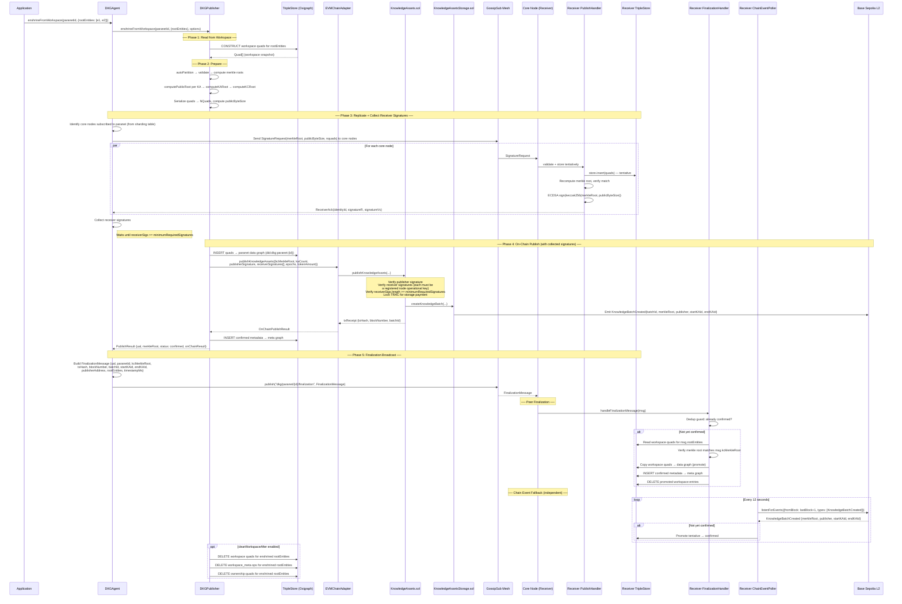
```mermaid
sequenceDiagram
    participant App as Application
    participant Agent as DKGAgent
    participant Pub as DKGPublisher
    participant Store as TripleStore (Oxigraph)
    participant Chain as EVMChainAdapter
    participant KA as KnowledgeAssets.sol
    participant KAS as KnowledgeAssetsStorage.sol
    participant GS as GossipSub Mesh
    participant CoreNode as Core Node (Receiver)
    participant RcvHandler as Receiver PublishHandler
    participant RcvStore as Receiver TripleStore
    participant FH as Receiver FinalizationHandler
    participant Poller as Receiver ChainEventPoller
    participant L2 as Base Sepolia L2

    App->>Agent: enshrineFromWorkspace(paranetId, {rootEntities: [e1, e2]})
    Agent->>Pub: enshrineFromWorkspace(paranetId, {rootEntities}, options)

    Note over Pub: ── Phase 1: Read from Workspace ──

    Pub->>Store: CONSTRUCT workspace quads for rootEntities
    Store-->>Pub: Quad[] (workspace snapshot)

    Note over Pub: ── Phase 2: Prepare ──

    Pub->>Pub: autoPartition → validate → compute merkle roots
    Pub->>Pub: computePublicRoot per KA → computeKARoot → computeKCRoot
    Pub->>Pub: Serialize quads → NQuads, compute publicByteSize

    Note over Agent,RcvStore: ── Phase 3: Replicate + Collect Receiver Signatures ──

    Agent->>Agent: Identify core nodes subscribed to paranet (from sharding table)
    Agent->>GS: Send SignatureRequest(merkleRoot, publicByteSize, nquads) to core nodes

    par For each core node
        GS->>CoreNode: SignatureRequest
        CoreNode->>RcvHandler: validate + store tentatively
        RcvHandler->>RcvStore: store.insert(quads) — tentative
        RcvHandler->>RcvHandler: Recompute merkle root, verify match
        RcvHandler->>RcvHandler: ECDSA sign(keccak256(merkleRoot, publicByteSize))
        RcvHandler-->>Agent: ReceiverAck(identityId, signatureR, signatureVs)
    end

    Agent->>Agent: Collect receiver signatures
    Note right of Agent: Waits until receiverSigs >= minimumRequiredSignatures

    Note over Pub,L2: ── Phase 4: On-Chain Publish (with collected signatures) ──

    Pub->>Store: INSERT quads → paranet data graph (did:dkg:paranet:{id})
    Pub->>Chain: publishKnowledgeAssets({kcMerkleRoot, kaCount,<br/>  publisherSignature, receiverSignatures[], epochs, tokenAmount})

    Chain->>KA: publishKnowledgeAssets(...)
    Note over KA: Verify publisher signature<br/>Verify receiver signatures (each must be<br/>a registered node operational key)<br/>Verify receiverSigs.length >= minimumRequiredSignatures<br/>Lock TRAC for storage payment
    KA->>KAS: createKnowledgeBatch(...)
    KAS->>L2: Emit KnowledgeBatchCreated(batchId, merkleRoot, publisher, startKAId, endKAId)
    KA-->>Chain: txReceipt {txHash, blockNumber, batchId}
    Chain-->>Pub: OnChainPublishResult

    Pub->>Store: INSERT confirmed metadata → meta graph
    Pub-->>Agent: PublishResult {ual, merkleRoot, status: confirmed, onChainResult}

    Note over Agent,RcvStore: ── Phase 5: Finalization Broadcast ──

    Agent->>Agent: Build FinalizationMessage {ual, paranetId, kcMerkleRoot,<br/>  txHash, blockNumber, batchId, startKAId, endKAId,<br/>  publisherAddress, rootEntities, timestampMs}
    Agent->>GS: publish("dkg/paranet/{id}/finalization", FinalizationMessage)
    GS-->>CoreNode: FinalizationMessage

    Note over CoreNode: ── Peer Finalization ──

    CoreNode->>FH: handleFinalizationMessage(msg)
    FH->>FH: Dedup guard: already confirmed?
    alt Not yet confirmed
        FH->>RcvStore: Read workspace quads for msg.rootEntities
        FH->>FH: Verify merkle root matches msg.kcMerkleRoot
        FH->>RcvStore: Copy workspace quads → data graph (promote)
        FH->>RcvStore: INSERT confirmed metadata → meta graph
        FH->>RcvStore: DELETE promoted workspace entries
    end

    Note over CoreNode: ── Chain Event Fallback (independent) ──

    loop Every 12 seconds
        Poller->>L2: listenForEvents({fromBlock: lastBlock+1, types: [KnowledgeBatchCreated]})
        L2-->>Poller: KnowledgeBatchCreated {merkleRoot, publisher, startKAId, endKAId}
        alt Not yet confirmed
            Poller->>RcvStore: Promote tentative → confirmed
        end
    end

    opt clearWorkspaceAfter enabled
        Pub->>Store: DELETE workspace quads for enshrined rootEntities
        Pub->>Store: DELETE workspace_meta ops for enshrined rootEntities
        Pub->>Store: DELETE ownership quads for enshrined rootEntities
    end
```

### Receiver Signature Verification

```
Receiver (off-chain):
  1. Receive quads + merkle root from publisher
  2. Store quads tentatively
  3. Recompute merkle root from received quads, verify match
  4. messageHash = keccak256(abi.encodePacked(merkleRoot, publicByteSize))
  5. ethHash = ECDSA.toEthSignedMessageHash(messageHash)
  6. Sign ethHash with operational key → (r, vs)
  7. Return ReceiverAck(identityId, r, vs)

Contract (on-chain):
  1. Recompute messageHash from merkleRoot + publicByteSize
  2. For each receiver signature:
     a. ECDSA.recover(ethHash, r, vs) → address
     b. IdentityStorage.getIdentityId(address) → identityId
     c. Verify identityId is registered (node has an identity)
  3. Verify receiverSigs.length >= minimumRequiredSignatures
  4. Create KnowledgeBatch, lock TRAC
```

### On-Chain Events Emitted

| Event | Contract | Fields | Consumer |
|-------|----------|--------|----------|
| `KnowledgeBatchCreated` | KnowledgeAssetsStorage | batchId, publisher, merkleRoot, startKAId, endKAId | ChainEventPoller |
| `UALRangeReserved` | KnowledgeAssetsStorage | publisher, startId, endId | (informational) |

---

## 5.4 Detailed Context Graph Enshrinement (Workspace → Context Graph)

Full end-to-end flow for `enshrineFromWorkspace()` targeting a context graph.
Extends paranet enshrinement with **two layers of signatures**:

1. **Receiver signatures (Layer 1 — Storage)**: Core nodes sign attesting they have the
   data. Same as paranet publish. Required for the on-chain KC creation.
2. **Participant signatures (Layer 2 — Governance)**: Context graph participants sign
   approving the data entering their shared context. Can be edge nodes (same identity
   structure as core nodes, but without minimum stake — not in sharding table).

### Design decisions

- **Edge node identity**: Edge nodes use the same `Profile.createProfile()` as core nodes.
  The only difference is they don't stake above `minimumStake`, so they're not in the
  sharding table. An edge node can be promoted to core by staking later.
- **Participant signature message**: `keccak256(contextGraphId, merkleRoot)` — uses
  merkleRoot instead of batchId so signatures can be collected BEFORE the chain tx.
- **Two contract functions**: `publishToContextGraph()` combines KC creation + context
  graph linkage atomically. `addBatchToContextGraph()` is kept for linking
  already-published KCs to a context graph.
- **Combined atomic transaction**: `publishToContextGraph()` creates the KC and links
  it to the context graph in a single tx. Both receiver signatures and participant
  signatures are submitted together.

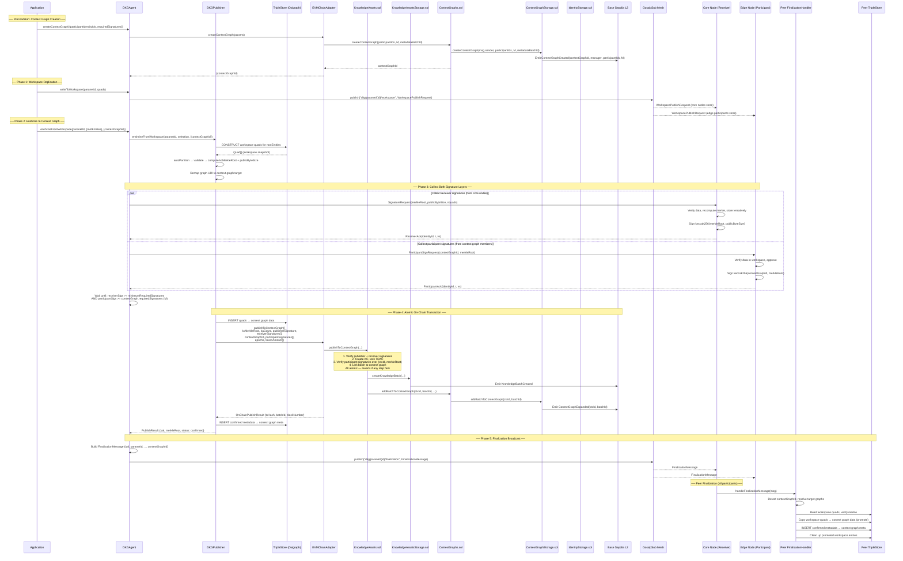
```mermaid
sequenceDiagram
    participant App as Application
    participant Agent as DKGAgent
    participant Pub as DKGPublisher
    participant Store as TripleStore (Oxigraph)
    participant Chain as EVMChainAdapter
    participant KA as KnowledgeAssets.sol
    participant KAS as KnowledgeAssetsStorage.sol
    participant CG as ContextGraphs.sol
    participant CGS as ContextGraphStorage.sol
    participant IS as IdentityStorage.sol
    participant L2 as Base Sepolia L2
    participant GS as GossipSub Mesh
    participant CoreNode as Core Node (Receiver)
    participant EdgeNode as Edge Node (Participant)
    participant FH as Peer FinalizationHandler
    participant PeerStore as Peer TripleStore

    Note over App: ── Precondition: Context Graph Creation ──

    App->>Agent: createContextGraph({participantIdentityIds, requiredSignatures})
    Agent->>Chain: createContextGraph(params)
    Chain->>CG: createContextGraph(participantIds, M, metadataBatchId)
    CG->>CGS: createContextGraph(msg.sender, participantIds, M, metadataBatchId)
    CGS->>L2: Emit ContextGraphCreated(contextGraphId, manager, participantIds, M)
    CG-->>Chain: contextGraphId
    Chain-->>Agent: {contextGraphId}

    Note over App: ── Phase 1: Workspace Replication ──

    App->>Agent: writeToWorkspace(paranetId, quads)
    Agent->>GS: publish("dkg/paranet/{id}/workspace", WorkspacePublishRequest)
    GS-->>CoreNode: WorkspacePublishRequest (core nodes store)
    GS-->>EdgeNode: WorkspacePublishRequest (edge participants store)

    Note over App: ── Phase 2: Enshrine to Context Graph ──

    App->>Agent: enshrineFromWorkspace(paranetId, {rootEntities}, {contextGraphId})
    Agent->>Pub: enshrineFromWorkspace(paranetId, selection, {contextGraphId})

    Pub->>Store: CONSTRUCT workspace quads for rootEntities
    Store-->>Pub: Quad[] (workspace snapshot)
    Pub->>Pub: autoPartition → validate → compute kcMerkleRoot + publicByteSize
    Pub->>Pub: Remap graph URI to context graph target

    Note over Agent,EdgeNode: ── Phase 3: Collect Both Signature Layers ──

    par Collect receiver signatures (from core nodes)
        Agent->>CoreNode: SignatureRequest(merkleRoot, publicByteSize, nquads)
        CoreNode->>CoreNode: Verify data, recompute merkle, store tentatively
        CoreNode->>CoreNode: Sign keccak256(merkleRoot, publicByteSize)
        CoreNode-->>Agent: ReceiverAck(identityId, r, vs)
    and Collect participant signatures (from context graph members)
        Agent->>EdgeNode: ParticipantSignRequest(contextGraphId, merkleRoot)
        EdgeNode->>EdgeNode: Verify data in workspace, approve
        EdgeNode->>EdgeNode: Sign keccak256(contextGraphId, merkleRoot)
        EdgeNode-->>Agent: ParticipantAck(identityId, r, vs)
    end

    Agent->>Agent: Wait until: receiverSigs >= minimumRequiredSignatures<br/>AND participantSigs >= contextGraph.requiredSignatures (M)

    Note over Pub,L2: ── Phase 4: Atomic On-Chain Transaction ──

    Pub->>Store: INSERT quads → context graph data
    Pub->>Chain: publishToContextGraph({<br/>  kcMerkleRoot, kaCount, publisherSignature,<br/>  receiverSignatures[],<br/>  contextGraphId, participantSignatures[],<br/>  epochs, tokenAmount})

    Chain->>KA: publishToContextGraph(...)
    Note over KA: 1. Verify publisher + receiver signatures<br/>2. Create KC, lock TRAC<br/>3. Verify participant signatures over (ctxId, merkleRoot)<br/>4. Link batch to context graph<br/>All atomic — reverts if any step fails
    KA->>KAS: createKnowledgeBatch(...)
    KAS->>L2: Emit KnowledgeBatchCreated
    KA->>CG: addBatchToContextGraph(ctxId, batchId, ...)
    CG->>CGS: addBatchToContextGraph(ctxId, batchId)
    CGS->>L2: Emit ContextGraphExpanded(ctxId, batchId)
    Chain-->>Pub: OnChainPublishResult {txHash, batchId, blockNumber}

    Pub->>Store: INSERT confirmed metadata → context graph meta
    Pub-->>Agent: PublishResult {ual, merkleRoot, status: confirmed}

    Note over Agent,PeerStore: ── Phase 5: Finalization Broadcast ──

    Agent->>Agent: Build FinalizationMessage {ual, paranetId, ..., contextGraphId}
    Agent->>GS: publish("dkg/paranet/{id}/finalization", FinalizationMessage)
    GS-->>CoreNode: FinalizationMessage
    GS-->>EdgeNode: FinalizationMessage

    Note over CoreNode: ── Peer Finalization (all participants) ──

    CoreNode->>FH: handleFinalizationMessage(msg)
    FH->>FH: Detect contextGraphId, resolve target graphs
    FH->>PeerStore: Read workspace quads, verify merkle
    FH->>PeerStore: Copy workspace quads → context graph data (promote)
    FH->>PeerStore: INSERT confirmed metadata → context graph meta
    FH->>PeerStore: Clean up promoted workspace entries
```

### Two Signature Layers

| Layer | Purpose | Signers | Message signed | When collected |
|-------|---------|---------|----------------|----------------|
| **Receiver (L1)** | Storage attestation | Core nodes (in sharding table) | `keccak256(merkleRoot, publicByteSize)` | During pre-publish replication |
| **Participant (L2)** | Governance / access control | Context graph participants (edge or core) | `keccak256(contextGraphId, merkleRoot)` | During pre-publish approval |

### Identity Model

| Node type | Identity | Stake | Sharding table | Can sign as |
|-----------|----------|-------|----------------|-------------|
| **Core node** | Full profile (createProfile) | ≥ minimumStake | Yes | Receiver + Participant |
| **Edge node** | Full profile (createProfile) | < minimumStake or 0 | No | Participant only |

Edge → Core promotion: An edge node stakes above `minimumStake` → automatically added
to sharding table → can now serve as receiver (core node).

### Contract Functions

**`publishToContextGraph()`** — Atomic combined operation:
1. Creates KC with receiver signatures (same as `publishKnowledgeAssets`)
2. Links KC to context graph with participant signatures
3. Single transaction — both succeed or both revert

**`addBatchToContextGraph()`** — For already-published KCs:
1. Links an existing batch to a context graph
2. Requires participant signatures over `(contextGraphId, merkleRoot)`
3. Useful when data was published to the paranet first, then added to a context graph later

### Context Graph On-Chain Events

| Event | Contract | Fields | Consumer |
|-------|----------|--------|----------|
| `ContextGraphCreated` | ContextGraphStorage | contextGraphId, manager, participantIds, M | Agent (creation receipt) |
| `ContextGraphExpanded` | ContextGraphStorage | contextGraphId, batchId | ChainEventPoller (future) |
| `KnowledgeBatchCreated` | KnowledgeAssetsStorage | batchId, merkleRoot, publisher, range | ChainEventPoller |

### Participant Signature Verification

```
Participant (off-chain):
  1. Receive workspace data or verify data already in workspace
  2. Approve the data entering the context graph
  3. digest = keccak256(abi.encodePacked(contextGraphId, merkleRoot))
  4. ethHash = ECDSA.toEthSignedMessageHash(digest)
  5. Sign ethHash with operational key → (r, vs)
  6. Return ParticipantAck(identityId, r, vs)

Contract (on-chain):
  1. Recompute digest from contextGraphId + merkleRoot
  2. For each participant signature:
     a. ECDSA.recover(ethHash, r, vs) → address
     b. IdentityStorage.getIdentityId(address) → identityId
     c. Verify identityId is a context graph participant
  3. Verify unique valid signers >= requiredSignatures (M)
  4. Link batch to context graph
```

---

## 6. Update Operation

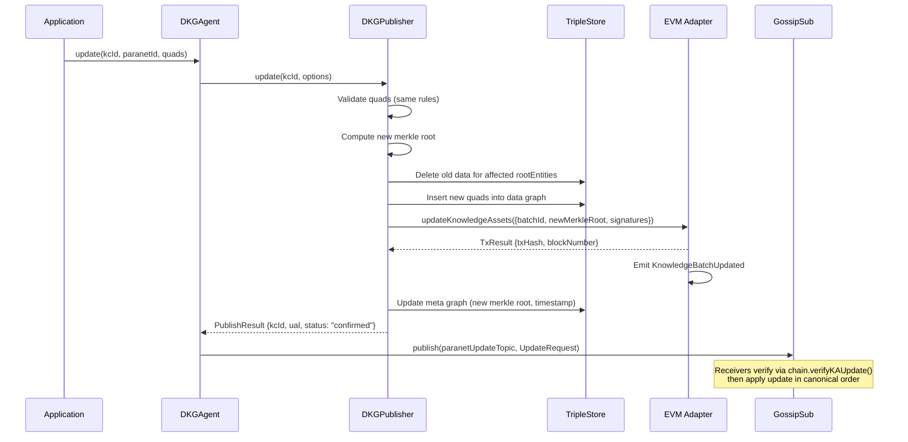
```mermaid
sequenceDiagram
    participant App as Application
    participant Agent as DKGAgent
    participant Pub as DKGPublisher
    participant Store as TripleStore
    participant Chain as EVM Adapter
    participant GS as GossipSub

    App->>Agent: update(kcId, paranetId, quads)

    Agent->>Pub: update(kcId, options)

    Pub->>Pub: Validate quads (same rules)
    Pub->>Pub: Compute new merkle root

    Pub->>Store: Delete old data for affected rootEntities
    Pub->>Store: Insert new quads into data graph

    Pub->>Chain: updateKnowledgeAssets({batchId, newMerkleRoot, signatures})
    Chain-->>Pub: TxResult {txHash, blockNumber}
    Chain->>Chain: Emit KnowledgeBatchUpdated

    Pub->>Store: Update meta graph (new merkle root, timestamp)
    Pub-->>Agent: PublishResult {kcId, ual, status: "confirmed"}

    Agent->>GS: publish(paranetUpdateTopic, UpdateRequest)

    Note over GS: Receivers verify via chain.verifyKAUpdate()<br/>then apply update in canonical order
```

> **REVIEW: Update ordering.**
> Updates are applied in canonical `(blockNumber, txIndex)` order. This is
> correct for consistency, but there's no mechanism for conflict resolution
> if two publishers update overlapping entities in the same block. The first
> tx wins (by txIndex), but the second publisher gets no notification of
> the conflict.

---

## 7. Query Operation

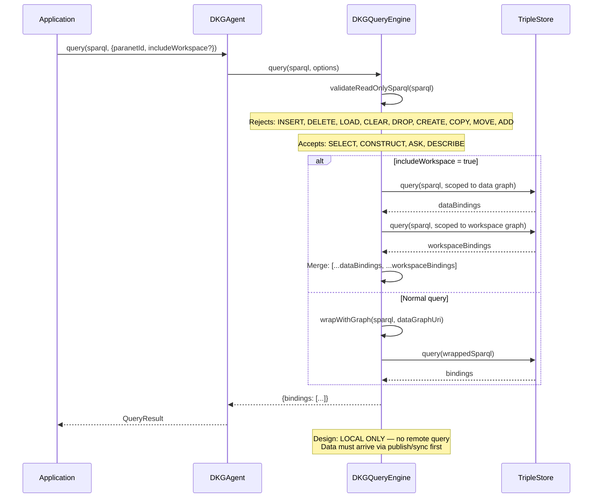
```mermaid
sequenceDiagram
    participant App as Application
    participant Agent as DKGAgent
    participant QE as DKGQueryEngine
    participant Store as TripleStore

    App->>Agent: query(sparql, {paranetId, includeWorkspace?})

    Agent->>QE: query(sparql, options)

    QE->>QE: validateReadOnlySparql(sparql)
    Note over QE: Rejects: INSERT, DELETE, LOAD, CLEAR, DROP, CREATE, COPY, MOVE, ADD
    Note over QE: Accepts: SELECT, CONSTRUCT, ASK, DESCRIBE

    alt includeWorkspace = true
        QE->>Store: query(sparql, scoped to data graph)
        Store-->>QE: dataBindings
        QE->>Store: query(sparql, scoped to workspace graph)
        Store-->>QE: workspaceBindings
        QE->>QE: Merge: [...dataBindings, ...workspaceBindings]
    else Normal query
        QE->>QE: wrapWithGraph(sparql, dataGraphUri)
        QE->>Store: query(wrappedSparql)
        Store-->>QE: bindings
    end

    QE-->>Agent: {bindings: [...]}
    Agent-->>App: QueryResult

    Note over QE: Design: LOCAL ONLY — no remote query<br/>Data must arrive via publish/sync first
```

### Query Access Policy

```typescript
interface ParanetQueryPolicy {
  policy: 'deny' | 'public' | 'allowList';
  allowedPeers?: string[];
  allowedLookupTypes?: LookupType[];
  sparqlEnabled?: boolean;
  sparqlTimeout?: number;
  sparqlMaxResults?: number;
}
```

> **REVIEW: Query isolation.**
> The query engine is intentionally local-only (Spec §1.6 Store Isolation).
> This means a node can only query data it has received via publish/sync.
> **Implication for apps:** If an app needs data from a paranet it hasn't
> synced, it must first sync from a peer. There's no query federation.
> This is a conscious design choice for privacy/security, but may frustrate
> app developers expecting a "world computer" model.

---

## 8. Peer Sync

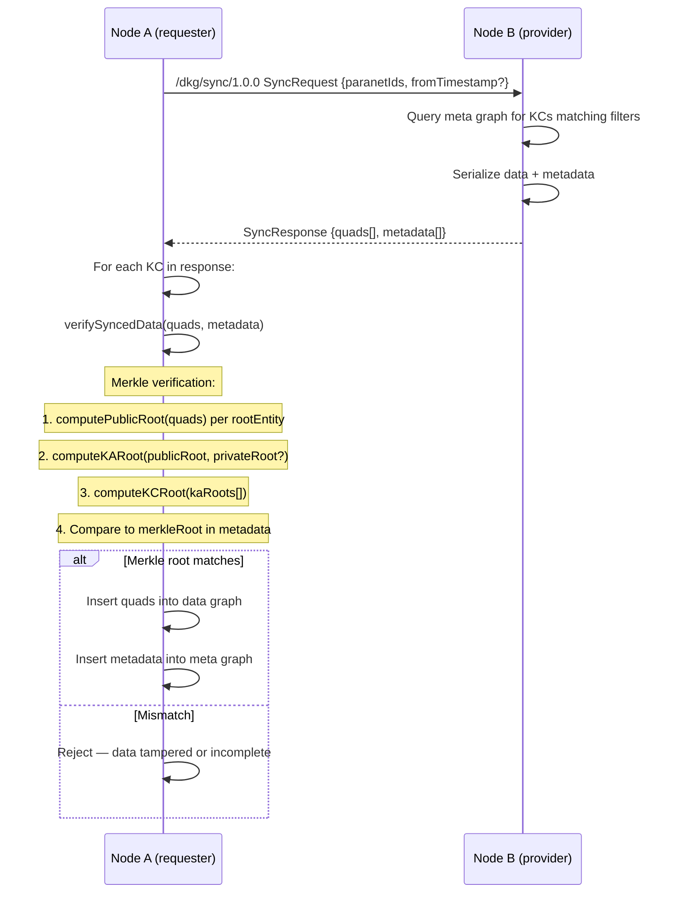
```mermaid
sequenceDiagram
    participant A as Node A (requester)
    participant B as Node B (provider)

    A->>B: /dkg/sync/1.0.0 SyncRequest {paranetIds, fromTimestamp?}

    B->>B: Query meta graph for KCs matching filters
    B->>B: Serialize data + metadata

    B-->>A: SyncResponse {quads[], metadata[]}

    A->>A: For each KC in response:
    A->>A: verifySyncedData(quads, metadata)

    Note over A: Merkle verification:
    Note over A: 1. computePublicRoot(quads) per rootEntity
    Note over A: 2. computeKARoot(publicRoot, privateRoot?)
    Note over A: 3. computeKCRoot(kaRoots[])
    Note over A: 4. Compare to merkleRoot in metadata

    alt Merkle root matches
        A->>A: Insert quads into data graph
        A->>A: Insert metadata into meta graph
    else Mismatch
        A->>A: Reject — data tampered or incomplete
    end
```

### Workspace Sync

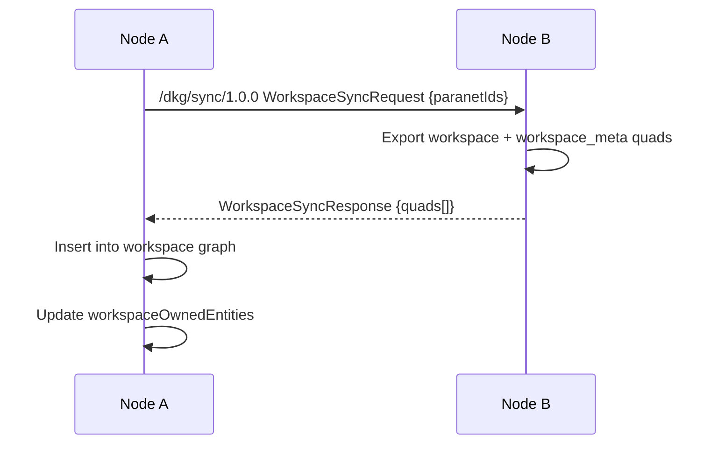
```mermaid
sequenceDiagram
    participant A as Node A
    participant B as Node B

    A->>B: /dkg/sync/1.0.0 WorkspaceSyncRequest {paranetIds}

    B->>B: Export workspace + workspace_meta quads
    B-->>A: WorkspaceSyncResponse {quads[]}

    A->>A: Insert into workspace graph
    A->>A: Update workspaceOwnedEntities
```

> **REVIEW: Sync completeness.**
> Workspace sync does NOT include the `workspaceOwnedEntities` map.
> A synced node cannot enforce creator-only upsert for workspace entities
> it received via sync. This is a known limitation.

---

## 9. Paranet Discovery

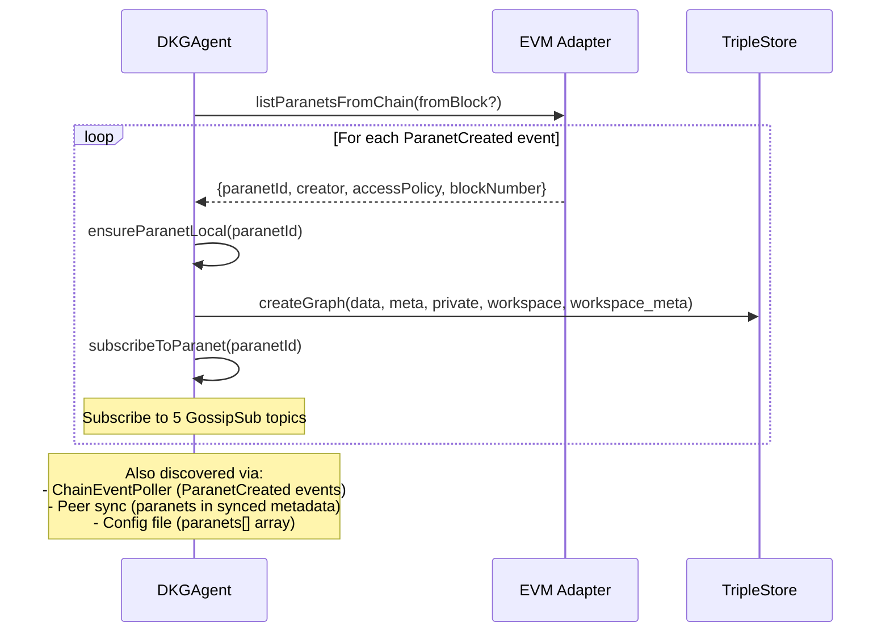
```mermaid
sequenceDiagram
    participant Agent as DKGAgent
    participant Chain as EVM Adapter
    participant Store as TripleStore

    Agent->>Chain: listParanetsFromChain(fromBlock?)

    loop For each ParanetCreated event
        Chain-->>Agent: {paranetId, creator, accessPolicy, blockNumber}
        Agent->>Agent: ensureParanetLocal(paranetId)
        Agent->>Store: createGraph(data, meta, private, workspace, workspace_meta)
        Agent->>Agent: subscribeToParanet(paranetId)
        Note over Agent: Subscribe to 5 GossipSub topics
    end

    Note over Agent: Also discovered via:<br/>- ChainEventPoller (ParanetCreated events)<br/>- Peer sync (paranets in synced metadata)<br/>- Config file (paranets[] array)
```

---

## 10. GossipSub Topic Architecture

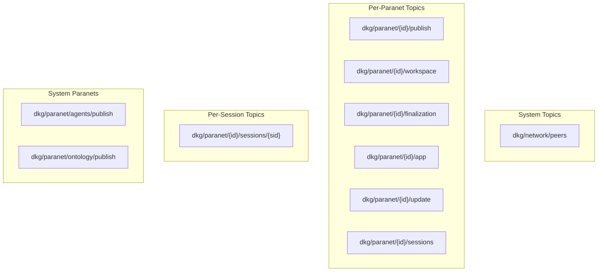
```mermaid
graph TB
    subgraph "System Topics"
        PEERS["dkg/network/peers"]
    end

    subgraph "Per-Paranet Topics"
        PUB["dkg/paranet/{id}/publish"]
        WS["dkg/paranet/{id}/workspace"]
        FIN["dkg/paranet/{id}/finalization"]
        APP["dkg/paranet/{id}/app"]
        UPD["dkg/paranet/{id}/update"]
        SESS["dkg/paranet/{id}/sessions"]
    end

    subgraph "Per-Session Topics"
        S1["dkg/paranet/{id}/sessions/{sid}"]
    end

    subgraph "System Paranets"
        AGENTS["dkg/paranet/agents/publish"]
        ONTO["dkg/paranet/ontology/publish"]
    end
```

| Topic | Purpose | Message Types |
|-------|---------|---------------|
| `dkg/network/peers` | Peer discovery & health | Peer announce, capabilities |
| `dkg/paranet/{id}/publish` | Published data broadcast | PublishRequest (encoded protobuf) |
| `dkg/paranet/{id}/workspace` | Workspace writes | WorkspacePublishRequest |
| `dkg/paranet/{id}/finalization` | Post-enshrine promotion signal | FinalizationMessage |
| `dkg/paranet/{id}/app` | Application coordination | JSON app messages (game, etc.) |
| `dkg/paranet/{id}/update` | KA updates | UpdateRequest |
| `dkg/paranet/{id}/sessions` | Multi-party sessions | Session proposals, coordination |
| `dkg/paranet/{id}/sessions/{sid}` | Per-session messages | Round data, commitments |

> **REVIEW: App topic is untyped.**
> The `app` topic carries JSON messages with an `app` field for routing (e.g.
> `"origin-trail-game"`). All apps on the same paranet share a single topic.
> **Risk:** A malicious app could flood the topic, affecting all apps. Consider
> per-app subtopics: `dkg/paranet/{id}/app/{appId}`.

---

## 11. Storage Model

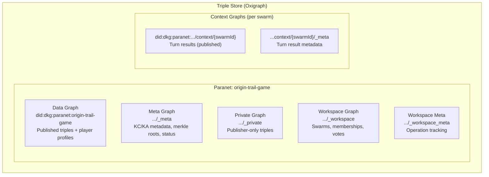
```mermaid
graph TB
    subgraph "Triple Store (Oxigraph)"
        subgraph "Paranet: origin-trail-game"
            DATA["Data Graph<br/>did:dkg:paranet:origin-trail-game<br/>Published triples + player profiles"]
            META["Meta Graph<br/>.../_meta<br/>KC/KA metadata, merkle roots, status"]
            PRIV["Private Graph<br/>.../_private<br/>Publisher-only triples"]
            WS["Workspace Graph<br/>.../_workspace<br/>Swarms, memberships, votes"]
            WS_META["Workspace Meta<br/>.../_workspace_meta<br/>Operation tracking"]
        end

        subgraph "Context Graphs (per swarm)"
            CTX["did:dkg:paranet:.../context/{swarmId}<br/>Turn results (published)"]
            CTX_META["...context/{swarmId}/_meta<br/>Turn result metadata"]
        end
    end
```

### Graph URI Patterns

| Pattern | Example | Content |
|---------|---------|---------|
| `did:dkg:paranet:{id}` | `did:dkg:paranet:origin-trail-game` | Published data |
| `did:dkg:paranet:{id}/_meta` | `.../_meta` | KC/KA metadata |
| `did:dkg:paranet:{id}/_private` | `.../_private` | Private triples |
| `did:dkg:paranet:{id}/_workspace` | `.../_workspace` | Workspace data |
| `did:dkg:paranet:{id}/_workspace_meta` | `.../_workspace_meta` | Workspace ops |
| `did:dkg:paranet:{id}/context/{ctxId}` | `.../context/swarm-abc123` | Context graph data |
| `did:dkg:paranet:{id}/context/{ctxId}/_meta` | `.../context/swarm-abc123/_meta` | Context graph meta |

---

## 12. Merkle Tree & Proof System

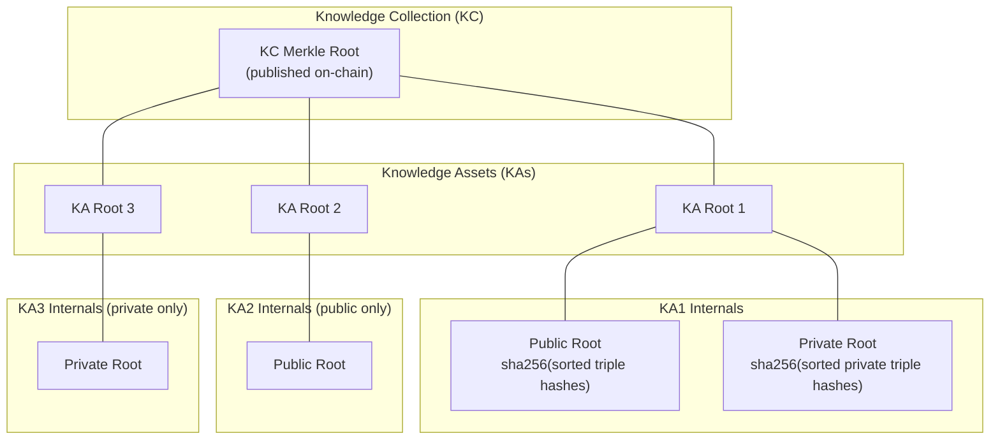
```mermaid
graph TB
    subgraph "Knowledge Collection (KC)"
        KC_ROOT["KC Merkle Root<br/>(published on-chain)"]
    end

    subgraph "Knowledge Assets (KAs)"
        KA1["KA Root 1"]
        KA2["KA Root 2"]
        KA3["KA Root 3"]
    end

    subgraph "KA1 Internals"
        PUB1["Public Root<br/>sha256(sorted triple hashes)"]
        PRIV1["Private Root<br/>sha256(sorted private triple hashes)"]
    end

    subgraph "KA2 Internals (public only)"
        PUB2["Public Root"]
    end

    subgraph "KA3 Internals (private only)"
        PRIV3["Private Root"]
    end

    KC_ROOT --- KA1
    KC_ROOT --- KA2
    KC_ROOT --- KA3

    KA1 --- PUB1
    KA1 --- PRIV1
    KA2 --- PUB2
    KA3 --- PRIV3
```

### Merkle Computation

1. **Triple hash:** SHA-256 of the NQuad serialization of each triple.
2. **Public root:** Merkle tree over sorted triple hashes for a rootEntity.
3. **Private root:** Merkle tree over sorted private triple hashes (publisher-only).
4. **KA root:** `sha256(publicRoot || privateRoot)` — or just the one that exists.
5. **KC root:** Merkle tree over sorted KA roots.
6. **On-chain:** Only the KC root (32 bytes) goes on-chain.

### Verification

```
Verifier receives: quads[], metadata{merkleRoot, kaManifest[]}

For each KA in manifest:
  1. Filter quads for rootEntity + skolemized children
  2. Hash each quad → sorted list
  3. Build merkle tree → publicRoot
  4. KA root = computeKARoot(publicRoot, privateMerkleRoot?)

Collect KA roots → sorted → build merkle tree → kcRoot
Compare kcRoot === metadata.merkleRoot ✓
```

> **REVIEW: Entity-proofs mode.**
> When `entityProofs: true`, each KA has its own sub-tree enabling selective
> disclosure (prove entity 2 without revealing entity 1). This is powerful
> but adds overhead. Currently off by default — consider making it the default
> for paranets with privacy requirements.

---

## 13. On-Chain vs Off-Chain Data

### On-Chain (Base Sepolia)

| Data | Contract | Purpose |
|------|----------|---------|
| KC Merkle Root | KnowledgeAssetsStorage | Integrity anchor — verifies off-chain data hasn't been tampered |
| KA token range | KnowledgeAssetsStorage | NFT ownership — startKAId to endKAId |
| Publisher address | KnowledgeAssetsStorage | Attribution — who published this data |
| Batch ID | KnowledgeAssetsStorage | Sequential ordering |
| Paranet ID | ParanetV9Registry | Paranet existence and access policy |
| TRAC stake | Token contract | Storage payment |
| Identity ID | Identity contract | DID ↔ on-chain identity binding |

### Off-Chain (Triple Store + GossipSub)

| Data | Storage | Propagation |
|------|---------|-------------|
| Published triples | Data graph | GossipSub publish topic |
| KC/KA metadata | Meta graph | GossipSub publish topic |
| Private triples | Private graph | NEVER propagated (publisher only) |
| Workspace data | Workspace graph | GossipSub workspace topic |
| App messages | In-memory | GossipSub app topic |

### What Gets Linked (and What Doesn't)

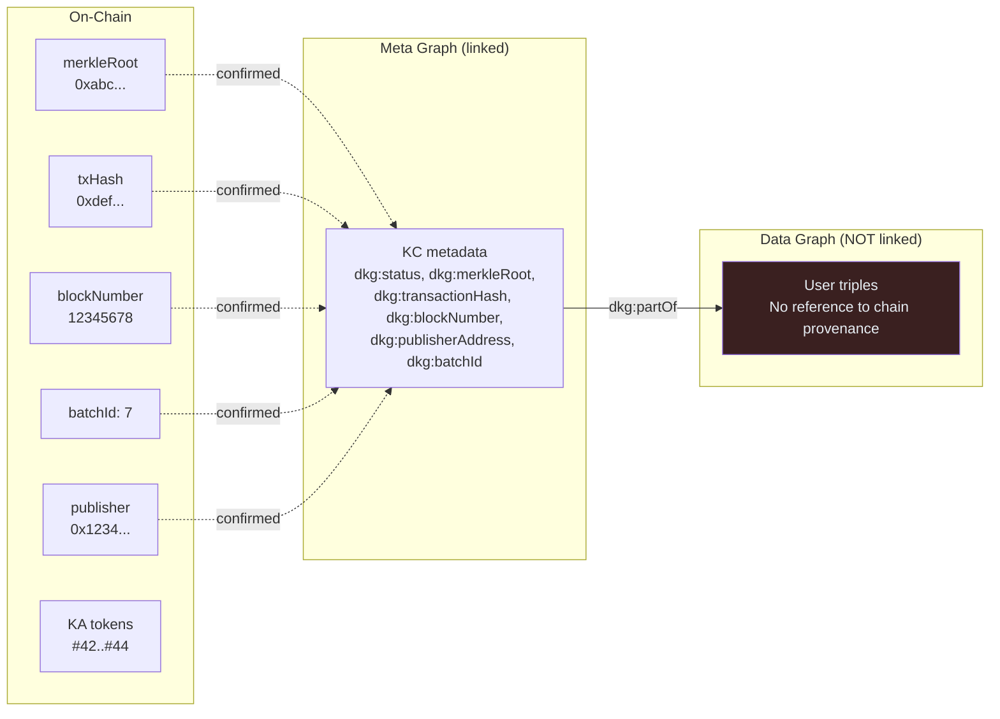
```mermaid
graph LR
    subgraph "On-Chain"
        MR["merkleRoot<br/>0xabc..."]
        TX["txHash<br/>0xdef..."]
        BN["blockNumber<br/>12345678"]
        BATCH["batchId: 7"]
        ADDR["publisher<br/>0x1234..."]
        NFT["KA tokens<br/>#42..#44"]
    end

    subgraph "Meta Graph (linked)"
        KC["KC metadata<br/>dkg:status, dkg:merkleRoot,<br/>dkg:transactionHash, dkg:blockNumber,<br/>dkg:publisherAddress, dkg:batchId"]
    end

    subgraph "Data Graph (NOT linked)"
        DATA["User triples<br/>No reference to chain provenance"]
    end

    MR -.->|confirmed| KC
    TX -.->|confirmed| KC
    BN -.->|confirmed| KC
    BATCH -.->|confirmed| KC
    ADDR -.->|confirmed| KC

    KC -->|"dkg:partOf"| DATA

    style DATA fill:#3a2020,color:#e6edf3
```

> **REVIEW: Data-to-chain linking gap.**
> User-facing data triples have NO direct link to their on-chain proof.
> To verify a triple's on-chain status, an app must:
> 1. Find the rootEntity of the triple
> 2. Look up the KA in the meta graph by rootEntity
> 3. Follow `dkg:partOf` to the KC
> 4. Read `dkg:transactionHash` from the KC
>
> This is workable but fragile. A convenience triple on each rootEntity
> pointing to its KA would simplify queries:
> ```turtle
> <rootEntity>  dkg:knowledgeAsset  <ual/tokenId> .
> ```

---

## 14. Protocol-Level Review & Improvements

### 14.1 Publish Flow

| # | Issue | Severity | Recommendation |
|---|-------|----------|----------------|
| P1 | Tentative data dropped after 60 min if chain is slow | Medium | Make timeout configurable; add re-request via sync protocol |
| P2 | No publish receipt/ACK from receivers | Low | Consider adding a lightweight gossip ACK for publisher visibility |
| P3 | Gossip publish can be replayed (no nonce/dedup) | Medium | Add `operationId` + dedup window to GossipSub handlers |
| P4 | `broadcastPublish` has a 5s timeout; large payloads may fail | Medium | Chunk large publish payloads or use direct protocol for big KCs |

### 14.2 Workspace

| # | Issue | Severity | Recommendation |
|---|-------|----------|----------------|
| W1 | `workspaceOwnedEntities` is in-memory only | High | Persist to workspace_meta; reconstruct on startup |
| W2 | No TTL on workspace data | Medium | Add configurable TTL; old workspace ops should be prunable |
| W3 | No workspace versioning | Low | Track version/revision per rootEntity for optimistic concurrency |

### 14.3 Consensus / Game

| # | Issue | Severity | Recommendation |
|---|-------|----------|----------------|
| C1 | Leader controls random seed — can manipulate game events | Medium | Use VRF seeded by collective randomness (hash of all votes) |
| C2 | No explicit rejection message for proposals | Medium | Add `turn:reject` message type with reason |
| C3 | `expedition:launched` game state is gossip-only | High | Write to workspace so late-joining nodes can catch up |
| C4 | Turn results don't include chain provenance | High | After publish, write txHash/ual/blockNumber to context graph |
| C5 | `resultMessage` not in RDF | Low | Add `ot:resultMessage` to `turnResolvedQuads` |
| C6 | No game event entities in RDF | Medium | Create first-class `ot:GameEvent` entities per turn |
| C7 | No resource deltas in RDF | Low | Add structured resource snapshots per turn |

### 14.4 GossipSub

| # | Issue | Severity | Recommendation |
|---|-------|----------|----------------|
| G1 | `offMessage` has a bug: returns early when handlers exist | Bug | Fix: `if (!handlers) return;` should be `if (handlers)` |
| G2 | All apps share single `app` topic per paranet | Medium | Add per-app subtopics: `dkg/paranet/{id}/app/{appId}` |
| G3 | No message signing/authentication on gossip level | Medium | GossipSub supports `strictNoSign: false` — enable message signing |
| G4 | Vote heartbeat creates O(n × 6) messages per turn | Low | Acceptable for 3-8 players; not scalable beyond ~20 |

### 14.5 Chain Integration

| # | Issue | Severity | Recommendation |
|---|-------|----------|----------------|
| CH1 | Chain poller interval (12s) may miss events on fast L2s | Low | Use WebSocket subscription instead of polling where available |
| CH2 | No retry on failed chain tx (publish, mint) | Medium | Add exponential backoff retry for chain transactions |
| CH3 | Paranet metadata reveal is a separate tx | Low | Consider batching with creation tx to save gas |

### 14.6 Storage

| # | Issue | Severity | Recommendation |
|---|-------|----------|----------------|
| S1 | Oxigraph doesn't support persistent WAL by default | Low | Ensure `oxigraph-persistent` backend is used in production |
| S2 | No compaction/garbage collection for dropped graphs | Low | Add periodic graph statistics and compaction |

### 14.7 Valuable Additions for Agents

Beyond fixing the gaps above, these additions to the knowledge graph would
significantly increase utility for AI agents:

1. **Consensus attestation triples** — Which specific nodes approved which turns,
   with their peerId and the proposal hash. Enables trust scoring and reputation.

2. **Publish provenance chain** — For each rootEntity, a provenance chain linking:
   `rootEntity → KA NFT → KC → txHash → blockNumber → publisher DID`.
   Currently requires 3 SPARQL joins; should be a direct property.

3. **Network topology hints** — Relay connections, direct connections, and peer
   latency metrics as RDF triples. Helps agents choose optimal peers.

4. **Workspace lineage** — Track which workspace entities were eventually
   enshrined (published) and link workspace operations to their resulting KCs.

5. **Game-specific: strategy patterns** — Aggregate voting patterns per player
   as RDF. Which players tend to vote "advance" vs "syncMemory"? This creates
   a behavioral knowledge graph that agents can use for strategy optimization.
