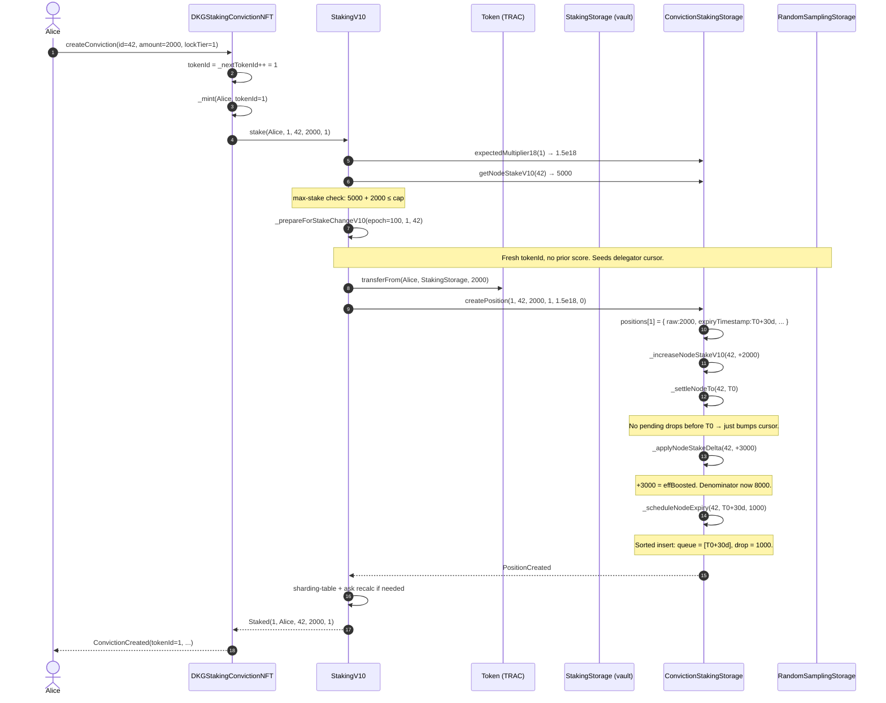
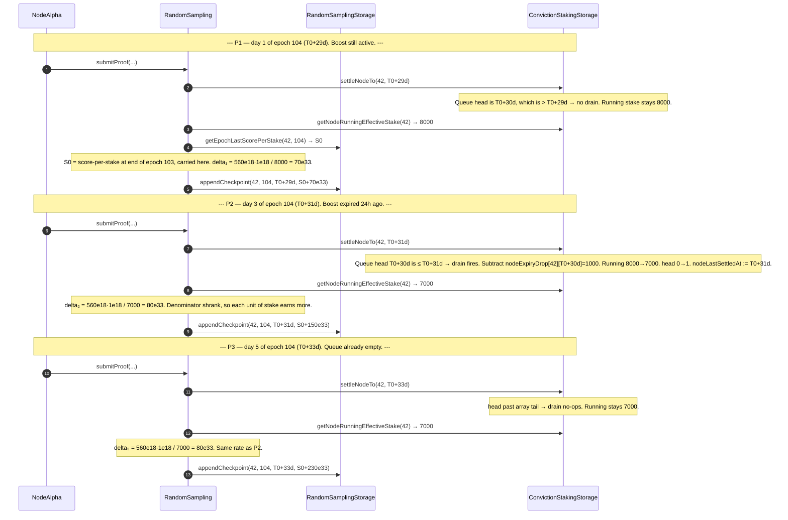
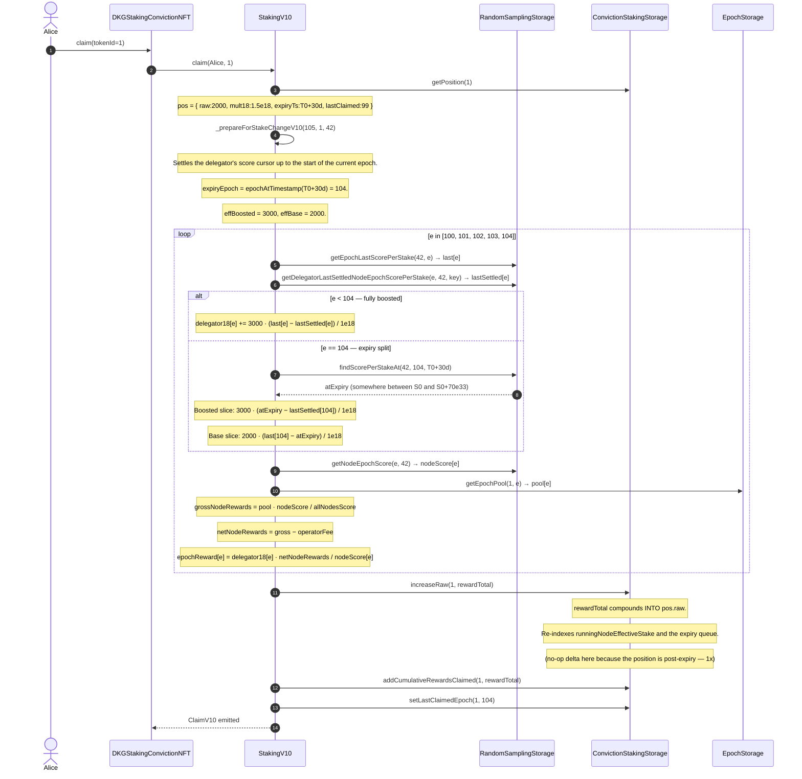

# D26 — Time-Accurate V10 Staking Accounting

**Status**: implemented in PR #240 (branch `v10-pr97-spec-impl`).
**Code-review follow-ups**: all H/M/L findings from [`CODE_REVIEW_V10_D26.md`](./CODE_REVIEW_V10_D26.md) have been applied in the same PR (contract versions bumped accordingly).
**Spec**: [`/Users/aleatoric/.cursor/plans/v10_time-accurate_staking_accounting_801da0cd.plan.md`](../../../.cursor/plans/v10_time-accurate_staking_accounting_801da0cd.plan.md)
**Scope**: `ConvictionStakingStorage.sol` (v3.1.0), `RandomSamplingStorage.sol` (v3.0.0), `RandomSampling.submitProof`, `StakingV10.sol` (v2.3.0) — `_claim` / `_prepareForStakeChangeV10`, `DKGStakingConvictionNFT.sol` (v1.2.0).

---

## 0. Glossary — read this first

Every diagram in this doc uses these terms. If any line is unclear, jump back here.

| Term | What it means |
| ---- | ------------- |
| **identityId** | The node's on-chain numeric id (uint72). In the examples we use `42` for NodeAlpha. |
| **tokenId** | The ERC-721 token id of a V10 staking position. Each delegator stake is a separate NFT. |
| **raw** | The literal TRAC amount the delegator staked, in wei. No multiplier applied. |
| **mult18** | The tier's boost multiplier, scaled by 1e18. `1.5x` = `1.5e18`. |
| **effBoosted** | `raw * mult18 / 1e18` — the delegator's contribution to the node's denominator **while the lock is active**. |
| **effBase** | `raw` — the delegator's contribution to the denominator **after the lock expires** (post-boost 1x). |
| **boostDrop** | `effBoosted - effBase` — the amount the denominator must shrink by the instant the lock expires. For Alice: `3000 - 2000 = 1000`. |
| **expiryTimestamp** | Wall-clock second at which the delegator's lock expires. For Alice: `T0 + 30 days`. Stored on `Position` (uint40). |
| **expiryEpoch** | Convenience derivation: `chronos.epochAtTimestamp(expiryTimestamp)`. The one epoch that *contains* the expiry instant. For Alice: epoch 104. |
| **runningNodeEffectiveStake[id]** | The node's current denominator. Updated in place by mutators; only valid as of `nodeLastSettledAt[id]`. |
| **nodeLastSettledAt[id]** | Wall-clock timestamp the running stake has been advanced to. Everything `≤` this ts has already been applied. |
| **Expiry queue** | A per-node sorted list of upcoming `(expiryTs, dropAmount)` pairs. Stored as `nodeExpiryTimes[id]` (ascending array) and `nodeExpiryDrop[id][ts]` (coalesced drop per ts). Walked forward by `nodeExpiryHead[id]`. |
| **Drain (or "drain fires")** | `settleNodeTo(id, ts)` walks the expiry queue from `head` forward and, for every queue entry with `entry.ts ≤ ts`, subtracts that entry's `drop` from the running stake and advances `head`. The running stake shrinks exactly as many locks have expired since the previous settle. |
| **settleNodeTo(id, ts)** | Public trigger for the drain. Called by `submitProof` every proof, and by every CSS mutator right before it reads or writes the running stake. Idempotent. |
| **Checkpoint** | A `(timestamp, scorePerStake36)` pair written once per proof into `nodeEpochIndex[id][epoch].mid[]`. Lets `_claim` binary-search the score at any mid-epoch instant. |
| **scorePerStake36** | Cumulative score per unit effective stake, scaled by 1e36. Epoch-local: starts at 0 each epoch, grows monotonically. |
| **lastScorePerStake36** | Latest value of the cumulative score per unit stake in an epoch. Equals the tail of `mid[]` (by invariant). |
| **findScorePerStakeAt(id, epoch, ts)** | Binary-searches `mid[]` for the at-or-before checkpoint at `ts`. Returns the cumulative score-per-stake at that instant. |
| **delegatorLastSettledNodeEpochScorePerStake** | A per-(delegator, node, epoch) cursor. Tracks the value of `scorePerStake36` at which we last paid this delegator. Subtracting this from the current value gives "score earned since last touch". |
| **\_prepareForStakeChangeV10** | Internal helper that fires *before* every stake mutation. Settles the delegator's earned score for the current epoch so subsequent math reads a fresh baseline. |

---

## 1. Problem statement

V10 delegators commit TRAC for **real-world durations** — 30 / 90 / 180 / 366 days — with a tiered boost multiplier (1.5x / 2.0x / 3.5x / 6.0x). The random-sampling reward pipeline, however, settles **per epoch** (~7 days). Two lies result:

1. **Denominator lie.** `RandomSampling.submitProof` divides the node's score by its effective stake. Pre-D26 that denominator was read at epoch granularity, so a boost expiring **mid-epoch** kept inflating the denominator until the next boundary. Every proof landing in that epoch under-credited every delegator by the fraction of `(expired boost) / (total effective stake)`.
2. **Claim lie.** At claim time, the same delegator whose 30-day lock expired on day 4 of a 7-day epoch was paid as if their boost lasted the full epoch (or ended on the prior boundary, depending on rounding). Small, persistent, real over/under-payment.

With proofs landing every ~30 minutes, sub-epoch precision is a product requirement.

## 2. Design summary — Option C.2

- **Reward pool granularity stays epoch-scoped.** `epochStorage.getEpochPool(idx, epoch)` is unchanged. All pool math at claim time is per-epoch.
- **Score-per-stake becomes timestamped.** Per `(node, epoch)` we store an `EpochIndex` with `firstScorePerStake36`, `lastScorePerStake36`, and an append-only `Checkpoint[] mid` of `(timestamp, scorePerStake36)` added once per proof.
- **Effective-stake becomes instantaneous.** Per node we store `runningNodeEffectiveStake[id]` and `nodeLastSettledAt[id]`, plus a **sorted expiry queue** `nodeExpiryTimes[id]` / `nodeExpiryDrop[id][ts]` / `nodeExpiryHead[id]`. `settleNodeTo(id, ts)` drains any queued expiries whose timestamp is ≤ `ts` and advances the running stake. `submitProof` calls this before reading the denominator.
- **Claim does per-epoch branching on expiryTimestamp.** For each epoch `e` in the claim window:
  - `e < expiryEpoch` OR `expiryTimestamp == 0` → O(1), full `effBoosted` (or `effBase` if tier-0).
  - `e > expiryEpoch` → O(1), full `effBase`.
  - `e == expiryEpoch` → **one** binary search into `mid[]` for `scorePerStakeAt(expiryTs)`. Split the earning interval at that point.
  - `first == last` → dead epoch, skip in O(1).

No iteration is proof-density-bounded. Dormancy is event-density-bounded (queue length, not wall-clock time).

## 3. Storage shapes

### `ConvictionStakingStorage` (v3.0.0)

```solidity
struct Position {
    uint96  raw;
    uint40  lockTier;
    uint40  expiryTimestamp;      // RENAMED from expiryEpoch (D26).
    uint72  identityId;
    // slot 2
    uint96  cumulativeRewardsClaimed;
    uint64  multiplier18;
    uint32  lastClaimedEpoch;
    uint32  migrationEpoch;
}

// Per-node instantaneous state.
mapping(uint72 => uint256) public runningNodeEffectiveStake;
mapping(uint72 => uint40)  public nodeLastSettledAt;

// Per-node sorted pending-expiry queue.
mapping(uint72 => uint40[])                    internal nodeExpiryTimes; // ascending
mapping(uint72 => mapping(uint40 => uint256))  internal nodeExpiryDrop;  // total boost drop at ts
mapping(uint72 => uint256)                     internal nodeExpiryHead;  // amortized-O(1) drain cursor
```

### `RandomSamplingStorage` (v2.0.0)

```solidity
struct Checkpoint {
    uint40  timestamp;
    uint216 scorePerStake36;
}

struct EpochIndex {
    uint248 firstScorePerStake36;   // epoch-local; seeded to 0.
    bool    firstInitialized;
    uint256 lastScorePerStake36;    // monotone in ts within the epoch.
    Checkpoint[] mid;               // one append per proof.
}

mapping(uint72 => mapping(uint256 => EpochIndex)) internal nodeEpochIndex;
```

The legacy scalar `nodeEpochScorePerStake` is deleted; the pre-D26 read signature is kept as a thin adapter returning `lastScorePerStake36` — semantically equivalent for past (fully-settled) epochs, which is everything V8 call sites (`Staking.sol`, `StakingKPI.sol`) ever read.

---

## 4. Worked example — a real delegator's life

### Scenario setup

| Entity               | Value                                                           |
| -------------------- | --------------------------------------------------------------- |
| **Node**             | `identityId = 42` ("NodeAlpha")                                 |
| **Alice**            | EOA, wants a 30-day lock (tier 1, 1.5x) on 2 000 TRAC           |
| **Epoch length**     | 7 days = 604 800 s                                              |
| **T0**               | `1 777 852 800` → 2026-05-01 00:00:00 UTC, start of **epoch 100** |
| **T_expiry**         | `T0 + 30 days` = `1 780 444 800` → day 2 of **epoch 104**       |
| **Withdraw**         | `T0 + 35 days` → day 0 of **epoch 105**                         |
| **Pre-Alice stake**  | 5 000 (other delegators on NodeAlpha, 1x baseline)              |

Derived quantities:

```
effBoosted = raw * mult18 / 1e18 = 2000 * 1.5 = 3000
effBase    = raw                 = 2000
boostDrop  = effBoosted - effBase = 1000   ← queued at expiryTs
```

Alice's effective contribution to NodeAlpha's denominator:

```
[T0, T_expiry)    →  3000   (1.5x boost)
[T_expiry, ∞)     →  2000   (1x, post-expiry rest state)
```

### Key epochs

| Epoch | Window (days since T0) | Alice's status in epoch                        |
| ----- | ---------------------- | ---------------------------------------------- |
| 100   | [0, 7)                 | boost fully active                              |
| 101   | [7, 14)                | boost fully active                              |
| 102   | [14, 21)               | boost fully active                              |
| 103   | [21, 28)               | boost fully active                              |
| **104** | **[28, 35)**        | **boost active for 2 days, then dropped at day 30** |
| 105   | [35, 42)               | boost dropped (but Alice already withdrew on day 35) |

Epoch 104 is the only one that triggers the binary-search claim branch. Every other epoch is one of the O(1) sentinel-pair branches.

---

## 5. Sequence diagrams

Every diagram uses `autonumber` — the `(n)` references in the walk-throughs below map directly to the numbered arrows.

### 5.1 `createConviction` — Alice opens a 30-day boosted position at `T0`



**Line-by-line walk-through:**

1. **`Alice → NFT: createConviction(id=42, 2000, 1)`** — Alice calls the outer NFT wrapper. `id=42` is NodeAlpha's `identityId`. `2000` is the TRAC raw amount. `1` is tier 1 (30 days, 1.5x).
2. **`NFT: tokenId = _nextTokenId++`** — the wrapper allocates a fresh NFT id. Monotone counter, no reuse.
3. **`NFT: _mint(Alice, 1)`** — standard ERC-721 mint. Alice now owns the NFT that represents this position.
4. **`NFT → SV10: stake(...)`** — forwards to `StakingV10`, passing Alice's address explicitly (the business-logic contract never trusts `msg.sender`).
5. **`SV10 → CSS: expectedMultiplier18(1) → 1.5e18`** — read the tier multiplier from storage. `1.5e18` = 1.5x at fixed-point scale 1e18.
6. **`SV10 → CSS: getNodeStakeV10(42) → 5000`** — read the node's current aggregate raw stake (other delegators already on NodeAlpha).
7. **Max-stake note** — pre-flight check: `5000 + 2000 ≤ maximumStake`. Rejects early if it would push the node over cap.
8. **`SV10 → SV10: _prepareForStakeChangeV10(100, 1, 42)`** — settles the delegator's unclaimed score in the *current* epoch before we mutate state. For a fresh tokenId there's nothing to settle — the helper just writes the initial value of the score cursor so later claims compute a clean delta.
9. **`SV10 → TOKEN: transferFrom(Alice, StakingStorage, 2000)`** — TRAC leaves Alice's wallet and lands in the `StakingStorage` vault. Alice must have pre-approved.
10. **`SV10 → CSS: createPosition(1, 42, 2000, 1, 1.5e18, 0)`** — CSS is the authoritative ledger. The `0` is `migrationEpoch` (not a V8 migrant).
11. **`CSS: positions[1] = { raw:2000, expiryTimestamp:T0+30d, ... }`** — write the per-tokenId record. `expiryTimestamp` is derived from `_computeExpiryTimestamp(1)` = `block.timestamp + tier.duration`.
12. **`CSS: _increaseNodeStakeV10(42, +2000)`** — update the *raw* aggregate. This is the unboosted total (used by `calculateNodeScore`'s `S(t)` factor).
13. **`CSS: _settleNodeTo(42, T0)`** — bring the per-node running state up to the current wall-clock. Since no expiries are queued yet and we're at the birth of the universe for this node, this is a no-op beyond bumping `nodeLastSettledAt[42] := T0`.
14. **`CSS: _applyNodeStakeDelta(42, +3000)`** — add Alice's **boosted** contribution (`effBoosted`) to the running denominator. `5000 + 3000 = 8000`.
15. **`CSS: _scheduleNodeExpiry(42, T0+30d, 1000)`** — queue the boost drop. In 30 days, 1000 must come *off* the denominator. Inserts `T0+30d` into the sorted array and sets `nodeExpiryDrop[42][T0+30d] = 1000`.
16. **`CSS ⇢ SV10: PositionCreated`** — event emission (consumed by off-chain indexers).
17. **Sharding/ask recalc** — if this stake pushed NodeAlpha across the `minimumStake` threshold, insert into the sharding table and recompute the ask. Usually no-op here.
18. **`SV10 ⇢ NFT: Staked(...)`** → **`NFT ⇢ Alice`** — events bubble up to the wrapper and the user.

**Invariants after this block:**

- `positions[1].expiryTimestamp == T0 + 30 days`
- `runningNodeEffectiveStake[42] == 5000 + 3000 == 8000`
- `nodeLastSettledAt[42] == T0`
- `nodeExpiryTimes[42] == [T0+30d]`, `nodeExpiryDrop[42][T0+30d] == 1000`

---

### 5.2 `submitProof` — a node proof lands at `T0 + 3 days` (mid-epoch 100)

NodeAlpha produces a valid proof. `score18 = 840e18` (arbitrary, illustrative).

```mermaid
%%{init: { 'sequence': { 'messageMargin': 55, 'noteMargin': 15, 'boxMargin': 15, 'actorMargin': 70 } } }%%
sequenceDiagram
    autonumber
    participant NodeAlpha as NodeAlpha
    participant RS as RandomSampling
    participant RSS as RandomSamplingStorage
    participant CSS as ConvictionStakingStorage

    NodeAlpha->>RS: submitProof(chunk, merkleProof)
    RS->>RS: verify challenge + merkle root
    RS->>RSS: incrementEpochNodeValidProofsCount(100, 42)
    RS->>RS: score18 = calculateNodeScore(42) = 840e18
    RS->>RSS: addToNodeEpochProofPeriodScore(100, _, 42, 840e18)
    RS->>RSS: addToNodeEpochScore(100, 42, 840e18)
    RS->>RSS: addToAllNodesEpochScore(100, 840e18)

    Note over RS,CSS: --- D26 timestamp-accurate denominator block ---

    RS->>CSS: settleNodeTo(42, tsNow = T0+3d)
    Note over CSS: Queue head ts = T0+30d, which is > T0+3d, so nothing is drained. nodeLastSettledAt advances to T0+3d; running stake stays 8000.

    RS->>CSS: getNodeRunningEffectiveStake(42) → 8000
    RS->>RSS: getEpochLastScorePerStake(42, 100) → 0
    Note over RS: First proof of the epoch: prior score-per-stake is 0. delta = 840e18 * 1e18 / 8000 = 105e33.

    RS->>RSS: appendCheckpoint(42, 100, T0+3d, 105e33)
    Note over RSS: lastScorePerStake36 := 105e33; mid.push({ts:T0+3d, val:105e33}); firstInitialized := true.
```

**Line-by-line walk-through** (numbers match the `autonumber` arrows in the diagram; `autonumber` only indexes arrows, not notes):

1. **`NodeAlpha → RS: submitProof(chunk, merkleProof)`** — the node operator (an EOA) submits a sampled chunk plus a merkle proof.
2. **`RS: verify challenge + merkle root`** — RandomSampling verifies the chunk matches the expected challenge and the merkle root. Reverts if not.
3. **`RS → RSS: incrementEpochNodeValidProofsCount(100, 42)`** — bookkeeping: epoch 100, NodeAlpha has one more valid proof.
4. **`RS: score18 = calculateNodeScore(42) = 840e18`** — RFC-26 score formula: `sqrt(stake/cap) · (0.002 + 0.86·P + 0.60·A·P)`, scaled 1e18.
5. **`RS → RSS: addToNodeEpochProofPeriodScore(...)`** — per-proof-period accumulator (used for later anti-gaming checks).
6. **`RS → RSS: addToNodeEpochScore(100, 42, 840e18)`** — node's epoch-total score bumps by `score18`. This is the **numerator** used to compute rewards later.
7. **`RS → RSS: addToAllNodesEpochScore(100, 840e18)`** — global epoch-total (used as the denominator when dividing the epoch reward pool across nodes).
8. **`RS → CSS: settleNodeTo(42, tsNow = T0+3d)`** — bring NodeAlpha's denominator up to current wall-clock *before* we read it. Walks the expiry queue from `nodeExpiryHead[42]` and drains every entry with `ts ≤ tsNow`. At T0+3d the earliest queued ts is T0+30d, so no entries are drained; `nodeLastSettledAt[42]` advances to T0+3d and the running stake stays 8000.
9. **`RS → CSS: getNodeRunningEffectiveStake(42) → 8000`** — read the denominator *after* settle.
10. **`RS → RSS: getEpochLastScorePerStake(42, 100) → 0`** — the cumulative score-per-stake at the last write in epoch 100. Zero because this is the first proof of the epoch.
11. **`RS → RSS: appendCheckpoint(42, 100, T0+3d, 105e33)`** — compute `delta = score18 · 1e18 / eff = 840e18 · 1e18 / 8000 = 105e33` (the 1e18 multiplier in the numerator keeps us at 1e36 precision). Store a new checkpoint so claim-time binary search can find the value at any mid-epoch instant. Inside RSS: `lastScorePerStake36 := 105e33`, `mid.push({T0+3d, 105e33})`, and `firstInitialized := true` (idempotency flag).

**Invariants after this proof:**

- `nodeEpochIndex[42][100].firstScorePerStake36 == 0`
- `nodeEpochIndex[42][100].lastScorePerStake36 == 105e33`
- `nodeEpochIndex[42][100].mid == [{T0+3d, 105e33}]`
- `runningNodeEffectiveStake[42] == 8000` (unchanged — no expiries fell in the interval)

---

### 5.3 `submitProof` — mid-epoch 104, straddling Alice's expiry

By epoch 104, many proofs have landed across epochs 100-103. For each of those epochs we only care about its salient reading: each ends with some `lastScorePerStake36[e]`. What matters is epoch 104.

Inside epoch 104 we inspect **three proofs**:

- **P1**: day 1 of epoch 104 (`T0 + 29d`). Boost still active (expires at T0+30d).
- **P2**: day 3 of epoch 104 (`T0 + 31d`). Boost expired 1 day ago. **First proof after expiry — drains the queue.**
- **P3**: day 5 of epoch 104 (`T0 + 33d`). Queue already drained.

Assume each proof's `score18 = 560e18`. Other delegators are unaffected by Alice's drop.



**Line-by-line walk-through:**

**P1 — pre-expiry proof:**

1. **`NodeAlpha → RS: submitProof(...)`** — normal proof submission.
2. **`RS → CSS: settleNodeTo(42, T0+29d)`** — drive the drain. The queue holds `[T0+30d]`; we're at T0+29d.
3. **Queue head note** — drain checks `queue[head].ts ≤ 29d`. T0+30d > T0+29d. Nothing to drain.
4. **Running stake note** — unchanged at 8000.
5. **`RS → CSS: getNodeRunningEffectiveStake(42) → 8000`** — read the denominator.
6. **`RS → RSS: getEpochLastScorePerStake(42, 104) → S0`** — `S0` is the cumulative carried in at epoch 104's start (the last checkpoint from epoch 103, represented as the epoch-local baseline for epoch 104).
7. **S0 note** — establishes what `S0` means for the reader.
8. **Delta₁ note** — `560e18 · 1e18 / 8000 = 70e33`. Each unit of effective stake just earned 70e33 units of score-per-stake-at-1e36-scale.
9. **`RS → RSS: appendCheckpoint(42, 104, T0+29d, S0+70e33)`** — store the cumulative at this moment.

**P2 — the drain fires:**

10. **`NodeAlpha → RS: submitProof(...)`**.
11. **`RS → CSS: settleNodeTo(42, T0+31d)`** — first settle *after* Alice's expiry.
12. **Drain fires note 1** — `queue[head].ts = T0+30d`, which is ≤ T0+31d, so this entry is due.
13. **Drain fires note 2** — we subtract `nodeExpiryDrop[42][T0+30d]` (= 1000) from the running stake.
14. **Drain fires note 3** — running stake drops from 8000 → 7000. Alice's 1000-unit boost contribution is now gone from the denominator.
15. **Drain fires note 4** — advance `head` (next drain won't re-visit this entry) and bump `nodeLastSettledAt` to T0+31d.
16. **`RS → CSS: getNodeRunningEffectiveStake(42) → 7000`** — the **new** denominator.
17. **Delta₂ note 1** — `560e18 · 1e18 / 7000 = 80e33`. Different from P1 because the denominator shrank.
18. **Delta₂ note 2** — the *other* delegators' per-unit earnings just went up: they still contribute 5000, but the total denominator dropped. Correct — Alice's boost no longer dilutes them.
19. **`RS → RSS: appendCheckpoint(42, 104, T0+31d, S0+150e33)`** — cumulative = `S0 + 70e33 + 80e33`.

**P3 — post-drain proof:**

20. **`NodeAlpha → RS: submitProof(...)`**.
21. **`RS → CSS: settleNodeTo(42, T0+33d)`**.
22. **Queue empty note 1** — `head` (now 1) is past the end of the array (length 1). Nothing to drain.
23. **Queue empty note 2** — running stake stays 7000. Settled cursor advances.
24. **`RS → CSS: getNodeRunningEffectiveStake(42) → 7000`**.
25. **Delta₃ note** — `560e18 · 1e18 / 7000 = 80e33`. Same rate as P2.
26. **`RS → RSS: appendCheckpoint(42, 104, T0+33d, S0+230e33)`** — cumulative = `S0 + 70e33 + 80e33 + 80e33`.

**Invariants after P3:**

- `nodeEpochIndex[42][104].mid == [{T0+29d, S0+70e33}, {T0+31d, S0+150e33}, {T0+33d, S0+230e33}]`
- `nodeEpochIndex[42][104].lastScorePerStake36 == S0 + 230e33`
- `runningNodeEffectiveStake[42] == 7000`
- `nodeExpiryHead[42] == 1` (T0+30d consumed)

> **Why this matters for Alice.** P1 credited Alice's boost correctly (she *was* boosted). P2 and P3 correctly divide by the smaller 7000 denominator (she is no longer contributing the 1000-unit boost to the pool). Alice still earns `effBase = 2000` worth of delegator-score from P2 and P3 (see §5.4), but she no longer inflates the denominator she divides against. Other delegators' rewards are not diluted.

---

### 5.4 `_claim` — Alice claims through epoch 104

When Alice (or a withdraw call) triggers `_claim`, the walker visits each unclaimed epoch `e ∈ [claimFrom, currentEpoch-1]` and computes `delegatorScore18[e]` using the appropriate branch:

```
for each epoch e:
    last         = nodeEpochIndex[42][e].lastScorePerStake36
    lastSettled  = delegatorLastSettledNodeEpochScorePerStake[e, 42, key]
    if last <= lastSettled: continue                            // dead epoch, nothing earned

    if pos.expiryTimestamp == 0 || e < expiryEpoch:            // boost fully active all epoch
        delegatorScore18 += effBoosted · (last - lastSettled) / 1e18
    else if e > expiryEpoch:                                   // boost fully dropped all epoch
        delegatorScore18 += effBase · (last - lastSettled) / 1e18
    else:                                                       // e == expiryEpoch — SPLIT
        atExpiry = RSS.findScorePerStakeAt(42, e, expiryTs)    // BINARY SEARCH in mid[]
        delegatorScore18 += effBoosted · (atExpiry - lastSettled) / 1e18
                          + effBase    · (last     - atExpiry)    / 1e18
```



**Line-by-line walk-through:**

1. **`Alice → NFT: claim(1)`** — the NFT wrapper entry point. `1` is Alice's tokenId.
2. **`NFT → SV10: claim(Alice, 1)`**.
3. **`SV10 → CSS: getPosition(1)`** — read Alice's position struct.
4. **Position note** — fields needed for the claim: raw stake, multiplier, expiry timestamp, last claimed epoch (99 means "everything through epoch 99 is already claimed").
5. **`_prepareForStakeChangeV10(105, 1, 42)`** — settles the *current* epoch (105) cursor first. Guarantees the subsequent loop reads a clean baseline for the current epoch (not strictly needed for past epochs but required if the claim is interleaved with a stake mutation).
6. **Prepare note** — informational.
7. **`expiryEpoch = 104`** — derived from `chronos.epochAtTimestamp(T0+30d)`.
8. **effBoosted / effBase note** — `3000` and `2000` respectively (from the scenario).
9. **`loop e in [100, 101, 102, 103, 104]`** — walks epoch 100 through `currentEpoch − 1 = 104`.
10. **`getEpochLastScorePerStake(42, e) → last[e]`** — the cumulative score-per-stake at the end of epoch `e` on this node.
11. **`getDelegatorLastSettledNodeEpochScorePerStake(e, 42, key) → lastSettled[e]`** — the cursor value: the cumulative score at which we *stopped* paying Alice last time for this (epoch, node). Zero for epochs she's never touched.
12. **`alt e < 104 — fully boosted`** — for epochs 100-103, Alice was boosted the entire epoch.
13. **Fully-boosted note** — use `effBoosted = 3000` for the full `last[e] − lastSettled[e]` interval.
14. **`else e == 104 — expiry split`**.
15. **`SV10 → RSS: findScorePerStakeAt(42, 104, T0+30d)`** — binary search on `mid[] = [{T0+29d, S0+70e33}, {T0+31d, S0+150e33}, {T0+33d, S0+230e33}]`. Finds the *at-or-before* entry for ts=T0+30d → `{T0+29d, S0+70e33}`. Returns `S0+70e33`.
16. **`RSS ⇢ SV10: atExpiry`** — the cumulative score-per-stake at the instant the boost dropped.
17. **Boosted slice note** — earnings between `lastSettled[104]` and `atExpiry` happened while Alice's boost was still live → multiply by 3000.
18. **Base slice note** — earnings between `atExpiry` and `last[104]` happened after the drop → multiply by 2000.
19. **`getNodeEpochScore(e, 42) → nodeScore[e]`** — total score NodeAlpha accumulated in epoch `e` (numerator from §5.2/5.3).
20. **`getEpochPool(1, e) → pool[e]`** — epoch `e`'s total reward pool (TRAC). The `1` is the reward-kind index (production knowledge rewards).
21. **Gross note** — node's share of the global pool: `pool · nodeScore / allNodesScore`.
22. **Net note** — subtract the operator fee (configurable percent) to get the delegator-splittable amount.
23. **Epoch reward note** — Alice's share: `(her delegator score) / (node's total score) · net`. Dimensionally the two score values cancel in the ratio.
24. **End loop**.
25. **`SV10 → CSS: increaseRaw(1, rewardTotal)`** — auto-compound: rewards become new principal on the same position.
26. **IncreaseRaw note 1** — `pos.raw` goes up by `rewardTotal`.
27. **IncreaseRaw note 2** — also updates the running denominator (plus the expiry queue if the boost were still active).
28. **IncreaseRaw note 3** — in this scenario Alice is post-expiry, so `effBoosted == effBase == new raw`, denominator bumps by the reward delta at 1x. Queue unchanged.
29. **`addCumulativeRewardsClaimed(1, rewardTotal)`** — life-time reward counter on the position (for analytics; not for math).
30. **`setLastClaimedEpoch(1, 104)`** — advance the cursor so future claims start at 105.
31. **`ClaimV10` event** — off-chain consumers.

> **Binary-search frequency.** In this entire lifecycle Alice's claim invokes `findScorePerStakeAt` **exactly once** — in epoch 104. Epochs 100-103 and 105+ take O(1) sentinel reads. The `mid[]` array grows with proof frequency (≈ one entry per 30 minutes), so `O(log n)` per binary search ≈ 9 SLOADs for a 7-day epoch with 30-minute proofs (≈336 proofs → log₂336 ≈ 8.4).

---

### 5.5 Full lifecycle — Alice's stake → withdraw cycle

This diagram threads every touchpoint of Alice's 30-day journey into one picture. Time flows top-to-bottom; each shaded band is a different *phase* of her lifecycle.

```mermaid
%%{init: { 'sequence': { 'messageMargin': 55, 'noteMargin': 15, 'boxMargin': 20, 'actorMargin': 70 } } }%%
sequenceDiagram
    autonumber
    actor Alice
    participant NFT as DKGStakingConvictionNFT
    participant SV10 as StakingV10
    participant CSS as ConvictionStakingStorage
    participant RSS as RandomSamplingStorage
    participant TOKEN as Token (TRAC)
    participant SS as StakingStorage
    participant NodeOps as NodeAlpha ops

    rect rgb(235, 245, 255)
    Note over Alice,NodeOps: --- PHASE 1 — T=T0. Alice stakes 2000 TRAC at tier 1 (30d, 1.5x). ---
    Alice->>TOKEN: approve(StakingV10, 2000)
    Alice->>NFT: createConviction(42, 2000, 1)
    NFT->>SV10: stake(Alice, 1, 42, 2000, 1)
    SV10->>TOKEN: transferFrom(Alice, StakingStorage, 2000)
    SV10->>CSS: createPosition(1, 42, 2000, 1, 1.5e18, 0)
    Note over CSS: positions[1].expiryTimestamp = T0+30d. Running stake 5000→8000. Queue gets (T0+30d, drop=1000).
    end

    rect rgb(230, 250, 230)
    Note over NodeOps,RSS: --- PHASE 2 — T ∈ [T0, T0+30d). Alice is boosted. ---
    loop proofs in epochs 100-103
        NodeOps->>SV10: submitProof (detail in §5.2)
        SV10->>CSS: settleNodeTo(42, ts)
        Note over CSS: ts < T0+30d → no drain. Running stake stays 8000.
        CSS-->>SV10: running = 8000
        SV10->>RSS: appendCheckpoint(42, e, ts, +Δ)
        Note over RSS: Δ computed against denominator 8000.
    end
    end

    rect rgb(255, 245, 225)
    Note over NodeOps,CSS: --- PHASE 3 — T = T0+30d. Lock expires. Nothing happens on-chain; drop is LAZY. Next proof (or any CSS mutator) will drain it. ---
    end

    rect rgb(230, 250, 230)
    Note over NodeOps,RSS: --- PHASE 4 — first proof after expiry triggers the drain. ---
    NodeOps->>SV10: submitProof(...)
    SV10->>CSS: settleNodeTo(42, ts ≥ T0+30d)
    Note over CSS: Queue head T0+30d ≤ ts → drain fires. Running 8000→7000. head 0→1.
    SV10->>RSS: appendCheckpoint(42, 104, ts, +Δ)
    Note over RSS: Δ now computed against denominator 7000. All subsequent proofs in epochs 104-105 also divide by 7000.
    end

    rect rgb(255, 230, 230)
    Note over Alice,SS: --- PHASE 5 — T = T0+35d. Alice withdraws. ---
    Alice->>NFT: withdraw(tokenId=1)
    NFT->>SV10: withdraw(Alice, 1)
    SV10->>CSS: getPosition(1)
    Note over SV10: now ≥ expiryTimestamp → unlocked, withdraw permitted.

    SV10->>SV10: _claim(1)
    Note over SV10: Auto-claim first (see §5.4). Epoch 104 does ONE binary search; others are O(1).

    SV10->>CSS: getPosition(1)
    Note over SV10: Re-read: raw may have grown via auto-compound.
    SV10->>CSS: deletePosition(1)
    Note over CSS: _settleNodeTo no-ops (queue empty). Running stake 7000→5000 (subtracts effBase=raw). No expiry cancel needed (already drained). positions[1] cleared.
    SV10->>SS: transferStake(Alice, amount)
    SV10-->>NFT: Withdrawn(1, Alice, amount)
    NFT->>NFT: _burn(1)
    NFT-->>Alice: tokens + event emissions
    end
```

**Line-by-line walk-through (by phase):**

**Phase 1 — stake creation:**

1. **`Alice → TOKEN: approve(StakingV10, 2000)`** — ERC-20 approval so `StakingV10.stake` can pull Alice's TRAC.
2. **`Alice → NFT: createConviction(42, 2000, 1)`** — open a tier-1 position on NodeAlpha with 2000 TRAC.
3. **`NFT → SV10: stake(...)`** — wrapper forwards to the business layer.
4. **`SV10 → TOKEN: transferFrom(Alice, StakingStorage, 2000)`** — TRAC moves into the vault.
5. **`SV10 → CSS: createPosition(1, 42, 2000, 1, 1.5e18, 0)`** — CSS writes the authoritative record.
6-9. **CSS state notes** — expiry timestamp set, running stake jumps to 8000, queue gets the 1000 drop scheduled at T0+30d.

**Phase 2 — boosted earning:**

10. **Loop: proofs across epochs 100-103** — abstraction over many proofs.
11. **`NodeOps → SV10: submitProof`** — shorthand for §5.2's flow.
12. **`SV10 → CSS: settleNodeTo(42, ts)`** — every proof settles first.
13. **Queue-head note** — while `ts < T0+30d`, no entries are due → running stays 8000.
14. **`CSS ⇢ SV10: running = 8000`** — denominator reads.
15. **`SV10 → RSS: appendCheckpoint(...)`** — checkpoint with Δ computed at denominator 8000.
16. **Δ note** — "computed against denominator 8000" is the key: Alice is being credited with her full boost.

**Phase 3 — silent expiry:**

17-19. **Phase 3 notes** — at T0+30d the lock conceptually expires. No transaction fires. The drop is **lazy**: it's recorded in the queue but not applied until the next `settleNodeTo` call. Deliberate — no actor pays gas to "poke" the expiry.

**Phase 4 — first post-expiry proof drains:**

20. **`NodeOps → SV10: submitProof(...)`** — next proof lands at some ts ≥ T0+30d.
21. **`SV10 → CSS: settleNodeTo(42, ts)`**.
22. **Drain note 1** — `queue[head].ts = T0+30d ≤ ts` → due.
23. **Drain note 2** — running stake drops from 8000 to 7000.
24. **Drain note 3** — head advances.
25. **`SV10 → RSS: appendCheckpoint(...)`** — with Δ computed at denominator **7000**.
26. **Post-drain note** — informational. For all subsequent proofs until someone else's boost expires, the denominator stays 7000.

**Phase 5 — atomic withdraw:**

27. **`Alice → NFT: withdraw(1)`**.
28. **`NFT → SV10: withdraw(Alice, 1)`**.
29. **`SV10 → CSS: getPosition(1)`** — re-read to check lock status.
30. **Unlocked note** — `block.timestamp ≥ expiryTimestamp` ⇒ lock has elapsed, withdraw is permitted.
31. **`SV10 → SV10: _claim(1)`** — auto-claim before draining the position. User gets rewards + principal in one tx.
32-34. **Claim-cost notes** — epoch 104 is the only binary search; the rest is pure SLOAD math.
35. **`SV10 → CSS: getPosition(1)`** — re-read after `_claim` because auto-compound may have grown `pos.raw`.
36. **`SV10 → CSS: deletePosition(1)`** — remove Alice's contribution from every accumulator.
37. **DeletePosition note 1** — `settleNodeTo` first (queue already drained, harmless).
38. **DeletePosition note 2** — subtract `effBase = raw` from running stake (no boost to remove, since it was already dropped). 7000 → 5000.
39. **DeletePosition note 3** — no expiry cancellation: the queue entry was already consumed in phase 4.
40. **DeletePosition note 4** — `positions[1]` is wiped clean.
41. **`SV10 → SS: transferStake(Alice, amount)`** — TRAC leaves the vault back to Alice. `amount = raw (with any compounded rewards)`.
42. **`Withdrawn` event**.
43. **`NFT: _burn(1)`** — the ERC-721 token is destroyed.
44. **`NFT ⇢ Alice`** — transaction returns; Alice has her tokens.

**What changed vs. pre-D26:**

- In PHASE 5, `_claim` does **one** binary search (for epoch 104), not N iterations over proofs.
- In PHASE 3, there is **no on-chain side effect** at T = T0 + 30d. Pre-D26 needed either (a) a poke at the epoch boundary to finalize effective-stake diffs or (b) risked a "dormancy bomb" where a long idle interval required a linear walk to catch up.
- In PHASE 4, the proof denominator is **7000** (post-boost), not 8000. Other delegators on NodeAlpha now see a correctly tighter denominator — Alice isn't double-dipping by inflating the pool divisor with phantom boost.

---

## 6. Invariants

These are enforced by the test suite (`test/unit/ConvictionStakingStorage.test.ts`, `test/unit/RandomSamplingStorage.test.ts`, `test/integration/D26TimeAccurateStaking.test.ts`):

1. **Running-stake consistency.** For any node `id` and timestamp `ts ≥ nodeLastSettledAt[id]`:

       getNodeEffectiveStakeAtTimestamp(id, ts)
       == runningNodeEffectiveStake[id]  −  Σ { nodeExpiryDrop[id][t] : head ≤ i s.t. nodeExpiryTimes[id][i] ≤ ts }

2. **Expiry-queue monotonicity.** `nodeExpiryTimes[id][i] < nodeExpiryTimes[id][i+1]` for all `i ≥ nodeExpiryHead[id]`; coalescing positions with identical expiry share a single queue entry and their drops are summed.
3. **Checkpoint monotonicity.** Within one epoch, `nodeEpochIndex[id][e].mid[i].timestamp < mid[i+1].timestamp`, and `mid[i].scorePerStake36 ≤ mid[i+1].scorePerStake36`.
4. **Dormancy bound.** Every iteration in `settleNodeTo` is bounded by the number of **queued expiries** in `(nodeLastSettledAt, ts]`, never by the number of epochs elapsed.
5. **Binary-search budget per claim.** Each delegator calls `findScorePerStakeAt` at most **once per claim** — for the single epoch containing `expiryTimestamp`. Every other epoch in the claim window takes exactly 2 SLOADs.
6. **V8 adapter parity.** `getNodeEpochScorePerStake(epoch, id)` returns `nodeEpochIndex[id][epoch].lastScorePerStake36`, which for a fully-settled past epoch is the same value the pre-D26 scalar would have held. V8 read sites in `Staking.sol` and `StakingKPI.sol` are behavior-equivalent.

## 7. Gas notes

Measured on localhost against the unit test harness:

| Operation                                                             | Pre-D26         | D26             | Notes                                                                 |
| --------------------------------------------------------------------- | --------------- | --------------- | --------------------------------------------------------------------- |
| `createPosition` with boosted tier                                    | ~180k           | ~195k           | +sorted-insert into `nodeExpiryTimes` (O(k), k = pending expiries).    |
| `deletePosition` / `withdraw` (post-expiry)                           | ~120k           | ~120k           | Queue head already drained; the cancellation path is O(1) amortized. |
| `submitProof` (no expiry in interval)                                 | ~55k (proof-only math) | ~58k     | +1 SSTORE (checkpoint append) +1 SLOAD (last).                        |
| `submitProof` (1 expiry drained)                                      | n/a             | ~65k            | +SLOAD head, +SSTORE head, +SUB on running stake.                     |
| `_claim` per epoch, boost fully active / fully expired                | ~7k (1 SLOAD)   | ~12k (2 SLOADs) | Trade 1 SLOAD for precision.                                          |
| `_claim` in `expiryEpoch`                                             | n/a             | ~12k + log₂(n)·SLOAD | Binary search over `mid[]` (≈9 SLOADs for a week of 30-min proofs).  |
| **Dormant settle after 5 years / 3 queued expiries** (integration test) | **N/A (would have been ≥150×epoch walk)** | **< 200k total** | Event-density-bounded. No epoch walk. |

## 8. Review checklist

Anything below a ☐ is a verified lint item — not a pending issue, but a concrete thing to eyeball when reviewing:

- [ ] `Position.expiryTimestamp` is read everywhere `expiryEpoch` used to be (rename completeness). — `rg "expiryEpoch" packages/evm-module/contracts` should only surface docstrings referring to the old shape if any.
- [ ] `_settleNodeTo` is called in every mutator that changes a position's effective stake: `createPosition`, `updateOnRelock`, `updateOnRedelegate`, `createNewPositionFromExisting`, `deletePosition`, `decreaseRaw`, `increaseRaw`.
- [ ] `settleNodeTo` (external) is called by `submitProof` before reading `runningNodeEffectiveStake`. Verified in `RandomSampling.sol` L275.
- [ ] Queue invariant: after `_scheduleNodeExpiry`, `nodeExpiryTimes[id]` is sorted ascending; duplicates coalesce via `nodeExpiryDrop`.
- [ ] `appendCheckpoint` rejects non-monotone timestamps and overwrites the tail when `ts` equals the current tail (`_upsertCheckpoint`). See `RandomSamplingStorage._upsertCheckpoint`.
- [ ] `findScorePerStakeAt` semantics at boundaries: `ts < first checkpoint` returns `firstScorePerStake36` (= 0 under D26). `ts ≥ last checkpoint` returns `lastScorePerStake36`.
- [ ] V8 adapter preserved: `getNodeEpochScorePerStake(epoch, id)` still compiles and returns a semantically-equivalent value for past epochs (Staking.sol L710, L745; StakingKPI.sol L211).
- [ ] `_claim` handles the three branches correctly (`e < expiryEpoch`, `e == expiryEpoch`, `e > expiryEpoch`); `expiryTimestamp == 0` collapses to the always-base branch.
- [ ] Versions bumped: CSS 2.1.0 → **3.0.0**, RSS 1.0.0 → **2.0.0**.

## 9. Test coverage

- `packages/evm-module/test/unit/ConvictionStakingStorage.test.ts` — 39 tests covering `expiryTimestamp` rename, sorted-queue invariant, find-and-remove on delete, `settleNodeTo` across multiple expiries, same-timestamp collisions.
- `packages/evm-module/test/unit/RandomSamplingStorage.test.ts` — `Checkpoint` append monotonicity, `findScorePerStakeAt` boundary cases, `getNodeEpochScorePerStake` adapter parity.
- `packages/evm-module/test/unit/DKGStakingConvictionNFT.test.ts` — 78 tests, all `expiryEpoch`-era asserts migrated to `expiryTimestamp`.
- `packages/evm-module/test/v10-conviction.test.ts` — 5 integration tests, including the atomic withdraw cycle (§5.5).
- `packages/evm-module/test/integration/D26TimeAccurateStaking.test.ts` — 7 new integration tests: mid-epoch expiry denominator, claim binary-search path, node dormancy resume.

Full suite (`pnpm test:unit && pnpm test:integration`): **763 unit + 37 integration passing**; 60 unit / 38 integration pending are pre-existing obsolete V8 flows tombstoned during V10 landing.

## 10. Related decisions in the DKG context graph

- [`decision:2026-04-23/time-based-accounting`](https://ontology.dkg.io/devgraph#) — the C.2 design decision.
- [`session:2026-04-23/v10-staking-redesign`](https://ontology.dkg.io/devgraph#) — the authoring session (tier-0 NFT, redelegate-in-place, atomic withdraw decisions).
- [`session:2026-04-23/v10-d26-implementation`](https://ontology.dkg.io/devgraph#) — the implementation session whose landed changes this document describes.

Query: `dkg query '0x1Fe3D11Cf77b71528A66BDCEF97BdaB79327ee62/dkg-v10-smart-contracts' --include-shared-memory --sparql 'SELECT ?s WHERE { ?s a <https://ontology.dkg.io/devgraph#Session> }'`
