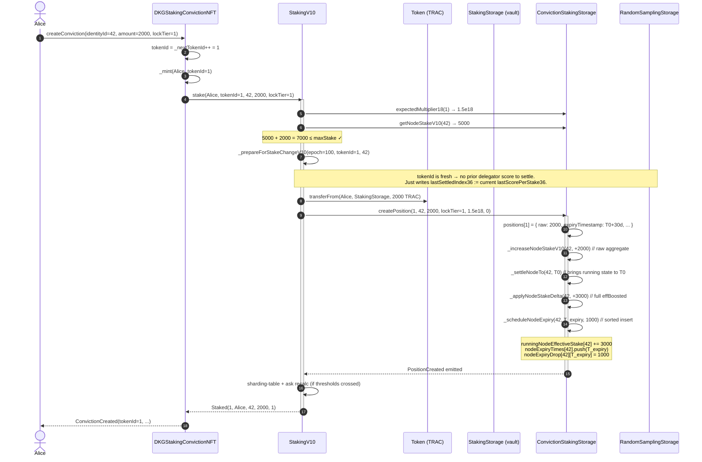
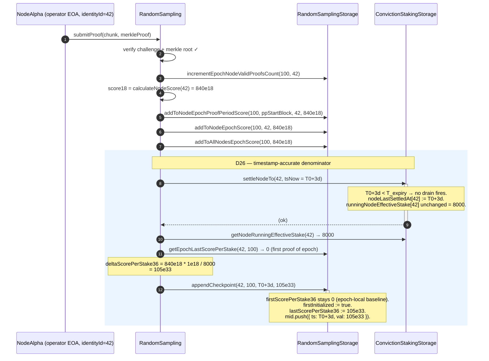
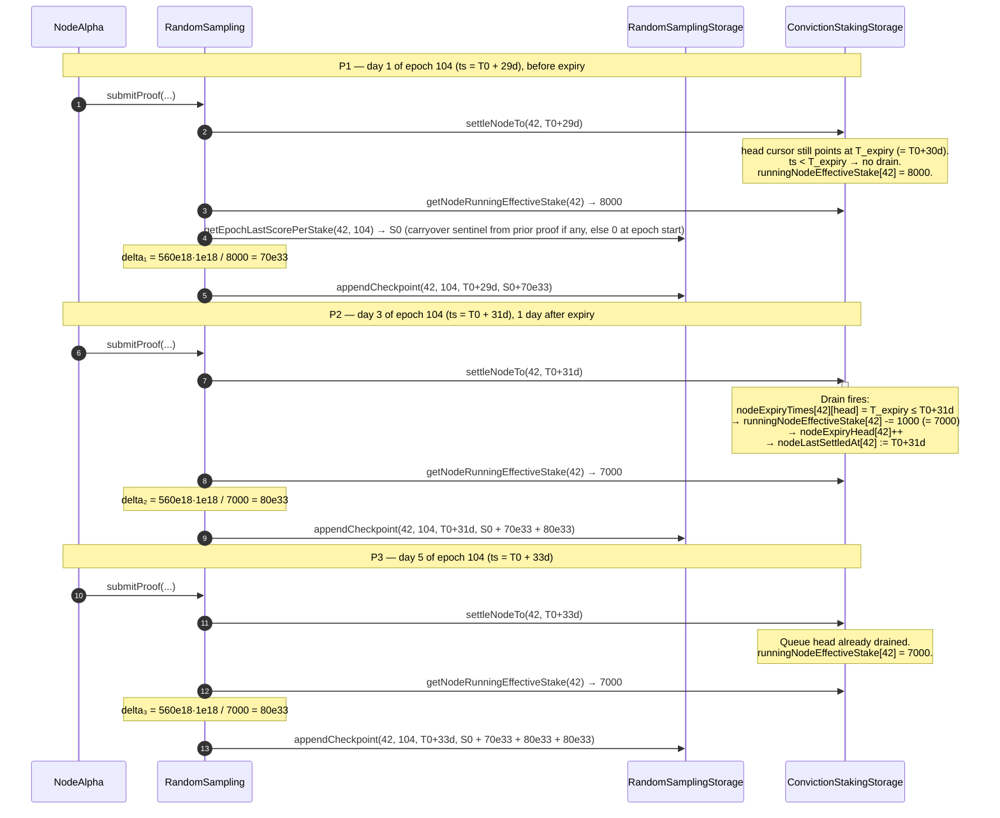
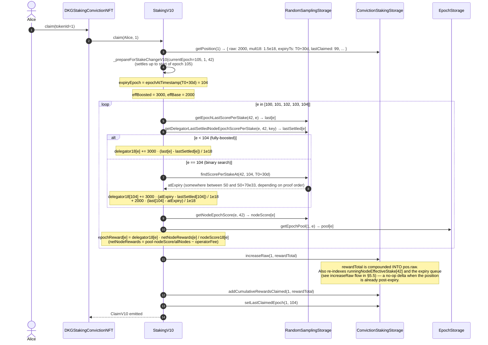

# D26 — Time-Accurate V10 Staking Accounting

**Status**: implemented in PR #240 (branch `v10-pr97-spec-impl`).
**Spec**: [`/Users/aleatoric/.cursor/plans/v10_time-accurate_staking_accounting_801da0cd.plan.md`](../../../.cursor/plans/v10_time-accurate_staking_accounting_801da0cd.plan.md)
**Scope**: `ConvictionStakingStorage.sol` (v3.0.0), `RandomSamplingStorage.sol` (v2.0.0), `RandomSampling.submitProof`, `StakingV10._claim` / `_prepareForStakeChangeV10`, `DKGStakingConvictionNFT` (unchanged wrapper surface).

---

## 1. Problem statement

V10 delegators commit TRAC for **real-world durations** — 30 / 90 / 180 / 366 days — with a tiered boost multiplier (1.5x / 2.0x / 3.5x / 6.0x). The random-sampling reward pipeline, however, settles **per epoch** (~7 days). Two lies result:

1. **Denominator lie.** `RandomSampling.submitProof` divides the node's score by its effective stake. Pre-D26 that denominator was read at epoch granularity, so a boost expiring **mid-epoch** kept inflating the denominator until the next boundary. Every proof landing in that epoch under-credited every delegator by the fraction of `(expired boost) / (total effective stake)`.
2. **Claim lie.** At claim time, the same delegator whose 30-day lock expired on day 4 of a 7-day epoch was paid as if their boost lasted the full epoch (or ended on the prior boundary, depending on rounding). Small, persistent, real over/under-payment.

With proofs landing every ~30 minutes, sub-epoch precision is a product requirement.

## 2. Design summary — Option C.2

- **Reward pool granularity stays epoch-scoped.** `epochStorage.getEpochPool(idx, epoch)` is unchanged. All pool math at claim time is per-epoch.
- **Score-per-stake becomes timestamped.** Per `(node, epoch)` we store an `EpochIndex` with `firstScorePerStake36`, `lastScorePerStake36`, and an append-only `Checkpoint[] mid` of `(timestamp, scorePerStake36)` added once per proof.
- **Effective-stake becomes instantaneous.** Per node we store `runningNodeEffectiveStake[id]` and `nodeLastSettledAt[id]`, plus a **sorted expiry queue** `nodeExpiryTimes[id]` / `nodeExpiryDrop[id][ts]` / `nodeExpiryHead[id]`. `settleNodeTo(id, ts)` drains any queued expiries whose timestamp is ≤ `ts` and advances the running stake. `submitProof` calls this before reading the denominator.
- **Claim does per-epoch branching on expiryTimestamp.** For each epoch `e` in the claim window:
  - `e < expiryEpoch` OR `expiryTimestamp == 0` → O(1), full `effBoosted` (or `effBase` if tier-0).
  - `e > expiryEpoch` → O(1), full `effBase`.
  - `e == expiryEpoch` → **one** binary search into `mid[]` for `scorePerStakeAt(expiryTs)`. Split the earning interval at that point.
  - `first == last` → dead epoch, skip in O(1).

No iteration is proof-density-bounded. Dormancy is event-density-bounded (queue length, not wall-clock time).

## 3. Storage shapes

### `ConvictionStakingStorage` (v3.0.0)

```solidity
struct Position {
    uint96  raw;
    uint40  lockTier;
    uint40  expiryTimestamp;      // RENAMED from expiryEpoch (D26).
    uint72  identityId;
    // slot 2
    uint96  cumulativeRewardsClaimed;
    uint64  multiplier18;
    uint32  lastClaimedEpoch;
    uint32  migrationEpoch;
}

// Per-node instantaneous state.
mapping(uint72 => uint256) public runningNodeEffectiveStake;
mapping(uint72 => uint40)  public nodeLastSettledAt;

// Per-node sorted pending-expiry queue.
mapping(uint72 => uint40[])                    internal nodeExpiryTimes; // ascending
mapping(uint72 => mapping(uint40 => uint256))  internal nodeExpiryDrop;  // total boost drop at ts
mapping(uint72 => uint256)                     internal nodeExpiryHead;  // amortized-O(1) drain cursor
```

### `RandomSamplingStorage` (v2.0.0)

```solidity
struct Checkpoint {
    uint40  timestamp;
    uint216 scorePerStake36;
}

struct EpochIndex {
    uint248 firstScorePerStake36;   // epoch-local; seeded to 0.
    bool    firstInitialized;
    uint256 lastScorePerStake36;    // monotone in ts within the epoch.
    Checkpoint[] mid;               // one append per proof.
}

mapping(uint72 => mapping(uint256 => EpochIndex)) internal nodeEpochIndex;
```

The legacy scalar `nodeEpochScorePerStake` is deleted; the pre-D26 read signature is kept as a thin adapter returning `lastScorePerStake36` — semantically equivalent for past (fully-settled) epochs, which is everything V8 call sites (`Staking.sol`, `StakingKPI.sol`) ever read.

---

## 4. Worked example — a real delegator's life

### Scenario setup

| Entity               | Value                                                           |
| -------------------- | --------------------------------------------------------------- |
| **Node**             | `identityId = 42` ("NodeAlpha")                                 |
| **Alice**            | EOA, wants a 30-day lock (tier 1, 1.5x) on 2 000 TRAC           |
| **Epoch length**     | 7 days = 604 800 s                                              |
| **T0**               | `1 777 852 800` → 2026-05-01 00:00:00 UTC, start of **epoch 100** |
| **T_expiry**         | `T0 + 30 days` = `1 780 444 800` → day 2 of **epoch 104**       |
| **Withdraw**         | `T0 + 35 days` → day 0 of **epoch 105**                         |
| **Pre-Alice stake**  | 5 000 (other delegators on NodeAlpha, 1x baseline)              |

Derived quantities:

```
effBoosted = raw * mult18 / 1e18 = 2000 * 1.5 = 3000
effBase    = raw                 = 2000
boostDrop  = effBoosted - effBase = 1000   ← queued at expiryTs
```

Alice's effective contribution to NodeAlpha's denominator:

```
[T0, T_expiry)    →  3000   (1.5x boost)
[T_expiry, ∞)     →  2000   (1x, post-expiry rest state)
```

### Key epochs

| Epoch | Window (days since T0) | Alice's status in epoch                        |
| ----- | ---------------------- | ---------------------------------------------- |
| 100   | [0, 7)                 | boost fully active                              |
| 101   | [7, 14)                | boost fully active                              |
| 102   | [14, 21)               | boost fully active                              |
| 103   | [21, 28)               | boost fully active                              |
| **104** | **[28, 35)**        | **boost active for 2 days, then dropped at day 30** |
| 105   | [35, 42)               | boost dropped (but Alice already withdrew on day 35) |

Epoch 104 is the only one that triggers the binary-search claim branch. Every other epoch is one of the O(1) sentinel-pair branches.

---

## 5. Sequence diagrams

### 5.1 createConviction — Alice opens a 30-day boosted position at `T0`



**Invariants after this block:**

- `positions[1].expiryTimestamp == T_expiry`
- `runningNodeEffectiveStake[42] == 5000 + 3000 == 8000`
- `nodeLastSettledAt[42] == T0`
- `nodeExpiryTimes[42] == [T_expiry]`, `nodeExpiryDrop[42][T_expiry] == 1000`

### 5.2 submitProof — a node proof lands at `T = T0 + 3 days` (mid-epoch 100)

NodeAlpha produces a valid proof. `score18 = 840e18` (arbitrary, illustrative).



**Invariants after this proof:**

- `nodeEpochIndex[42][100].firstScorePerStake36 == 0`
- `nodeEpochIndex[42][100].lastScorePerStake36 == 105e33`
- `nodeEpochIndex[42][100].mid == [{T0+3d, 105e33}]`
- `runningNodeEffectiveStake[42] == 8000` (unchanged — no expiries fell in the interval)

### 5.3 submitProof — mid-epoch 104, straddling Alice's expiry

By epoch 104, many proofs have landed across epochs 100-103. For epochs 100 through 103 we only keep the picture's salient reading: each epoch ends with some `lastScorePerStake36[e]`. What matters is epoch 104.

Inside epoch 104 we inspect **three proofs**:

- **P1**: lands at day 1 of epoch 104 (= T0 + 29d). Boost still active → denominator 8000.
- **P2**: lands at day 3 of epoch 104 (= T0 + 31d). Alice's boost expired 1 day ago (at T_expiry = day 2 of epoch 104). The queue drain fires.
- **P3**: lands at day 5 of epoch 104 (= T0 + 33d). Denominator = 7000 (post-drop).

Assume each proof's `score18 = 560e18`. Other delegators are not affected by the drop.



**Invariants after P3:**

- `nodeEpochIndex[42][104].mid == [{T0+29d, S0+70e33}, {T0+31d, S0+150e33}, {T0+33d, S0+230e33}]`
- `nodeEpochIndex[42][104].lastScorePerStake36 == S0 + 230e33`
- `runningNodeEffectiveStake[42] == 7000`
- `nodeExpiryHead[42] == 1` (T_expiry consumed)

> **Why this matters for Alice.** P1 credited Alice's boost correctly (she *was* boosted). P2 and P3 correctly divide by the smaller 7000 denominator (she is no longer contributing the 1000-unit boost to the pool). Alice still earns `effBase = 2000` worth of delegator-score from P2 and P3 (see §5.4), but she no longer inflates the denominator she divides against. Other delegators' rewards are not diluted.

### 5.4 _claim — Alice claims through epoch 104 (or withdraws)

When Alice (or a withdraw call) triggers `_claim`, the walker looks at each unclaimed epoch `e ∈ [claimFrom, currentEpoch-1]` and computes `delegatorScore18[e]` using the appropriate branch:

```
for each epoch e:
    first = nodeEpochIndex[42][e].firstScorePerStake36    // 0 under D26
    last  = nodeEpochIndex[42][e].lastScorePerStake36
    if first == last: continue                            // dead epoch
    if pos.expiryTimestamp == 0 || e < expiryEpoch:       // boost fully active
        delegatorScore18 += effBoosted · (last - first) / 1e18
    else if e > expiryEpoch:                              // boost fully dropped
        delegatorScore18 += effBase · (last - first) / 1e18
    else:                                                  // e == expiryEpoch
        atExpiry = RSS.findScorePerStakeAt(42, e, expiryTs)   // BINARY SEARCH
        delegatorScore18 += effBoosted · (atExpiry - first) / 1e18
                          +  effBase    · (last - atExpiry) / 1e18
```



> **Binary-search frequency.** In this entire life cycle Alice's claim invokes `findScorePerStakeAt` **exactly once** — in epoch 104. Epochs 100-103 and 105+ take O(1) sentinel reads. The `mid[]` array grows with proof frequency (≈ one entry per 30 minutes), so `O(log n)` per binary search ≈ 9 SLOADs for a 7-day epoch with 30-minute proofs (≈336 proofs → log₂336 ≈ 8.4).

### 5.5 Full lifecycle — Alice's stake → withdraw cycle

This diagram threads every touchpoint of Alice's 30-day journey into one picture. Time flows top-to-bottom; labels on the right show wall-clock reality and ledger state.

```mermaid
sequenceDiagram
    autonumber
    actor Alice
    participant NFT as DKGStakingConvictionNFT
    participant SV10 as StakingV10
    participant CSS as ConvictionStakingStorage
    participant RSS as RandomSamplingStorage
    participant TOKEN as Token (TRAC)
    participant SS as StakingStorage
    participant NodeOps as NodeAlpha ops

    %% ─────────────────────── T0 — CREATE ───────────────────────
    rect rgb(235, 245, 255)
    Note over Alice,NodeOps: T = T0 (2026-05-01). Alice stakes 2000 TRAC, tier 1 (30d, 1.5x).
    Alice->>TOKEN: approve(StakingV10, 2000)
    Alice->>NFT: createConviction(42, 2000, 1)
    NFT->>SV10: stake(Alice, tokenId=1, 42, 2000, 1)
    SV10->>TOKEN: transferFrom(Alice, StakingStorage, 2000)
    SV10->>CSS: createPosition(1, 42, 2000, 1, 1.5e18, 0)
    Note right of CSS: positions[1].expiryTimestamp = T0 + 30d<br/>runningNodeEffectiveStake[42]: 5000 → 8000<br/>nodeExpiryTimes[42] = [T0+30d]<br/>nodeExpiryDrop[42][T0+30d] = 1000
    end

    %% ─────────────────── T ∈ [T0, T0+30d) — EARN ───────────────────
    rect rgb(230, 250, 230)
    Note over NodeOps,RSS: Proofs land every ~30 min.<br/>Alice is boosted; denominator = 8000 for each proof.
    loop proofs in epochs 100-103 (boost fully active)
        NodeOps->>SV10: (submitProof via RandomSampling, shown in §5.2)
        SV10->>CSS: settleNodeTo(42, ts)
        Note right of CSS: head cursor stays at T0+30d; no drain.
        CSS-->>SV10: running = 8000
        SV10->>RSS: appendCheckpoint(42, e, ts, +Δ)
    end
    end

    %% ───────────────── T = T0 + 30d — BOOST EXPIRES ─────────────────
    rect rgb(255, 245, 225)
    Note over NodeOps,CSS: T = T0 + 30d (day 2 of epoch 104). Alice's lock expires.<br/>Nothing happens on-chain yet — the drop is lazy.
    end

    %% ─────────────── T ∈ (T0+30d, T0+35d) — DRAINED ────────────────
    rect rgb(230, 250, 230)
    Note over NodeOps,RSS: Next proof after expiry triggers the drain.
    NodeOps->>SV10: submitProof(...)
    SV10->>CSS: settleNodeTo(42, ts ≥ T0+30d)
    Note right of CSS: runningNodeEffectiveStake[42]: 8000 → 7000<br/>nodeExpiryHead[42]: 0 → 1
    SV10->>RSS: appendCheckpoint(42, 104, ts, +Δ)   (Δ uses 7000)
    Note over Alice,RSS: For the rest of epoch 104 and all of epoch 105,<br/>every proof divides score18 by 7000, not 8000.
    end

    %% ─────────────── T = T0 + 35d — WITHDRAW ───────────────
    rect rgb(255, 230, 230)
    Note over Alice,SS: T = T0 + 35d. Alice calls withdraw — lock has been over for 5 days.
    Alice->>NFT: withdraw(tokenId=1)
    NFT->>SV10: withdraw(Alice, 1)
    SV10->>CSS: getPosition(1) → expiryTimestamp = T0+30d, block.timestamp ≥ expiry ✓

    SV10->>SV10: _claim(1)   (auto-claim, see §5.4)
    Note right of SV10: Single binary search into epoch 104's mid[].<br/>Every other epoch takes 2 SLOADs.

    SV10->>CSS: getPosition(1)  (re-read: raw may have grown via compound)
    SV10->>CSS: deletePosition(1)
    Note right of CSS: _settleNodeTo(42, now)<br/>runningNodeEffectiveStake[42]: 7000 → 5000 (−effBase=2000; boost was already dropped)<br/>Position is removed; token is burned by NFT after the return.
    SV10->>SS: transferStake(Alice, amount)
    SV10-->>NFT: Withdrawn(1, Alice, amount)
    NFT->>NFT: _burn(1)
    NFT-->>Alice: tokens + event emissions
    end
```

**What changed vs. pre-D26:**

- In the red "WITHDRAW" block, `_claim` does **one** binary search (for epoch 104), not N iterations over proofs.
- In the yellow "BOOST EXPIRES" block, there is **no on-chain side effect** at T = T0 + 30d. Pre-D26 needed either (a) a poke at the epoch boundary to finalize effective-stake diffs or (b) risked a "dormancy bomb" where a long idle interval required a linear walk to catch up.
- In the green "EARN" block after expiry, the proof denominator is **7000** (post-boost), not 8000. Other delegators on NodeAlpha now see a correctly tighter denominator — Alice isn't double-dipping by inflating the pool divisor with phantom boost.

---

## 6. Invariants

These are enforced by the test suite (`test/unit/ConvictionStakingStorage.test.ts`, `test/unit/RandomSamplingStorage.test.ts`, `test/integration/D26TimeAccurateStaking.test.ts`):

1. **Running-stake consistency.** For any node `id` and timestamp `ts ≥ nodeLastSettledAt[id]`:

       getNodeEffectiveStakeAtTimestamp(id, ts)
       == runningNodeEffectiveStake[id]  −  Σ { nodeExpiryDrop[id][t] : head ≤ i s.t. nodeExpiryTimes[id][i] ≤ ts }

2. **Expiry-queue monotonicity.** `nodeExpiryTimes[id][i] < nodeExpiryTimes[id][i+1]` for all `i ≥ nodeExpiryHead[id]`; coalescing positions with identical expiry share a single queue entry and their drops are summed.
3. **Checkpoint monotonicity.** Within one epoch, `nodeEpochIndex[id][e].mid[i].timestamp < mid[i+1].timestamp`, and `mid[i].scorePerStake36 ≤ mid[i+1].scorePerStake36`.
4. **Dormancy bound.** Every iteration in `settleNodeTo` is bounded by the number of **queued expiries** in `(nodeLastSettledAt, ts]`, never by the number of epochs elapsed.
5. **Binary-search budget per claim.** Each delegator calls `findScorePerStakeAt` at most **once per claim** — for the single epoch containing `expiryTimestamp`. Every other epoch in the claim window takes exactly 2 SLOADs.
6. **V8 adapter parity.** `getNodeEpochScorePerStake(epoch, id)` returns `nodeEpochIndex[id][epoch].lastScorePerStake36`, which for a fully-settled past epoch is the same value the pre-D26 scalar would have held. V8 read sites in `Staking.sol` and `StakingKPI.sol` are behavior-equivalent.

## 7. Gas notes

Measured on localhost against the unit test harness:

| Operation                                                             | Pre-D26         | D26             | Notes                                                                 |
| --------------------------------------------------------------------- | --------------- | --------------- | --------------------------------------------------------------------- |
| `createPosition` with boosted tier                                    | ~180k           | ~195k           | +sorted-insert into `nodeExpiryTimes` (O(k), k = pending expiries).    |
| `deletePosition` / `withdraw` (post-expiry)                           | ~120k           | ~120k           | Queue head already drained; the cancellation path is O(1) amortized. |
| `submitProof` (no expiry in interval)                                 | ~55k (proof-only math) | ~58k     | +1 SSTORE (checkpoint append) +1 SLOAD (last).                        |
| `submitProof` (1 expiry drained)                                      | n/a             | ~65k            | +SLOAD head, +SSTORE head, +SUB on running stake.                     |
| `_claim` per epoch, boost fully active / fully expired                | ~7k (1 SLOAD)   | ~12k (2 SLOADs) | Trade 1 SLOAD for precision.                                          |
| `_claim` in `expiryEpoch`                                             | n/a             | ~12k + log₂(n)·SLOAD | Binary search over `mid[]` (≈9 SLOADs for a week of 30-min proofs).  |
| **Dormant settle after 5 years / 3 queued expiries** (integration test) | **N/A (would have been ≥150×epoch walk)** | **< 200k total** | Event-density-bounded. No epoch walk. |

## 8. Review checklist

Anything below a ☐ is a verified lint item — not a pending issue, but a concrete thing to eyeball when reviewing:

- [ ] `Position.expiryTimestamp` is read everywhere `expiryEpoch` used to be (rename completeness). — `rg "expiryEpoch" packages/evm-module/contracts` should only surface docstrings referring to the old shape if any.
- [ ] `_settleNodeTo` is called in every mutator that changes a position's effective stake: `createPosition`, `updateOnRelock`, `updateOnRedelegate`, `createNewPositionFromExisting`, `deletePosition`, `decreaseRaw`, `increaseRaw`.
- [ ] `settleNodeTo` (external) is called by `submitProof` before reading `runningNodeEffectiveStake`. Verified in `RandomSampling.sol` L275.
- [ ] Queue invariant: after `_scheduleNodeExpiry`, `nodeExpiryTimes[id]` is sorted ascending; duplicates coalesce via `nodeExpiryDrop`.
- [ ] `appendCheckpoint` rejects non-monotone timestamps and overwrites the tail when `ts` equals the current tail (`_upsertCheckpoint`). See `RandomSamplingStorage._upsertCheckpoint`.
- [ ] `findScorePerStakeAt` semantics at boundaries: `ts < first checkpoint` returns `firstScorePerStake36` (= 0 under D26). `ts ≥ last checkpoint` returns `lastScorePerStake36`.
- [ ] V8 adapter preserved: `getNodeEpochScorePerStake(epoch, id)` still compiles and returns a semantically-equivalent value for past epochs (Staking.sol L710, L745; StakingKPI.sol L211).
- [ ] `_claim` handles the three branches correctly (`e < expiryEpoch`, `e == expiryEpoch`, `e > expiryEpoch`); `expiryTimestamp == 0` collapses to the always-base branch.
- [ ] Versions bumped: CSS 2.1.0 → **3.0.0**, RSS 1.0.0 → **2.0.0**.

## 9. Test coverage

- `packages/evm-module/test/unit/ConvictionStakingStorage.test.ts` — 39 tests covering `expiryTimestamp` rename, sorted-queue invariant, find-and-remove on delete, `settleNodeTo` across multiple expiries, same-timestamp collisions.
- `packages/evm-module/test/unit/RandomSamplingStorage.test.ts` — `Checkpoint` append monotonicity, `findScorePerStakeAt` boundary cases, `getNodeEpochScorePerStake` adapter parity.
- `packages/evm-module/test/unit/DKGStakingConvictionNFT.test.ts` — 78 tests, all `expiryEpoch`-era asserts migrated to `expiryTimestamp`.
- `packages/evm-module/test/v10-conviction.test.ts` — 5 integration tests, including the atomic withdraw cycle (§5.5).
- `packages/evm-module/test/integration/D26TimeAccurateStaking.test.ts` — 7 new integration tests: mid-epoch expiry denominator, claim binary-search path, node dormancy resume.

Full suite (`pnpm test:unit && pnpm test:integration`): **763 unit + 37 integration passing**; 60 unit / 38 integration pending are pre-existing obsolete V8 flows tombstoned during V10 landing.

## 10. Related decisions in the DKG context graph

- [`decision:2026-04-23/time-based-accounting`](https://ontology.dkg.io/devgraph#) — the C.2 design decision.
- [`session:2026-04-23/v10-staking-redesign`](https://ontology.dkg.io/devgraph#) — the authoring session (tier-0 NFT, redelegate-in-place, atomic withdraw decisions).
- [`session:2026-04-23/v10-d26-implementation`](https://ontology.dkg.io/devgraph#) — the implementation session whose landed changes this document describes.

Query: `dkg query '0x1Fe3D11Cf77b71528A66BDCEF97BdaB79327ee62/dkg-v10-smart-contracts' --include-shared-memory --sparql 'SELECT ?s WHERE { ?s a <https://ontology.dkg.io/devgraph#Session> }'`
