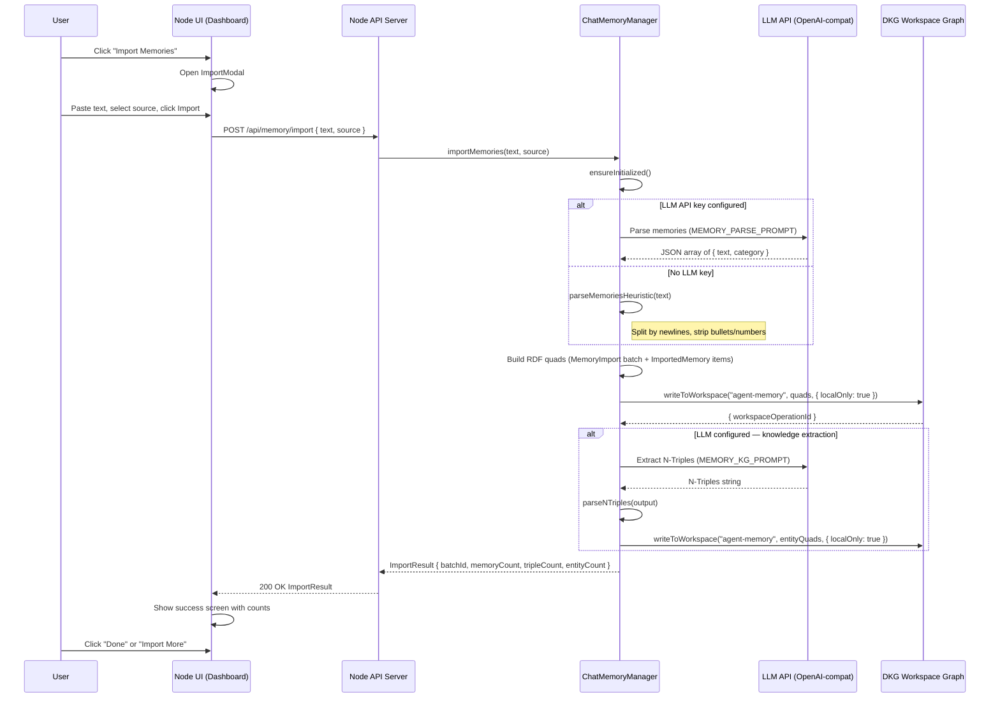

# Import Memory Feature

Allow users to import their memories and preferences from other AI assistants (Claude, ChatGPT, Gemini) into the DKG as private Knowledge Assets.

## Overview

Users accumulate context and preferences across AI assistants over time. This feature lets them consolidate that knowledge into their private DKG node, where it becomes:

- **Private** — stored in the `agent-memory` paranet with `localOnly: true`, never broadcast to other nodes
- **Structured** — raw text is parsed into individual memory items and optionally enriched with entity extraction via LLM
- **Queryable** — memories become part of the agent's knowledge graph, available for semantic recall during conversations

## User Flow

1. Click "Import Memories" on the Dashboard
2. Select the source AI system (Claude, ChatGPT, Gemini, Other)
3. Paste the exported text (the modal includes a prompt to copy-paste into the old AI)
4. Click "Import as Private Knowledge"
5. View results: count of memories imported, triples created, entities extracted

## Sequence Diagram



## Data Model (RDF)

### Import Batch Entity

Each import session creates a batch record:

```
<urn:dkg:memory:import:{batchId}> rdf:type <http://dkg.io/ontology/MemoryImport> .
<urn:dkg:memory:import:{batchId}> dkg:importSource "claude" .
<urn:dkg:memory:import:{batchId}> schema:dateCreated "2026-03-05T..." .
<urn:dkg:memory:import:{batchId}> dkg:itemCount "15"^^xsd:integer .
```

### Individual Memory Items

Each parsed memory becomes an `ImportedMemory`:

```
<urn:dkg:memory:item:{id}> rdf:type <http://dkg.io/ontology/ImportedMemory> .
<urn:dkg:memory:item:{id}> schema:text "Prefers dark mode in all apps" .
<urn:dkg:memory:item:{id}> dkg:category "preference" .
<urn:dkg:memory:item:{id}> schema:dateCreated "2026-03-05T..." .
<urn:dkg:memory:item:{id}> dkg:importBatch <urn:dkg:memory:import:{batchId}> .
<urn:dkg:memory:item:{id}> dkg:importSource "claude" .
```

### Extracted Entities (when LLM is configured)

Structured knowledge extracted from memory items:

```
<urn:dkg:entity:acme-corp> rdf:type <http://schema.org/Organization> .
<urn:dkg:entity:acme-corp> schema:name "Acme Corp" .
<urn:dkg:entity:acme-corp> dkg:extractedFrom <urn:dkg:memory:import:{batchId}> .
```

## Categories

Memories are classified into categories:

| Category       | Description                                        |
| -------------- | -------------------------------------------------- |
| `preference`   | User preferences (dark mode, language, tools)      |
| `fact`         | Factual information (employer, location, skills)   |
| `context`      | Background context (projects, goals)               |
| `instruction`  | Standing instructions (communication style, tone)  |
| `relationship` | People and connections (colleagues, family)         |

## Privacy

All imported data is:

1. Written to the `agent-memory` paranet with `localOnly: true`
2. The paranet itself is created with `private: true`
3. Data never appears in GossipSub broadcasts
4. Other nodes cannot query or discover imported memories

## API

### `POST /api/memory/import`

**Request:**
```json
{
  "text": "- Prefers dark mode\n- Works at Acme Corp\n- Has a dog named Max",
  "source": "claude"
}
```

**Response (200):**
```json
{
  "batchId": "abc123def456",
  "source": "claude",
  "memoryCount": 3,
  "tripleCount": 22,
  "entityCount": 2
}
```

**Errors:**
- `400` — Missing or empty `text` field
- `500` — Internal error during import

## Parsing Modes

### LLM-assisted (when API key is configured)

Uses `MEMORY_PARSE_PROMPT` to have the LLM:
- Split compound items
- Normalize formatting
- Classify into categories
- Skip metadata lines

Falls back to heuristic mode if the LLM call fails.

### Heuristic (fallback)

Simple line-by-line splitting:
- Splits on newlines
- Strips bullet markers, numbering, markdown artifacts
- Filters out lines shorter than 4 characters
- Filters out common headers ("Here are your memories:", etc.)
- All items categorized as `fact`

## Testing

Tests are in `packages/node-ui/test/import-memory.test.ts` and cover:

- Heuristic parsing (line splitting, filtering)
- RDF triple generation (correct predicates, batch linking)
- Privacy guarantees (`localOnly: true` on all writes)
- API endpoint validation (empty text, source validation)
- LLM-assisted parsing with mocked responses
- Knowledge extraction from imported memories
